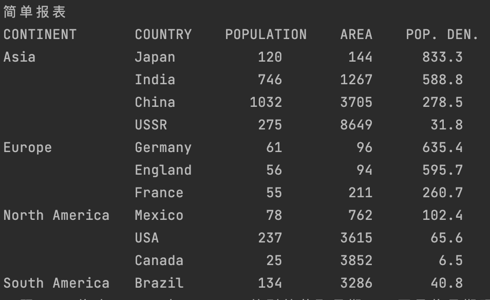
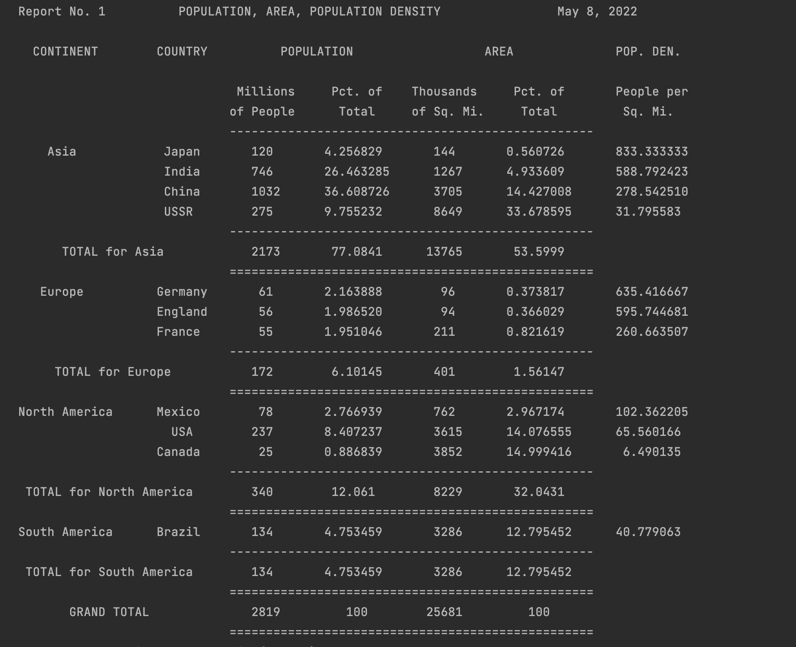
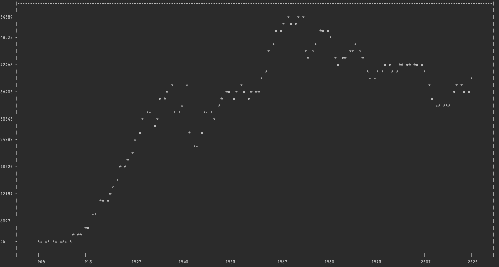
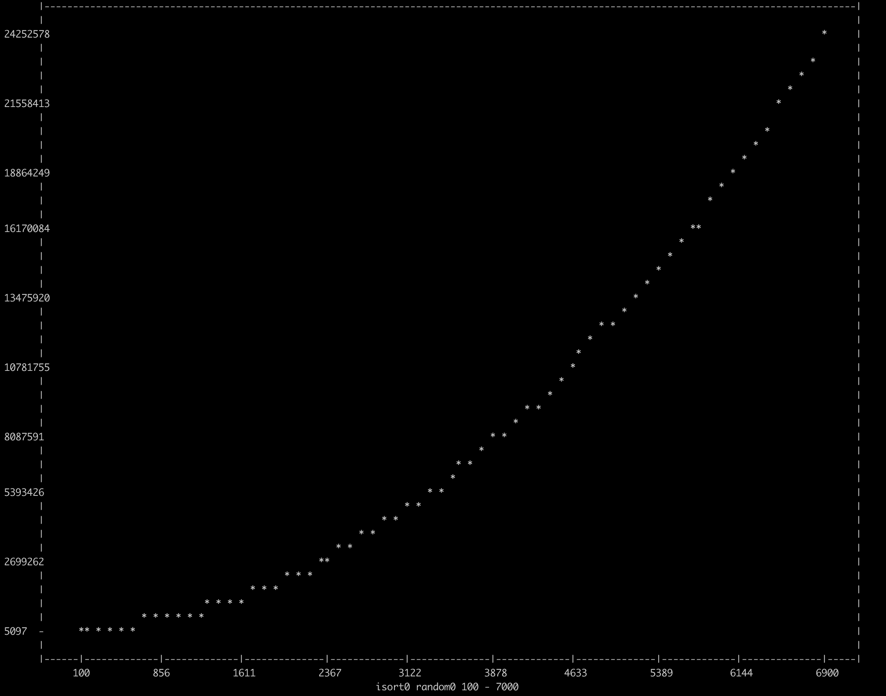
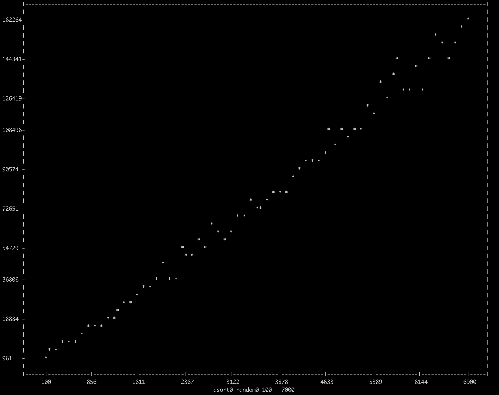
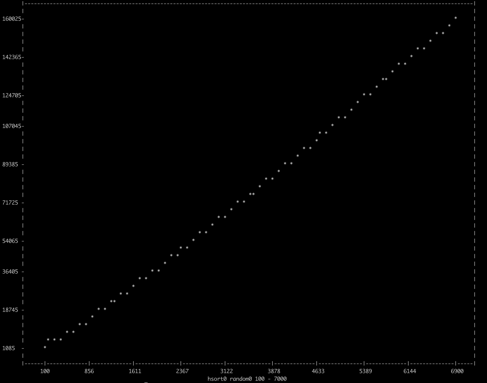

# awk命令行

## 一行手册

1. **输入行的总行数**

   ```shell
   END {print NR}
   ```

2. **打印第10行**

   ```shell
   NR == 10
   ```

3. **打印每一个输入行的最后一个字段**

   ```shell
   {print $NF}
   ```

4. **打印最后一行的最后一个字段**

   ```shell
   {field = $NF}
   END {print $NF}
   ```

5. **打印字段数多于4个的输入行**

   ```shell
   NF > 4
   ```

6. **打印最后一个字段值大于4的输入行**

   ```shell
   $NF > 4
   ```

7. **打印所有输入行的字段数的总和**

   ```shell
   {nf = NF}
   END {print nf}
   ```

8. **打印包含Beth的行的数量**

   ```shell
   /Beth/ {nf++}
   END {print nf}
   ```

9. **打印具有最大值的第一个字段, 以及包含它的行【假设 $1 总是 正的】**

   ```shell
   $1 > max { max = $1; maxline = $0 }
   END { print max, maxline }
   ```

10. **打印至少包含一个字段的行**

    ```shell
    NF > 0
    ```

11. **打印长度超过80个字符的行**

    ```shell
    length($0) > 80
    ```

12. **在每一行的前面加上它的字段数**

    ```shell
    {print NF, $0}
    ```

13. **打印每一行的第 1 与第 2 个字段, 但顺序相反**

    ```shell
    {print $2, $1}
    ```

14. **交换每一行的第 1 与第 2 个字段, 并打印该行**

    ```shell
    {temp = $1; $1 = $2; $2 = temp; print}
    ```

15. **将每一行的第一个字段用行号代替**

    ```shell
    {$1 = NR; print}
    ```

16. **打印删除了第 2 个字段后的行**

    ```shell
    {$2 = ""; print}
    ```

17. **将每一行的字段按逆序打印**

    ```shell
    {
    	for (i = NF; i > 0; i--) 
    		printf("%s ", $i) 
    	printf("\n")
    }
    ```

18. **打印每一行的所有字段值之和**

    ```shell
    {
    	sum = 0
      for (i = 1; i <= NF; i = i + 1) 
      	sum += $i
      print sum
    }
    ```

19. **将所有行的所有字段值累加起来**

    ```shell
    {
      for (i = 1; i <= NF; i = i + 1) 
      	sum += $i
    }
    END {print sum}
    ```

20. **将每一行的每一个字段用它的绝对值替换**

    ```shell
    { 
    	for (i = 1; i <= NF; i = i + 1) 
    		if ($i < 0) 
    			$i = -$i
      print
    }
    ```

## 命令行格式

```shell
awk [-Fs] 'program' optional list of filenames 
awk [-Fs] -f progfile optional list of filenames
```

> - Fs：把字段分隔符 FS 设置成 s。

## 命令行变量赋值

- **文件名**：形如：`var=text` 表示赋值语句。
- **赋值时机**：当被当作文件访问时，执行赋值动作。
- **变量修改**：允许在读文件之前或之后修改值。

## 命令行参数

```shell
awk -f progfile a v=1 b
```

> - **`ARGC`**：参数个数 + 1。`ARGC[0] ` 的值永远为 awk。
> - **非参数**：`awk程序`、`-f progfile`、`-Fs`

## 基础知识

### 正则表达式

1. **正则表达式的元字符**

   `\` `^` `$` `.` `[]` `|` `()` `*` `+` `?`

2. **表达式类型**

   - 不是元字符的字符：e.g. `A`
   - 匹配特殊符号的转义字符：e.g. `\t`
   - 被引用的元字符：e.g. `\*`
   - 匹配一行的开始：e.g. `^`
   - 匹配一行的结束：e.g. `$`
   - 匹配任意一个字符：e.g. `.`
   - 一个字符类：e.g. `[ABC]`
   - 字符类可能包含缩写形式：e.g. `[A-Za-z]`
   - 一个互补的字符类：e.g. `[^0-9]`

3. **表达式组合**

   - 选择：`A|B`
   - 拼接：`AB`
   - 闭包：`A*` 匹配0个或多个A
   - 正闭包：`A+` 匹配一个或多个A
   - 零或一：`A?`匹配空字符串或A
   - 括号：`(r)` 和 r 相同，只不过优先级高。

### 转义序列

| 序列 | 含义                                             |
| ---- | ------------------------------------------------ |
| \b   | 退格                                             |
| \f   | 换页                                             |
| \n   | 换行                                             |
| \r   | 回车                                             |
| \t   | 制表符                                           |
| \ddd | 八进制数，含有1到3个数字，每个数字的值在0到7之间 |
| \c   | 其他字面意义上的c；`\\` 代表反斜杠。             |


# awk程序

## 语法

```shell
模式 { 动作 }
```

1. **动作**

   1. *语句分隔*

      > - 通常用换行符。
      > - 语句出现在同一行时，用分号分隔。

   2. *左花括号*：必须与模式在同一行。

   3. *右花括号*：可出现在下面几行。

   4. *单条语句换行*：断行处插入反斜杠。

2. **分号**：可放在任何语句末尾。

3. **空行**：被忽略。可出现在任何位置。

4. **注释**：可以出现在任何一行末尾。

## 模式

### BEGIN 与 END

```shell
BEGIN {statements}
```

> 在输入被读取之前, statements 执行一次。

```shell
END {statements}
```

> 当所有输入被读取完毕之后，statements 执行一次。

- 不匹配任何输入行。
- 多个begin或end：按照在程序中**出现的顺序**执行。
- end 语句可放在 begin 前，但通常放在最后。begin 放在开头。
- **常见用途**：更改输入行被分割为字段的默认方式。

### 表达式

```shell
expression { statements }
```

> 每碰到一个使 `expression` 为真的输入行，`statements` 就执行。

- **为真**：`expression` 值非0或非空。

### 字符串匹配

```shell
/regular expression/ { statements }
```

> 当输入行有含有一段字符串，可以被 `regular expression` 匹配，`statements` 就执行。
>
> 任意一个被一对斜杠包围的正则表达式都可以作为匹配运算符的右操作数。

- **/regexpr/**

  > 当前输入行包含一段能够被 regexpr 匹配的子字符串时，该模式被匹配。

- **expression ~ /regexpr/**

  > `expression` 的字符串值包含一段能够被 `regexpr` 匹配的子字符时, 该模式被匹配。

- **expression !~ /regexpr/**

  > `expression` 的字符串值不包含能够被 `regexpr` 匹配的子字符时, 该模式被匹配。

### 复合模式

```shell
compound pattern { statements }
```

> 将表达式用 `&&`、`||`、`!` 以及括号组合起来，当`compound pattern` 为真，`statements` 就执行。

- **优先级**：`!` > `&&` > `||`。
- **从左至右计算**：会提前停止。

### 范围模式

```shell
pattern1, pattern2 { statements}
```

> 匹配多个输入行
>
> 从匹配 `pattern1` 的行开始，到匹配 `pattern2` 的行结束【包括这两行】，执行 `statements`。

- 如果 `pattern2` 一直没有匹配到，`statements` 会执行到输入结束。
- 范围模式不能是其他模式的一部分。

## 动作

### 表达式

```shell
expression
print expression-list
printf(format, expression-list)
```

- **初等表达式**

  > 数值与字符串常量、变量、字段、函数调用、数组元素

  - **数值与字符串常量**：`"hello"` `123`

  - **变量**：包括用户定义变量、内建变量和字段变量。

    - *用户定义变量*：未初始化的变量的值是**"" 或 0**。

    - *内建变量*

      | 变量       | 含义                                         | 默认值 |
      | ---------- | -------------------------------------------- | ------ |
      | ARGC       | 命令行参数的个数                             | -      |
      | ARGV       | 命令行参数数组                               | -      |
      | FILENAME   | 当前输入文件名                               | -      |
      | FNR        | 当前输入文件的记录个数                       | -      |
      | FS         | 输入行的字段分隔符                           | " "    |
      | NF         | 当前记录的字段个数                           | -      |
      | NR         | 到目前位置读的记录数量                       | -      |
      | OFMT       | 数值的输入格式                               | "%.6g" |
      | OFS        | 输出字段分隔符                               | " "    |
      | ORS        | 输出的记录的分隔符                           | "\n"   |
      | RLENGTH    | 被函数 match 匹配的字符串的长度              | -      |
      | RS         | 输入行的记录分隔符。                         | "\n"   |
      | RSTART     | 被函数 match 匹配的字符串的开始              | -      |
      | SUBSEP     | 下标分隔符                                   | "\034" |
      | ENVIRON    | 包含所有 shell 环境变量的数组                |        |
      | IGNORECASE | 字符串匹配和比较是否区分大小写               | 0      |
      | ERRNO      | 执行 I/O 操作【getline】出错时，保存错误信息 |        |

    - *字段变量*：从 `$1`, `$2`, 一直到 `$NF`; `$0` 表示整行。

      - **发生改变**：`$0` 变化，会重新计算 `$1`、`$2`；`$1` 变化会重新构造 `$0`。
      - **表达式**：`$(NF-1)` 表示倒数第2个字段。
      - **不存在的字段**：值为空字符串。
      - **字段上限**：100。

  - **内建函数**

    - **算数函数**

      | 函数        | 返回值                    |
      | ----------- | ------------------------- |
      | atan2(y, x) | y/x 的反正切值            |
      | cos(x)      | x的余弦值                 |
      | exp(x)      | x的指数函数               |
      | int(x)      | x的整数部分               |
      | log(x)      | x的自然对数               |
      | rand()      | 返回一个随机数r，0<=r<1   |
      | sin(x)      | x的正弦值                 |
      | sqrt(x)     | x的平方根                 |
      | srand(x)    | x是rand()的新的随机数种子 |

    - **字符串函数**

      | 函数                    | 描述                                                         |
      | ----------------------- | ------------------------------------------------------------ |
      | gsub(r, s)              | 将 `$0` 中所有的 r 替换为 s ，返回发生替换的次数。           |
      | gsub(r, s, t)           | 将 字符串t 中所有的 r 替换为 s ，返回发生替换的次数。        |
      | index(s, t)             | 返回 字符串t 在 s 中第一次出现的位置，没有出现返回0。        |
      | length(s)               | 返回 s 包含的字符个数。                                      |
      | match(s, r)             | 测试 s 是否包含能被 r 匹配的子串，返回子串的起始位置或0。设置 `RSTART` 和 `RLENGTH` |
      | split(s, a)             | 用 `FS` 将 s 分隔到 数组a 中，返回字段的个数。               |
      | split(s, a, fs)         | 用 fs 将 s 分隔到 数组a 中，返回字段的个数。                 |
      | sprintf(fmt. expr-list) | 返回格式化后的字符串。                                       |
      | sub(r, s)               | 将 `$0` 的最左最长的, 能被 r 匹配的子字符串替换为 s ，返回替换发生的次数。 |
      | sub(r, s, t)            | 将 t 的最左最长的, 能被 r 匹配的子字符串替换为 s ，返回替换发生的次数。 |
      | substr(s, p)            | 返回 s 中从位置 p 开始的后缀。                               |
      | substr(s, p, n)         | 返回 s 中从位置 p 开始，长度为 n 的子字符串。                |

  - **自定义函数**

    ```shell
    function name(patameter-list) {
    	statements
    }
    ```

    > 函数定义可以出现在任何 模式–动作 语句可以出现的地方。
    >
    > **可选**：左右花括号前的换行符。
    >
    > **返回**：可能包含一个 return 语句。
    >
    > **调用**：调用时，函数名与左括号之间不能留有空白。
    >
    > **变量作用域**：除参数是局部变量外，其他所有变量都是全局变量。如果函数要拥有私有的局部变量, 唯一的方法是将该变量包含在参数列表的末尾。

- **运算符**

  > - 运算符要求数值形式的值：字符串自动转换成数字。
  > - 运算符要求字符串形式的值：数字自动转换成字符串。
  > - **字符串的数值类型的值**：等于字符串中最长的看起来像数值的前缀的值。
  > - **数值的值过大**：大到机器无法表示，就会被当成字符串进行比较。
  > - **比较**：只有当两个字段都是数值时, 比较才会以数值的形式进行。
  > - **数值字符串强制转换**
  >   - `number ""`
  >   - `string + 0`

  - **赋值运算符**

    `=` `+=` `-=` `*=` `/=` `%=` `^=`

  - **条件表达式**

    `?:`

  - **逻辑运算符**

    `||` `&&` `!`

  - **匹配运算符**

    `~` `!~`

  - **关系运算符**

    `<` `<=` `==` `!=` `>` `>=`

  - **拼接运算符**：无需显式

  - **算数运算符**

    `+` `-` `*` `/` `%` 

    `^`：幂运算。

  - **单目运算符**

    `+` `-`

  - **自增自减运算符**

    `++` `--` 包含前后缀

  - **括号**：用于分组

### 流程控制语句

- **决策**

  ```shell
  if (expression)statements
  ```

  > 如果 expression 为真, 执行 statements。

  ```shell
  if (expression) statements1 else statements2
  ```

  > 如果 expression 为真, 执行 statements<sub>1</sub> , 否则执行 statements<sub>2</sub>。

  - else statements<sub>2</sub>是可选的。
  - 右括号, statements<sub>1</sub>, 和关键词 else 后面的换行符是可选的。
  - 如果 else 与 statements<sub>1</sub>1 出现在同一行，并且 statements<sub>1</sub> 是一条单独的语句，那么在 statements<sub>1</sub> 的末尾必须使用分号来终止语句。
  - else 与最近一个未匹配的 if 匹配。

- **循环**

  ```shell
  while (expression) statements
  ```

  > 如果 expression 为真, 执行 statements; 然后重复前面的过程。

  ```shell
  for (expression1;expression2;expression3 ) statements
  ```

  > 等价于 expression<sub>1</sub>; while (expression<sub>2</sub>) { statements; expression<sub>3</sub>}

  ```shell
  for (variable in array) statements
  ```

  > 轮流地将 variable 设置为 array 的每一个下标, 并执行 statements。

  ```shell
  do statements while (expression)
  ```

  > 执行 statements; 如果 expression 为真就重复。

  ```shell
  break
  ```

  > 马上离开最内层的, 包围 break 的 while, for 或 do。

  ```shell
  continue
  ```

  > 开始最内层的, 包围 continue 的 while, for, 或 do 的下一次循环。

  ```shell
  next
  ```

  > 开始输入主循环【读取输入行的循环】的下一次迭代。

  ```shell
  exit
  exit expression
  ```

  > 马上执行 END 动作。
  >
  > 如果已经在 END 动作内, 那就退出程序。
  >
  > 将 expression 作为程序的退出状态返回。

  - 右括号后面的换行符是可选的。

### 空语句

单独一个分号表示空语句。

### 关联数组

- **无需声明**：也不需要说明数组中的元素个数。

- **元素创建**：**提及** ` x[NR]` 或 **赋值** `x[NR] = $0`

- **元素删除**：`delete x[NR]`

- **数组下标**：字符串，因此也叫**关联数组**。

  - *判断数组下标是否存在*：`if ("Africa" in pop) ...`。

    > 不会产生副作用。即不会提及。

- **多维数组**：不直接支持多维数据。数组的元素不可以是数组。
  - `arr[i, j]`：由 `SUBSEP` 链接i和j。

## 输出

### 格式

#### print

> **用括号场景**：当参数含有运算关系时，必须用括号。

```shell
print
```

> 将 `$0` 打印到标准输出。

```shell
print expression, expression, ...
print(expression, expression, ...)
```

> 打印各个 `expression`，`expression` 之间由 `OFS` 隔开，由 `ORS` 终止。

```shell
print expression, expression, ... > filename
```

> 输出至文件 `filename`。

```shell
print expression, expression, ... >> filename
```

> 输出追加到 `filename`，不覆盖。

```shell
print expression, expression, ... | command
```

> 作为 `command` 的标准输入。

#### printf

```shell
printf(format, expression, expression, ...)
printf(format, expression, expression, ...) > filename
printf(format, expression, expression, ...) >> filename
printf(format, expression, expression, ...) | command
```

##### 控制字符

| 字符 | 含义                                                   |
| ---- | ------------------------------------------------------ |
| c    | ASCII 字符                                             |
| d    | 十进制字符                                             |
| e    | [-]d.ddddddE[+-]dd                                     |
| f    | [-]ddd.dddddd                                          |
| g    | 按照 e 或 f 进行转换，选择较短的那个，去掉无意义的零。 |
| o    | 无符号八进制数                                         |
| s    | 字符串                                                 |
| x    | 无符号十六进制数                                       |
| %    | 打印一个 % ，不会有参数被吸收                          |

##### 修饰符

| 字符  | 含义                                               |
| ----- | -------------------------------------------------- |
| -     | 表达式在它的域内左对齐。                           |
| width | 为了达到宽度，必要时填充空格；前导的0表示用0填充。 |
| .prec | 字符串最大宽度, 或十进制数的小数部分的位数。       |

##### 例子

| fmt     | $1      | printf(fmt, $1) |
| ------- | ------- | --------------- |
| %c      | 97      | a               |
| %d      | 97.5    | 97              |
| %5d     | 97.5    | 97              |
| %e      | 97.5    | 9.750000e+01    |
| %f      | 97.5    | 97.500000       |
| %7.2f   | 97.5    | 97.50           |
| %g      | 97.5    | 97.5            |
| %.6g    | 97.5    | 97.5            |
| %o      | 97      | 141             |
| %06o    | 97      | 000141          |
| %x      | 97      | 61              |
| %s      | January | January         |
| %10s    | January | January         |
| %-10s   | January | January         |
| %.3s    | January | Jan             |
| %10.3s  | January | Jan             |
| %-10.3s | January | Jan             |
| %%      | January | %               |

### 目标

> 在程序运行期间, 文件或管道只被打开一次。

#### 输出到管道

- `|`

```shell
for (category in sum) {
	printf("%s\t%d\n", category, sum[category]) | "sort -t'\t' -k1n"
}
```

#### 输出到文件

- `> filename`：【覆盖】。
- `>> filename`：【追加】。

#### 关闭文件或管道

> 如果文件或管道被显式地关闭, 而后面又使用到了, 那么它们就会被重新打开。

```shell
close(filename)
close(command)
```

- 文件或管道由 `expression` 指定。

- `expression` 的字符串值必须与最初用于创建文件或管道的字符串值相同

  ```shell
  close("sort -t'\t' -k1rn")
  ```

## 输入

### 分隔符

```shell
BEGIN { FS = "[ ]" }
```

> 把字段分隔符设置为一个空格符。

### 多行记录

```shell
BEGIN { RS = ""; FS = "\n" }
```

> 把行分隔符设置为一个或多个空白行。
>
> 把字段分隔符设置成单个的换行符。

### getline 函数

> 可以从**当前输入行**、**文件**、**管道**读取输入。
>
> getline 抓取下一个记录、按照默认方式把记录分割成一个个的字段。设置 `NF`、 `NR`、 `FNR`。
>
> - 如果存在记录, 返回 1；
> - 如果遇到文件末尾，返回 0；
> - 发生错误时返回 -1 【例如打开文件失败】。

| 表达式             | 被设置的变量    | 含义                                          |
| ------------------ | --------------- | --------------------------------------------- |
| getline            | $0、NF、NR、FNR | 读取下一条记录                                |
| getline var        | var、NR、FNR    | 读取下一条记录到变量 `var` 中。               |
| getline <file      | $0、NF          | 从 `file` 读取下一条记录。                    |
| getline var <file  | var             | 从 `file` 读取下一条记录，存到变量 `var` 中。 |
| cmd \| getline     | $0、NF          | 从命令行读取记录                              |
| cmd \| getline var | var             | 从命令行读取记录到变量 `var` 中。             |

## 外部交互

### system

```shell
system(command)
```

> 执行 command; 函数的返回值是 command 的退出状态。

### 制作shell命令

> - 如何获取 n<sub>i</sub> 的值，如何区分 n<sub>i</sub> 与文件名参数？
>
>   扫描内建数组 ARGV，获取 n<sub>i</sub> 的值之后，把数组中对应的位置清零，这样它们就不会被当成文件名。
>
> - 将 `shell` 参数传递给 `awk`？
>
>   在shell文件中写 awk 结尾写 `$*`。

```shell
awk '
     BEGIN {
        for (i = 1; ARGV[i] ~ /^[0-9]+$/; i++) { # collect numbers
            print ARGV[i]
            fld[++nf] = ARGV[i]
			ARGV[i] = ""
		}
        if (i >= ARGC)   # no file names so force stdin
            ARGV[ARGC++] = "-"
     }
     {
        for (i = 1; i <= nf; i++)
            printf("%s%s", $fld[i], i < nf ? " " : "\n")
     }
' $*
```

# 数据处理

> - 可调整的字段与记录分隔符可以适应不同格式与形状的输入数据。
> - `split` 与 `substr` 函数擅长文本数据的挑选。
> - `printf` 是一个灵活的格式化工具。

## 转换与归约

### 列求和

```shell
NR == 1 { maxfield = NF } # 相信程序每行的字段数都一样
NF != 0 {
    for (i = 1; i <= NF; i++) {
        # 判断是否为整数
        if (isnum($i)) {
            sum[i] += $i
        }
    }
    print NF
}
END {
    for (i = 1; i <= maxfield; i++) {
        if (isnum(sum[i])) {
            printf("%g", sum[i])
        } else {
            printf("%s", "--")
        }
        printf("%s", i == maxfield ? "\n " : " ")
    }
}
function isnum(v) {
    return v ~ /^(\+|-)?[0-9]+\.?[0-9]*$/
}
```

### 百分比与分位数

> 第一次遍历时，把数值存储在一个数组中，第二次遍历时计算百分比。

```shell
BEGIN {
    bucketNum = 10
    width = 1000
}
{
    cap = $1 / bucketNum
    if (cap > bucketCap) {
        bucketCap = cap
    }
    num[NR] = $1
}
END {
    for (i = 1; i <= NR; i++) {
        bucket[int(num[i] / bucketCap + 1)]++
    }
    for (i = 1; i <= bucketNum; i++) {
        printf("%5.1f - %5.1f: %03d %s\n", (i - 1) * bucketCap, i * bucketCap - 1, bucket[i], strLength(bucket[i]))
    }
    printf("%-13.1f: %03d %s\n", i * bucketCap, bucket[i], strLength(bucket[i]))
}
function strLength(v, len, t){
    len = int(v * width / NR)
    while (len-- > 0) {
        t = t "*"
    }
    return t
}
```

### 带逗号数

```shell
{
    if (checkComma($2)) {
        gsub(",", "", $2)
        sum += $2
    }
}
END {
    printf("%.5f\n", sum)
}
function checkComma(v) {
    return v ~ /^[+-]?[0-9][0-9]?[0-9]?(,[0-9][0-9][0-9])*([.][0-9]*)?$/
}
```

### 字段长度固定

> 字段长度固定的数据最适合用 `substr` 处理。

```shell
# 计算到1970-01-01的间隔天数
function datenum(year, month, day, days, i, n) {
    split("31 28 31 30 31 30 31 31 30 31 30 31", days)
    n = (year - 1901) * 365 + int((year - 1901) / 4)
    if (year % 4 == 0) {
        days[2]++
    }
    for (i = 1; i < month; i++) {
        n += days[i]
    }
    return n + day
}
{
    print datenum(substr($1, 5, 2) + 1900, substr($1, 1, 2), substr($1, 3, 2)), $2
}
```

### 交叉引用检查

> 有时候其他程序产生输出是人类可读的形式。`awk` 需要把格式化过的输出**重新还原成**机器容易处理的形式。

```shell
NF == 1 { file = $1 }
NF == 2 { print file, $1, $2 }
NF == 3 { print file, $2, $3 }
```

> ```shell
> file.o:
>     00000c80 T _addroot
>     00000b30 T _checkdev
>     00000a3c T _checkdupl
>              U _chown
>              U _client
>              U _close
> funmount.o:
>     00000000 T _funmount
> 	U cerror
> ```

### 格式化输出

```shell
# 输入：由多行组成, 每一行都包括支票编号, 金额, 收款人, 字段之间用制表符分开。
# 输出：标准的支票格式
# 8 行高
# 第 2 行与第 3 行是支票编号与日期, 都向右缩进 45 个空格
# 第 4 行是收款人, 占用 45 个字符宽的区域, 紧跟在它后 面的是 3 个空格, 再后面是金额,
# 第 5 行是金额的大写形式, 其他行都是空白
BEGIN {
    FS = "\t"
    dashes = sp45 = sprintf("%45s", " ")
    gsub(/ /, "-", dashes)
    "date" | getline date
    split(date, d, " ")
    date = d[2] " " d[3] ", " d[6]
    initnum()
}
NF != 3 || $2 > 1000000 || $2 < 0 {
    printf("\nline %d illegal:\n%s\n\nVOID\nVOID\n\n\n", NR, $0)
    next
}
{
    printf("\n")
    printf("%s%s\n", sp45, $1)
    printf("%s%s\n", sp45, date)
    amt = sprintf("%.2f", $2)
    printf("Pay to %45.45s   $%s\n", $3 dashes, addcomma(amt))
    printf("the sum of %s\n", numtowords(amt))
    if (int(amt) < 100000) {
        printf("\n")
    }
    printf("\n\n")
}

function numtowords(n, cents, dols) {
    cents = substr(n, length(n)-1, 2)
    dols = substr(n, 1, length(n)-3)
    if (dols == 0) {
        s = "zero dollars and " cents " cents exactly"
    } else {
        if (int(dols) >= 100000) {
            s = intowords(dols) " dollars\nand " cents " cents exactly"
        } else {
            s = intowords(dols) " dollars and " cents " cents exactly"
        }
    }
    sub(/^one dollars/, "one dollar", s)
    gsub(/  +/, " ", s)
    return s
}

function intowords(n) {
    n = int(n)
    if (n >= 1000)
        return intowords(n/1000) " thousand " intowords(n%1000)
    if (n >= 100)
        return intowords(n/100) " hundred " intowords(n%100)
    if (n >= 20)
        return tens[int(n/10)] "-" intowords(n%10)
    return nums[n]
}

function initnum() {
    split("one two three four five six seven eight nine ten eleven twelve thirteen fourteen fifteen sixteen seventeen eighteen nineteen", nums, " ")
    split("ten twenty thirty forty fifty sixty seventy eighty ninety", tens, " ")
}

function addcomma(n) {
    while (n ~ /[0-9][0-9][0-9][0-9]/) {
        sub(/[0-9][0-9][0-9][,.]/, ",&", n)
    }
    return n
}
```

## 数据验证

### 对称分隔符

```shell
# 每一个程序都由一种特殊行开始, 这个特殊行以 .P1 打头,
# 程序以一种特殊行结束, 该行以 .P2 打头。
# 符号对不能嵌套或重叠。
BEGIN {
    expects["aa"] = "bb"
    expects["cc"] = "dd"
    expects["ee"] = "ff"
}

/^(aa|cc|ee)/ {
    if (p != "")
        print "line", NR, ": expected " p
    p = expects[substr($0, 1, 2)]
}

/^(bb|dd|ff)/ {
    x = substr($0, 1, 2)
    if (p != x) {
        print "line", NR, ": saw " x
        if (p)
            print ", expected", p
    }
    p = ""
}
END {
    if (p != "")
        print "at end, missing", p
}
```

### 密码文件检查

```shell
BEGIN {
    FS = ":"
}

$0 ~ /^#/ {
    next
}

# 密码文件由7个字段组成
NF != 7 {
    printf("line %d, does not have 7 fields: %s\n", NR, $0)
}

# 第 1 个字段是用户的登录名, 只能由字母或数字组成。
$1 ~ /[^_0-9a-zA-Z]+/ {
    printf("line %d, nonalphanumeric user id: %s\n", NR, $0)
}

# 第 2 个字段是加密后的登录密码, 如果密码是空的, 那么任何人都可以利用这个用户名来登录系统。
$2 == "" {
    printf("line %d, no password: %s\n", NR, $0)
}

# 第 3 与第 4 个字段是数字。
$3 ~ /[^-0-9]/ {
    printf("line %d, 21312312 nonnumeric user id: %s\n", NR, $0)
}
$4 ~ /[^-0-9]/ {
    printf("line %d, nonnumeric group id: %s\n", NR, $0)
}

# 第 6 个字段以 / 开始。
$6 !~ /^\// {
    printf("line %d, invalid login directory: %s\n", NR, $0)
}
```

### 自动生成数据验证程序

> 条件与消息集合自动转化成检查程序。

```shell
BEGIN {
    FS = "\t+"
}
$1 == "BEGIN" {
    printf("BEGIN {\n\t%s\n}\n", $2)
    next
}
{
    printf("%s {\n\tprintf(\"line %%d, %s: %%s\\n\",NR,$0)\n}\n",$2, $3)
}
```

> ```shell
> BEGIN					FS = "\t+"
> 							NF != 7						does not have 7 fields
> 							$1 ~ /[^A-Za-z0-9]/			nonalphanumeric user id
> 							$2 == "s"					no password
> ```

### awk版本

> 用 awk 程序检查 awk 程序。
>
> 检查旧版本是否错误使用新版本的内置函数和变量。

```shell
{
    line = $0
}
/"/ {
    gsub(/"([^"]|\\")*"/, "", line)
} # remove strings
/\// {
    gsub(/\/([^\/]|\\\/)+\//, "", line)
} # reg exprs
/#/ {
    sub(/#.*/, "", line)
} # and comments
{
    n = split(line, x, "[^A-Za-z0-9_]+")  # into words
    for (i = 1; i <= n; i++) {
        if (x[i] ~ /^(close|system|atan2|sin|cos|rand|srand|match|sub|gsub|printf)$/) {
            warn(x[i] " is now a built-in function")
            continue
        }

        if (x[i] ~ /^(ARGC|ARGV|FNR|RSTART|RLENGTH|SUBSEP|FILENAME|BEGIN)$/) {
            warn(x[i] " is now a built-in variable")
            continue
        }

        if (x[i] ~ /^(do|delete|function|return)$/) {
            warn(x[i] " is now a keyword")
            continue
        }

        y[x[i]]++
    }
}

END {
    for (item in y) {
        if (y[item] == 1) {
            printf("%s只出现了一次\n", item)
        }
    }
}

function warn(s) {
    sub(/^[ \t]*/, "")
    printf("file %s, line %d: %s\n\t%s\n", FILENAME, FNR, s, $0)
}
```

## 打包与拆包

```shell
echo "打包到文件 bundle"
awk '{ gsub(/.*\//, "", FILENAME); print FILENAME, $0 > "bundle"} ' ch3/file/*
echo "解压到文件夹 unbundle"
awk '$1 != prev { close(prev); prev = $1; } { print substr($0, index($0, " ") + 1)  > "unbundle/"$1}' bundle
```

## 多行记录

### 空行分隔的记录

```shell
# 若记录由空百行分隔，则将RS值设置为空白符
BEGIN {
    RS = ""
    ORS = "\n\n"
    FS = "\n"
}
/New York/ {
    print $1, $4
}
```

### 处理多行记录

```shell
awk -f ch3/addressbooksort1.awk ch3/file/addressbooktest.txt | sort | awk -f ch3/addressbooksort2.awk

# addressbooksort1.awk
BEGIN { RS = ""; FS = "\n" }
{
		# 取切割后数组的最后一个元素
    printf("%s!!#", x[split($1, x, " ")])
    if ($0 ~ /!!#/) {
        next
    }
    for (i = 1; i <= NF; i++)
        printf("%s%s", $i, i < NF ? "!!#" : "\n")
}

# addressbooksort2.awk
BEGIN {
    FS = "!!#"
}
{
    for (i = 2; i <= NF; i++)
        printf("%s\n", $i)
    print "\n"
}
```

> 地址薄进行排序。

### 带头部、尾部记录

> 筛选带头部标签的数据。

```shell
/^doctor/ { p = 1; next }
# 只有在p为1时才输出整行数据
p == 1
# 空行将p置为0
/^$/      { p = 0; next }
```

### 键值对

> 命令 `lookup x y`，该命令从已知的文件中打印所有符合条件的多行记录。

```shell
awk '
    BEGIN {
        RS = ""
        FS = "\n"
        OFS = "\n"
        ORS = "\n\n"
        if (ARGC != 4) {
            exit
        }
        key = ARGV[2]
        ARGV[2] = ""
        value = ARGV[3]
        ARGV[3] = ""
    }
    {
        check = 0
        for (i = 1; i <= NF; i++) {
            split($i, f, "\t")

            if (f[1] == key && f[2] == value) {
                check = 1
                break
            }
        }
        if (check) {
            print $0
        }
    }
' $*
```

# 报表与数据库

> - **表格**：分而治之，一个程序排序、一个程序格式化。
> - **对齐计算字符个数**：最好自动计算。
> - **数据库**：小型个人数据库。

## 报表生成

### 简单报表

> 国家按照所在的大洲进行分组, 大洲按照字母顺序排列, 大洲相同的国家按照人口密度的降序排列。
>
> 

```shell
# 预处理&准备与排序
BEGIN { FS = "\t" }
{
    den = 1000 * $3/$2
    printf("%-15s:%12.8f:%s:%d:%d:%.1f\n", $4, 1/den, $1, $3, $2, den) | "sort"
}
```

> prep

```shell
BEGIN {
    FS = ":"
    printf("%-15s %-10s %10s %7s %12s\n", "CONTINENT", "COUNTRY", "POPULATION", "AREA", "POP. DEN.")
}
{
    if ($1 != prev) {
        prev = $1
    } else {
        $1 = ""
    }
    printf("%-15s %-10s %7d %10d %10.1f\n", $1, $3, $4, $5, $6)
}
```

> form

### 复杂报表

> 为每一个大洲作一个汇总，以及计算每一个国家占总人口与总面积的比重，新增一个标题，以及更多的列表头。
>
> **control-break思想**：每行去判断是否需要生成额外信息。
>
> 

```shell
BEGIN  {
    FS = "\t"
}
pass == 1 {
    areatot += $2
    poptot += $3
}

pass == 2 {
    den = 1000*$3/$2
    printf("%s:%s:%s:%f:%d:%f:%f\n", $4, $1, $3, 100*$3/poptot, $2, 100*$2/areatot, den) | "sort -t: +0 -1 +6rn"
}
```

> prep

```shell
BEGIN  {
    FS = ":"
    blanks = blanks_ = blanks__ = sprintf("%100s", " ")
    gsub(/ /, "-", blanks_)
    gsub(/ /, "=", blanks__)
}

{
    row[NR] = $0
    for (i = 1; i <= 7; i++) {
        fieldWidth[i] = max(fieldWidth[i], length($i) + 6)
    }
    gpop += $3
    gpoppct += $4
    garea += $5
    gareapct += $6
}

END {
    # 报表编号  人口 地区 人口密度  日期
    printf("%s%s%s\n\n",
        outputField("Report No. 1", fieldWidth[1]),
        outputField("POPULATION, AREA, POPULATION DENSITY", fieldWidth[2] + fieldWidth[3] + fieldWidth[4] + fieldWidth[5]),
        outputField(getDate(), fieldWidth[6] + fieldWidth[7]))

    # 大陆 国家       人口             面积             人口密度
    printf("%s%s%s%s%s\n\n",
        outputField("CONTINENT", fieldWidth[1]),
        outputField("COUNTRY", fieldWidth[2]),
        outputField("POPULATION", fieldWidth[3] + fieldWidth[4]),
        outputField("AREA", fieldWidth[5] + fieldWidth[6]),
        outputField("POP. DEN.", fieldWidth[7]))

    #           百万人 百分比     平方千米 百分比    人口密度【每平方米】
    printf("%s%s%s%s%s%s%s\n",
        outputField("", fieldWidth[1]),
        outputField("", fieldWidth[2]),
        outputField("Millions", fieldWidth[3]),
        outputField("Pct. of", fieldWidth[4]),
        outputField("Thousands", fieldWidth[5]),
        outputField("Pct. of", fieldWidth[6]),
        outputField("People per", fieldWidth[7]))
    printf("%s%s%s%s%s%s%s\n",
        outputField("", fieldWidth[1]),
        outputField("", fieldWidth[2]),
        outputField("of People", fieldWidth[3]),
        outputField("Total", fieldWidth[4]),
        outputField("of Sq. Mi.", fieldWidth[5]),
        outputField("Total", fieldWidth[6]),
        outputField("Sq. Mi.", fieldWidth[7]))
    printf("%s%s\n",
        outputField("", fieldWidth[1] + fieldWidth[2]),
        outputFieldByBlank("", fieldWidth[3] + fieldWidth[4] + fieldWidth[5] + fieldWidth[6], blanks_))

    for (r = 1; r <= NR; r ++) {
        split(row[r], d, ":")
        if (d[1] != prev) {
            if (r > 1) {
                totalprint()
            }
            prev = d[1]
            poptot = d[3]
            poppct = d[4]
            areatot = d[5]
            areapct = d[6]
        } else {
            d[1] = ""
            poptot += d[3]
            poppct += d[4]
            areatot += d[5]
            areapct += d[6]
        }
        printf("%s%s%s%s%s%s%s\n",
            outputField(d[1], fieldWidth[1]),
            outputField(d[2], fieldWidth[2]),
            outputField(d[3], fieldWidth[3]),
            outputField(d[4], fieldWidth[4]),
            outputField(d[5], fieldWidth[5]),
            outputField(d[6], fieldWidth[6]),
            outputField(d[7], fieldWidth[7]))
    }

    totalprint()
    printf("%s%s%s%s%s\n",
        outputField("GRAND TOTAL", fieldWidth[1] + fieldWidth[2]),
        outputField(gpop, fieldWidth[3]),
        outputField(gpoppct, fieldWidth[4]),
        outputField(garea, fieldWidth[5]),
        outputField(gareapct, fieldWidth[6]))
    printf("%s%s\n",
        outputField("", fieldWidth[1] + fieldWidth[2]),
        outputFieldByBlank("", fieldWidth[3] + fieldWidth[4] + fieldWidth[5] + fieldWidth[6], blanks__))
}

# 打印大陆总数
function totalprint() {     # print totals for previous continent
    printf("%s%s\n",
        outputField("", fieldWidth[1] + fieldWidth[2]),
        outputFieldByBlank("", fieldWidth[3] + fieldWidth[4] + fieldWidth[5] + fieldWidth[6], blanks_))
    printf("%s%s%s%s%s\n",
        outputField("TOTAL for " prev, fieldWidth[1] + fieldWidth[2]),
        outputField(poptot, fieldWidth[3]),
        outputField(poppct, fieldWidth[4]),
        outputField(areatot, fieldWidth[5]),
        outputField(areapct, fieldWidth[6]))
    printf("%s%s\n",
        outputField("", fieldWidth[1] + fieldWidth[2]),
        outputFieldByBlank("", fieldWidth[3] + fieldWidth[4] + fieldWidth[5] + fieldWidth[6], blanks__))

}

function max(x, y) { return (x > y) ? x : y }

function outputFieldByBlank(fieldValue, fieldWidth, blanks, rigth) {
    rigth = int((fieldWidth - length(fieldValue)) / 2)
    return substr(blanks, 1, rigth) fieldValue substr(blanks, 1, fieldWidth - length(fieldValue) - rigth)
}

function outputField(fieldValue, fieldWidth) {
    return outputFieldByBlank(fieldValue, fieldWidth, blanks)
}

function getDate(date, d) {
    "date" | getline date
    split(date, d, " ")
    date = d[2] " " d[3] ", " d[6]
    return date
}
```

> form

## 打包的查询与报表

### 格式化信息

```shell
awk '
    # info - print information about country
    #    usage: info country-name
    BEGIN {
        FS = "\t"
        name = ARGV[2]
        ARGV[2] = ""
    }
    $1 ~ name {
        printf("%s:\n", $1)
        printf("\t%d million people\n", $3)
        printf("\t%.3f million sq. mi.\n", $2/1000)
        printf("\t%.1f people per sq. mi.\n", 1000*$3/$2)
}
' file/countries.txt $*
```

## 关系数据库系统

### 自然连接

```shell
BEGIN {
    sep = "\t"

    # 字段映射初始化
    initFieldMap(fields, fieldMap)
}

FILENAME == "file/temp.capitals.txt" && NR == 1 {
    # 关联字段和输出字段
    print "countries表连接字段：" leftKey
    print "capitals表连接字段：" rightKey
    print "输出字段：" outputField
}

FILENAME == "file/temp.capitals.txt" {
    split($0, rowArr, "\t")
    pk = getPrimaryKey(FILENAME, rowArr, rightKey)
    capitalKeyCount[pk]++
    setKeyAndValue(capitalData, pk, capitalKeyCount[pk], FILENAME, rowArr)
    filename = FILENAME
}

FILENAME == "file/temp.countries.txt" {
    split($0, rowArr, sep)
    key = getPrimaryKey(FILENAME, rowArr, rightKey)
    if (!(key in capitalKeyCount)) {
        next
    }
    count = split(outputField, outputFieldArr, " ")
    for (i = 1; i <= capitalKeyCount[key]; i++) {
        for (oFidx in outputFieldArr) {
            if ((FILENAME, outputFieldArr[oFidx]) in fieldMap) {
                val = rowArr[fieldMap[FILENAME, outputFieldArr[oFidx]]]
            } else if ((filename, outputFieldArr[oFidx]) in fieldMap) {
                val = capitalData[key, i, outputFieldArr[oFidx]]
            } else {
                val = "null"
            }
            printf("%-15s", val)
        }
        printf("\n")
    }
}

# 字段映射初始化
function initFieldMap(fields, fieldMap) {
    fields["file/temp.capitals.txt"] = "COUNTRY AREA POPULATION CONTINENT"
    fieldMap["file/temp.countries.txt", "COUNTRY"] =  1
    fieldMap["file/temp.countries.txt", "AREA"] =  2
    fieldMap["file/temp.countries.txt", "POPULATION"] =  3
    fieldMap["file/temp.countries.txt", "CONTINENT"] =  4
    fields["file/temp.capitals.txt"] = "COUNTRY CAPITAL"
    fieldMap["file/temp.capitals.txt", "COUNTRY"] = 1
    fieldMap["file/temp.capitals.txt", "CAPITAL"] = 2
}

# 获取主键
function getPrimaryKey(filename, rowArr, primaryKey, idx) {
    idx = fieldMap[filename, primaryKey]
    return rowArr[idx]
}

# 设置key和value
function setKeyAndValue(data, pk, idx, filename, rowArr, fieldArr, field) {
    split(fields[filename], fieldArr, " ")
    for (field in fieldArr) {
        data[pk, idx, fieldArr[field]] = rowArr[fieldMap[filename, fieldArr[field]]]
    }
}
```

> 提前载入内存，而且还可以不排序。

```shell
BEGIN {
    OFS = sep = "\t"

    eofstat = 1  # 第二个文件是否读完的标识
    # 存放每组数据 gp
    ungot # 判断是否有缓存数据
    ungotline # 缓存的数据内容
    filename = ARGV[2] # 第二个文件
    ARGV[2] = ""
    preGroup # 前一组标识
    ng = getGroup()
    if (ng <= 0) {
        exit
    }
}

{
    while (prefix($0) > prefix(gp[1])) {
        ng = getGroup()
        if (ng <= 0) {
            exit
        }
    }
    if (prefix($0) == prefix(gp[1]))  {
        for (i = 1; i <= ng; i++) {
            print $0, suffix(gp[i])
        }
    }
}

function getGroup(n) {
    n = 0
    while (eofstat) {
        n++
        getOne(n)
        if (eofstat && (prefix(gp[n]) != prefix(gp[1]))) {
            unget(gp[n])
            break
        }
    }
    return n-1
}

function getOne(n) {
    if (eofstat <= 0) {
        return 0
    }
    if (ungot) {
        gp[n] = ungotline
        ungot = 0
        return 1
    }
    eofstat = getline gp[n] < filename
}

function unget(s)  {
    ungotline = s; ungot = 1
}

function prefix(s) {
    return substr(s, 1, index(s, sep) - 1)
}

function suffix(s) {
    return substr(s, index(s, sep) + 1)
}
```

> qawk使用的脚本

### relfile

> 关联文件，全局关系表。

```shell
countries:
	country
	area
	population
	continent
capitals:
	country
	capital
cc:
	country
	area
	population
	continent
	capital
	!sort countries >temp.countries
	!sort capitals >temp.capitals
	!join temp.countries temp.capitals >cc
```

### q

> 类 awk 查询语言。

```shell
$continent ~ /Asia/ { print $country, $population }
```

> 查询 continent = Asia 的数据，并输出 country、population。

```shell
{ print $country, $population, $capital }
```

> 输出 population、capital字段。

```shell
{ area += $area }; END { print area/NR }
```

> 计算 面积 均值。

### qawk

> q-to-awk 翻译器

```shell
BEGIN {
    # 初始化关系
    readrel("file/relfile.txt")
    # 多行语句时需要打开
    # RS = ""
}

/./ {
    # 清理历史查询数据
    for (i in qattr) {
        delete qattr[i]
    }
    print "origin query：" $0
    doquery($0)
    print ""
}

# 最终初始化出一下数据，用于保存关系数据
# relname 表的列表，nrel表的个数
# cmd 表的命令，ncmd为表的命令计数，ncmd 每张表的命令数
# attr 每张表、每个字段的位置，nattr 每张表的字段数
function readrel(f) {
    while ((getline <f) > 0)
        if ($0 ~ /^[A-Za-z\/\.]+ *:/) {
            # 拿到表名
            gsub(/[^A-Za-z\/\.]+/, "", $0)
            relname[++nrel] = $0
        } else if ($0 ~ /^[ \t]*!/)     # !命令
            cmd[nrel, ++ncmd[nrel]] = substr($0,index($0,"!")+1)
        else if ($0 ~ /^[ \t]*[A-Za-z]+[ \t]*$/)  # attribute
            attr[nrel, $1] = ++nattr[nrel]
        else if ($0 !~ /^[ \t]*$/)      # not white space
            print "bad line in relfile:", $0
}

# 执行查询
function doquery(s, i,j) {
    # 拿到原始query
    query = s

    # 判断是否还有变量可以获取
    while (match(s, /\$[A-Za-z]+/)) {
        # 提取变量
        qattr[substr(s, RSTART+1, RLENGTH-1)] = 1
        s = substr(s, RSTART+RLENGTH+1)
    }

    # 查询哪张表能包含所有的字段，i值即为表的索引
    for (i = 1; i <= nrel && !subset(qattr, attr, i); ) {
        i++
    }

    # 没有表能包含所有字段
    if (i > nrel) {
        missing(qattr)
    } else {
        # 去掉所有的 $ 符号
        for (j in qattr) {
            gsub("\\$" j, "$" attr[i,j], query)
        }

        systemCmd = ""
        if (exists[i] && ncmd[i] > 0) {
            # 如果当前表需要命令生成，则执行命令
            for (j = 1; j <= ncmd[i]; j++) {
                systemCmd = systemCmd cmd[i, j] "\n"
            }
            if (system(systemCmd) != 0) {
                print "command failed, query skipped\n", systemCmd
                return
            }
            exists[i]++
        }

        # 对表文件执行 awk
        awkcmd = sprintf("awk -F'\\t' '%s' %s", query, relname[i])
        printf("query: %s\n", awkcmd)
        system(awkcmd)
    }

}

# 判断
function subset(q, a, r, i) {
    for (i in q) {
        if (!((r,i) in a)) {
            return 0
        }
    }
    return 1
}
function missing(x, i) {
    print "no table contains all of the following attributes:"
    for (i in x)
        print i
}
```

# 文本处理

## 随机文本生成

### 随机选择

> 发桥牌

```shell
BEGIN {
    split(permute(52, 52), pokers, " ")
    # 1. 发牌
    dealPoker(pokers, NORTH, WEST, SOUTH, EAST)
    # 2. 整排
    processPoker(NORTH, north)
    processPoker(WEST, west)
    processPoker(SOUTH, south)
    processPoker(EAST, east)
    # 3. 展示
    show(north, west, south, east)
}

# 洗牌
function permute(k, n,i, p, r) {
    srand()
    p = " "
    for (i = n-k+1; i <= n; i++) {
        r = int(i*rand())+1
        if (p ~ " " r " " ) {
            sub(" " r " ", " " r " " i " ", p)
        } else {
            p = " " r p
        }
    }
    return p
}

# 发牌
function dealPoker(pokers, NORTH, WEST, SOUTH, EAST, i) {
    split("", NORTH, "")
    split("", WEST, "")
    split("", SOUTH, "")
    split("", EAST, "")
    for(i = 1; i <= 52; i++) {
        switch (i % 4) {
            case 0:
                # 北
                handPoker(NORTH, pokers[i])
                break
            case 1:
                # 西
                handPoker(WEST, pokers[i])
                break
            case 2:
                # 南
                handPoker(SOUTH, pokers[i])
                break
            case 3:
                # 东
                handPoker(EAST, pokers[i])
                break
        }
    }
}

# 拿牌
function handPoker(p, v, i, pos, len) {
    len = length(p)
    pos = len + 1
    for (i = 1; i <= len; i++) {
        if (p[i] < v) {
            pos = i
            break
        }
    }
    if (pos <= len) {
        for (i = len + 1; i > pos; i--) {
            p[i] = p[i - 1]
        }
    }
    p[pos] = v
}

# 整牌
function processPoker(p, res, i) {
    res["S"] = "S:"
    res["H"] = "H:"
    res["D"] = "D:"
    res["C"] = "C:"
    for (i in p) {
        switch (int((p[i] - 1) / 13)) {
            case 0:
                res["S"] = res["S"] " " fvcard(p[i])
                break
            case 1:
                res["H"] = res["H"] " " fvcard(p[i])
                break
            case 2:
                res["D"] = res["D"] " " fvcard(p[i])
                break
            case 3:
                res["C"] = res["C"] " " fvcard(p[i])
                break
        }
    }
}

# 输出实际牌号
function fvcard(i) {
    if (i % 13 == 0) return "A"
    else if (i % 13 == 12) return "K"
    else if (i % 13 == 11) return "Q"
    else if (i % 13 == 10) return "J"
    else return (i % 13) + 1
}

# 展示牌
function show(north, west, south, east) {
    printf("%-40s%-40s%-40s\n", "", north["S"],"")
    printf("%-40s%-40s%-40s\n", "", north["H"],"")
    printf("%-40s%-40s%-40s\n", "", north["D"],"")
    printf("%-40s%-40s%-40s\n", "", north["C"],"")
    printf("%-40s%-40s%-40s\n", west["S"], "",east["S"])
    printf("%-40s%-40s%-40s\n", west["H"], "",east["H"])
    printf("%-40s%-40s%-40s\n", west["D"], "",east["D"])
    printf("%-40s%-40s%-40s\n", west["C"], "",east["C"])
    printf("%-40s%-40s%-40s\n", "", south["S"],"")
    printf("%-40s%-40s%-40s\n", "", south["H"],"")
    printf("%-40s%-40s%-40s\n", "", south["D"],"")
    printf("%-40s%-40s%-40s\n", "", south["C"],"")
}
```

### 废话生成器

```shell
BEGIN {
    FS = ":"
    n = ARGV[2]
    ARGV[2] = ""
}
{
    x[NR] = $1; y[NR] = $2
}
END   {
    for (i = 1; i <= n; i++)
        print x[randint(NR)], y[randint(NR)]
}

function randint(n) { return int(n * rand()) + 1 }
```

### 随机语句

> 根据语法规则生成语句

```shell
BEGIN {
    # 获取左部出现的次数、每次出现左部拥有右部个数、以及组成部分
    while ((getline < "ch5/file/grammartest.txt") > 0) {
        if ($2 == "->") {
            leftCount[$1]++
            leftRightCount[$1, leftCount[$1]] = NF - 2
            for (i = 3; i <= NF; i++) {
                leftRightItem[$1, leftCount[$1], i - 2] = $i
            }
        } else {
            print "illegal production: " $0
        }
    }
    srand()
}

{
    if ($1 in leftCount) {
        print gen($1)
    } else
        print "unknown nonterminal: " $0
}

function gen(sym, idx, i, res) {
    res = ""
    if (sym in leftCount) {
        idx = randInt(leftCount[sym])
        for (i = 1; i <= leftRightCount[sym, idx]; i++) {
            res = res gen(leftRightItem[sym, idx, i])
        }
    } else {
        res = " " sym
    }
    return res
}

# 返回一个 1 - n的随机整数
function randInt(n) {
    return int(n * rand()) + 1
}
```

## 交互式文本处理

### 运算

```shell
BEGIN {
    # 加号
    symbol = ARGC > 1 ? ARGV[1] : "+"
    # 计算的最大值
    maxnum = ARGC > 2 ? ARGV[2] : 10
    ARGV[1] = "-"
    srand()
    n1 = randint(maxnum)
    n2 = randint(maxnum)
    val = getValue(symbol, n1, n2)
    do {
        printf("%g %s %g = ? ", n1, symbol, n2)
        while (getline > 0) {
            if ($0 == val) {
                print "Right!"
                break
            } else if ($0 == "") {
                print n1 + n2
                break
            } else {
                printf("wrong, try again: ")
            }
        }
    } while (input > 0)
}

function randint(n) {
    return int(rand()*n)+1
}

function getValue(symbol, n1, n2) {
    switch (symbol) {
        case "+":
            return n1 + n2
        case "-":
            return n1 - n2
        case "*":
            return n1 * n2
        case "/":
            return int(n1 / n2)
        case "%":
            return n1 % n2
    }
    printf("%s symbol error", symbol)
    exit
}
```

### 测验

```shell
BEGIN {
    FS = ":"

    if (ARGV[4] == "auto") {
        auto = 1
        ARGC = 4
        ARGV[4] = ""
    }

    if (ARGC != 4) {
        error("usage: awk -f quiz topicfile question answer")
    }
    if (getline < ARGV[1] < 0) {
        error("no such quiz as " ARGV[1])
    }
    q = a = 1
    while ($q !~ ARGV[2] && q <= NF) {
        q++
    }
    while ($a !~ ARGV[3] && a <= NF) {
        a++
    }

    if (q > NF || a > NF || q == a) {
        error("valid subjects are " $0)
    }
    while (getline <ARGV[1] > 0) {
        qa[++nq] = $0
    }

    ARGC = 2
    ARGV[1] = "-"      # now read standard input

    p = random(nq, nq)
    split(p, parr, " ")
    do {
        ++i
        split(qa[parr[i]], x)
        printf("%s? ", x[q])
        if (auto == 1) {
            printf("%s\n", x[a])
            exit
        }
        while ((input = getline) > 0)
            if ($0 ~ "^(" x[a] ")$") {
                print "Right!"
                break
            } else if ($0 == "") {
                print x[a]
                break
            } else {
                printf("wrong, try again: ")
            }
    } while (input > 0 && i < nq)
}

function error(s) {
    printf("error: %s\n", s); exit
}

function random (n, k, i, r, p) {
    srand()
    p = " "
    for (i = n - k + 1; i <= n; i++ ) {
        r = int(rand()*i + 1)
        if (p ~ " " r " ") {
            sub(" " r " ", " " r " " i " ", p)
        } else {
            p = " " r p
        }
    }
    return p
}
```

## 文本处理

### 单词计数

```shell
{
    gsub(/[.,:;!?(){}]/, "")
    for (i = 1; i <= NF; i++) {
        "echo " $i "| tr a-z A-Z "  | getline key
        close("echo " $i "| tr a-z A-Z ")
        count[key]++
    }
}

END {
    for (w in count) {
        print count[w], w | "sort -rn"
    }
}
```

### 文本格式化

> 限制文本每行长度，并且行结尾对齐。

```shell
BEGIN {
    blanks = sprintf("%60s", " ")
}

/./  {
    for (i = 1; i <= NF; i++) {
        addword($i)
    }
}

/^$/ {
    printline("no"); print ""


END  {
    printline("no")
}

# 添加词
function addword(w) {
    if (cnt + size + length(w) > 60)
        printline()
    line[++cnt] = w
    size += length(w)
}

# 打印当前行
function printline(f, i, nsp, spaceNum, holeNum) {
    # 参数 no 可以避免对段落的最后一行进行右对齐
    if (f == "no" || cnt == 1) {
        for (i = 1; i <= cnt; i++) {
            printf("%s%s", line[i], i < cnt ? " " : "\n")
        }
    } else if (cnt > 1) {
        spaceNum = 60 - size
        holeNum = cnt - 1
        for (i = 1; i <= cnt - 1; i++) {
            nsp = int((spaceNum -1) / holeNum) + 1
            printf("%s%s", line[i], substr(blanks, 1, nsp))
            holeNum--
            spaceNum -= nsp
        }
        print line[cnt]
    }
    cnt = size = 0
}
```

### 维护手稿交叉引用

```shell
/^\.#/ {
    printf("{ gsub(/%s/, \"%d\") }\n", $2, ++count[$1])
}
END    {
    printf("!/^[.]#/\n")
}
```

> - 第一次遍历生成awk命令文件。
> - 第二次遍历执行临时文件作用在最终文稿中。

### 制作 KWIC 【关键字索引】

```shell
awk 'BEGIN {
   RS = "[,.?]"
}
/^./ {
    gsub("\n", " ")
    gsub(/ +/, " ")
    print $0
    for (i = length($0); i > 0; i--)
        if (substr($0,i,1) == " " || substr($0,i,1) == "\n") {
            print substr($0,i+1) "\t" substr($0,1,i-1)
        }
}' $* |
awk '$1 !~ /^(a|an|and|by|for|if|in|is|of|on|the|to)$/' |
sort -f |
awk 'BEGIN {
    FS = "\t"; WID = 100
}
{
    printf("%" WID "s  %s\n", substr($2,length($2)-WID+1),substr($1,1,WID))
}'
```

# 小语言

## 汇编程序与解释程序

```shell
BEGIN {
    srcfile = ARGV[1]
    ARGV[1] = ""
    tempfile = "ch6/file/asm.temp"
    backfile = "ch6/file/backasm.txt"
    n = split("const get put ld st add sub jpos jz j halt", x)
    for (i = 1; i <= n; i++) {
        # 生成每个指令的操作码
        op[x[i]] = i - 1
    }

    # 汇编第一步
    nextmem = 0
    FS = "[ \t]+"
    while (getline < srcfile > 0) {
        input[nextmem] = $0
        # 清空注释
        sub(/#.*/, "")
        # 统计标签及地址
        symtab[$1] = nextmem
        if ($2 != "") {
            print $2 "\t" $3 > tempfile
            nextmem++
        }
    }
    close(tempfile)

    # 汇编第二步
    nextmem = 0
    while (getline <tempfile > 0) {
        # 如果是符号地址的话
        if ($2 !~ /^[0-9]*$/) {
            # 将符号替换成地址
            $2 = symtab[$2]
        }
        # 保存每行指令
        mem[nextmem++] = 1000 * op[$1] + $2  # pack into word
    }
    for (i = 0; i < nextmem; i++) {
        printf("%3d:  %05d   %s\n", i, mem[i], input[i])
        printf("%3d:  %05d   %s\n", i, mem[i], input[i]) > backfile
    }
    print "=============================================================="
    close(backfile)

    if (ARGV[2] == "auto") {
        exit
    }
    # 执行
    for (pc = 0; pc >= 0;) {
        addr = mem[pc] % 1000
        code = int(mem[pc++] / 1000)
        sub(/#.*/, "", input[pc])
        sub(/ *$/, "", input[pc])
        printf("const sum=%d; %s: \n", mem[10], mem[11], input[pc - 1])
        if      (code == op["get"])  { getline acc }
        else if (code == op["put"])  { print acc }
        else if (code == op["st"])   { mem[addr] = acc }
        else if (code == op["ld"])   { acc  = mem[addr] }
        else if (code == op["add"])  { acc += mem[addr] }
        else if (code == op["sub"])  { acc -= mem[addr] }
        else if (code == op["jpos"]) { if (acc >  0) pc = addr }
        else if (code == op["jz"])   { if (acc == 0) pc = addr }
        else if (code == op["j"])    { pc = addr }
        else if (code == op["halt"]) { pc = -1 }
        else                         { pc = -1 }
    }
}
```

> 解释

```shell
BEGIN {
    srcfile = ARGV[1]
    ARGV[1] = ""
    n = split("const get put ld st add sub jpos jz j halt", x)

    # 第一遍获取所有操作符和引用
    nextmem = 0
    while (getline < srcfile > 0) {
        op[nextmem] = x[int(substr($1, 1, 2)) + 1]
        quote[nextmem] = int(substr($1, 3))
        nextmem++
    }
    close(srcfile)

    # 第二遍判断引用位置是否需要符号
    constIndex = symbolIndex = 1
    for (i = 0; i < nextmem; i++) {
        if (!(quote[i] in symbol) && quote[i] != 0) {
            if (op[quote[i]] == "const") {
                symbol[quote[i]] = "const" constIndex++
            } else {
                symbol[quote[i]] = "symbol" constIndex++
            }
        }
    }

    # 第三遍生成汇编文件
    for (i = 0; i < nextmem; i++) {
        # 先打印符号
        if (i in symbol) {
            printf("%s", symbol[i])
        }
        # 打印操作
        printf("\t%s", op[i])
        # 打印操作
        if (op[i] == "const") {
            printf("\t%s\n", quote[i])
            continue
        } else {
            if (quote[i] != 0) {
                printf("\t%s", symbol[quote[i]])
            }
        }
        printf("\n")
    }
}
```

> 反汇编

## 绘图语言

> 

```shell
{
    # 画布长宽
    ht = 40
    wid = 200

    # 原点偏移
    ox = 6
    oy = 2

    # 数字验证规则
    number = "^[-+]?([0-9]+[.]?[0-9]*|[.][0-9]+)([eE][-+]?[0-9]+)?$"

    nb = nl = 10
}

# 获取图表描述，展示在底部
$1 == "label" {
    sub(/^ *label */, "")
    botlab = $0
    next
}

## 底部横轴标记
#$1 == "bottom" && $2 == "ticks" {
#    for (i = 3; i <= NF; i++) {
#        bticks[++nb] = $i
#    }
#    next
#}
#
## 左侧纵轴标记
#$1 == "left" && $2 == "ticks" {
#    for (i = 3; i <= NF; i++) {
#        lticks[++nl] = $i
#    }
#    next
#}

# 图表纵轴和横轴的最小最大值
#$1 == "range" {
#    xmin = $2
#    ymin = $3
#    xmax = $4
#    ymax = $5
#    next
#}

# 如果指定宽高的话覆盖默认宽高
$1 == "height" {
    ht = $2
    next
}
$1=="width" {
    wid=$2
    next
}

# 点坐标
$1 ~ number && $2 ~ number {
    nd++
    if (xmax == 0) {
        xmax = xmin = $1
        ymax = ymin = $2
    } else {
        if (xmax < $1) xmax = $1
        if (xmin > $1) xmin = $1
        if (ymax < $2) ymax = $2
        if (ymin > $2) ymin = $2
    }
    x[nd] = $1
    y[nd] = $2
    next
}

# 画图
END {
    # 初始化标记
    initTicks()
    # 画框框
    frame()
    # 画标点
    ticks()
    # 画底部label
    label()
    # 画数据
    data()
    # draw
    draw()
}

# 初始化标记
function initTicks() {
    xrange = xmax - xmin
    for (i = 0; i <= nb - 1; i++) {
        bticks[i+1] = int(xrange / (nl - 1) * i + xmin + 0.5)
    }
    xmax += int(xrange / 20)
    xmin -= int(xrange / 20)
    yrange = ymax - ymin
    for (i = 0; i <= nl - 1; i++) {
        lticks[i+1] = int(yrange / (nl - 1) * i + ymin + 0.5)
    }
    ymax += int(yrange / 20)
    ymin -= int(yrange / 20)
}

# 画框框
function frame() {
    for (i = ox; i < wid; i++) {
        plot(i, oy, "-")
        plot(i, ht - 1, "-")
    }
    for (i = oy; i < ht; i++) {
        plot(ox, i, "|")
        plot(wid - 1, i, "|")
    }
}

# 画标记
function ticks() {
    for (i = 1; i <= nb; i++) {
        plot(xscale(bticks[i]), oy, "|")
        splot(xscale(bticks[i]) - 1, 1, bticks[i])
    }
    for (i = 1; i <= nl; i++) {
        plot(ox, yscale(lticks[i]), "-")
        splot(0, yscale(lticks[i]), lticks[i])
    }
}

# 画底部label
function label() {
    splot(int((wid + ox - length(botlab))/2), 0, botlab)
}

# 画数据
function data() {
    for (i = 1; i <= nd; i++) {
        plot(xscale(x[i]), yscale(y[i]), "*")
    }
}

# 画
function draw(   i, j) {
    for (i = ht - 1; i >= 0; i--) {
        for (j = 0; j < wid; j++) {
            printf((j,i) in array ? array[j,i] : " ")
        }
        printf("\n")
    }
}

# 布局字符
function plot(x, y, c) {
    array[x, y] = c
}

# 布局字符串
function splot(x, y, s,    i, n) {
    n = length(s)
    for (i = 0; i < n; i++) {
        array[x+i, y] = substr(s, i+1, 1)
    }
}

# 计算横轴相对值
function xscale(i) {
    return int((i - xmin) / (xmax - xmin) * (wid - 1 - ox) + ox + 0.5)
}

# 计算纵轴相对值
function yscale(i) {
    return int((i - ymin) / (ymax - ymin) * (ht - 1 - oy) + oy + 0.5)
}
```

## sort生成器

> 输入：一连串的单词或短语，描述了有关排序的选项：字段分隔符、排序键、比较的方向或类型
>
> 输出：排序命令

```shell
BEGIN {
    key = 0
}

/ no |not |n't / { print "error: can't do negatives:", $0; ok = 0 }

# 必须匹配到一个规则
{ ok = 0 }

# 去重
/uniq|discard.*(iden|dupl)/ { uniq = " -u"; ok = 1 }

# 分隔符
/separ.*tab|tab.*sep/ { sep = "t'\t'"; ok = 1 }
/separ/ {
    # 只拿只有一个字符的字段
    for (i = 1; i <= NF; i++) {
        if (length($i) == 1) {
            sep = "t'" $i "'"
        }
    }
    ok = 1
}

# 排序项
/key/ {
    key++; dokey();ok = 1
}

# 排序方式
/dict/                            { dict[key] = "d"; ok = 1 }
/ignore.*(space|blank)/           { blank[key] = "b"; ok = 1 }
/fold|case/                       { fold[key] = "f"; ok = 1 }
/num/                             { num[key] = "n"; ok = 1 }
/rev|descend|decreas|down|oppos/  { rev[key] = "r"; ok = 1 }
/forward|ascend|increas|up|alpha/ { ok = 1 }

# 匹配不到报错
!ok   { print "error: can't understand:", $0 }

END {
    cmd = "sort" uniq
    flag = dict[0] blank[0] fold[0] rev[0] num[0] sep
    if (flag) cmd = cmd " -" flag
    for (i = 1; i <= key; i++) {
        if (pos[i] != "") {
            flag = pos[i] dict[i] blank[i] fold[i] rev[i] num[i]
            if (flag) cmd = cmd " +" flag
            if (pos2[i]) cmd = cmd " -" pos2[i]
        }
    }
    print cmd
}

function dokey(   i) {
    for (i = 1; i <= NF; i++) {
        if ($i ~ /^[0-9]+$/) {
            pos[key] = $i - 1
            break
        }
    }
    for (i++; i <= NF; i++) {
        if ($i ~ /^[0-9]+$/) {
            pos2[key] = $i
            break
        }
    }
    if (pos[key] == "") {
        printf("error: invalid key specification: %s\n", $0)
    }
    if (pos2[key] == "") {
        pos2[key] = pos[key] + 1
    }
}
```

## 逆波兰式计算器

```shell
{
    for (i = 1; i <= NF; i++) {
        if ($i ~ /^[+-]?([0-9]+[.]?[0-9]*|[.][0-9]+)$/) {
            stack[++top] = $i
        } else if ($i == "+" && top > 1) {
            stack[top-1] += stack[top]; top--
        } else if ($i == "-" && top > 1) {
            stack[top-1] -= stack[top]; top--
        } else if ($i == "*" && top > 1) {
            stack[top-1] *= stack[top]; top--
        } else if ($i == "/" && top > 1) {
            stack[top-1] /= stack[top]; top--
        } else if ($i == "^" && top > 1) {
            stack[top-1] ^= stack[top]; top--
        } else {
            printf("error: cannot evaluate %s\n", $i)
            top = 0
            next
        }
    }
    if (top == 1) {
        printf("\t%.8g\n", stack[top])
    } else if (top > 1) {
        printf("error: too many operands\n")
    }
    top = 0
}
```

## 中缀计算器

```shell
# 中缀表达式
NF > 0 {
    printf("%s = ", $0)
    f=1
    e = expr()
    if (f <= NF) {
        printf("error at %s\n", $f)
    } else {
        printf("%.8g\n", e)
    }
}

# 加减运算
function expr(  e) {
    e = term()
    while ($f == "+" || $f == "-")
        e = $(f++) == "+" ? e + term() : e - term()
    return e
}

# 乘除运算
function term(  e) {        # factor | factor [*/] factor
    e = factor()
    while ($f == "*" || $f == "/" || $f == "%") {
        if ($f == "*") {
            f++
            e = e * factor()
        } else if ($f == "/") {
            f++
            div = factor()
            if (div == 0) {
                printf("无意义\n")
                next
            }
            e = e / div
        } else {
            f++
            div = factor()
            if (div == 0) {
                printf("无意义\n")
                next
            }
            e = e % div
        }
    }
    return e
}

# 解析括号
function factor(  e) {
    if ($f ~ /^[+-]?([0-9]+[.]?[0-9]*|[.][0-9]+)$/) {
        return $(f++)
    } else if ($f == "(") {
        f++
        e = expr()
        if ($(f++) != ")")
            printf("error: missing ) at %s\n", $f)
        return e
    } else {
        printf("error: expected number or ( at %s\n", $f)
        return 0
    }
}
```

# 算法实验

## 排序

```shell
{
    # 收集数据
    print "label ", $1, $2, $3, "-", $NF | "awk -f ch6/graph.awk"
    for (i = 3; i < NF; i++) {
        print $i, test($1, $2, $i) | "awk -f ch6/graph.awk"
    }
    close("awk -f ch6/graph.awk")
}

# 排序测试
function test(sort, data, n) {
    comp = exch = 0
    if (data ~ /rand/) {
        genrand(A, n)
    } else if (data ~ /id/) {
        genid(A, n)
    } else if (data ~ /rev/) {
        genrev(A, n)
    } else if (data ~ /sort/) {
        gensort(A, n)
    } else {
        print "illegal type of data in", $0
    }

    if (sort ~ /q.*sort/){
        qsort(A, 1, n)
    } else if (sort ~ /h.*sort/) {
        hsort(A, n)
    } else if (sort ~ /i.*sort/){
        isort(A, n)
    } else {
        print "illegal type of sort in", $0
    }

    if (!check(A, n)) {
        printf("array is not sorted\n")
    }
#    print sort, data, n, comp, exch, comp+exch
    return comp+exch
}

# 插入排序
function isort(A, n,   i, j, t) {
    for (i = 2; i <= n; i++) {
        for (j = i; j > 1 && fcomp(A, j-1, j); j--) {
            swap(A, j-1, j)
        }
    }
}

# 快速排序
function qsort(A,left,right,   i,last) {
    if (left >= right) {
        return
    }
    # 选一个放前面
    swap(A, left, left + int((right - left + 1) * rand()))
    last = left
    for (i = left + 1; i <= right; i++) {
        if (fcomp(A, left, i)) {
            swap(A, ++last, i)
        }
    }
    swap(A, left, last)
    qsort(A, left, last-1)
    qsort(A, last+1, right)
}

# 堆排序
function hsort(A,n,  i) {
    for (i = int(n / 2); i >= 1; i--){
        heapify(A, i, n)
    }
    for (i = n; i > 1; i--) {
        swap(A, 1, i)
        heapify(A, 1, i-1)
    }
}

# 比较一层堆
function heapify(A,left,right,   p, c) {
    for (p = left; (c = 2 * p) <= right; p = c) {
        if (c < right && fcomp(A, c+1, c)){
            c++
        }
        if (A[p] < A[c]){
            swap(A, c, p)
        }
    }
}

# 比较
function fcomp(A,i,j) {
    comp++
    return A[i] > A[j]
}

# 交换
function swap(A,i,j,   t) {
    exch++
    t = A[i]; A[i] = A[j]; A[j] = t
}


# 检查是否有序
function check(A, n,   i) {
    for (i = 2; i <= n; i++) {
        if (A[i] < A[i - 1]) {
            return 0
        }
    }
    return 1
}

# n个随机数
function genrand(A, n,   i) {
    srand()
    for (i = 1; i <= n; i++) {
        A[i] = int(n*rand())
    }
}

# n个有序数
function gensort(A, n,   i) {
    for (i = 1; i <= n; i++) {
        A[i] = n
    }
}

# n个逆序数
function genrev(A, n,   i) {
    for (i = 1; i <= n; i++) {
        A[i] = n - i + 1
    }
}

# n个相同的数
function genid(A, n,   i) {
    for (i = 1; i <= n; i++) {
        A[i] = 1
    }
}
```

### 插入排序

> 

### 快速排序

> 

### 堆排序

> 

## 拓扑排序

### 广度优先

```shell
{
    # pcnt 计算每个节点的入度
    if (!($1 in pcnt)) {
        pcnt[$1] = 0
    }
    if ($2 != 0) {
        pcnt[$2]++
        # 计算每个节点的出度 && 边
        slist[$1, ++scnt[$1]] = $2
    }
}

END {
    for (node in pcnt) {
        nodecnt++
        # 将入度为0的节点入队
        if (pcnt[node] == 0) {
            q[++back] = node
        }
    }

    # 遍历每个入度为0的节点
    for (front = 1; front <= back; front++) {
        printf(" %s", node = q[front])
        # 广度优先遍历
        for (i = 1; i <= scnt[node]; i++) {
            if (--pcnt[slist[node, i]] == 0) {
                q[++back] = slist[node, i]
            }
        }
    }

    if (back != nodecnt) {
        print "\nerror: input contains a cycle"
    }
    printf("\n")
}
```

### 深度优先

```shell
{
    if (!($2 in pcnt)) {
        pcnt[$2] = 0
    }
    if ($1 != 0) {
        pcnt[$1]++
        slist[$2, ++scnt[$2]] = $1
    }
}

END {
    for (node in pcnt) {
        nodecnt++
        if (pcnt[node] == 0) {
            rtsort(node)
        }
    }
    if (pncnt != nodecnt) {
        print "error: input contains a cycle"
    }
    printf("\n")

}

# 深度优先遍历
function rtsort(node,     i, s) {
    visited[node] = 1
    for (i = 1; i <= scnt[node]; i++)
        if (visited[s = slist[node, i]] == 0) {
            rtsort(s)
        } else if (visited[s] == 1) {
            printf("error: nodes %s and %s are in a cycle\n", s, node)
        }
    visited[node] = 2
    printf(" %s", node)
    pncnt++ # count nodes printed
}
```