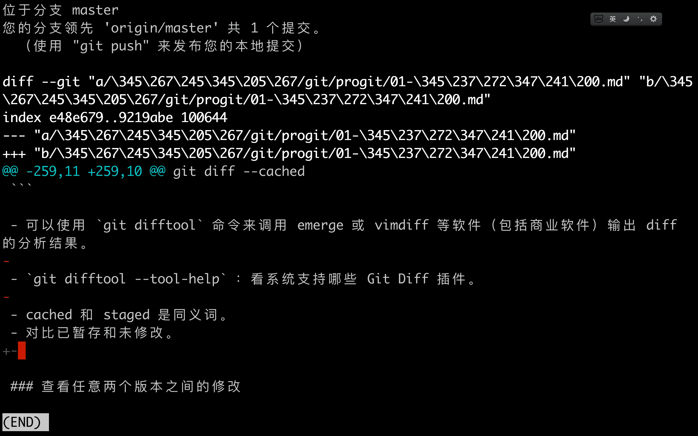

# 命令

| 命令                              | 说明              |
| ------------------------------- | --------------- |
| git --version                   | 查看Git版本         |
| git config --list --show-origin | 查看所有配置以及他们所在的文件 |
| git config <key>                | 来检查 Git 的某一项配置  |

# 版本控制系统

- 可以将选定的文件回溯到之前的状态；

- 将整个项目都回退到过去某个时间点的状态；

- 可以比较文件的变化细节，查出最后是谁修改了哪个地方，从而找出导致怪异问题出现的原因；

- 可以看出谁在何时报告了某个功能缺陷等等。

## 分类

1. **本地版本控制系统**

   采用某种简单的数据库来记录文件的历次更新差异。

   - RCS

2. **集中化版本控制系统**

   > **CVCS**。有一个单一的集中管理的服务器，保存所有文件的修订版本，而协同工作的人们都通过客户端连到这台服务器，取出`最新的文件`或者`提交更新`。 
   >
   > 

   - **缺点**
     - 中央服务器的单点故障。 如果宕机一小时，那么在这一小时内，谁都无法提交更新，也就无法协同工作。

     - 中心数据库所在的磁盘发生损坏，又没有做恰当备份，你将`丢失所有数据`——包括项目的整个变更历史。

3. **分布式版本控制系统**

   > **DVCS**。

   - **优点**
     - 客户端并不只提取最新版本的文件快照， 而是把`代码仓库`完整地`镜像`下来，包括`完整的历史记录`。 
     - 每一次的克隆操作，实际上都是一次对代码仓库的完整备份。
     - 任何一处协同工作用的服务器发生故障，事后都可以用任何一个`镜像出来的本地仓库`恢复。

# GIT特性

1. **直接记录快照，而非差异比较。**其他版本控制系统是基于差异的版本控制。

   - 基于差异：

   - 快照：

     > Git 像是把数据看作是对小型文件系统的一系列快照。<br>每当提交更新或保存项目状态时，基本上就会对当时的全部文件创建一个快照并保存这个快照的索引。<br>如果文件没有修改，Git 不再重新存储该文件，而是只保留一个链接指向之前存储的文件。

2. **近乎所有操作都本地执行**。

3. **git保证完整性**。

   > Git 中所有的数据在存储前都计算校验和，然后以校验和来引用。 <br>不可能在 Git 不知情时更改任何文件内容或目录内容。 <br>Git 用以计算校验和的机制叫做 SHA-1 散列。这是40个十六进制字符串。 <br>基于 Git 中**文件的内容或目录结构**计算出来 TODO。

4. **git一般只添加数据**。

   > Git 几乎不会执行任何可能导致文件不可恢复的操作。

5. **git拥有三种状态和三个阶段**

   

   1. 三种状态

      - **已修改【modified】**：表示修改了文件，但还没保存到数据库中。

      - **已暂存【staged】**：表示对一个已修改文件的当前版本做了标记，使之包含在下次提交的快照中。

      - **已提交【committed】**：表示数据已经安全的保存在本地数据库中。

   2. 三个阶段

      - **工作区**：是对项目的某个版本独立提取出来的内容。从 Git 仓库的压缩数据库中提取出来的文件，放在磁盘上供你使用或修改。

      - **暂存区**：是一个文件，保存了下次将要提交的文件列表信息，一般在 Git 仓库目录中。 Git 的术语叫做「索引」。

      - **git目录**： Git 用来保存项目的元数据和对象数据库的地方。 从其它计算机克隆仓库时，复制的就是这里的数据。 

# 版本

- 查看git版本

```shell
git --version
```

# 配置

设置控制 Git 外观和行为的配置变量。

1. **配置文件**

   - `/etc/gitconfig` 文件：包含系统上每一个用户及他们仓库的通用配置。`--system` 选项会读写该文件中的配置变量。

   - `~/.gitconfig` 或 `~/.config/git/config` 文件：只针对当前用户。`--global` 选项会读写该文件中的配置变量。

   - 项目中的 ` .git/config` 文件：针对该仓库。 默认用这个。`--local`。

> 每个级别会覆盖上一级别的配置。

2. **列表**

   ```shell
   git config --list --show-origin
   ```

3. **用户**

   ```shell
   git config [--local|--global|--system] user.name your_name
   git config [--local|--global|--system] user.email XXX@XXX.com
   ```

   - 必须设置用户名和邮件地址。

   - 会写入到每一次提交中，不可更改。

4. **文本编辑器**

   ```shell
   git config --global core.editor 编辑器
   ```

   当 Git 需要你输入信息时会调用它。 如果未配置，Git 会使用操作系统默认的文本编辑器【Vim、Emacs、Notepad++】。 

5. **别名**

   ```shell
   git config --global alias.co checkout
   git config --global alias.br branch
   git config --global alias.ci commit
   git config --global alias.st status
   git config --global alias.unstage 'reset HEAD --'
   ```


## 检查配置

```shell
git config --list [--local|--global|--system]
```

> 会看到重复的变量名，因为 Git 会从不同的文件中读取同一个配置。

```shell
git config <key>
```

> 检查某一项的配置

```shell
git config --show-origin <key>
```

> 重复时可以查看是在哪个文件中配置的该项值

# 帮助

```shell
git help <verb>
git <verb> --help
man git-<verb>
```

> 以上命令全部等价

```shell
git add -h
```

> 如果不需要全面的手册，只需要可用选项的快速参考，那么可以用 -h 选项获得更简明的 「help」 输出。e.g.

# GIT仓库

## 本地仓库

1. **初始化仓库**

   ```shell
   git init
   ```

   > 将创建一个名为 .git 的子目录。含有你初始化的 Git 仓库中所有的必须文件。

2. **克隆仓库**

   ```shell
   git clone <url> [projectName]
   ```

   > 克隆的是 Git 仓库服务器上的几乎所有数据，不仅仅复制工作所需文件。<br>会拉取每一个文件的每一个版本。

## 远程仓库

- **查看仓库**

  ```shell
  git remote
  ```

  > 列出你指定的每一个远程服务器的简写。origin 是克隆的仓库服务器的默认名字。

  ```shell
  git remote -v
  ```

  > 显示需要读写远程仓库使用的 Git 保存的简写与其对应的 URL。

- **添加仓库**

  ```shell
  git remote add <shortname> <url>
  ```

- **查看仓库**

  ```shell
  git remote show <remote>
  ```

  > 显示当你在特定的分支上执行 *git push* 会自动地推送到哪一个远程分支。
  >
  > 显示哪些远程分支不在你的本地，哪些远程分支已经从服务器上移除了。
  >
  > 显示当你执行 *git pull* 时哪些本地分支可以与它跟踪的远程分支自动合并。

- **重命名仓库**

  ```shell
  git remote rename oldName newName
  ```

- **移除仓库**

  ```shell
  git remote remove name
  ```

# 文件

## 文件状态

工作目录下的每一个文件都不外乎两种状态：**已跟踪** 或 **未跟踪**。 

- 已跟踪：被纳入了版本控制的文件，上一次快照中有他们的记录。

  > 包含三个子状态。
  >
  > 未修改「**unmodified**」<br>已修改「**modified**」<br>已暂存「**staged**」

- 未跟踪「**untracked**」：已跟踪文件外其他文件，既不在上次快照的记录中，也不在暂存区。 


### 状态检查

```shell
git status
```

> `Changes to be committed`：已暂存文件。
>
> `Changes not staged for commit`：已跟踪文件的内容发生了变化，但还没有放到暂存区。

**状态简览**

```shell
git status -s
git status --short
```

> 输出中有两栏，左栏指明了暂存区的状态，右栏指明了工作区的状态。
>
> `??`：新添加的未跟踪文件。<br>`A`：新添加到暂存区中的文件。<br>`M`：修改过的文件。<br>`D`：删除的文件。

## 文件查看

- **未暂存的修改**：对比未暂存和已暂存。

  ```shell
  git diff
  ```

  

  > - 第一部分
  >
  >   - 文件的基本信息。
  >
  >   - 第一行表示结果为git格式的diff：`diff --git "a/file" "b/file"`。
  >
  >   - 第二行表示暂存区和工作区的hash值。
  >
  >   - *"---"* 表示变动前的文件，*"+++"* 表示变动后的文件。
  >
  > - 第二部分
  >
  >   - 变动的位置，用@@表示起首和结束
  >   - *-num1，num2* 有三部分，`-`表示第一个文件，`num1`表示从第259行开始，`num2`表示展示11行。
  >
  > - 第三部分
  >
  >   - 变动的具体内容，除了有变动的行以外，上下文各显示3行。两个文件的上下文，合并显示在一起，叫做 **"合并格式"** 。
  >
  >   - 每一行最前面的标志位
  >
  >     `空`：无变动<br>`-`：第一个文件删除的行<br>`+`：第二个文件新增的行

- **已暂存的修改**：对比已暂存和未修改。

  ```shell
  git diff --cached
  ```

  >  `git difftool` 命令调用 emerge 或 vimdiff 等软件输出 diff 分析结果。 
  >
  >  `git difftool --tool-help` ：看系统支持哪些 Git Diff 插件。
  >
  >  cached 和 staged 是同义词。

- **版本区别**

  ```shell
  git diff <版本号1> <版本号2>
  ```

  ```shell
  git diff <文件夹>
  git diff <版本号1> <版本号2> <文件夹>
  ```

  > 指定文件夹

## 文件操作 

- **跟踪新文件**

  ```shell
  git add <fileName>
  ```

- **暂存文件**

  ```shell
  git add <fileName>
  ```

  > 为每一个文件计算校验和，然后把当前版本的文件快照「 **blob 对象**」保存到 Git 仓库中。<br>最终将校验和加入到暂存区域等待提交。

- **忽略文件**：不纳入 Git 管理，也不出现在未跟踪列表。

  创建  *.gitignore* 文件。子目录下也可以有额外的 **.gitignore** 文件。

  - **格式规范**

    - 空行或者以 # 开头：无意义，视为注释。 

    - 简化正则表达式：会递归应用在整个工作区。

      > *****：匹配零个或多个任意字符。<br>**[abc]**：匹配任何一个在方括号中的字符。<br>**?**：只匹配任意一个字符。<br>**[0-9]** ：表示所有在这两个字符范围内的都可以匹配。<br>******：匹配任意中间目录。

    - 以 */* 开头：防止递归。指定文件。

    - 以 */* 结尾：指定目录。

    - 模式前加叹号 *!* ：忽略指定模式以外的文件或目录。

- **提交更新**

  ```shell
  git commit
  ```

  > 启动你选择的文本编辑器来输入提交说明，编辑器是通过 Shell 的环境变量 EDITOR 指定的，一般为 vim 或 emacs。

  ```shell
  git commit -m "msg"
  ```

  > 1. 提交时记录的是放在暂存区域的快照。
  > 2. Git 会先计算每一个子目录的校验和， 然后在 Git 仓库中这些校验和保存为**树对象**「**记录着目录结构和 blob 对象索引**」。
  > 3. 3. 随后，Git 便会创建一个**提交对象**「**包含树对象的指针和所有提交信息**（作者的姓名和邮箱、提交时输入的信息、指向它的父对象的指针）」。

  - *首次提交*：

  - *非首次提交*:

    > 显示格式
    >
    > [提交分支 提交的 SHA-1 校验和前缀] 提交信息<br>多少文件修改，多少行添加，多少行删除。<br>创建了哪些文件。删除了哪些文件。

- **跳过使用暂存区域**

  ```shell
  git commit -a
  ```

- **撤销操作**

  - *修改最后一次提交*

    ```shell
    git commit --amend
    ```

  - *取消暂存*

    ```shell
    git reset HEAD <file>...
    ```

  - *撤消修改*

    ```shell
    git checkout <file>...
    ```

- **移除文件**

  - *从跟踪清单中删除*：**最终生效还需 commit**。

    ```shell
    git rm files
    ```

  - *在工作目录或者暂存区中做过修改。*

    ```shell
    git rm files -f
    ```

  - *从跟踪清单中删除，但在工作目录中保留。*

    ```shell
    git rm files --cached
    ```

  > files可以使用正则。
  >
  > ```shell
  > git rm log/\*.log
  > git rm \*idea
  > ```

- **移动文件**

  ```shell
  git mv fileFrom fileTo
  ```

  > 等价于三条命令。
  >
  > ```shell
  > mv fileFrom fileTo
  > git rm fileFrom
  > git add fileTo
  > ```

# 提交历史

```shell
git log
```

> 按时间先后顺序列出所有提交，最近的在最上面。<br>列出每个提交的 SHA-1 校验和、作者的名字和电子邮件地址、提交时间以及提交说明。

- **显示差异**

  ```shell
  git log -p|--patch
  ```

- **显示简略统计**

  ```shell
  git log --stat
  ```

  > 列出所有被修改过的文件、有多少文件修改、删了多少行，加了多少行。 <br>在每次提交的最后还有一个总结。

-  **显示指定格式**

  - *预置格式*

    ```shell
    git log --pretty=[oneline|short|full|fuller]
    ```

    > **oneline**：每个提交放在一行显示。<br>**short**：不显示date。<br>**full**和**fuller**：多显示一些内容。

  - *自定义格式*

    ```shell
    git log --pretty=format:"%h - %an, %ar : %s"
    ```

    > | 选项 | 说明                                          |
    > | :--- | :-------------------------------------------- |
    > | %H   | 提交的完整hash值                              |
    > | %h   | 提交的简写哈希值                              |
    > | %T   | 树的完整哈希值                                |
    > | %t   | 树的简写哈希值                                |
    > | %P   | 父提交的完整哈希值                            |
    > | %p   | 父提交的简写哈希值                            |
    > | %an  | 作者名字                                      |
    > | %ae  | 作者的电子邮箱                                |
    > | %ad  | 作者修订日期（可以用 --date=选项 来定制格式） |
    > | %ar  | 作者修订日期，按多久以前的方式显示            |
    > | %cn  | 提交者的名字                                  |
    > | %ce  | 提交者的电子邮件地址                          |
    > | %cd  | 提交日期                                      |
    > | %cr  | 提交日期（距今多长时间）                      |
    > | %s   | 提交说明                                      |
    > | %G?  | 验证GPG签名结果                               |


- **显示分支&合并历史**

  ```shell
  git log --graph
  ```

- **限制输出长度**

  ```shell
  git log -<n>
  ```

  > | 选项               | 说明                    |
  > | ---------------- | --------------------- |
  > | -\<n>            | 仅显示最近的 n 条提交。         |
  > | --since， --after | 仅显示指定时间之后的提交。         |
  > | --until，--before | 仅显示指定时间之前的提交。         |
  > | --author         | 仅显示作者匹配指定字符串的提交。      |
  > | --committer      | 仅显示提交者匹配指定字符串的提交。     |
  > | --grep           | 仅显示提交说明中包含指定字符串的提交。   |
  > | -S               | 仅显示添加或删除内容匹配指定字符串的提交。 |

- **显示各分支的对象**

  ```shell
  git log --decorate
  ```

- **查看及验证GPG签名**

  ```shell
  git log --show-signature
  ```

# 标签

> Git 可以给仓库历史中的某一个提交打上标签，以示重要。

- **标签列表**

  ```shell
  git tag
  ```

  >以字母顺序列出标签，但是它们显示的顺序并不重要。

- **筛选标签**

  ```shell
  git tag -l <通配符>
  ```

- **创建标签**

  >Git 支持两种标签：轻量标签（**lightweight**）与附注标签（**annotated**）。

  - *附注标签*

    ```shell
    git tag -a <标签名> -m "备注"
    ```

    >存储在 Git 数据库中的一个完整对象， 可以被校验，包含打标签者的名字、电子邮件地址、日期时间、标签信息，可以使用 GNU Privacy Guard （GPG）签名并验证。 
    >
    >通常会建议创建附注标签，这样你可以拥有以上所有信息。

  - *轻量标签*

    ```shell
    git tag <标签名>
    ```

    > 很像一个不会改变的分支——它只是某个特定提交的引用。

  - *过去的提交打标签*

    ```shell
    git tag -a <标签名> <logid>
    ```

- **标签详情**

  ```shell
  git show <标签名>
  ```

- **共享标签**

  ```shell
  git push <remote> <tagname>
  git push <remote> --tags # 所以标签
  ```

  >不会区分轻量标签和附注标签， 没有简单的选项能够让你只选择推送一种标签。

- **删除标签**

  - *删除本地标签*

    ```shell
    git tag -d <tagname>
    ```

  - *删除远程标签*

    ```shell
    git push <remote> :refs/tags/<tagname>
    ```

    > 将冒号前面的空值推送到远程标签名，可以高效地删除。

    ```shell
    git push <remote> --delete <tagname>
    ```

    > 直观删除。

- **检出标签**

  ```shell
  git checkout <tagname>
  ```

# 分支

## 本地分支

>- 在很多版本控制系统中，这是一个略微低效的过程——常常需要完全创建一个源代码目录的副本。
>- Git 处理分支的方式可谓是难以置信的轻量，创建新分支这一操作几乎能在瞬间完成，并且在不同分支之间的切换操作也是一样便捷。 
>  - Git 的分支实质上仅是包含所指对象校验和的文件，所以它的创建和销毁都异常高效。 
>  - 创建一个新分支就相当于往一个文件中写入 41 个字节（40 个字符和 1 个换行符）。
>- Git 的分支，其实**本质**上仅仅是指向提交对象的**可变指针**。 
>- Git 的默认分支名字是 **master**。
>- **Git** 的 **master** 分支并不是一个特殊分支。 它跟其它分支没有区别。 
>- **Git** 有一个名为 **HEAD** 的特殊指针，指向当前所在的本地分支。「**当前分支的别名**」。

- **分支创建**

  ```shell
  git branch <分支名>
  ```

  >在当前所在的提交对象上创建一个指针。

- **分支切换**

  >会改变工作目录中的文件。<br>如果 Git 不能干净利落地完成这个任务，将禁止切换分支。

  - *切换已存在分支*

    ```shell
    git checkout <分支名>
    ```

  - *切换不存在分支*

    ```shell
    git checkout -b <分支名>
    ```

    > 等同于于
    >
    > ```shell
    > git branch <分支名>
    > git checkout <分支名>
    > ```

- **分支合并**

  ```shell
  git merge <目标分支>
  ```

  - *fast-forward【快进】*

    > 目标分支所在的提交是当前所在提交的直接后继。

  - *merge【自动合并】*

    > 目标分支所在的提交不是当前所在提交的直接后继，git会把两个分支的末端节点和两个分支的公共祖先做一个三方合并。如果没有冲突，会创建一个新的节点。新节点有两个**父提交**。

  - *auto-merging【合并冲突】*

    > 如果在两个分支中对同一个部分进行了不同的修改，需要解决冲突。

    - 手动解决

      >Unmerged file：
      >
      >```shell
      ><<<<<<< HEAD:<文件名>
      >当前分支的修改
      >=======
      >目标分支的修改
      >>>>>>>> <目标分支>:<文件名>
      >```
      >
      >执行 git add 命令表示冲突已解决。Unmerged file：

    - 工具

      ```
      git mergetool
      ```

- **删除分支**

  ```shell
  git branch -d <分支名>
  ```

- **分支列表**

  ```shell
  git branch
  ```

  > - -v：展示每个分支的最后一次提交。
  > - --merged：查看哪些分支已经合并到当前分支。
  > - --no-merged：查看所有包含未合并工作的分支。
  >   - 这里展示的分支执行 -d 会失效。-D可强制删除。
  > - --merged [分支名]：查看哪些分支已经合并到指定分支。

## 远程分支

- **远程分支信息**

  ```shell
  git remote show <remote>
  ```

- **远程引用**

  对远程仓库的引用，包括分支、标签等等。

  - 远程引用列表

    ```shell
    git ls-remote <remote>
    ```

- **远程跟踪分支**

  - *特点*：远程分支状态的引用。无法移动，进行网络通信后， Git会自动移动，以精确反映远程仓库的状态。
  - *命名*：`<remote>/<branch>`。

  - *同步远程跟踪分支*

    ```shell
    git fetch <remote>
    ```

- **推送远程分支**

  ```shell
  git push <remote> <branch>
  ```

  > 完整命令
  >
  > ```shell
  > git push <remote> refs/heads/<branch>:refs/heads/<branch>
  > ```

- **跟踪分支**

  > 从远程跟踪分支检出一个本地分支会自动创建「跟踪分支」(它跟踪的分支叫做「上游分支」)。
  >
  > 如果在一个跟踪分支上输入 `git pull`，Git 能自动地识别去哪个服务器上抓取、合并到哪个分支。

  - *设置跟踪*

    ```shell
    git checkout -b <branch> <remote>/<branch>
    ```

    >本地某分支不存在，以远程为基础，创建本地分支，并建立跟踪关系。

    ```shell
    git checkout --track <remote>/<branch>
    ```

    >与远程分支建立跟踪关系

    ```shell
    git checkout <branch>
    ```

    >如果检出的分支不存在，且刚好只有一个名字与之匹配的远程分支，那么 Git 就会为你创建一个跟踪分支

    ```shell
    git branch -u <remote>/<branch>
    ```

    >修改/设置正在跟踪的上游分支，当设置好跟踪分支后，可以通过简写 @{upstream} 或 @{u} 来引用它的上游分支。

  - *查看跟踪关系*

    ```shell
    git branch -vv
    ```

- **拉取远程分支**

  ```shell
  git pull
  ```

  > 相当于
  >
  > ```shell
  > git fetch
  > git merge
  > ```

- 删除远程分支

  ```shell
  git push <remote> --delete <branch>
  ```

## 分支开发工作流

- **长期分支**

  不同的长期分支具有不同级别的稳定性;当它们具有一定程度的稳定性后，再把它们合并入具有更高级别稳定 性的分支中。

- **主题分支**

  主题分支是一种短期分支，它被用来实现单一特性或其相关工作。

# 变基

- 将提交在某一分支的所有修改都移动到另一个分支上

- rebase原理

  - 找到两个分支的最近公共祖先
  - 对比当前分支相对于该祖先的历次提交，提取相应的修改并存为临时文件。
  - 将分支指向目标基底，依次将之前另存为临时文件的修改依序应用。

- rebase命令

  ```shell
  # 将目标基底分支分支变基到指定分支
  git checkout <branch>
  git rebase <目标分支>
  # 目标分支快速合并
  git checkout <目标分支>
  git merge <指定分支>
  ```

- rebase实例

  ```shell
  # master主分支，sever为从master拉取的主题分支，client为从server拉取的分支
  # 只合并client到master
  git rebase --onto master server client
  git checkout master
  git merge client
  # 将server合并到master
  git rebase master server
  git checkout master
  git merge server
  ```

- 风险
  - 如果提交在你的仓库之外，而别人可能基于这些提交进行开发，那么不要执行变基。
  - 解决办法：用变基解决变基

- 变基和合并的区别
  - 变基：整理合并提交历史
  - 合并：保留所有的提交记录

# GITHUB

## 公钥

```Ssh
ssh-keygen -o
```

> 生成公钥

```Ssh
~/.ssh/id_rsa.pub
```

> 公钥位置

## 特殊文件

- **readme**

  > 可以是 README ，README.md， README.asciidoc。

  - 一般包含这些内容。

    > • 该项目的作用
    >
    > • 如何配置与安装
    >
    > • 有关如何使用和运行的例子
    >
    > • 项目的许可证 
    >
    > • 如何向项目贡献力量

-  **CONTRIBUTING**

  > 当有人开启一个合并请求时 GitHub 会显示。

# GIT命令

## 修订版本

### 单个修订版本

- **表示方法【老孙说会了，下次复习不要打脸】**

  ```shell
  # 查看分支在昨天最近的提交
  <branceName>@{yesterday}
  # SHA-1
  SHA-1|SHA-1至少4个字符，且没有歧义
  # HEAD在前n次所指向的提交
  HEAD@{n}
  # 第一个父提交
  HEAD^
  HEAD~
  # 第二个父提交
  HEAD^2
  # 第一父提交的第一父提交
  HEAD~~
  HEAD^^
  HEAD~2
  # 第一父提交的第一父提交的第一父提交的第二个父提交
  HEAD~3^2
  ```


- **查看单个修订版本**

  ```sh
  git show [修订版本]
  ```

- **查看全部修订版本**

  ```sh
  git log
  # 显示简短且唯一的sha1值； 默认使用七个字符。
  git log --abbrev-commit --pretty=oneline 
  ```

- **查看引用日志**

  > 引用日志记录了最近几个月本地你的 HEAD 和分支引用所指向的历史。 

  ```sh
  #查看引用日志
  git reflog
  #git log 输出格式的引用日志信息
  git log -g
  ```

### 修订版本区间

- **双点**

  ```shell
  git log refA..refB
  ```

  > 在 refA 分支中而不在 refB 分支中的提交

- **多点**

  ```shell
  git log ^refA refB
  git log refB --not refA
  ```

  > 在 refA 分支中而不在 refB 分支中的提交

  ```shell
  git log refA refB ^refC
  git log refA refB --not refC
  ```

  > 所有 被 refA 或 refB 包含的但是不被 refC 包含的提交。

- **三点**

  ```shell
  git log refA...refB
  ```

  > refA 分支和 refB 分支的并差集

  ```shell
  git log --left-right refA...refB
  ```

  > 输出数据更加清晰
  >
  > ```sh
  > < A1
  > < A1
  > > B1
  > > B2
  > ```

## 交互式暂存

```shell
git add -i
git add --interactive 
```

> 进入交互式界面

### 暂存补丁

```shell
git add -p
git add --patch
```

> y - 暂存这个区域
>
> n - 不暂存这个区域
>
> a - 暂存这个和剩余区域
>
> d - 这个区域和剩余区域都不暂存
>
> g - 选一个区域
>
> / - 通过正则表达式选择区域
>
> j - 跳到下一个未处理过的区域
>
> J - 跳到下一个区域
>
> k - 跳到上一个未处理过的区域
>
> K - 跳到上一个区域
>
> s - 拆分当前区域
>
> e - 编辑当前区域
>
> ? - 打印帮助

## 清理与贮藏

### 贮藏

> 贮藏的区域分为**暂存区**和**工作区**。

- **贮藏**

  ```shell
  # 贮藏 已跟踪 的 暂存区 和 工作区 文件
  git stash [push]
  
  # 贮藏 已跟踪 的 暂存区 和 工作区 文件，自定义注释
  git stash save "comment"
  
  # 贮藏 已跟踪 的 工作区 文件
  git stash --keep-index
  
  # 贮藏 已跟踪 和 未跟踪 文件，不包含忽略文件
  git stash -u[--include-untracked]
  
  # 贮藏 已跟踪 和 未跟踪 文件，包含忽略文件
  git stash -a[--all]
  ```

- **贮藏列表**

  ```shell
  git stash list
  ```

- **应用贮藏**

  ```shell
  # 应用 最近一个贮藏，暂存区 和 工作区 都应用到 工作区
  git stash apply
  
  # 应用 指定贮藏，暂存区 和 工作区 都应用到 工作区
  git stash applay <stashname>
  
  # 应用 最近一个贮藏，暂存区 应用到 暂存区， 工作区 都应用到 工作区
  git stash apply --index
  
  # 应用 最近一个贮藏，并从 贮藏列表 删除。
  git stash pop
  
  # 交互式 选择性贮藏
  git stash --patch
  
  # 在 新分支 应用 最近一个贮藏，并删除贮藏
  git stash branch <branchname>
  ```

- **删除贮藏**

  ```shell
  # 删除 最近一个 贮藏
  git stash drop
  
  # 删除 指定 贮藏
  git stash drop <stashname>
  
  # 清空贮藏
  git stash clear
  ```

- **显示贮藏文件**

  ```shell
  # 展示 最近一个 贮藏 的文件
  git stash show
  
  # 展示 最近一个 贮藏 的文件修改内容
  git stash show -p
  
  # 展示 指定 贮藏 的文件
  git stash show <stashname>
  
  # 展示 指定 贮藏 的文件修改内容
  git stash show <stashname> -p
  ```

### 清理

**清理未跟踪文件**。

```shell
# 交互式清理 未跟踪 文件
git clean -i

# 强制清理 未跟踪 文件
git clean -f

# 查看会删除哪些文件，但不真实删除
git clean -n

# 删除 未跟踪的 空的子目录 和 文件
git clean -d -[i/f/n]

# 删除 忽略 文件
git clean -x -[i/f/n]
```

## GPG

> GNU Privacy Guard，GNU隐私保护，是一种基于密钥的加密方式，主要用于文件加密。

- **生成密钥**

  ```shell
  gpg --gen-key # 交互式地输入真实姓名、邮箱
  ```

- **查看已有密钥**

  ```shell
  # 查看公钥和其签名
  gpg -k --list-sigs
  
  # 查看私钥和其签名
  gpg -K --list-sigs
  ```

  - **密钥类型**：pub/sub/sec/ssb
    - pub：公钥
    - sec：私钥
    - sub：子密钥的公钥
    - ssb：子密钥的私钥
  - **密钥用途**：E/S/C/A
    - *Encryption*：加密。
    - *Signing*：签名。
    - *Certification*：认证其他子密钥或 uid。
    - *Authentication*：身份认证，例如用于 SSH 登录。

- **导出密钥**

  ```shell
  # 导出公钥 --armor 是可视化
  gpg --armor --export <签名>
  
  # 导出私钥
  gpg --armor --export-secret-keys <签名>
  
  # 导出子密钥
  gpg --armor --export-secret-subkeys <签名>
  ```

- **导入密钥**

  ```shell
  gpg --import <gpg文件名>
  ```

- **删除密钥**

  ```shell
  # 删除公钥
  gpg --delete-keys <签名>
  
  # 删除私钥
  gpg --delete-secret-keys <签名>
  
  # 删除公钥和私钥
  gpg --delete-secret-and-public-keys <签名>
  ```

- **编辑密钥**

  ```shell
  gpg --edit-key <签名>
  ```

- **签署密钥**

  ```shell
  git config --global user.signingkey <签名>
  ```

- **签署标签**

  ```shell
  git tag -s <tagName> -m 'comment'
  ```

- **签署提交**

  ```shell
  git commit -m 'comment' -S 
  
  # 自动签署，配置后可不加-S
  git config --global commit.gpgsign true
  ```

## 搜索

### 文件查找

```shell
# 查找工作目录的文件
git grep {关键字}

# 查找指定版本的文件
git grep {关键字} {版本号}

# 输出匹配的行号
git grep -n {关键字}

# 输出每个文件包含了多少个匹配
git grep -c {关键字}

# 输出每一个匹配的字符串所在的方法或函数
git grep -p {关键字}

# 多条件查询
git grep -e {关键字} --and -e {关键字}
git grep -e {关键字} <--or> -e {关键字}
```

### 日志搜索

```shell
# 显示新增和删除关键字的提交
git log -S {关键字}

# 显示一行或一个函数的提交历史
git log -L :关键字:文件名
```

## 重写历史

### 修改最近一次提交

```shell
# 修改内容，注释
git commit --amend

# 修改内容&不修改注释
git commit --amend --no-edit
```

### 修改最近多次提交

#### 修改提交信息

1. **选择要修改的提交**。

   ```shell
   git rebase -i {要修改的最近一次提交的父提交}
   ```

2. 将要修改的提交 **`pick` 改成 `edit`**，并保存退出。

   ```shell
   pick f7f3f6d changed my name a bit
   edit 310154e updated README formatting and added blame
   pick a5f4a0d added cat-file
   ```

3. **修改提交信息**，编辑提交注释并保存退出。

   ```shell
   git commit --amend
   ```

4. **处理下一个提交信息**，没有则结束。

   ```shell
   git rebase --continue
   ```

#### 修改提交顺序

```
pick f7f3f6d changed my name a bit
pick 310154e updated README formatting and added blame
pick a5f4a0d added cat-file
```

改成如下，实现**修改顺序**并完全**移除**想要移除的提交。

```
pick 310154e updated README formatting and added blame
pick f7f3f6d changed my name a bit
```

#### 合并多个提交

将要合并的多个提交，除第一个，其他提交的 **`pick` 改成 `squash`**。

#### 拆分提交

1. 选择**要拆分**的提交。

   ```shell
   git rebase -i {要拆分的最近一次提交的父提交}
   ```

2. 将要拆分的提交 **`pick` 改成 `edit`**，并保存退出。

3. **撤销**当前提交。

   ```shell
   git reset HEAD^
   ```

4. **分批**提交。

5. **处理下一个提交信息**，没有则结束。

   ```shell
   git rebase --continue
   ```

### Filter-branch

- **修改已提交的邮箱**

  ```shell
  git filter-branch --commit-filter 'GIT_AUTHOR_EMAIL="zhangshuai1134@gmail.com"; git commit-tree "$@";' HEAD
  ```

  

