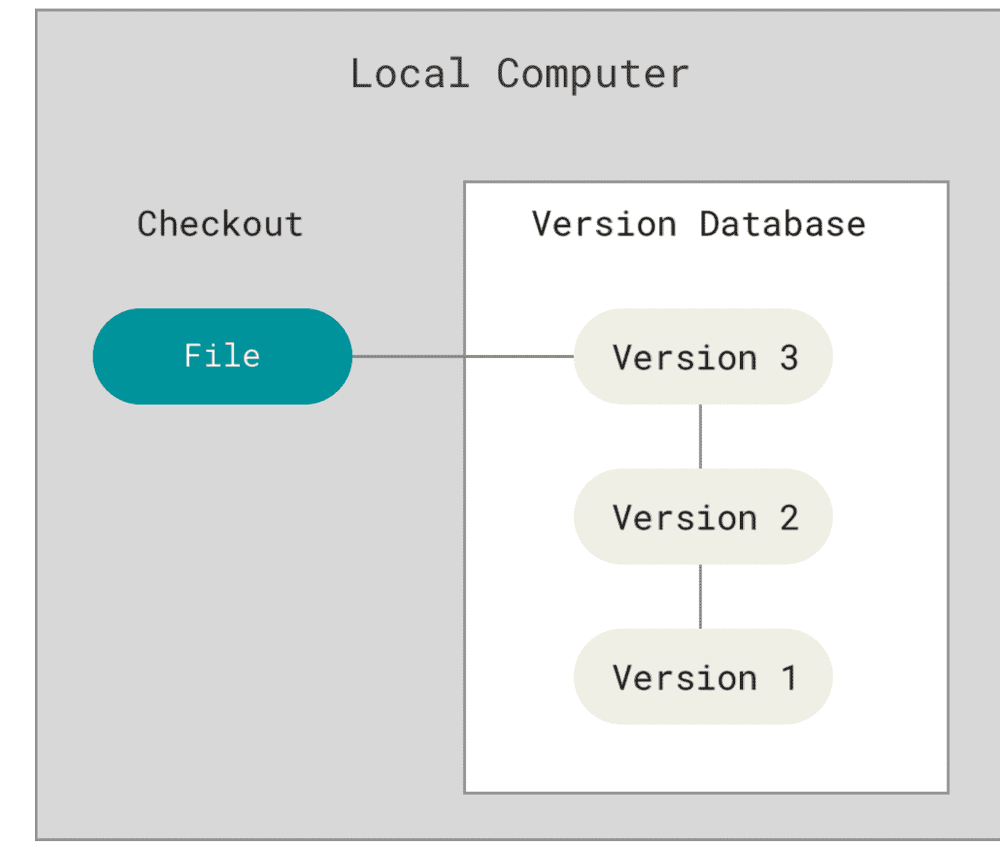
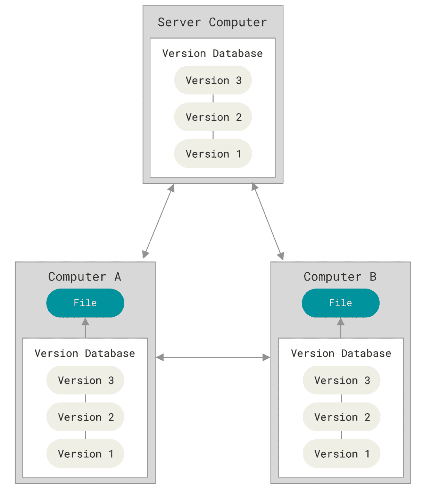

# 版本控制系统

- 可以将选定的文件回溯到之前的状态；

- 将整个项目都回退到过去某个时间点的状态；

- 可以比较文件的变化细节，查出最后是谁修改了哪个地方，从而找出导致怪异问题出现的原因；

- 可以看出谁在何时报告了某个功能缺陷等等。

## 分类

1. **本地版本控制系统**

   采用某种简单的数据库来记录文件的历次更新差异。

   - **RCS**： 

2. **集中化版本控制系统**

   > 有一个单一的集中管理的服务器，保存所有文件的修订版本，而协同工作的人们都通过客户端连到这台服务器，**取出最新的文件** 或者 **提交更新**。
   >
   > **缺点** 
   >
   > - 中央服务器的单点故障。 如果宕机一小时，那么在这一小时内，谁都无法提交更新，也就无法协同工作。
   >
   > - 中心数据库所在的磁盘发生损坏，又没有做恰当备份，你将`丢失所有数据`——包括项目的整个变更历史。

   **CVCS**：

3. **分布式版本控制系统**

   > **优点**
   >
   > - 客户端并不只提取最新版本的文件快照， 而是把 `代码仓库` 完整地 `镜像` 下来，包括 `完整的历史记录` 。 
   > - 每一次的克隆操作，实际上都是一次对代码仓库的完整备份。
   > - 任何一处协同工作用的服务器发生故障，事后都可以用任何一个 `镜像出来的本地仓库` 恢复。

   **DVCS**：

# GIT 基础

## 特性

1. **直接记录快照，而非差异比较。**其他版本控制系统是基于差异的版本控制。

   - **基于差异**：

   - **基于快照**：

     > Git 像是把数据看作是对小型文件系统的一系列快照。
     >
     > 每当提交更新或保存项目状态时，基本上就会对当时的全部文件创建一个快照并保存这个快照的索引。
     >
     > 如果文件没有修改，Git 不再重新存储该文件，而是只保留一个链接指向之前存储的文件。

2. **近乎所有操作都本地执行**。

3. **git保证完整性**。

   > Git 中所有的数据在存储前都计算校验和，然后以校验和来引用。 <br>不可能在 Git 不知情时更改任何文件内容或目录内容。 <br>Git 用以计算校验和的机制叫做 SHA-1 散列。这是40个十六进制字符串。 <br>基于 Git 中**文件的内容或目录结构**计算出来 TODO。

4. **git一般只添加数据**。

   > Git 几乎不会执行任何可能导致文件不可恢复的操作。

5. **git拥有三种状态和三个阶段**

   

   - ***三种状态***

     - *已修改【modified】*：表示修改了文件，但还没保存到数据库中。


     - *已暂存【staged】*：表示对一个已修改文件的当前版本做了标记，使之包含在下次提交的快照中。


     - *已提交【committed】*：表示数据已经安全的保存在本地数据库中。

   - ***三个阶段***

     - *工作区*：是对项目的某个版本独立提取出来的内容。从 Git 仓库的压缩数据库中提取出来的文件，放在磁盘上供你使用或修改。


     - *暂存区*：是一个文件，保存了下次将要提交的文件列表信息，一般在 Git 仓库目录中。 Git 的术语叫做「索引」。


     - *git目录*： Git 用来保存项目的元数据和对象数据库的地方。 从其它计算机克隆仓库时，复制的就是这里的数据。 

## 仓库

### 本地仓库

1. **初始化仓库**：创建一个名为 .git 的子目录。含有所有的必须文件。

   ```shell
   git init
   ```

2. **克隆仓库**：克隆的是 Git 仓库服务器上的几乎所有数据，不仅仅复制工作所需文件。

   ```shell
   git clone {url} [projectName]
   ```

   - `url`：远程仓库地址。
   - `projectName`：本地项目名称。

### 远程仓库

- **查看仓库**

  ```shell
  # 列出每一个远程服务器的简写
  git remote
  
  # 列出每一个远程服务器的简写和对应的URL。
  git remote -v
  ```

- **添加仓库**

  ```shell
  git remote add {shortName} {url}
  ```

- **查看仓库**

  ```shell
  git remote show {shortName}
  ```

  > 显示当你在特定的分支上执行 *git push* 会自动地推送到哪一个远程分支。
  >
  > 显示哪些远程分支不在你的本地，哪些远程分支已经从服务器上移除了。
  >
  > 显示当你执行 *git pull* 时哪些本地分支可以与它跟踪的远程分支自动合并。

- **重命名仓库**

  ```shell
  git remote rename oldName newName
  ```

- **移除仓库**

  ```shell
  git remote remove name
  ```

## 文件

### 状态

> 一个文件有两种状态：**已跟踪** 或 **未跟踪**。 

- ***已跟踪***：被纳入了版本控制的文件，上一次快照中有他们的记录。包含**三个子状态**。
  - 未修改「**unmodified**」
  - 已修改「**modified**」
  - 已暂存「**staged**」
  
- ***未跟踪「untracked」***：已跟踪文件外其他文件，既不在上次快照的记录中，也不在暂存区。 


```shell
# 状态展示
git status
```

> `Changes to be committed`：已暂存文件。
>
> `Changes not staged for commit`：已跟踪文件的内容发生了变化，但还没有放到暂存区。

```shell
# 状态的简单显示
git status -s
git status --short
```

> 输出中有两栏，左栏指明了暂存区的状态，右栏指明了工作区的状态。
>
> `??`：新添加的未跟踪文件。<br>`A`：新添加到暂存区中的文件。<br>`M`：修改过的文件。<br>`D`：删除的文件。<br>`U`：文件没有被合并(你需要完成合并才能进行提交)。

### 文件查看

- **未暂存的修改**：对比 *已暂存* 和 *未暂存* 。

  ```shell
  git diff
  ```

  

  > - 第一部分
  >
  >   - 文件的基本信息。
  >
  >   - 第一行表示结果为git格式的diff：`diff --git "a/file" "b/file"`。
  >
  >   - 第二行表示暂存区和工作区的hash值。
  >
  >   - *"---"* 表示变动前的文件，*"+++"* 表示变动后的文件。
  >
  > - 第二部分
  >
  >   - 变动的位置，用@@表示起首和结束
  >   - *-num1，num2* 有三部分，`-`表示第一个文件，`num1`表示从第259行开始，`num2`表示展示11行。
  >
  > - 第三部分
  >
  >   - 变动的具体内容，除了有变动的行以外，上下文各显示3行。两个文件的上下文，合并显示在一起，叫做 **"合并格式"** 。
  >
  >   - 每一行最前面的标志位
  >
  >     `空`：无变动<br>`-`：第一个文件删除的行<br>`+`：第二个文件新增的行

- **已暂存的修改**：对比已暂存和未修改。

  ```shell
  git diff --cached
  ```

  >  `git difftool` 命令调用 emerge 或 vimdiff 等软件输出 diff 分析结果。 
  >
  >  `git difftool --tool-help` ：看系统支持哪些 Git Diff 插件。
  >
  >  cached 和 staged 是同义词。

- **版本区别**

  ```shell
  git diff <版本号1> <版本号2>
  ```

  ```shell
  git diff <文件夹>
  git diff <版本号1> <版本号2> <文件夹>
  ```

  > 指定文件夹

### 文件操作 

- **跟踪新文件**

  ```shell
  git add <fileName>
  ```

- **暂存文件**

  ```shell
  git add <fileName>
  ```

  > 为每一个文件计算校验和，然后把当前版本的文件快照「 **blob 对象**」保存到 Git 仓库中。<br>最终将校验和加入到暂存区域等待提交。

- **忽略文件**：不纳入 Git 管理，也不出现在未跟踪列表。

  创建  *.gitignore* 文件。子目录下也可以有额外的 **.gitignore** 文件。

  - **格式规范**

    - 空行或者以 # 开头：无意义，视为注释。 

    - 简化正则表达式：会递归应用在整个工作区。

      > *****：匹配零个或多个任意字符。<br>**[abc]**：匹配任何一个在方括号中的字符。<br>**?**：只匹配任意一个字符。<br>**[0-9]** ：表示所有在这两个字符范围内的都可以匹配。<br>******：匹配任意中间目录。

    - 以 */* 开头：防止递归。指定文件。

    - 以 */* 结尾：指定目录。

    - 模式前加叹号 *!* ：忽略指定模式以外的文件或目录。

- **提交更新**

  ```shell
  git commit
  ```

  > 启动你选择的文本编辑器来输入提交说明，编辑器是通过 Shell 的环境变量 EDITOR 指定的，一般为 vim 或 emacs。

  ```shell
  git commit -m "msg"
  ```

  > 1. 提交时记录的是放在暂存区域的快照。
  > 2. Git 会先计算每一个子目录的校验和， 然后在 Git 仓库中这些校验和保存为**树对象**「**记录着目录结构和 blob 对象索引**」。
  > 3. 3. 随后，Git 便会创建一个**提交对象**「**包含树对象的指针和所有提交信息**（作者的姓名和邮箱、提交时输入的信息、指向它的父对象的指针）」。

  - ***首次提交***：

  - ***非首次提交***:

    > 显示格式
    >
    > [提交分支 提交的 SHA-1 校验和前缀] 提交信息<br>多少文件修改，多少行添加，多少行删除。<br>创建了哪些文件。删除了哪些文件。

- **跳过使用暂存区域**

  ```shell
  git commit -a
  ```

- **撤销操作**

  - *修改最后一次提交*

    ```shell
    git commit --amend
    ```

  - *取消暂存*

    ```shell
    git reset HEAD <file>...
    ```

  - *撤消修改*

    ```shell
    git checkout <file>...
    ```

- **移除文件**

  - *从跟踪清单中删除*：**最终生效还需 commit**。

    ```shell
    git rm files
    ```

  - *在工作目录或者暂存区中做过修改。*

    ```shell
    git rm files -f
    ```

  - *从跟踪清单中删除，但在工作目录中保留。*

    ```shell
    git rm files --cached
    ```

  > files可以使用正则。
  >
  > ```shell
  > git rm log/\*.log
  > git rm \*idea
  > ```

- **移动文件**

  ```shell
  git mv fileFrom fileTo
  ```

  > 等价于三条命令。
  >
  > ```shell
  > mv fileFrom fileTo
  > git rm fileFrom
  > git add fileTo
  > ```

## 提交历史

```shell
git log
```

> 按时间先后顺序列出所有提交，最近的在最上面。<br>列出每个提交的 SHA-1 校验和、作者的名字和电子邮件地址、提交时间以及提交说明。

- **显示差异**

  ```shell
  git log -p|--patch
  ```

- **显示简略统计**

  ```shell
  git log --stat
  ```

  > 列出所有被修改过的文件、有多少文件修改、删了多少行，加了多少行。 <br>在每次提交的最后还有一个总结。

-  **显示指定格式**

  - *预置格式*

    ```shell
    git log --pretty=[oneline|short|full|fuller]
    ```

    > **oneline**：每个提交放在一行显示。<br>**short**：不显示date。<br>**full**和**fuller**：多显示一些内容。

  - *自定义格式*

    ```shell
    git log --pretty=format:"%h - %an, %ar : %s"
    ```

    > | 选项 | 说明                                          |
    > | :--- | :-------------------------------------------- |
    > | %H   | 提交的完整hash值                              |
    > | %h   | 提交的简写哈希值                              |
    > | %T   | 树的完整哈希值                                |
    > | %t   | 树的简写哈希值                                |
    > | %P   | 父提交的完整哈希值                            |
    > | %p   | 父提交的简写哈希值                            |
    > | %an  | 作者名字                                      |
    > | %ae  | 作者的电子邮箱                                |
    > | %ad  | 作者修订日期（可以用 --date=选项 来定制格式） |
    > | %ar  | 作者修订日期，按多久以前的方式显示            |
    > | %cn  | 提交者的名字                                  |
    > | %ce  | 提交者的电子邮件地址                          |
    > | %cd  | 提交日期                                      |
    > | %cr  | 提交日期（距今多长时间）                      |
    > | %s   | 提交说明                                      |
    > | %G?  | 验证GPG签名结果                               |


- **显示分支&合并历史**

  ```shell
  git log --graph
  ```

- **限制输出长度**

  ```shell
  git log -<n>
  ```

  > | 选项               | 说明                    |
  > | ---------------- | --------------------- |
  > | -\<n>            | 仅显示最近的 n 条提交。         |
  > | --since， --after | 仅显示指定时间之后的提交。         |
  > | --until，--before | 仅显示指定时间之前的提交。         |
  > | --author         | 仅显示作者匹配指定字符串的提交。      |
  > | --committer      | 仅显示提交者匹配指定字符串的提交。     |
  > | --grep           | 仅显示提交说明中包含指定字符串的提交。   |
  > | -S               | 仅显示添加或删除内容匹配指定字符串的提交。 |

- **显示各分支的对象**

  ```shell
  git log --decorate
  ```

- **查看及验证GPG签名**

  ```shell
  git log --show-signature
  ```

## 标签

> Git 可以给仓库历史中的某一个提交打上标签，以示重要。

- **标签列表**

  ```shell
  git tag
  ```

  >以字母顺序列出标签，但是它们显示的顺序并不重要。

- **筛选标签**

  ```shell
  git tag -l <通配符>
  ```

- **创建标签**

  >Git 支持两种标签：轻量标签（**lightweight**）与附注标签（**annotated**）。

  - *附注标签*

    ```shell
    git tag -a <标签名> -m "备注"
    ```

    >存储在 Git 数据库中的一个完整对象， 可以被校验，包含打标签者的名字、电子邮件地址、日期时间、标签信息，可以使用 GNU Privacy Guard （GPG）签名并验证。 
    >
    >通常会建议创建附注标签，这样你可以拥有以上所有信息。

  - *轻量标签*

    ```shell
    git tag <标签名>
    ```

    > 很像一个不会改变的分支——它只是某个特定提交的引用。

  - *过去的提交打标签*

    ```shell
    git tag -a <标签名> <logid>
    ```

- **标签详情**

  ```shell
  git show <标签名>
  ```

- **共享标签**

  ```shell
  git push <remote> <tagname>
  git push <remote> --tags # 所以标签
  ```

  >不会区分轻量标签和附注标签， 没有简单的选项能够让你只选择推送一种标签。

- **删除标签**

  - *删除本地标签*

    ```shell
    git tag -d <tagname>
    ```

  - *删除远程标签*

    ```shell
    git push <remote> :refs/tags/<tagname>
    ```

    > 将冒号前面的空值推送到远程标签名，可以高效地删除。

    ```shell
    git push <remote> --delete <tagname>
    ```

    > 直观删除。

- **检出标签**

  ```shell
  git checkout <tagname>
  ```

# GIT 分支

- 在很多版本控制系统中，这是一个略微低效的过程——常常需要完全创建一个源代码目录的副本。
- Git 处理分支的方式可谓是难以置信的轻量，创建新分支这一操作几乎能在瞬间完成，并且在不同分支之间的切换操作也是一样便捷。 
 - Git 的分支实质上仅是包含所指对象校验和的文件，所以它的创建和销毁都异常高效。 
 - 创建一个新分支就相当于往一个文件中写入 41 个字节（40 个字符和 1 个换行符）。
- Git 的分支，其实**本质**上仅仅是指向提交对象的**可变指针**。 
- Git 的默认分支名字是 **master**。
- **Git** 的 **master** 分支并不是一个特殊分支。 它跟其它分支没有区别。 
- **Git** 有一个名为 **HEAD** 的特殊指针，指向当前所在的本地分支。「**当前分支的别名**」。

## 本地分支

- **分支创建**：在当前所在的提交对象上创建一个指针。

  ```shell
  git branch {分支名}
  ```

- **分支切换**：改变工作目录中的文件。如果 Git **不能直接完成，禁止切换**。

  - *切换已存在分支*

    ```shell
    git checkout {分支名}
    ```
  
  - *切换不存在分支*

    ```shell
    git checkout -b {分支名}
    
    # 等同于
    git branch {分支名} + git checkout {分支名}
    ```
    
  
- **分支合并**

  ```shell
  git merge {目标分支名}
  ```

  - ***fast-forward【快进】***：目标分支所在的提交是当前所在提交的直接后继。
- ***merge【自动合并】***：目标分支所在的提交不是当前所在提交的直接后继，git会把两个分支的末端节点和两个分支的公共祖先做一个三方合并。如果没有冲突，会创建一个新的节点。新节点有两个**父提交**。
  - ***auto-merging【合并冲突】***：如果在两个分支中对同一个部分进行了不同的修改，需要解决冲突。

- **删除分支**

  ```shell
  git branch -d <分支名>
  ```

- **分支列表**

  ```shell
  git branch [-v] [[--merged|--no-merged] {分支名}]
  ```

  - `-v`：展示每个分支的最后一次提交。
  - `--merged`：查看哪些分支已经合并到当前分支。
  - `--no-merged`：查看所有包含未合并工作的分支。
    - 这里展示的分支执行 `-d` 会失效。
    - `-D` 可强制删除。
  - `--merged [分支名]`：查看哪些分支已经合并到指定分支。

## 远程分支

- **远程分支信息**

  ```shell
  git remote show {remoteName}
  ```

- **远程引用**：对远程仓库的引用，包括分支、标签等等。

  ```shell
git ls-remote {remoteName}
  ```

- **远程跟踪分支**

  - ***特点***：远程分支状态的引用。无法移动，进行网络通信后， Git会自动移动，以精确反映远程仓库的状态。
  - ***命名***：`{remote}/{branch}`。

  - ***同步远程跟踪分支***

    ```shell
    git fetch {remoteName}
    ```

- **推送远程分支**

  ```shell
  git push {remoteName} {branchName}
  
  # 完整命令
  git push {remoteName} refs/heads/{branchName}:refs/heads/{branchName}
  ```
  
- **跟踪分支**：跟踪后可直接用 `git pull`。

  - ***自动跟踪***

    ```shell
    # 从远程分支检出
    
    # 检出的分支不存在，且刚好只有一个名字与之匹配的远程分支
    git checkout {branchName}
    ```


  - ***设置跟踪***

    ```shell
    # 本地某分支不存在，以远程为基础，创建本地分支，并建立跟踪关系。
    git checkout -b {branchName} {remoteName}/{branchName}
    
    # 与远程分支建立跟踪关系
    git checkout --track {remoteName}/{branchName}
    
    # 修改/设置正在跟踪的上游分支
    git branch -u {remoteName}/{branchName}
    ```

  - ***查看跟踪关系***

    ```shell
    git branch -vv
    ```

- **拉取远程分支**

  ```shell
  git pull
  
  # 相当于
  git fetch + git merge
  ```

- **删除远程分支**

  ```shell
  git push {remoteName} --delete {branchName}
  ```

## 分支开发工作流

- **长期分支**：不同的长期分支具有不同级别的稳定性;当它们具有一定程度的稳定性后，再把它们合并入具有更高级别稳定 性的分支中。

- **主题分支**：主题分支是一种短期分支，它被用来实现单一特性或其相关工作。

## 变基

> 将 某一分支的所有修改 都**移动**到 另一个分支 上。

- **原理**

  1. 找到两个分支的最近公共祖先。

  2. 对比当前分支相对于该祖先的历次提交，提取相应的修改并存为临时文件。

  3. 将分支指向目标基底，依次将之前另存为临时文件的修改依序应用。

- **命令**：`git rebase {branchName}`

- **风险**
  
  - 如果提交在你的仓库之外，而别人可能基于这些提交进行开发，那么不要执行变基。
  - 解决办法：用变基解决变基。
  
- **变基和合并的区别**
  
  - *变基*：整理合并提交历史。
  - *合并*：保留所有的提交记录。

# GIT命令

- **版本**：`git --version`。

- **帮助**

  ```shell
  # 完整帮助
  git help [command]
  git {command} --help
  man git-{verb}
  
  # 快速参考，简单输出
  git {command} -h
  ```

## 修订版本

### 单个修订版本

- **表示方法**

  ```shell
  # 查看分支最近的提交
  <branceName>
  # 查看分支在昨天最近的提交
  <branceName>@{yesterday}
  # SHA-1
  SHA-1|SHA-1至少4个字符，且没有歧义
  # HEAD在前n次所指向的提交
  HEAD@{n}
  # 第一个父提交
  HEAD^
  HEAD~
  # 第二个父提交
  HEAD^2
  # 第一父提交的第一父提交
  HEAD~~
  HEAD^^
  HEAD~2
  # 第一父提交的第一父提交的第一父提交的第二个父提交
  HEAD~3^2
  ```


- **查看单个修订版本**

  ```sh
  git show [修订版本]
  ```

- **查看全部修订版本**

  ```sh
  git log
  # 显示简短且唯一的sha1值； 默认使用七个字符。
  git log --abbrev-commit --pretty=oneline 
  ```

- **查看引用日志**

  > 引用日志记录了最近几个月本地你的 HEAD 和分支引用所指向的历史。 

  ```sh
  #查看引用日志
  git reflog
  #git log 输出格式的引用日志信息
  git log -g
  ```

### 修订版本区间

- **双点**

  ```shell
  git log refA..refB
  ```

  > 在 refB 分支中而不在 refA 分支中的提交

- **多点**

  ```shell
  git log ^refA refB
  git log refB --not refA
  ```

  > 在 refA 分支中而不在 refB 分支中的提交

  ```shell
  git log refA refB ^refC
  git log refA refB --not refC
  ```

  > 所有 被 refA 或 refB 包含的但是不被 refC 包含的提交。

- **三点**

  ```shell
  git log refA...refB
  ```

  > refA 分支和 refB 分支的并差集

  ```shell
  git log --left-right refA...refB
  ```

  > 输出数据更加清晰
  >
  > ```sh
  > < A1
  > < A1
  > > B1
  > > B2
  > ```

## 交互式暂存

```shell
git add -i
git add --interactive 
```

> 进入交互式界面

### 暂存补丁

```shell
git add -p
git add --patch
```

> y - 暂存这个区域
>
> n - 不暂存这个区域
>
> a - 暂存这个和剩余区域
>
> d - 这个区域和剩余区域都不暂存
>
> g - 选一个区域
>
> / - 通过正则表达式选择区域
>
> j - 跳到下一个未处理过的区域
>
> J - 跳到下一个区域
>
> k - 跳到上一个未处理过的区域
>
> K - 跳到上一个区域
>
> s - 拆分当前区域
>
> e - 编辑当前区域
>
> ? - 打印帮助

## 清理与贮藏

### 贮藏

> 贮藏的区域分为**暂存区**和**工作区**。

- **贮藏**

  ```shell
  # 贮藏 已跟踪 的 暂存区 和 工作区 文件
  git stash [push]
  
  # 贮藏 已跟踪 的 暂存区 和 工作区 文件，自定义注释
  git stash save "comment"
  
  # 贮藏 已跟踪 的 工作区 文件
  git stash --keep-index
  
  # 贮藏 已跟踪 和 未跟踪 文件，不包含忽略文件
  git stash -u[--include-untracked]
  
  # 贮藏 已跟踪 和 未跟踪 文件，包含忽略文件
  git stash -a[--all]
  ```

- **贮藏列表**

  ```shell
  git stash list
  ```

- **应用贮藏**

  ```shell
  # 应用 最近一个贮藏，暂存区 和 工作区 都应用到 工作区
  git stash apply
  
  # 应用 指定贮藏，暂存区 和 工作区 都应用到 工作区
  git stash applay <stashname>
  
  # 应用 最近一个贮藏，暂存区 应用到 暂存区， 工作区 都应用到 工作区
  git stash apply --index
  
  # 应用 最近一个贮藏，并从 贮藏列表 删除。
  git stash pop
  
  # 交互式 选择性贮藏
  git stash --patch
  
  # 在 新分支 应用 最近一个贮藏，并删除贮藏
  git stash branch <branchname>
  ```

- **删除贮藏**

  ```shell
  # 删除 最近一个 贮藏
  git stash drop
  
  # 删除 指定 贮藏
  git stash drop <stashname>
  
  # 清空贮藏
  git stash clear
  ```

- **显示贮藏文件**

  ```shell
  # 展示 最近一个 贮藏 的文件
  git stash show
  
  # 展示 最近一个 贮藏 的文件修改内容
  git stash show -p
  
  # 展示 指定 贮藏 的文件
  git stash show <stashname>
  
  # 展示 指定 贮藏 的文件修改内容
  git stash show <stashname> -p
  ```

### 清理

**清理未跟踪文件**。

```shell
# 交互式清理 未跟踪 文件
git clean -i

# 强制清理 未跟踪 文件
git clean -f

# 查看会删除哪些文件，但不真实删除
git clean -n

# 删除 未跟踪的 空的子目录 和 文件
git clean -d -[i/f/n]

# 删除 忽略 文件
git clean -x -[i/f/n]
```

## GPG

> GNU Privacy Guard，GNU隐私保护，是一种基于密钥的加密方式，主要用于文件加密。

- **生成密钥**

  ```shell
  gpg --gen-key # 交互式地输入真实姓名、邮箱
  ```

- **查看已有密钥**

  ```shell
  # 查看公钥和其签名
  gpg -K --list-sigs
  
  # 查看私钥和其签名
  gpg -K --list-sigs
  ```

  - **密钥类型**：pub/sub/sec/ssb
    - pub：公钥
    - sec：私钥
    - sub：子密钥的公钥
    - ssb：子密钥的私钥
  - **密钥用途**：E/S/C/A
    - *Encryption*：加密。
    - *Signing*：签名。
    - *Certification*：认证其他子密钥或 uid。
    - *Authentication*：身份认证，例如用于 SSH 登录。

- **导出密钥**

  ```shell
  # 导出公钥 --armor 是可视化
  gpg --armor --export <签名>
  
  # 导出私钥
  gpg --armor --export-secret-keys <签名>
  
  # 导出子密钥
  gpg --armor --export-secret-subkeys <签名>
  ```

- **导入密钥**

  ```shell
  gpg --import <gpg文件名>
  ```

- **删除密钥**

  ```shell
  # 删除公钥
  gpg --delete-keys <签名>
  
  # 删除私钥
  gpg --delete-secret-keys <签名>
  
  # 删除公钥和私钥
  gpg --delete-secret-and-public-keys <签名>
  ```

- **编辑密钥**

  ```shell
  gpg --edit-key <签名>
  ```

- **签署密钥**

  ```shell
  git config --global user.signingkey <签名>
  ```

- **签署标签**

  ```shell
  git tag -s <tagName> -m 'comment'
  ```

- **签署提交**

  ```shell
  git commit -m 'comment' -S 
  
  # 自动签署，配置后可不加-S
  git config --global commit.gpgsign true
  ```

## 搜索

### 文件查找

```shell
# 查找工作目录的文件
git grep {关键字}

# 查找指定版本的文件
git grep {关键字} {版本号}

# 输出匹配的行号
git grep -n {关键字}

# 输出每个文件包含了多少个匹配
git grep -c {关键字}

# 输出每一个匹配的字符串所在的方法或函数
git grep -p {关键字}

# 多条件查询
git grep -e {关键字} --and -e {关键字}
git grep -e {关键字} <--or> -e {关键字}
```

### 日志搜索

```shell
# 显示新增和删除关键字的提交
git log -S {关键字}

# 显示一行或一个函数的提交历史
git log -L :关键字:文件名
```

## 重写历史

### 修改最近一次提交

```shell
# 修改内容，注释
git commit --amend

# 修改内容&不修改注释
git commit --amend --no-edit
```

### 修改最近多次提交

#### 修改提交信息

1. **选择要修改的提交**。

   ```shell
   git rebase -i {要修改的最近一次提交的父提交}
   ```

2. 将要修改的提交 **`pick` 改成 `edit`**，并保存退出。

   ```shell
   pick f7f3f6d changed my name a bit
   edit 310154e updated README formatting and added blame
   pick a5f4a0d added cat-file
   ```

3. **修改提交信息**，编辑提交注释并保存退出。

   ```shell
   git commit --amend
   ```

4. **处理下一个提交信息**，没有则结束。

   ```shell
   git rebase --continue
   ```

#### 修改提交顺序

```
pick f7f3f6d changed my name a bit
pick 310154e updated README formatting and added blame
pick a5f4a0d added cat-file
```

改成如下，实现**修改顺序**并完全**移除**想要移除的提交。

```
pick 310154e updated README formatting and added blame
pick f7f3f6d changed my name a bit
```

#### 合并多个提交

1. 方法一：将要合并的多个提交，除第一个，其他提交的 **`pick` 改成 `squash`**。

2. 方法二

   ```shell
   # 1
   git reset {要合并的第一个版本}
   # 2
   git commit -m "message"
   ```

#### 拆分提交

1. 选择**要拆分**的提交。

   ```shell
   git rebase -i {要拆分的最近一次提交的父提交}
   ```

2. 将要拆分的提交 **`pick` 改成 `edit`**，并保存退出。

3. **撤销**当前提交。

   ```shell
   git reset HEAD^
   ```

4. **分批**提交。

5. **处理下一个提交信息**，没有则结束。

   ```shell
   git rebase --continue
   ```

### Filter-branch

- **修改已提交的邮箱**

  ```shell
  git filter-branch --commit-filter 'GIT_AUTHOR_EMAIL="zhangshuai1134@gmail.com"; git commit-tree "$@";' HEAD
  ```


## 重置

| 树                | 用途                                 |
| ----------------- | ------------------------------------ |
| HEAD              | 上一次提交的快照，下一次提交的父节点 |
| Index             | 预期的下一次提交的快照               |
| Working Directory | 沙盒                                 |

### reset

#### commit level

```shell
git reset [--soft|--mixed（默认）|--hard] 修订版
```

1. 移动HEAD所指向的分支的指向。（--soft停留在这一步）
2. 用HEAD指向的当前快照的内容更新索引。（--mixed停留在这一步）
3. 用HEAD指向的当前快照的内容更新工作目录区。（指定--hard）

#### file level

```shell
git reset {filename} 
# 相当于
git reset --mixed HEAD {filename}
```

1. 移动HEAD指向【跳过，因为HEAD无法同时指向两个提交中的各自一部分】。
2. 用HEAD指向的当前快照的内容更新索引。

### checkout【检出】

#### commit level

```shell
# 移动HEAD自身来指向切换的分支，而不移动HEAD指向的分支
git checkout [branch]
```

#### file level

```shell
# 用HEAD所指向的提交的文件覆盖索引区和工作目录区
git checkout [branch] {filename}
```

## 高级合并

### 合并

 ```shell
 # 合并分支
 git merge {branchname}
 
 # 合并文件
 git merge-file -p {oursfile} {commonflie} {theirsfile} {filename}
 ```

#### 策略 -s

- `Resolve`【解决】：这种策略只能合并两个分支，首先定义某个次commit为祖先为合并基础，然后执行一个直接的三方合并。
- `Recursive`【递归】：和解决很相似，说白了就是多次的调用解决。为什么会有这个策略呢？因为解决策略，是找到两个分支的某个commit为组向才来合并的，如果某一个分支上，某一次提交【祖先或者祖先以后的提交】是merge过的，这时候，就需要递归来解决了。
- `Octopus`【章鱼】：当需要多个分支的时候，就可以用octopus来解决，这就是来同时合并多个分支的策略。
- `Ours`【自己的】：**假合并**。它的作用是，将另外一个分支的commit记录【log】提交过来，但是不提交文件本身。
- `Subtree`【子树】：这种策略是在用于，当想将一个新的项目作为该项目的子项目往git上提交时可以使用，说白了就是将其当做一个子模块一般。

#### 策略选项 -X

- `ignore-space-change`：将一个空白符与多个连续的空白字符视作等价的。
- `ignore-all-space`：在比较行时**完全忽略**空白修改。
- `ours`：发生冲突时，以当前版本为准。
- `theirs`：发生冲突时，以要合入的版本为准。

### 退出合并

```shell
git merge --abort
```

> **缺点**：会尝试恢复到合并前的状态。 但在工作目录中有未储藏、未提交的修改时它不能处理。

```shell
git reset --hard HEAD
```

> 任何未提交的工作都会丢失。

### 冲突

#### 检出冲突

- **默认**：只给出 「ours」 和 「theirs」 版本。

  ```shell
  git checkout --conflict=merge {filename}
  ```

  > 

- 不只给出 「ours」 和 「theirs」 版本。还给出 「base」 版本。

  ```shell
  git checkout --conflict=diff3 {filename}
  # 设置为默认
  git config --global merge.conflictstyle diff3
  ```

  > 

#### 解决冲突

##### 直接修改文件

1. 修改文件。
2. `git commit -m ""`。

##### 手动文件合并

1. 获取三版本文件。**三版本文件查找方式**：`1: 共同祖先`、`2: 当前分支版本`、`3: 要merge的版本`。

   1. ```shell
      git ls-files -u
      ```

      > ```text
      > 100755 ac51efdc3df4f4fd328d1a02ad05331d8e2c9111 1 hello.rb
      > 100755 36c06c8752c78d2aff89571132f3bf7841a7b5c3 2 hello.rb
      > 100755 e85207e04dfdd5eb0a1e9febbc67fd837c44a1cd 3 hello.rb
      > ```

   2. ```shell
      git show {:1:hello.rb|ac51efdc3df4f4fd328d1a02ad05331d8e2c9111}
      git show :2:hello.rb
      git show :3:hello.rb
      ```

2. 输入到工作目录。

   ```shell
   git show :1:hello.rb > hello.common.rb
   ```

3. 分别处理版本文件。

4. 执行 `git merge-file`。

   ```shell
   git merge-file -p hello.ours.rb hello.common.rb hello.theirs.rb > hello.rb
   ```

5. 查看差异。

   ```shell
   # 查看合并引入内容
   git diff --ours
   
   # 查看结果与另一边的不同 【-b 可以去除空白】
   git diff --theirs -b
   
   # 查看文件在两边的改动
   git diff --base
   ```

6. 清理临时文件。

   ```shell
   git clean -f
   ```

### 撤销合并

#### 本地撤销

```shell
git reset --hard HEAD~
```

#### 远程撤销

```shell
git revert -m 1 HEAD
```

- `-m`：**mainline**，表明需要被保留的父节点。`1：当前分支`、`2：merge分支`。

- **实际效果**：

> **缺点**：topic分支上的历史提交无法再被合入master。

## Rerere

**reuse recorded resolution**【重用记录的解决方案】：让git记住解决一个块冲突的方法，下一次遇到相同的冲突时，git可以自动解决。

### 启动

```shell
# 全局
git config --global rerere.enabled true

# 项目：在仓库中创建 .git/rr-cache 目录
```

### 使用场景

- **保证一个长期分支会干净地合并**：偶尔合并，解决冲突，然后退出合并。
- **用变基来替代合并**：修复冲突后，回退再使用变基。
- **将一堆正在改进的主题分支合并到一个测试分支**：如果测试失败，可以倒回合并之前然后在去除导致测试失败的那个主题分支后重做合并，而不用再次重新解决所有的冲突。

### 相关命令

```shell
# 展示记录合并前状态。
git rerere status

# 显示解决方案的当前状态——开始解决前与解决后的样子。
git rerere diff

# 通过rerere来解决合并。
git rerere
```

## 调试工具

### blame

```shell
# 查看文件每一行的最近一次提交信息
git blame [-C] [-L startLine, endLine] {fileName}
```

> `-C`：文件有重命名，可以查看重命名前的文件的提交信息。
>
> `-L`：指定展示文件行的范围。

### bisect

> 在多次提交中二分查找到bug的第一次引入时间

#### 人工查找

```shell
# 1. 启动
git bisect start
# 2. 告诉系统当前你所在的提交是有问题的
git bisect bad
# 3. 告诉bisect最后一次正常提交是哪次提交
git bisect good <good_commit>
# 4. git检出中间的那次提交，人工校验是否有问题，没有问题的话执行下面的命令
git bisect good
# 5. 继续查找，git再次检出中间的那次提交，如果有问题执行下面的命令
git bisecr bad
# 6. 最终找到出问题的那次提交
```

#### 脚本查找

```shell
# 1. 编写检查脚本，正常返回0，不正常返回非0
# 2. 设置二分查找范围
git bisect start HEAD {最后一次正常的提交}
# 3. git自动在每个被检出的提交执行检查脚本，直到找到第一个不正常的提交
git bisect run {检查脚本}
```

## 子模块

子模块允许将一个git仓库作为另一个git仓库的子目录，将另一个仓库克隆到自己的项目中，同时还能保持提交的独立。

### 添加

```shell
git submodule add {uri} [dirname]
```

> **默认**：子模块会将子项目放到一个与仓库同名的目录中。可通过 `dirname` 指定。

#### .gitmodules

保存了项目url与已经拉取的本地目录之间的映射。

```shell
[submodule "{name}"]
      path = {name}
      url = {uri}
```

> 可以执行 `git config submodule.{name}.url {url}` 进行url覆盖。

### 检出

有四种检出方式。

```shell
# pull会递归地抓取子模块的更改，但不会更新子模块。还需要 init && update
git pull && git submodule init && git submodule update
git pull && git submodule update --init [--recursive]
```

- `init`：初始化本地配置文件。

- `update`：从项目中抓取所有数据并检出父项目中列出的所有的提交。

```shell
git clone --recurse-submodules {uri}
```

自动初始化并更新仓库中的每一个子模块，包括可能存在的嵌套子模块。

```shell
git pull --recurse-submodules
```

- 拉取后运行 `update`，将子模块置为正确的状态。

- 可将 `submodule.recurse` 设置为 `true`，除 `clone` 外，自动更新子模块。

```shell
git submodule update --remote [uri]
```

- 没有uri会拉取全部最新的，可通过uri指定。

- 默认检出 **master** 分支。可通过 `git config -f .gitmodules submodule.{name}.branch {branchname}` 修改。

### 提交子模块

```shell
# 主模块提交时检测子模块的改动是否推送，没有推送则失败。
git push --recurse-submodules=check
# 主模块提交时尝试推送子模块
git push --recurse-submodules=on-demand
```

> `git config push.recurseSubmodules check` 可以将 `check` 设置为默认行为。

### 技巧

#### foreach

```shell
git submodule foreach 'git stash'
```

> 在每一个子模块运行命令。

#### alias

```shell
git config alias.sdiff '!'"git diff && git submodule foreach 'git diff'"
git config alias.spush 'push --recurse-submodules=on-demand'
git config alias.supdate 'submodule update --remote --merge'
```

> 子模块的命令比较长，可以多使用别名。

## 打包

> git可以将数据打包到一个二进制文件里，以邮箱等方式传输给其他人，然后解包到其他仓库中。

-  **打包整个仓库**

```shell
git bundle create repo.bundle HEAD MASTER
```

- **打包提交区间**

```shell
git bundle create repo.bundle refA..refB
```

- **检查打包文件**

```shell
git bundle verfiy repo.bundle
```

- **查看要应用的是哪些提交**

```shell
git bundle list-heads repo.bundle
git log --online refA..refB | refA ^refB
```

- **应用打包文件**

```shell
git fetch repo.bundle master::other-master
git rebase other-master
```

# 自定义

## 配置

- **配置文件**

  - `/etc/gitconfig`：含有系统里每位用户及他们所拥有的仓库的配置值。 **--system**
  - `~/.gitconfig` 或 `~/.config/git/config`：只针对当前用户。 **--global**
  - `obj/.git/config`：**默认**，只针对该仓库。  **--local**

- **必须项**：会写入到每一次提交中，不可更改。

  ```shell
  git config [--local|--global|--system] user.name your_name
  git config [--local|--global|--system] user.email XXX@XXX.com
  ```

- **查看配置**

  ```shell
  git config --list [--local|--global|--system] [--show-origin]
  git config [--show-origin] {key}
  ```

  - `--local|--global|--system`：只显示特定域的配置。
  - `--show-origin`：显示作用域。
  - `key`：显示特定key的配置。

### 客户端配置

- **core.editor**：修改默认编辑器，默认 `vi` 。
- **core.excludesfile**：加入额外的忽略文件。即全局生效的 `.gitignore`。
- **core.pager**：运行 **log** 和 **diff** 等命令使用的分页器。默认 `less` 。
- **core.autocrlf**：用来处理 mac 和 windows 上的换行问题。
  - `true`： 在检出代码时，换行会被转换成回车和换行。
  - `input`：在提交时把回车和换行转换成换行。
  - `false`：**默认**，不转换。
- **core.whitespace**：探测和修正多余空白字符问题。
  - `blank-at-eol`：行尾的空格，**默认打开**。
  - `blank-at-eof`：文件底部的空行，**默认打开**。
  - `space-before-tab`：tab前的空格，**默认打开**。
  - `indent-with-non-tab`：以空格而非 tab 开头的行。**默认关闭**。
  - `tab-in-indent`：行头表示缩进的 tab。
  - `cr-at-eol`：忽略行尾的回车。
- **commit.template**：指定文件路径作为提交的默认初始化信息。
- **commit.gpgsign**：提交时自动使用 **GPG** 签署。
- **user.signingkey**：设置要签署的秘钥。
- **help.autocorrect**：当命令出错时，自动运行命令， **`value * 0.1` 为等待的秒数**。
- **color.ui**：Git 会自动着色大部分输出内容。
  - `auto`：**默认**，终端带色，管道或重定向不带色。
  - `false`： 关掉 Git 的终端颜色输出。
  - `always`： 全带色。
- **merge.tool**：修改git的合并工具。
- **mergetool.extMerge.cmd**：规定合并工具的运行方式。
- **diff.external**：通知 Git 该用什么命令做比较。

### 服务端配置

- **receive.fsckObjects**：在每次推送时都要求Git 检查一致性。这个操作**很耗时间**，很有可能会拖慢提交的过程。
- **receive.denyNonFastForwards**：禁用强制更新推送。
- **receive.denyDeletes**：禁止通过推送删除分支和标签。

## 属性

针对特定的路径配置某些设置项，这样 Git 就只对特定的子目录或子文件集运用它们。

- **配置文件**：
  - 提交远程：`.gitattributes`。
  - 本地生效：`.git/info/attributes`。

### 二进制文件

不会处理 CRLF 问题，也不比较和打印文件变化。

- **识别**

  ```shell
  *.pbxproj binary
  ```

- **比较**

  ```shell
  # 对 doc 文件使用 word 过滤器。
  *.docx diff=word
  
  # 对 png 使用 exif 过滤器。
  *.png diff=exif
  ```

- **配置过滤器**

  ```shell
  # 配置过滤器的执行脚本
  diff.word.textconv docx2txt
  diff.exif.textconv exiftool
  ```

### 关键字展开

可以在检出某个文件后对其注入文本，并在再次提交前删除这些文本。

- **注入**：checkout 时会对文件注入变量。

  ```shell
  ## 识别需要注入的文件
  *.txt ident
  ```

### 合并策略

```shell
# 制定合并策略
database.xml merge=ours

# 配置策略
git config --global merge.ours.driver true
```

## 钩子

**所在目录**：`.git/hooks`

| 钩子               | 类型       | 运行时间                                                     | 参数                                                         |
| ------------------ | ---------- | ------------------------------------------------------------ | ------------------------------------------------------------ |
| pre-commit         | 客户端钩子 | 键入提交信息前                                               | -                                                            |
| prepare-commit-msg | 客户端钩子 | 启动提交信息编辑器之前，默认信息被创建之后                   | 存有当前提交信息的文件的路径<br />提交类型<br />修补提交的 SHA-1 校验。 |
| commit-msg         | 客户端钩子 | 提交通过                                                     | 存有当前提交信息的文件的路径                                 |
| post-commit        | 客户端钩子 | 在整个提交过程完成后                                         | -                                                            |
| pre-rebase         | 客户端钩子 | 变基之前                                                     | -                                                            |
| post-rewrite       | 客户端钩子 | 被那些会替换提交记录的命令调用<br />`git commit --amend`<br />`git rebase` | 触发重写的命令名                                             |
| post-checkout      | 客户端钩子 | `git checkout` 成功运行后                                    | -                                                            |
| post-merge         | 客户端钩子 | `git merge` 成功运行后                                       | -                                                            |
| pre-push           | 客户端钩子 | `git push` 运行期间， 更新了远程引用但尚未传送对象时被调用。 | 远程分支的名字<br />位置                                     |
| pre-auto-gc        | 客户端钩子 | 垃圾回收 `git gc --auto` 开始之前                            |                                                              |
| pre-receive        | 服务端钩子 | 处理来自客户端的推送操作前                                   | 标准输入获取一系列被推送的引用                               |
| update             | 服务端钩子 | 会为每一个准备更新的分支各运行一次                           | 标准输入获取一系列被推送的引用                               |
| post-receive       | 服务端钩子 | 完成推送后                                                   | 标准输入获取一系列被推送的引用                               |

# 内部原理

# GITHUB

## 公钥

- **生成公钥**：`ssh-keygen -o`。
- **位置**：`~/.ssh/id_rsa.pub`。

## 特殊文件

- **readme**：可以是 README ，README.md， README.asciidoc。

  - 项目作用

  - 配置与安装

  - 如何使用、运行demo

  - 许可证 

  - 如何向项目贡献力量

- **CONTRIBUTING**：当有人开启一个合并请求时 GitHub 会显示。
