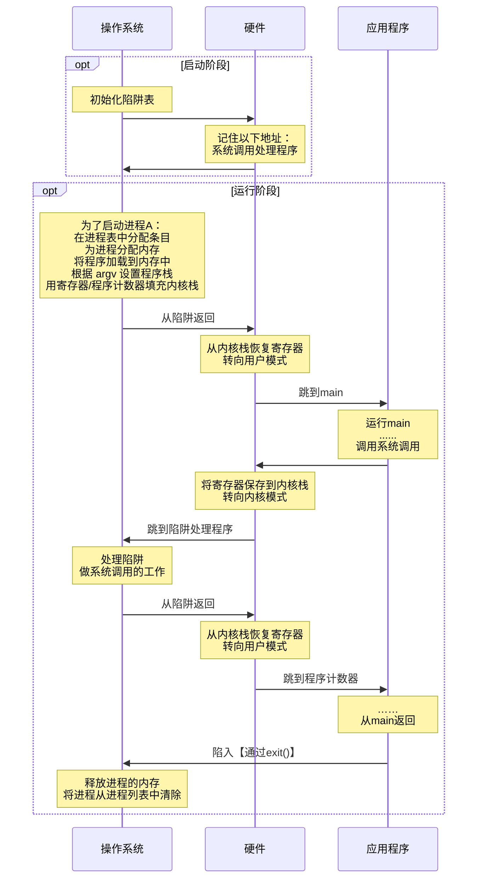
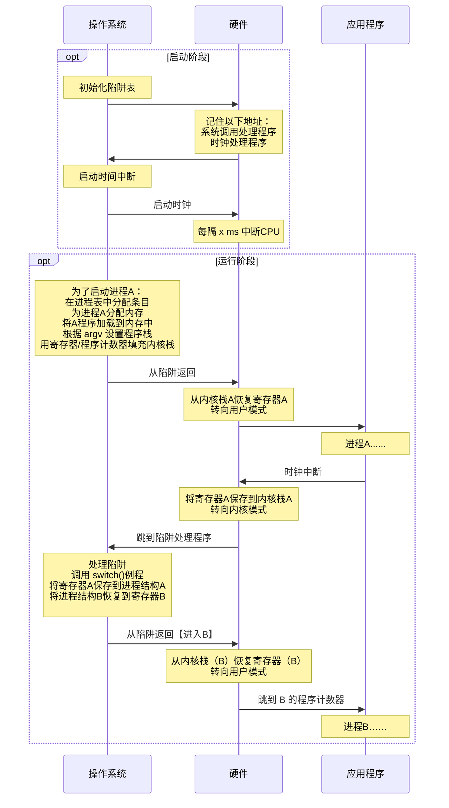
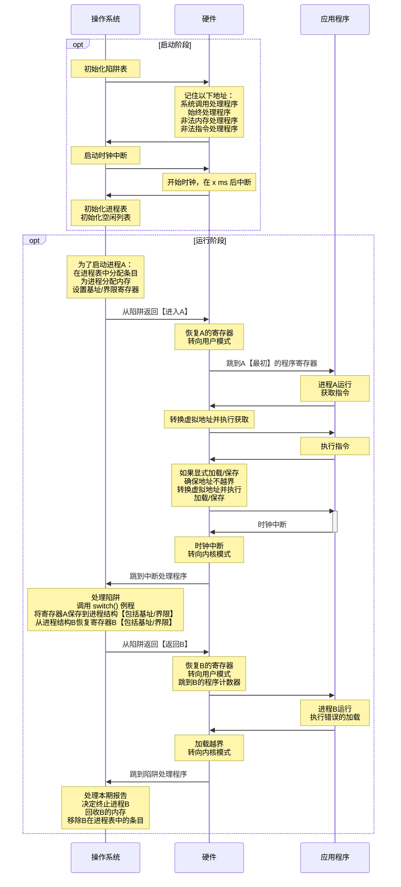

# 虚拟化

- **机制和策略**

  - *机制*：一些低级方法或协议，实现了所需的功能。

  - *策略*：操作系统内做出某种决定的算法。

- **时分共享和空分共享**

  - *时分共享*：允许资源由一个实体使用一小段时间，由另一个实体使用一小段时间。
  - *空分共享*：资源在空间上被划分给希望使用使用它的人。

## CPU：进程

> - *非正式定义*：运行中的程序。
> - *正式定义*：是计算机中的程序关于某数据集合上的一次运行活动，是系统进行**资源分配和调度的基本单位**，是操作系统**结构的基础**。

### 数据结构

```c
struct context {
    int eip;
    int esp;
    int ebx;
    int ecx;
    int edx;
    int esi;
    int edi;
    int ebp;
};

enum proc_state { 
    UNUSED, 		// 未使用
    EMBRYO, 		// 初始化，在创建时的状态
    SLEEPING, 		// 休眠
    RUNNABLE, 		// 可运行
    RUNNING, 		// 运行
    ZOMBIE 			// 僵尸
};

struct proc {
    char *mem; 										// 进程内存开始位置
    uint sz;										// 进程内存大小
    char *kstack;									// 此进程的内核堆栈底部
    enum proc_state state; 							// 进程状态
    int pid;										// 进程id
    struct proc *parent;							// 父进程
    void *chan;										// 如果非零，在chan上休眠
    int killed;										// 如果非零，则已终止
    struct file *ofile[NOFILE];						// 打开的文件列表
    struct inode *cwd;								// 当前目录
    struct context context;							// 切换上下文
    struct trapframe *tf; 							// 陷阱框架
}
```

### 进程状态

- **运行**：在运行状态下，进程正在处理器上运行。意味着正在执行指令。

- **就绪**：在就绪状态下，进程已准备好运行，但由于某种原因，操作系统选择不在此时运行。

- **阻塞**：在阻塞状态下，一个进程执行了某种操作，直到发生其他事件时才会准备运行。

- **初始**：进程在创建时的状态。

- **最终状态**：已退出但尚未清理的状态，即僵尸状态。

### 进程API

```shell
./ch5/syscall
```

- **创建：fork()**

  - 父子进程都从 `forc()` 调用处返回，新创建的为子进程，原来的进程为父进程。

  - **子进程从父进程完全拷贝一份**，除了：子进程的 `fork()` 位置返回的是0，父进程的 `fork()` 位置返回的是子进程 `pid`。

- **等待：wait()**

  - 父进程可以调用 `wait()`，延迟自己的执行，等待子进程执行完毕。

- **执行：exec()**

  > 可以让子进程执行和父进程不同的程序。

  - 从可执行程序中加载代码和静态数据，并覆写自己的代码段【和静态数据】、堆、栈内存空间。
  - 参数通过 `argv` 传递程序。
  - 不创建新进程，把当前程序替换为不同的进程。

- **销毁**：强制销毁进程。

- **其他控制**：大多数操作系统提供某种方法来暂停进程。

- **状态**：运行了多长时间、出于什么状态。

### 机制：受限直接执行

> **limit direct execution**：让程序运行的大部分指令直接访问硬件，只在关键点由操作系统介入。

- **解决的问题**

  > 1. 如何保证一个程序**不做违规操作**，并**保证性能**？
  > 2. 如何将一个进程**切换**到另一个进程？

#### 操作受限

> **用户模式和内核模式**

- **用户【受限】模式**：代码受到限制，如 `I/O` 操作。
- **内核【特权】模式**：可以运行任何代码，操作系统跑在内核模式。

#### 进程间切换

>  进程切换的时机有两个：**系统调用** 和 **时钟中断**。
>
> - **时钟中断**：时钟设备编程为每隔几毫秒发生一次中断，操作系统预先配置的调度策略运行，拿到CPU控制权。
>
> - **上下文切换**：为当前正在执行的进程保存一些寄存器的值，这样可以确保最后执行从陷阱返回指令时，可以执行另一个进程。
>
>   > 通用寄存器、程序计数器，以及当前正在运行的进程的内核栈指针。
>
>   - **上下文切换成本**：不仅仅来自保存和恢复少量寄存器，还有CPU高速缓存、TLB、分之预测器和其他片上硬件中建立了大量状态。

##### 内核栈【kernel stack】

- 操作系统维护的栈。
- 确保存储足够的调用者寄存器：在x86中，处理器会将程序计数器、标志和其他一些寄存器推送到内核栈。

##### 陷阱表【trap table】

1. 当机器启动时，在特权模式下执行，根据需要自由配置机器硬件。

2. 告诉硬件发生某些异常事件时要运行哪些代码。

   > - 硬盘中断
   > - 键盘中断
   > - 程序进行系统调用等。

##### 系统调用切换



##### 时钟中断切换




- **启动**

  | 操作系统     | 硬件                                                   | 程序 |
  | ------------ | ------------------------------------------------------ | ---- |
  | 初始化陷阱表 | 记住以下地址：<br />系统调用处理程序<br />时钟处理程序 |      |
  | 启动时钟中断 |                                                        |      |
  |              | 启动时钟                                               |      |
  |              | 每隔 x ms 中断CPU                                      |      |

- **运行**

  | 操作系统                                                     | 硬件                                                         | 程序     |
  | ------------------------------------------------------------ | ------------------------------------------------------------ | -------- |
  |                                                              |                                                              | 进程 A…… |
  |                                                              | 时钟中断<br />将寄存器（A）保存到内核栈（A）<br />转向内核模式<br />跳到陷阱处理程序 |          |
  | 处理陷阱<br />调用 switch()例程<br />将寄存器（A）保存到进程结构（A）<br />将进程结构（B）恢复到寄存器（B）<br />从陷阱返回（进入 B） |                                                              |          |
  |                                                              | 从内核栈（B）恢复寄存器（B）<br />转向用户模式<br />跳到 B 的程序计数器 |          |
  |                                                              |                                                              | 进程 B…… |

### 策略

> **调度程序至今仍有争议**。

- **公式**

$$
T(周转时间) = T(完成时间) - T(到达时间)
$$

$$
T(响应时间) = T(首次运行时间) - T(到达时间)
$$


#### 先进先出：FIFO

短任务在长任务之后，会导致平均周转时间较高。

#### 最短任务优先：SJF

在任务同时到达时可行，但任务往往不是同时到达的。

#### 最短完成时间优先：STCF

每当新工作进入系统时，确定剩余工作和新工作中谁的剩余时间最少。但是响应时间不好。

#### 轮转：RR

响应时间较好，但周转时间很差。

#### 多级反馈队列：MLFQ

> 当对进程一无所知时，如何构建调度程序？

- **规则1**：如果A的优先级 > B的优先级，运行A（不运行B）。
- **规则2**：如果A的优先级 = B的优先级，轮转运行A和B。
- **规则3**：工作进入系统时，放在最高优先级。
- **规则4**：一旦工作用完了其在某一层中的时间配额【无论中间放弃了多少次CPU】，就降低其优先级。
- **规则5**：经过一段时间，就将系统中所有工作重新加入最高优先级队列。

#### 比例份额【公平份额】

> 最终目标是让每个工作获得一定比例的CPU时间。

- **彩票调度**：票数分配问题不能很好解决，无法知道每个进程应该分配多少票。

- **步长调度**：需要全局状态，新加入的进程很可能会独占CPU。

  > 假设彩票数是 100、 50、250。每个进程的总行程是10000【一个大数，保持不变】。
  >
  > 那每步行程值就是 100、200、和40。每个进程执行一次就自己的行程值就加一步。
  >
  > 每次都选行程值最小的进程。

## 内存：虚拟地址

> 负责为程序提供一个巨大的、稀疏的、私有的地址空间的假象，其中保存了程序的所有指令和数据。
>
> 在专门硬件的帮助下，通过每一个虚拟内存的索引，将其转换为物理地址，物理内存根据获得的地址去获取所需的信息。
>
> 确保程序之间不会受到影响。

### 目标

- *透明*：实现虚拟内存的方式，让运行中的程序看不见。
- *效率*：实现高效虚拟化时，依靠硬件支持，包括【TLB】这样的硬件工程。
- *保护*：确保进程受到保护，不受其他进程影响。

### 内存操作API

- **申请空间：malloc()**

  ```c
  void *malloc(size_t size);
  ```

  - **malloc**：返回之前将其置零。
  - **realloc**：创建更大的内存区域，将旧区域复制到其中，并返回新区域的指针。

- **释放空间：free()**

  > 接收一个参数，即一个由 malloc() 返回的指针。

#### 常见错误

- **忘记分配内存**
- **没有分配足够的内存**：缓冲区溢出。覆盖变量。
- **忘记初始化分配的内存**：读出未知的数据。
- **忘记释放内存**：内存泄露。
- **在用完之前释放内存**：悬挂指针，随后使用会导致程序崩溃或覆盖有效内存。
- **重复释放内存**：崩溃。
- **错误的调用free**

### 机制：【基于硬件的】地址转换

> **hardware-based address translation**：利用地址转换，硬件对每次内存访问进行处理，将指令中的虚拟地址转换为数据实际存储的物理地址，因此，每次内存引用时，硬件都会进行地址转换，将应用程序的内存引用重定位到内存中实际的位置。

#### 动态重定位

> 效率低下，栈和堆之间有大块空间，容易造成内部碎片，空间利用率不高。



##### 基址寄存器和界限寄存器

- *基址寄存器*：每个进程内都维护一个内存基址，切换进程时将值写到寄存器。

- *界限寄存器*：存储同上，提供访问保护，有两种使用方式：

  > - 地址空间的大小，硬件将虚拟地址与基址寄存器求和前，检查这个界限。
  > - 地址空间结束的物理地址，求和之后再检查。

$$
虚拟地址 + 基址 = 物理地址
$$

##### 硬件要求

| 硬件要求                           | 解释                                                     |
| ---------------------------------- | -------------------------------------------------------- |
| 处理器状态字【用户模式、特权模式】 | 以防用户模式的进程执行特权操作。                         |
| 基址/界限寄存器                    | 每个CPU需要一对寄存器来支持地址转换和界限检查。          |
| 能够转换虚拟地址并检查它是否越界   | 电路来完成转换和检查界限，在这种情况下，非常简单。       |
| 修改基址/界限寄存器的特权指令      | 在让用户程序运行之前，操作系统必须能够设置这些值。       |
| 注册异常处理程序的特权指令         | 操作系统必须能告诉硬件，如果异常发生，那么执行哪些代码。 |
| 能够触发异常                       | 如果进程试图使用特权指令或越界的内存。                   |

##### 操作系统职责

| 操作系统职责  | 解释                                                         |
| ------------- | ------------------------------------------------------------ |
| 内存管理      | 需要为新进程分配内存<br />从终止的进程回收内存<br />一般通过空闲列表【free list】来管理内存。 |
| 基址/界限管理 | 必须在上下文切换时正确设置基址/界限寄存器。                  |
| 异常处理      | 当异常发生时执行的代码，可能得动作是终止犯错的进程。         |

#### 分段

> 将代码、栈、堆放到不同的物理内存区域。需要三对寄存器【段寄存器】。

- **优点**

  - 避免地址空间的逻辑段之间的大量潜在内存浪费。

  - 代码共享。

- **缺点**

  - *外部碎片*：因为每段大小不同，物理内存出现许多空闲的小洞，很难分配给新段，和扩大段。
  - 不足以支持稀疏地址空间：对很大但稀疏的堆，因为在一个段中，必须完整的加载到内存。

##### 段寄存器

| 段   | 基址     | 大小【界限】 | 是否正向增长  | 保护【代码共享，不能被改】 |
| ---- | -------- | ------------ | ------------- | -------------------------- |
| 代码 | eg：32KB | eg：2KB      | 1             | 读-执行                    |
| 堆   | eg：34KB | eg：2KB      | 1             | 读-写                      |
| 栈   | eg：28KB | eg：2KB      | 0：栈反向增长 | 读-写                      |

#### 空闲空间管理

- **思路**

  - 操作系统管理一串的空闲列表。

  - 每次分配在指针之前，加一块儿头地址。

    ```c
    typedef struct header_t {
        int size;
        int magic;
    } header_t
    ```

  - 释放时找到头地址，进行释放。

    ```c
    void free(void *ptr) {
        header_t *hptr = (void *)ptr - sizeof(header_t);
    }
    ```

  - 空闲列表由指针连接。

- **策略**

  - **最优匹配**：遍历整个列表，找到和请求大小最匹配的空闲块儿。
    - *缺点*：需要遍历块儿，有性能代价。
  - **最差匹配**：找到最大的空闲块儿，进行切割。
    - *优点*：尽量保留大块儿，避免剩下很多难以利用的小块儿。
    - *缺点*：研究表明表现很差。
  - **首次匹配**：找到第一个足够大的块儿。
    - *优点*：速度快，保持空间块按内存地址有序，合并操作会很容易。
    - *缺点*：开头部分有很多小块。
  - **下次匹配**：多维护一个指针，指向上一次查找结束的位置。
    - 优点：将查找操作扩散到整个列表，避免对开头频繁分割。
  - **分离空间列表**：如果某个应用经常申请一种【或几种】大小的空间，就用一个独立的列表，只管理这样大小的对象。
  - **伙伴系统**：空闲空间首先从概念上被看成大小为 2<sup>N</sup> 的大空间。当有一个内存分配请求时，空间被递归地一分为二，知道刚好满足请求的大小。
    - *优点*：合并速度快，检查伙伴方便。

#### 分页

> 将空间分割成固定大小的分片。不会导致外部碎片，并且非常灵活。

##### 思路

- **页**：将地址空间分割成固定大小的单元，每个单元为一页。

- **页帧**：把物理内存看成是定长槽块的阵列，叫做页帧，每个页帧包含一个虚拟内存页。

- **页表**：**page table**，为了记录每个虚拟页放在物理内存中的位置，为每个进程保存一个数据结构，称为页表。

  > 如：
  >
  > | V【虚拟】P【页】N【号】 | PFN【Physical frame number】物理帧 |
  > | ----------------------- | ---------------------------------- |
  > | 0                       | 3                                  |
  > | 1                       | 7                                  |
  > | 2                       | 5                                  |
  > | 3                       | 2                                  |

- **虚拟地址组成**：**VPN** 和 **偏移量**。

  > 

- **页表存储**：可以存储在操作系统的虚拟内存中【甚至可以交换到磁盘上】。

- **页表内容**

  > - **有效位**：**valid bit**；用于指定特定地址转换是否有效。程序开始运行时，所有在堆和栈中间未使用的中间空间都被标记为无效。
  > - **保护位**：**protection nit**；表明页是否可以读取、写入或执行。
  > - **存在位**：**present bit**；表示该页是在屋里存储器还是磁盘上。
  > - **脏位**：**dirty bit**；表明页面被带入内存后是否被访问过。
  > - **参考位**：**reference bit**；或访问位，追踪页是否被访问。

- **页访问**：如果不仔细设计硬件和软件，页表会导致系统运行速度过慢，并占用太多内存。

  > 如果存储在内存中，每次指令获取、显式加载或保存，都要额外读一次内存以得到转换信息。

##### 实现：快速地址转换【TLB】

# 并发
