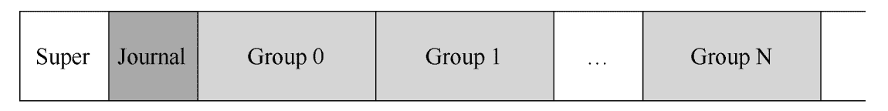
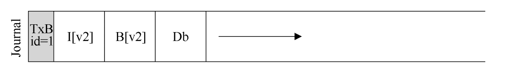

# 虚拟化

- **机制和策略**

  - *机制*：一些低级方法或协议，实现了所需的功能。

  - *策略*：操作系统内做出某种决定的算法。

- **时分共享和空分共享**

  - *时分共享*：允许资源由一个实体使用一小段时间，由另一个实体使用一小段时间。
  - *空分共享*：资源在空间上被划分给希望使用使用它的人。

## CPU：进程

> - *非正式定义*：运行中的程序。
> - *正式定义*：是计算机中的程序关于某数据集合上的一次运行活动，是系统进行**资源分配和调度的基本单位**，是操作系统**结构的基础**。

### 数据结构

```c
struct context {
    int eip;
    int esp;
    int ebx;
    int ecx;
    int edx;
    int esi;
    int edi;
    int ebp;
};

enum proc_state { 
    UNUSED, 		// 未使用
    EMBRYO, 		// 初始化，在创建时的状态
    SLEEPING, 		// 休眠
    RUNNABLE, 		// 可运行
    RUNNING, 		// 运行
    ZOMBIE 			// 僵尸
};

struct proc {
    char *mem; 										// 进程内存开始位置
    uint sz;										// 进程内存大小
    char *kstack;									// 此进程的内核堆栈底部
    enum proc_state state; 							// 进程状态
    int pid;										// 进程id
    struct proc *parent;							// 父进程
    void *chan;										// 如果非零，在chan上休眠
    int killed;										// 如果非零，则已终止
    struct file *ofile[NOFILE];						// 打开的文件列表
    struct inode *cwd;								// 当前目录
    struct context context;							// 切换上下文
    struct trapframe *tf; 							// 陷阱框架
}
```

### 进程状态

- **运行**：在运行状态下，进程正在处理器上运行。意味着正在执行指令。

- **就绪**：在就绪状态下，进程已准备好运行，但由于某种原因，操作系统选择不在此时运行。

- **阻塞**：在阻塞状态下，一个进程执行了某种操作，直到发生其他事件时才会准备运行。

- **初始**：进程在创建时的状态。

- **最终状态**：已退出但尚未清理的状态，即僵尸状态。

### 进程API

```shell
./ch5/syscall
```

- **创建：fork()**

  - 父子进程都从 `forc()` 调用处返回，新创建的为子进程，原来的进程为父进程。

  - **子进程从父进程完全拷贝一份**，除了：子进程的 `fork()` 位置返回的是0，父进程的 `fork()` 位置返回的是子进程 `pid`。

- **等待：wait()**

  - 父进程可以调用 `wait()`，延迟自己的执行，等待子进程执行完毕。

- **执行：exec()**

  > 可以让子进程执行和父进程不同的程序。

  - 从可执行程序中加载代码和静态数据，并覆写自己的代码段【和静态数据】、堆、栈内存空间。
  - 参数通过 `argv` 传递程序。
  - 不创建新进程，把当前程序替换为不同的进程。

- **销毁**：强制销毁进程。

- **其他控制**：大多数操作系统提供某种方法来暂停进程。

- **状态**：运行了多长时间、出于什么状态。

### 机制：受限直接执行

> **limit direct execution**：让程序运行的大部分指令直接访问硬件，只在关键点由操作系统介入。

- **解决的问题**

  > 1. 如何保证一个程序**不做违规操作**，并**保证性能**？
  > 2. 如何将一个进程**切换**到另一个进程？

#### 操作受限

> **用户模式和内核模式**

- **用户【受限】模式**：代码受到限制，如 `I/O` 操作。
- **内核【特权】模式**：可以运行任何代码，操作系统跑在内核模式。

#### 进程间切换

>  进程切换的时机有两个：**系统调用** 和 **时钟中断**。
>
> - **时钟中断**：时钟设备编程为每隔几毫秒发生一次中断，操作系统预先配置的调度策略运行，拿到CPU控制权。
>
> - **上下文切换**：为当前正在执行的进程保存一些寄存器的值，这样可以确保最后执行从陷阱返回指令时，可以执行另一个进程。
>
>   > 通用寄存器、程序计数器，以及当前正在运行的进程的内核栈指针。
>
>   - **上下文切换成本**：不仅仅来自保存和恢复少量寄存器，还有CPU高速缓存、TLB、分之预测器和其他片上硬件中建立了大量状态。

##### 内核栈【kernel stack】

- 操作系统维护的栈。
- 确保存储足够的调用者寄存器：在x86中，处理器会将程序计数器、标志和其他一些寄存器推送到内核栈。

##### 陷阱表【trap table】

1. 当机器启动时，在特权模式下执行，根据需要自由配置机器硬件。

2. 告诉硬件发生某些异常事件时要运行哪些代码。

   > - 硬盘中断
   > - 键盘中断
   > - 程序进行系统调用等。

##### 系统调用切换


##### 时钟中断切换


### 策略

> **调度程序至今仍有争议**。

- **公式**

$$
T(周转时间) = T(完成时间) - T(到达时间)
$$

$$
T(响应时间) = T(首次运行时间) - T(到达时间)
$$

#### 先进先出：FIFO

短任务在长任务之后，会导致平均周转时间较高。

#### 最短任务优先：SJF

在任务同时到达时可行，但任务往往不是同时到达的。

#### 最短完成时间优先：STCF

每当新工作进入系统时，确定剩余工作和新工作中谁的剩余时间最少。但是响应时间不好。

#### 轮转：RR

响应时间较好，但周转时间很差。

#### 【重点】多级反馈队列：MLFQ

> 当对进程一无所知时，如何构建调度程序？

- **规则1**：如果A的优先级 > B的优先级，运行A（不运行B）。
- **规则2**：如果A的优先级 = B的优先级，轮转运行A和B。
- **规则3**：工作进入系统时，放在最高优先级。
- **规则4**：一旦工作用完了其在某一层中的时间配额【无论中间放弃了多少次CPU】，就降低其优先级。
- **规则5**：经过一段时间，就将系统中所有工作重新加入最高优先级队列。

#### 比例份额【公平份额】

> 最终目标是让每个工作获得一定比例的CPU时间。

- **彩票调度**：票数分配问题不能很好解决，无法知道每个进程应该分配多少票。

- **步长调度**：需要全局状态，新加入的进程很可能会独占CPU。

  > 假设彩票数是 100、 50、250。每个进程的总行程是10000【一个大数，保持不变】。
  >
  > 那每步行程值就是 100、200、和40。每个进程执行一次就自己的行程值就加一步。
  >
  > 每次都选行程值最小的进程。

### 多处理器调度


#### 缓存一致性

硬件提供了基本解决方案：通过监控内存访问，硬件可以保证获得正确的数据，并保证内存共享的唯一性。在基于总线的系统中，一种方式是使用总线窥探。每个缓存都通过监听链接所有缓存和内存的总线，来发现内存访问。如果CPU发现对它放在缓存中的数据的更新，会作废本地副本过更新。

#### 缓存亲和度

> 考虑缓存亲和性，并尽可能将进程保持在同一个CPU上。

- **单队列调度：SQMS**

  > Single Queue Multiprocessor Scheduling。

  - **优点**：实现简单。

  - **缺点**

    - **缺乏可扩展性**：为保证在多CPU上正常运行，调度程序的开发着需要在代码中加锁来保证原子性。

    - **缓存亲和性**：每个工作都不断在不同CPU之间转移。

      

      > 需要牺牲其他工作的亲和度来实现复杂均衡。

- **多队列调度**：**MQMS**

  > Multi-Queue Multiprocessor Scheduling。

  - **优点**：当一个工作进入系统后，系统会按照一些启发性规则将其放入某个调度队列。每个CPU调度之间相互独立，避免了单队列的方式中由于数据共享及同步带来的问题。

  - **缺点**

    - **负载均衡**：可能会让每个CPU的负载不同。

      > 工作窃取，工作量少的队列不定期查看其他队列是不是比自己工作多，偷去一个或多个工作，实现负载均衡。

## 内存：虚拟地址

> 负责为程序提供一个巨大的、稀疏的、私有的地址空间的假象，其中保存了程序的所有指令和数据。
>
> 在专门硬件的帮助下，通过每一个虚拟内存的索引，将其转换为物理地址，物理内存根据获得的地址去获取所需的信息。
>
> 确保程序之间不会受到影响。

### 目标

- *透明*：实现虚拟内存的方式，让运行中的程序看不见。
- *效率*：实现高效虚拟化时，依靠硬件支持，包括【TLB】这样的硬件工程。
- *保护*：确保进程受到保护，不受其他进程影响。

### 内存操作API

- **申请空间：malloc()**

  ```c
  void *malloc(size_t size);
  ```

  - **malloc**：返回之前将其置零。
  - **realloc**：创建更大的内存区域，将旧区域复制到其中，并返回新区域的指针。

- **释放空间：free()**

  > 接收一个参数，即一个由 malloc() 返回的指针。

#### 常见错误

- **忘记分配内存**
- **没有分配足够的内存**：缓冲区溢出。覆盖变量。
- **忘记初始化分配的内存**：读出未知的数据。
- **忘记释放内存**：内存泄露。
- **在用完之前释放内存**：悬挂指针，随后使用会导致程序崩溃或覆盖有效内存。
- **重复释放内存**：崩溃。
- **错误的调用free**

### 机制：【基于硬件的】地址转换

> **hardware-based address translation**：利用地址转换，硬件对每次内存访问进行处理，将指令中的虚拟地址转换为数据实际存储的物理地址，因此，每次内存引用时，硬件都会进行地址转换，将应用程序的内存引用重定位到内存中实际的位置。

#### 动态重定位

> 效率低下，栈和堆之间有大块空间，容易造成内部碎片，空间利用率不高。


##### 基址寄存器和界限寄存器

- *基址寄存器*：每个进程内都维护一个内存基址，切换进程时将值写到寄存器。

- *界限寄存器*：存储同上，提供访问保护，有两种使用方式：

  > - 地址空间的大小，硬件将虚拟地址与基址寄存器求和前，检查这个界限。
  > - 地址空间结束的物理地址，求和之后再检查。

$$
虚拟地址 + 基址 = 物理地址
$$

##### 硬件要求

| 硬件要求                           | 解释                                                     |
| ---------------------------------- | -------------------------------------------------------- |
| 处理器状态字【用户模式、特权模式】 | 以防用户模式的进程执行特权操作。                         |
| 基址/界限寄存器                    | 每个CPU需要一对寄存器来支持地址转换和界限检查。          |
| 能够转换虚拟地址并检查它是否越界   | 电路来完成转换和检查界限，在这种情况下，非常简单。       |
| 修改基址/界限寄存器的特权指令      | 在让用户程序运行之前，操作系统必须能够设置这些值。       |
| 注册异常处理程序的特权指令         | 操作系统必须能告诉硬件，如果异常发生，那么执行哪些代码。 |
| 能够触发异常                       | 如果进程试图使用特权指令或越界的内存。                   |

##### 操作系统职责

| 操作系统职责  | 解释                                                         |
| ------------- | ------------------------------------------------------------ |
| 内存管理      | 需要为新进程分配内存<br />从终止的进程回收内存<br />一般通过空闲列表【free list】来管理内存。 |
| 基址/界限管理 | 必须在上下文切换时正确设置基址/界限寄存器。                  |
| 异常处理      | 当异常发生时执行的代码，可能得动作是终止犯错的进程。         |

#### 分段

> 将代码、栈、堆放到不同的物理内存区域。需要三对寄存器【段寄存器】。

- **优点**

  - 避免地址空间的逻辑段之间的大量潜在内存浪费。

  - 代码共享。

- **缺点**

  - *外部碎片*：因为每段大小不同，物理内存出现许多空闲的小洞，很难分配给新段，和扩大段。
  - 不足以支持稀疏地址空间：对很大但稀疏的堆，因为在一个段中，必须完整的加载到内存。

##### 段寄存器

| 段   | 基址     | 大小【界限】 | 是否正向增长  | 保护【代码共享，不能被改】 |
| ---- | -------- | ------------ | ------------- | -------------------------- |
| 代码 | eg：32KB | eg：2KB      | 1             | 读-执行                    |
| 堆   | eg：34KB | eg：2KB      | 1             | 读-写                      |
| 栈   | eg：28KB | eg：2KB      | 0：栈反向增长 | 读-写                      |

#### 空闲空间管理

- **思路**

  - 操作系统管理一串的空闲列表。

  - 每次分配在指针之前，加一块儿头地址。

    ```c
    typedef struct header_t {
        int size;
        int magic;
    } header_t
    ```

  - 释放时找到头地址，进行释放。

    ```c
    void free(void *ptr) {
        header_t *hptr = (void *)ptr - sizeof(header_t);
    }
    ```

  - 空闲列表由指针连接。

- **策略**

  - **最优匹配**：遍历整个列表，找到和请求大小最匹配的空闲块儿。
    - *缺点*：需要遍历块儿，有性能代价。
  - **最差匹配**：找到最大的空闲块儿，进行切割。
    - *优点*：尽量保留大块儿，避免剩下很多难以利用的小块儿。
    - *缺点*：研究表明表现很差。
  - **首次匹配**：找到第一个足够大的块儿。
    - *优点*：速度快，保持空间块按内存地址有序，合并操作会很容易。
    - *缺点*：开头部分有很多小块。
  - **下次匹配**：多维护一个指针，指向上一次查找结束的位置。
    - 优点：将查找操作扩散到整个列表，避免对开头频繁分割。
  - **分离空间列表**：如果某个应用经常申请一种【或几种】大小的空间，就用一个独立的列表，只管理这样大小的对象。
  - **伙伴系统**：空闲空间首先从概念上被看成大小为 2<sup>N</sup> 的大空间。当有一个内存分配请求时，空间被递归地一分为二，知道刚好满足请求的大小。
    - *优点*：合并速度快，检查伙伴方便。

#### 分页

> 将空间分割成固定大小的分片。不会导致外部碎片，并且非常灵活。

##### 思路

- **页**：将地址空间分割成固定大小的单元，每个单元为一页。

- **页帧**：把物理内存看成是定长槽块的阵列，叫做页帧，每个页帧包含一个虚拟内存页。

- **页表**：**page table**，为了记录每个虚拟页放在物理内存中的位置，为每个进程保存一个数据结构，称为页表。

  > 如：
  >
  > | V【虚拟】P【页】N【号】 | PFN【Physical frame number】物理帧 |
  > | ----------------------- | ---------------------------------- |
  > | 0                       | 3                                  |
  > | 1                       | 7                                  |
  > | 2                       | 5                                  |
  > | 3                       | 2                                  |

- **虚拟地址组成**：**VPN** 和 **偏移量**。

  > 

- **页表存储**：可以存储在操作系统的虚拟内存中【甚至可以交换到磁盘上】。

- **页表内容**

  > - **有效位**：**valid bit**；用于指定特定地址转换是否有效。程序开始运行时，所有在堆和栈中间未使用的中间空间都被标记为无效。
  > - **保护位**：**protection nit**；表明页是否可以读取、写入或执行。
  > - **存在位**：**present bit**；表示该页是在物理存储器还是磁盘上。
  > - **脏位**：**dirty bit**；表明页面被带入内存后是否被访问过。
  > - **参考位**：**reference bit**；或访问位，追踪页是否被访问。

- **页访问**：如果不仔细设计硬件和软件，页表会导致系统运行速度过慢，并占用太多内存。

  > 如果存储在内存中，每次指令获取、显式加载或保存，都要额外读一次内存以得到转换信息。

##### 地址转换缓存：TLB

> **translation-lookaside buffer**。地址转换旁路缓冲存储器。硬件缓存。

- **大致流程**

  - 首先从虚拟地址中提取虚拟页号(VPN)，然后检查TLB是否有该VPN的**转换映射**。如果有就有了**TLB命中**，即TLB有该虚拟页号的转换映射，接下来从TLB中取出物理页帧号(PFN)，与虚拟地址中的偏移量结合形成期望的物理地址，并访问内存。
  - 如果CPU没有在TLB中找到转换映射(**TLB未命中**)，硬件访问页表来寻找地址转换，并用该转换**更新TLB**，当TLB更新后，系统会重新尝试该指令，这时TLB中有这个转换映射，内存引用很快得到处理。

- **处理TLB命中**

  - 以前是硬件处理TLB未命中，**硬件是CISC【复杂指令集计算】**。
  - 现代的体系结构都是**RISC【精简指令集计算】**。发生TLB未命中时，硬件会抛出一个异常，这会暂停当前的指令流，将特权级别提升到内核模式，然后跳转到陷阱处理程序，这段陷阱处理程序是操作系统的一段代码，用于处理TLB未命中，这段代码运行时，会查看页表中的地址转换映射，然后用特权指令更新TLB，并从陷阱返回，此时硬件重试该指令。

- **TLB内容**：典型的TLB有32项，64项或128项，并且是**全相联的**。

  > 
  >
  > - **VPN**：虚拟页号。
  > - **G**：全局位。用来指示这个页是否为全局共享。
  > - **ASID【Address Space Identifier】**：区分进程空间。
  > - **FPN**：物理帧号。
  > - **C**：一致性位，决定如何缓存该页。
  > - **D**：脏位。
  > - **V**：有效位，用来标识该页是不是有效的地址转换映射。
  > - 存在位：表示页在磁盘还是内存。

- **上下文切换**

  - **方案一**：上下文切换时**清空TLB**，把所有TLB项有效位置0。

    > 缺点：开销高。

  - **方案二**：通过**地址空间标识符 ASID**，实现跨上下文切换的TLB共享。

    > 在上下文切换时，必须将某个特权寄存器的值设置为当前进程的ASID。

- **替换策略**

  - **替换最近最少使用的项 LRU**，LRU尝试利用内存引用流中的局限性，假定最近没有用过的项，作为被替换的候选项。
  - **随机策略**，随机换一个出去，这种策略虽然很简单，但能避免一些极端情况。


##### 较小的表

> 页表太大，需要节省空间。解决方案如下：

- **更大的页**：页越大，页表越小，可以节省空间。

  > 大内存页会导致页内浪费。

- **混合方法【分页和分段】**：先为进程分段，再分页。不是为进程的整个地址空间提供单个页表，而是为**每个逻辑段提供一个**。

  > 仍然存在分段，虽然大部分内存以页大小为单位存在于内存，但现在的页表可以是任意大小，会使得**外部碎片**再次出现，使得物理内存更为复杂。

- **多级页表**：将页表中的所有无效区域去掉，而不是将它们都保留在内存中，这种方式称为**多级页表**，它将**线性页表变成了类似树**的东西。

  

  > - 左侧的线性页表即使地址空间中间区域无效，也要为这些区域分配页表空间
  > - 右侧的多级页表，页目录仅将页表的两页标记为有效，因此这两页就驻留在内存里，**多级页表让线性页表无效的部分消失，并用页目录来记录页表的哪些页被分配**。
  >
  > 在TLB未命中时，需要从内存中加载两次，才能从页表中获取正确的地址转换映射。

  - **PDIndex**：页目录索引。
  - **PDE**：页目录项。
  - **PTE**：页表项。

- **反向页表**：只保留了一个页表，其中的页表项代表系统的每个物理页，而不是有许多页表，页表项告诉我们哪个进程正在使用此页，以及该进程的哪个虚拟页映射到此物理页。

- **将页表交换到磁盘**：一些系统将页表放入内核虚拟内存，从而允许系统在内存压力大时，将这些页表的一部分交换到磁盘。

### 超越物理内存

#### 机制

- **内存覆盖**：早期系统使用，需要程序员手动移出或移出。

- **交换空间**：在硬盘上开辟一部分空间用于物理页的移入和移出。

  > 交换空间不是唯一的硬盘交换目的地，比如二进制代码就不需要交换空间。

- **存在位**：页表项的一个字段，值为1，说明在物理内存，否则，在硬盘上。

- **页错误**：访问不在物理内存中的页。

  > **处理流程**
  >
  > 1. 在PTE中查找地址，将请求发送到硬盘。进程阻塞。
  > 2. 当硬盘I/O完成时，操作系统更新页表，将此页标记为存在，更新页表项的 PFN 字段，重试指令。

- **交换发生时间**

  - **高水位线**：High Watermark，HW。
  - **低水位线**：Low Watermark，LW。

  > 当操作系统发现有少于 LW 个页可用时，后台负责释放内存的线程会开始运行，直到有 HW 个可用的物理页。这个后台线程有时称为**交换守护进程**。

#### 策略

- **缓存未命中类型**
  - **强制性未命中**：缓存一开始是空的，对项目的第一次引用。
  - **容量未命中**：由于缓存空间的不足不得不踢出一个项目用于将新的项目引入缓存。
  - **冲突未命中**：硬件缓存中对项的放置位置有限制。

##### 最优替换策略

踢出最远将来会访问的页。**指导思想**。

##### 先入先出策略：FIFO

> 无法确定页的重要性。

页在进入系统时，简单的放入一个队列，当发生替换时，队列尾部的页先被踢出。

##### 随机

在内存满时，随机选择一个页进行替换。

##### LRU

实现完美的LRU代价非常昂贵，只能实现近似的LRU算法。

**时钟算法**：每当页被使用，硬件将使用位置位1，系统中的所有页都放在一个循环列表中，时钟指针开始时指向某个特定的页，当必须进行页替换时，操作系统检查当前指向的页P的使用位是1还是0，如果是1，这意味着页面P最近被使用，因此不适合替换，然后，P的使用位置为0，时钟指针递增到下一页，该算法一直持续到找到一个使用位为0的页。

**脏页**：脏页踢出需要写回磁盘，比较昂贵，因此一般踢出干净页。

# 并发

- **临界区**：**critical section**，访问共享资源的一段代码，资源通常是一个变量或数据结构。
- **竞态条件**：**race condition**，出现在多个执行线程大致同时进入临界区时，它们都试图更新共享的数据结构，导致不确定的结果。
- **不确定性**：**indeteminate**，程序由一个或多个竞态条件组成，程序的输出因运行而异，具体取决于哪些线程在何时运行。这导致结果不是确定的，而我们通常希望计算机系统给出确定的结果。
- **互斥执行**：**mutual exclusion**，保证只有一个线程进入临界区，从而避免出现竞态，并产生确定的程序输出。

## 线程API

- **创建**：**pthread_create()**

- **完成**：**pthread_join()**

  > 线程返回时不要返回一个指针，会导致非法读取。

- **锁**

  - **初始化锁**：**pthread_mutex_init()**
  - **加锁**：**pthread_mutex_lock()**：卡住，直到拿到锁。
  - **尝试加锁**：**pthread_mutex_trylock()**：如果拿不到锁立马返回。
  - **超时锁**：**pthread_mutex_timedlock()**：指定时间内拿不到锁，则失败。
  - **解锁**：**pthread_mutex_unlock()**
  - **销毁锁**：**pthread_mutex_destory()**

- **条件**：线程之间最好通过条件变量来发送信号。

  - **休眠**：**pthread_cond_wait()**：线程进入休眠，等待其他线程唤醒。
  - **唤醒**：**pthread_cond_signal()**。

## 同步原语：锁

### 评价

1. **互斥性**：**mutual exclusion**，需要能够阻止多个线程进入临界区。
2. **公平性**：**fairness**，是否每个线程有公平的机会抢到锁，是否有竞争锁的线程会饿死。
3. **性能**：**performance**，使用锁之后增加的开销。

### 自旋锁

```go
type look_t struct {
    int flag
}

func init() *look_t {
    return &look_t {
        flag: 0,
    }
}

func (l *look_t) lock() {
    for ; l.flag == 1; {
        // 自旋
    }
    l.flag = 1
}

func (l *look_t) unlock() {
    l.flag = 0
}
```

**有两个问题：**

- **正确性**：在一个线程flag还没赋值1的时候，另一个线程读到flag，则会两个都拿到锁。

  ```mermaid
  sequenceDiagram
  	participant A as 线程1
  	participant B as 线程2
  	Note over A: lock()<br />l.flag == 1【false】
  	A->>B: 时钟中断
  	Note over B: lock()<br />l.flag == 1【false】<br />l.flag = 1；拿到了锁
  	B->>A: 时钟中断
  	Note over A: l.flag = 1；拿到了锁
  ```

- **性能**：单CPU自旋会浪费一个时间片，多CPU性能不错。

#### 正确性：硬件原语

##### 测试并设置指令【test-and-set】

> 也叫原子交换：atomic-exchange。

```go
func TestAndSet(flag *int, newValue int) int {
    int old := *flag
    *flag = newValue
    return old
}

func (l *look_t) lock() {
    for ; TestAndSet(&l.flag, 1) == 1; {
        // 自旋
    }
    l.flag = 1
}
```

> 可能永远拿不到锁，可能会饿死。

##### 比较并交换【compare-and-swap】

```go
// CompareAndSwap 【原子指令】比较并交换 
func CompareAndSwap(flag *int, expected, newValue int) int {
    int actial := *flag
    if *flag == expected {
        *flag = newValue
    }
    return actial
}

func (l *look_t) lock() {
    for ; CompareAndSwap(&l.flag, 0, 1) == 1; {
        // 自旋
    }
    l.flag = 1
}
```

> 无等待同步时强大，自旋锁和上面等价。

##### 链接加载和条件式存储指令【load-linked】

```go
const REG int

// LoadLinked 【原子指令】链接加载
func LoadLinked(flag *int, mem int) int {
    // 从内存中取出一个值放入寄存器
    REG = reg
    return *flag
}

// StoreConditional 【原子指令】条件式存储
func StoreConditional(flag *int, mem int, newValue int) int {
    if REG == reg /* 寄存器中的值没有更新过 */ {
        *flag = value;
        return 1
    }
   	return 0
}

func (l *look_t) lock() {
    mem = rand.Int()
    for {
        for ; LoadLinked(&l.flag, mem) == 1; {
            // 自旋
        }
        if StoreConditional(&l.flag, mem, 1) == 1 {
            return;
        }
    }
}
```

**并发情况**


##### 获取并增加

```go
func FetchAndAdd(ticket *int) {
    old := *ticket
    *ticket = old + 1
    return old
}

type look_t struct {
    int ticket
    int turn
}

func init() *look_t {
    return &look_t {
        ticket: 0,
        turn: 0,
    }
}

func (l *look_t) lock() {
    int myturn = FetchAndAdd(&l.ticket)
    for ; l.turn != myturn; {
        // 自旋
    }
}

func (l *look_t) unlock() {
    FetchAndAdd(&l.turn)
}
```

> 能保证所有线程都抢到锁，只要获得了ticket值，最终就会被调度。

#### 性能：避免自旋

##### 放弃CPU

```go
func (l *look_t) lock() {
    for ; TestAndSet(&l.flag, 1) == 1; {
        yield() // 让出CPU。
    }
}
```

**两个问题**

- **频繁的上下文切换**：100个线程反复竞争一把锁，会有99个反复上下文切换。
- **存在饿死**：某线程反复进出临界区，一直让出循环。

##### 使用队列：休眠代替自旋

```go
type lock_t struct {
    flag int
    guard int
    q *queue_t 
}

func init() *look_t {
    return &look_t{
        flag: 0,
        guard: 0,
        q: queue_init(),
    }
}

func (l *look_t) lock() {
    for ; TestAndSet(&l.guard, 1); {
        // 自旋获得防护锁
    }
    if l.flag == 0 {
        l.flag = 1 // 上锁
        l.guard = 0
    } else {
        queue_add(l.q, gettid())
        setpark() // 表明自己将要park，如果随后被unpack，那么后续的pack会直接返回。
        l.guard = 0
        // 这个阶段时钟中断，另一个线程释放锁并激活这个线程，那这个线程会永远睡眠下去。
        pack() // 休眠
    }
    
}

func (l *look_t) unlock() {
    for ; TestAndSet(&l.guard, 1); {
        // 自旋获得防护锁
    }
    if queue_empty(l.q) {
        l.flag = 0 // 直接释放
    } else {
        unpack(queue_remove(l.q)) // 唤醒队列中的下一个线程
    }
    l.guard = 0
}
```

##### 两阶段锁

> 自旋很可能有用，尤其是在很快就要释放锁的场景。

第一阶段先自旋一段时间，第二阶段调用者睡眠【队列】，直到锁可用。

Linux锁只自旋一次；更常见的是在循环中自旋固定的次数，然后睡眠。

### 并发数据结构

#### 计数器

##### 不可扩展：线程越多，性能越差

```go
type counter struct {
    value int
    lock pthread_mutex
}

func initCounter() *counter {
    return &counter{
        value: 0,
        lock: initPthreadMutex(),
    }
}

func (c *counter) increment() {
    c.lock.Lock()
    c.value++
    c.lock.Unlock()
}

func (c *counter) decrement() {
    c.lock.Lock()
    c.value--
    c.lock.Unlock()
}

func (c *counter) get() int {
    c.lock.Lock()
    int rc := c.value
    c.lock.Unlock()
    return rc
}
```

##### 可扩展：懒惰计数器

每个CPU核心有一个局部计数器，整体有个全局计数器。

- 如果一个核心上的线程想增加计数器，那就增加它的局部计数器，访问这个局部计数器通过对应的局部锁同步。

- 局部计数器定期转移给全局计数器：让全局计数器加上局部计数器的值，然后局部计数器置零。

**缺点**：计数有延时，牺牲了准确性。

```go
const NUM_CPU = 4

type counter struct {
    global int
    gLock pthread_mutex
    local []int
    lLock []pthread_mutex
    int threshold // 阈值
}

func initCounter(threshold int) *counter {
    ret := &counter{
        global: 0,
        gLock: initPthreadMutex(),
        threshold: threshold,
    }
    
    ret.local = make([]int, NUM_CPU)
    ret.lLock = make([]pthread_mutex, NUM_CPU)
    for i := 0; i < NUM_CPU; i++ {
        ret.lLock[i] = initPthreadMutex()
    }
}

func (c *counter) update(cpuID, amt int) {
    c.lLock[cpuID].Lock()
    c.local[cpuID] += amt
    if c.local[cpuID] >= c.threshold {
        c.gLock.Lock()
        c.global += c.local[cpuID]
        c.gLock.Unlock()
        c.local[cpuID] = 0
    }
    c.lLock[cpuID].Unlock()
}

func (c *counter) get() int {
    c.gLock.Lock()
    int rc := c.global
    c.gLock.Unlock()
    return rc
} 
```

#### 链表

```go
type node_t struct {
    key int
    next *node_t
}

type list_t struct {
    head *node_t
    lock pthread_mutex
}

func initList() *list_t {
    return &list_t {
        head: nil,
        lock: initPthreadMutex(),
    }
}

func (l *list_t) insert(key int) {
    newNode := &node_t{
        key: key,
        next: l.head,
    }
    l.lock.Lock()
    l.head = newNode
    l.lock.Unlock()
}

func (l *list_t) lookup(key int) bool {
    rv := false
    l.lock.Lock()
    for curr := l.head; curr != nil; curr = curr.next {
        if curr.key == key {
            rv = true
            break
        }
    }
    l.lock.Unlock()
    return rv
}
```

#### 队列

```go
type node_t struct {
    value *int
    next *node_t
}

type queue_t struct {
    head *node_t
    tail *node_t
    headLock pthread_mutex
    tailLock pthread_mutex
}

func initQueue() *queue_t {
    tmp := &node_t{}
    return &queue_t{
        head: tmp,
        tail: tmp,
        headLock: initPthreadMutex(),
        tailLock: initPthreadMutex(),
    }
}

func (q *queue_t) enqueue(value int) {
    tmp := &node_t{
        value: &value,
    }
    q.tailLock.Lock()
    q.tail.next = tmp
    q.tail = tmp
    q.tailLock.Unlock()
}

func (q *queue_t) dequeue(value int) bool {
    q.pthread_mutex.Lock()
    if q.head.next == nil {
        return false
    }
    q.head.next = q.head.next.next
    q.pthread_mutex.Unlock()
    return true
}
```

#### 散列表

```go
const BUCKETS = 16

type hash_t struct {
    lists []*list_t
}

func initHash() *hash_t {
    ret := &hash_t {
        lists: make([]*list_t, BUCKETS),
    }
    for i := 0; i < BUCKETS; i++ {
        ret.lists[i] = initList()
    }
}

func (h *hash) insert(key int) {
    ret.lists[key % BUCKETS].insert(key)
}

func (h *hash) lookup(key int) bool {
    return ret.lists[key % BUCKETS].lookup(key)
}
```

## 同步原语：条件变量

> 是一个显式队列，当某些执行状态【即条件，condition】不满足时，线程可以把自己加入队列，等待【waiting】该条件。另外某个线程，当它改变了上述状态时，就可以唤醒一个或多个等待线程【通过在该条件上发信号】，让它们继续执行。
>
> 条件变量有两种操作：**wait()** 和 **signl()** 。

**基本要求**：发信号时要持有锁，即调用 **wait()** 和 **signl()**  是要持有锁。不然可能会陷入无限睡眠。

```go
var done int
var m *pthread_mutex
var cond *cond_t

func thrExit() {
    m.Lock()
    done = 1
    m.Signal(cond)
    m.Unlock()
}

func thrJoin() {
    m.Lock()
    for ; done == 0; {
        m.Wait(cond)
    }
    m.Unlock()
}

func child() {
    fmt.Println("child")
    thrExit()
}

func main() {
    m := initPthreadMutex()
    fmt.Println("parent:begin")
    go child()
    thrJoin()
    fmt.Println("parent:end")
}
```

### 生产者/消费者【有界缓冲区】

```go
const MAX = 10
var buffer = make([]int, MAX)
var count = 0
var fillPtr int
var usePtr int

var loops = 100
var empty, fill cond_t
var mutex mutex_t


// put 放入buffer
func put(value int) {
    buffer[fillPtr] = value
    fillPtr = (fillPtr + 1) % MAX
    count++
}

// get 拿出buffer
func get() int {
    tmp := buffer[usePtr]
    usePtr = (usePtr + 1) % MAX
    count--
    return tmp
}

// producer 生产者
func producer() {
    for i := 0; i < loops; i++ {
        mutex.Lock()
        for ; count == Max; {
            mutex.Wait(&empty)
        }
        put(i)
        mutex.Signal(&fill)
        mutex.Unlock()
    }   
}

// consumer 消费者
func consumer() {
    for {
        mutex.Lock()
        for ; count == 0; {
            mutex.Wait(&fill)
        }
        tmp := get()
        mutex.Signal(&empty)
        mutex.Unlock()
        fmt.Println(tmp)
    }
}
```

### 覆盖条件：pthread_cond_broadcast()

> 唤醒所有的等待线程。**广播**。

**缺点**：可能会影响性能，唤醒了不必要的线程。

## 单一原语：信号量

> 可以用信号量替代锁和条件变量。最终只需要一种原语。

```go
type sem_t struct {
    value int
    typ int // 0表示是同一进程的所有线程共享。
    m *pthread_mutex
	cond *cond_t
}

func NewSem(typ, initValue int) *sem_t {
    return &sem_t{
        value: initValue,
        typ: typ,
        m: initPthreadMutex(),
        cond: initCond(),
    }
}

func (s *sem_t) wait() {
    // 将信号量s的值减少1
	// 如果信号量s的值为负值，请等待
    s.m.Lock()
    for ; s.value < 0; {
        s.m.Wait(s.cond)
    }
    s.value--
    s.m.Unlock()
}

func (s *sem_t) post() {
    // 将信号量s的值增加1
	// 如果有一个或多个线程正在等待，请唤醒一个
    s.m.Lock()
    s.value++
    s.m.Signal(s.cond) // 没有实现唤醒其中一个
    s.m.Unlock()
}
```

### 锁：二值信号量

```go
var s = initSem(0, 1)

func lock(s *sem_t) {
    s.wait()
}

func unlock(s *sem_t) {
    s.post()
}
```

### 条件变量

```go
var s = initSem(0, 0)

func child() {
    fmt.Println("child")
    s.post()
}

func main() {
    fmt.Println("parent:begin")
    go child()
    s.wait()
    fmt.Println("parent:end")
}
```

### 生产者/消费者

```go
const MAX = 10
var buffer = make([]int, MAX)
var fillPtr int
var usePtr int
var empty = initSem(0, MAX)
var fill = = initSem(0, 0)
// 需要一个锁来保证 get、put是原子
var mutex = = initSem(0, 1)

var loops = 100

// put 放入buffer
func put(value int) {
    buffer[fillPtr] = value
    fillPtr = (fillPtr + 1) % MAX
}

// get 拿出buffer
func get() int {
    tmp := buffer[usePtr]
    usePtr = (usePtr + 1) % MAX
    return tmp
}

// producer 生产者
func producer() {
    for i := 0; i < loops; i++ {
        empty.wait()
        mutex.wait()
        put(i)
        mutex.post()
        fill.post()
    }   
}

// consumer 消费者
func consumer() {
    for {
        fill.wait()
        mutex.wait()
        tmp := get()
        mutex.post()
        fill.post()
        fmt.Println(tmp)
    }
}
```

### 读写锁

```go
type rwlock_t struct {
    lock *sem_t
    writeLock *sem_t
    readers int
}

func initRwLock() *rwlock_t {
    return &rwlock_t{
        lock: initSem(0, 1),
        writeLock: initSem(0, 1),
    }
}

func (rw *rwlock_t) rLock() {
    rw.lock.wait()
    rw.readers++
    if rw.readers == 1 {
        rw.writeLock.wait()
    }
    rw.lock.post()
}

func (rw *rwlock_t) rUnlock() {
    rw.lock.wait()
    rw.readers--
    if rw.readers == 0 {
        rw.writeLock.post()
    }
    rw.lock.post()
}

func (rw *rwlock_t) wLock() {
    rw.writeLock.wait()
}

func (rw *rwlock_t) wUnlock() {
    rw.writeLock.post()
}
```

### 死锁：哲学家就餐问题

> 假定有 5 位“哲学家”围着一个圆桌。每两位哲学家 之间有一把餐叉（一共 5 把）。哲学家有时要思 考一会，不需要餐叉；有时又要就餐。而一位哲 学家只有同时拿到了左手边和右手边的两把餐 叉，才能吃到东西。

**破解方式**：其他哲学家先拿左手餐具，最后一个哲学家先拿右手餐具。【破除依赖】。

## 常见并发问题

### 非死锁缺陷

- **违反原子性**：违反了多次内存访问中预期的可串行性。

  > 给共享变量访问加锁。

- **违反顺序**：两个内存访问的预期顺序被打破了。

  > 通过条件变量解决。

### 死锁缺陷

- **发生原因**：复杂依赖和封装。

- **产生条件**：同时满足

  - *互斥*：线程对于需要的资源进行互斥的访问。
  - *持有并等待*：线程吃有了资源，同时又在等待其他资源。
  - *非抢占*：线程获得的资源，不能被抢占。
  - *循环等待*：线程之间存在一个环路，环路上每个线程都额外持有一个资源，而这个资源又是下一个线程要申请的。

- **预防**

  - *循环等待*：设置全序/偏序锁，每次加锁都需要从上到下依次加锁。

  - *持有并等待*：全局锁，降低并发。

  - *非抢占*：拿不到锁的时候，释放已持有的锁。可能会导致**活锁**。

    ```c
    top:
    	lock(L1);
    	if (trylock(L2) == -1) {
            unlock(L1);
            goto top;
        }
    ```

  - *互斥*：通过强大的硬件指令，构造出无需锁的数据结构。**不够通用**。

- **调度避免死锁**：通过知道全局信息，通过一定调度避免死锁。**不够通用**。

- **检查和恢复**：允许死锁偶尔发生，检查到死锁时再采取行动。

## 事件并发

> 单线程，无需锁，构建并发服务器。

### 阻塞系统调用：select/poll()

```c++
int select(int nfds,
           fd_set *restrict readfds,
           fd_set *restrict writefds,
           fd_set *restrict errorfds,
           struct timeval *restrict timeout); 
```

> 在每个集合中，检查 0 ~ nfds-1 的描述符，返回就绪描述符的总数。

**使用**

```c++
#include <stdio.h>
#include <stdlib.h>
#include <sys/time.h>
#include <sys/types.h>
#include <unistd.h>

int main(void) {
    while (1) {
        // 初始化 fd 集合
        fd_set readFDs;
        FD_ZERO(&readFDs);
        
        int fd;
        for (fd = minFD; fd < maxFD; fd++) {
            FD_SET(fd, &readFDs);
        }
        
        // 执行select
        int rc = select(maxFD + 1, &readFDs, NULL, NULL, NULL);
        
        for (fd = minFD; fd < maxFD; fd++) {
            if (FD_ISSET(fd, &readFDs)) {
                processFD(fd);
            }
        }
        
    }
}
```

> 如果一个事件处理程序发出一个阻塞的调用，整个服务器会阻塞直到调用完成，系统处于闲置状态。

### 异步IO

```c
struct aiocb {
    int aio_fildes; /* 文件描述符 */
    off_t aio_offset; /* 文件偏移 */
    volatile void *aio_buf; /* 缓冲区位置 */
    size_t aio_nbytes; /* 传输长度 */
}; 
```

- **异步读取**

  ```c
  int aio_read(struct aiocb *aiocbp);
  ```

- **检查读取是否完成**

  ```c
  int aio_error(const struct aiocb *aiocbp); 
  ```

# 持久性

## I/O设备

### 系统架构


### 标准设备


### 标准协议

```c
while (STATUS == BUSY) {
    // 等待设备单元
}
// 将数据写入数据寄存器
// 将命令写入命令寄存器
	// 执行命令
while (STATUS == BUSY) {
    // 等待设备单元结束返回
}
```

1. 操作系统反复读取寄存器状态，等待设备进入可以接收命令的就绪状态。【**轮询**】。
2. 操作系统下发数据到数据寄存器。如果主CPU参数数据移动，称为编程的I/O【**programmed I/O，PIO**】。
3. 操作系统将命令写入命令寄存器。
4. 操作系统再次轮询设备，等待并判断设备是否执行完成命令。

### 协议优化

#### 减少轮询：中断

CPU向设备发出一个请求，让对应进程睡眠，切换执行其他任务。当设备完成自身操作，抛出一个硬件中断，引发CPU跳转执行操作系统预先定义好的中断服务例程，或更简单的中断处理程序。也可以**先轮询再中断**。

- **缺点**：仅在慢速设备上有意义，如果短时间出现大量中断，可能会使系统过载并且引发活锁。

  > 网络请求最好按时轮询，不然会发生活锁。

- **优点**：计算与I/O重叠。

- **优化**：合并，设备中断之前等待一小段时间，多次中断合并为一次中断抛出。

#### 减少PIO：DMA

> direct memory access

为了能够将数据传送给设备，操作系统会通过编程告诉 **DMA引擎** 数据在内存的位置，要拷贝的大小以及要拷贝到哪个设备。在此之后，操作系统就可以处理其他请求了。当DMA的任务完成后，DMA控制器会抛出一个中断来告诉操作系统自己已经完成数据传输。

### 与设备通信

**有两种方式**

1. *特权指令*：操作系统是唯一可以与设备交互的实体。
2. *内存映射I/O*：硬件将设备寄存器作为内存地址提供。当需要访问设备寄存器时，操作系统读取或存入到该内存地址。然后硬件将操作转移到设备上，而不是物理内存。

### 文件系统栈


- **文件系统**：完全不清楚使用的是什么类型的磁盘，只向块设备层发送读写请求。
- **块设备层**：将请求路由给对应的设备驱动程序。
- **设备驱动程序**：完成真正的底层操作，*Linux有70%的内核代码都是各种驱动程序*。

#### IDE磁盘驱动程序

- **4种类型的寄存器**

  | 类型       | 地址                                                         | 描述                                                         |
  | ---------- | ------------------------------------------------------------ | ------------------------------------------------------------ |
  | 控制       | 0x3f6                                                        | R：reset<br />E：开启中断                                    |
  | 命令块     | 0x1F0<br />0x1F2<br />0x1F3<br />0x1F4<br />0x1F5<br />0x1F6 | 驱动编号<br />扇区计数<br />LBA低位字节<br />LBA中位字节<br />LBA高位字节<br />1B1D TOP4LBA：B=LBA，D=驱动器命令/状态 |
  | 状态寄存器 | 0x1F7                                                        | 7：忙碌<br />6：就绪<br />5：故障<br />4：寻道<br />3：驱动请求数据<br />2：更正<br />1：索引<br />0：错误 |
  | 错误寄存器 | 0x1F1                                                        | 7：不良扇区<br />6：无法更正的数据错误<br />5：媒介已更改<br />4：找不到ID标记<br />3：媒介已请求更改<br />2：命令已中止<br />1：没找到磁道0<br />0：找不到地址标记 |

- **协议**

  - **等待驱动就绪**。读取状态寄存器（0x1F7）直到驱动 READY 而非忙碌。
  -  **向命令寄存器写入参数**。写入扇区数，待访问扇区对应的逻辑块地址（LBA）， 并将驱动编号（master=0x00，slave=0x10，因为 IDE 允许接入两个硬盘）写入命令寄存器（0x1F2-0x1F6）。
  - **开启 I/O**。发送读写命令到命令寄存器。向命令寄存器（0x1F7）中写入 READ-WRITE 命令。
  - **数据传送（针对写请求）**：等待直到驱动状态为 READY 和 DRQ（驱动请求数据）， 向数据端口写入数据。
  - **中断处理**。在最简单的情况下，每个扇区的数据传送结束后都会触发一次中断处理程序。较复杂的方式支持批处理，全部数据传送结束后才会触发一次中断处理。
  - **错误处理**。在每次操作之后读取状态寄存器。如果 ERROR 位被置位，可以读取错误寄存器来获取详细信息。

## 磁盘驱动器

- **单磁道延时**：旋转延时。

- **多磁道**：寻道时间。

- **I/O时间**
  $$
  T(I/O) = T(寻道) + T(旋转) + T(传输)
  $$

  $$
  R(I/O速率) = 大小(传输) / T(I/O)
  $$

- **磁盘调度**

  - *SSTF：最短寻道时间优先*

    > 对I/O请求队列排序，选择在最近磁道上的请求先完成。

  - *电梯：SCAN 或 C - SCAN*

    > 如果请求的块所属的磁道在这次扫一遍【跨越磁盘】中已经服务过了，它不会立即处理，而是排队等待下次扫一遍。

  - *SPTF：最短定位时间优先*

## 廉价冗余磁盘阵列【RAID】

> RAID 系统通常构建为单独的硬件盒，并通过标准连接【SCSI或SATA】接入主机。然而，在内部，RAID相当复杂。包括一个微控制器，运行固件以指导 RAID 的操作。还包括 DRAM 这样的易失性存储器，在读取和写入时缓冲数据块。在某些情况下，还包括非易失性存储器。安全地缓冲写入，甚至可能包含专用的逻辑电路，执行奇偶校验运算。
>
> 在很高的层面上。RAID是一个非常专业的计算机系统：它有一个处理器、内存和磁盘。不是运行应用程序，而是运行专门用于操作 RAID 的软件。
>
> 考虑4个重要的 RAID 设计。

### 评估 RAID

- **容量【capacity】**：和冗余和副本数有关。

- **可靠性【reliability】**：允许有多少磁盘故障？

- **性能【performance】**：取决于磁盘阵列提供的工作负载。
  $$
  S(顺序负载) = 数据量 / (T(寻道) + T(旋转) + T(顺序传输))
  $$

  $$
  R(随机负载) = 数据量 / (T(寻道) + T(旋转) + T(随机传输))
  $$

### RAID 设计

#### RAID 0 级：条带化

> 以轮转方式将磁盘阵列的块分布在磁盘上。目的是在对数组的连续块进行请求时，从阵列中获取最大的并行性。
>
> 

#### RAID 1 级：镜像

> 生成系统中每个块的多个副本，每个副本应该在一个单独的磁盘上。也称RAID-10，先镜像，再条带化。
>
> **读取**：可以读取任一副本。
>
> **写入**：可以并行写入。
>
> 

#### RAID 4 级：奇偶校验

> 用一个磁盘存储奇偶校验块，计算该条块的奇偶信息。
>
> 如果某个块丢失，可以用条带上的其他块和校验块进行异或算出。
>
> 

#### RAID 5 级：旋转奇偶校验

> 将奇偶校验块跨驱动器旋转。
>
> 

### 评估比较

|            | RAID-0 | RAID-1【镜像2】                                              | RAID-4                                                       | RAID-5    |
| ---------- | ------ | ------------------------------------------------------------ | ------------------------------------------------------------ | --------- |
| **容量**   | N      | N/2                                                          | N-1                                                          | N-1       |
| **可靠性** | 0      | 1 ~ (N/2)                                                    | 1                                                            | 1         |
| **吞吐量** |        |                                                              |                                                              |           |
| *顺序读*   | N * S  | (N/2) * S<br />【每个磁盘都会收到其他块的请求<br />跳过的块不会提供有用带宽】 | (N-1) * S                                                    | (N-1) * S |
| *顺序写*   | N * S  | (N/2) * S                                                    | (N-1) * S                                                    | (N-1) * S |
| *随机读*   | N * R  | N * R                                                        | (N-1) * R                                                    | N * R     |
| *随机写*   | N * R  | (N/2) * R                                                    | 1/2 * R<br />【奇偶校验磁盘不会实现任何并行<br />所有写操作都将被序列化。】<br />即**小写入问题** | (N/4) * R |
| **延迟**   |        |                                                              |                                                              |           |
| *读*       | T      | T                                                            | T                                                            | T         |
| *写*       | T      | T                                                            | 2T                                                           | 2T        |

## 文件和目录API

### 文件

- **创建**：`open("foo", O_CREAT | O_WRONLY | O_TRUNC)`。

  > 返回值是一个**文件描述符**。一个整数，进程私有的。

- **读取**：`read(fd, *str, len)`。

- **写入**: `write(fd, str, len)`。先卸载内存中缓冲一段时间【5s ~ 30s】，然后发送到存储设备。

- **指定偏移【非顺序读写】**：`lseek(fd, offset, 搜索执行方式)`。

- **立即入盘**：`fsync(fd)`。立即强制写入磁盘。

- **文件重命名**：`rename(old, new)`。

  > 是原子操作，没有中间态。所以编辑器会先写到临时文件，然后再命名成原文件，实现原子文件更新。

- **获取文件信息**：`stat() 或 fstat()`。

  ```c
  struct stat {
      dev_t st_dev; /* 包含文件的设备ID */
      ino_t st_ino; /* inode号 */
      mode_t st_mode; /* 保护权限 */
      nlink_t st_nlink; /* 硬链接数 */
      uid_t st_uid; /* 所有者的用户ID */
      gid_t st_gid; /* 所有者的组ID */
      dev_t st_rdev; /* 设备ID（特殊文件有值） */
      off_t st_size; /* 总大小（字节） */
      blksize_t st_blksize; /* 文件系统I/O的块大小 */
      blkcnt_t st_blocks; /* 分配的块数 */
      time_t st_atime; /* 上次访问时间 */
      time_t st_mtime; /* 上次修改时间 */
      time_t st_ctime; /* 上次状态更改的时间 */
  }; 
  ```

- **删除**：`unlink(name)`。

### 目录

- **创建**：`mkdir(name, 权限)`。

  > 空目录有两个条目。`.` 和 `..`。

- **读取**：`opendir()、readdir()、closedir()`。

  ```c
  struct dirent {
      char d_name[256]; /* 文件名称 */
      ino_t d_ino; /* inode号 */
      off_t d_off; /* 下一个的偏移 */
      unsigned short d_reclen; /* 记录长度 */
      unsigned char d_type; /* 文件类型 */
  }; 
  ```

- **删除**：`rmdir()`。

- **硬链接**：`link()`。

  > 在当前目录下生成一个可读名称，映射到到源文件的inode上，文件本身的引用计数[st_nlink] + 1。当引用计数为0时，文件系统才会释放inode和相关数据块。

- **符号链接**：链接指向文件的路径名作为链接文件的数据。有可能造成**悬空引用**。

### 文件系统

- **创建**：`mkfs()`。
- **挂载**：`mount()`。

## 简单文件系统【VSFS】

> very simple file system。

### 数据结构

> 将磁盘看作一系列块，每块大小4KB。


- **S**：superblock，包含文件系统信息，包括文件系统中有多少个 inode 和数据块。inode 表的开始位置，还包含一些幻数【标识文件系统类型】。

- **i**：位图，记录inode是否已分配。

- **d**：位图，记录数据块是否已分配。

- **inodes**：一个数组，每个inode大概只有 128 ~ 256 字节。inode的个数表示文件系统拥有的最大文件数量。

  - **inode**

    

    > 计算方式
    > $$
    > blk(inode所在块) = (inumber(inode号) * sizeof(inode\_t)) / blockSize(单块大小)
    > $$
    >
    > $$
    > sector(所在扇区) = ((blk * blockSize) + indeStartAddr(inode开始地址)) / sectorSize(扇区大小)
    > $$
    >
    > 

  - **ext 的 inode**

    | 大小【字节】 |    名称     | inode 字段的用途                |
    | :----------: | :---------: | :------------------------------ |
    |      2       |    mode     | 该文件是否可以读/写/执行        |
    |      2       |     uid     | 谁拥有该文件                    |
    |      4       |    size     | 该文件有多少字节                |
    |      4       |    time     | 该文件最近的访问时间是什么时候  |
    |      4       |    ctime    | 该文件的创建时间是什么时候      |
    |      4       |    mtime    | 该文件最近的修改时间是什么时候  |
    |      4       |    dtime    | 该 inode 被删除的时间是什么时候 |
    |      2       |     gid     | 该文件属于哪个分组              |
    |      2       | links count | 该文件有多少硬链接              |
    |      4       |   blocks    | 为该文件分配了多少块            |
    |      4       |    flags    | Ext2 将如何使用该 inode         |
    |      4       |    osd1     | OS 相关的字段                   |
    |      60      |    block    | 一组磁盘指针【共16个】          |
    |      4       | generation  | 文件版本【用于NFS】             |
    |      4       |  file acl   | 一种新的许可模式，除了 mode 位  |
    |      4       |   dir acl   | 称为访问控制列表                |
    |      4       |    faddr    | 未支持字段                      |
    |      12      |   i osd2    | 另一个 OS 字段                  |

  - **大文件**：blocks 指针数只有 16 个，大文件需要多级索引。

    - **间接指针**：inode有一些固定数量的直接指针和一个间接指针。分配一个间接块【从数据块区域】，间接指针指向它。

      > 假设 有12个直接指针和一个间接指针，每个磁盘是4kb，地址是4字节，那文件可以增长到【(12 + (4096 / 4)) * 4KB】 = 4144KB。

    - **双重间接指针**：inode有一些固定数量的直接指针和一个间接指针和一个双重间接指针。

      > 文件支持大小：【(12 + 1024 + 1024 * 1024) * 4KB】。超过4GB。

    - **三重间接指针**

  - **不平衡树**：上述的文件索引方式属于不平衡树。这样设计的原因是大多数文件很小。

- **数据区域**：存放数据。

#### 目录组织

文件系统将目录视为特殊类型的文件。目录有一个inode，位于inode表的某处，该目录具有由 inode 指向的块【也可能是间接块】。

- **目录数据内容**：

  > - inum：inode号。**0为已删除**。
  > - reclen：文件名分配的长度。
  > - strlen：文件名的实际长度。
  > - name：文件名。

### 访问方式

#### 创建

1. 查找空闲inode：读取 inode 位图。
2. 将其标记为已分配：写入 inode 位图。
3. 初始化 inode：写入新的 inode 本身。
4. 将文件的 可视化名称链接到它的 inode 号：写入目录的数据。【**需要读写**】
5. 如果目录需要增长，还需要创建新的数据位图和新目录块。

#### 读取

> 这种情况下，open导致的 I/O 量和路径名的长度成正比。

1. 先从文件系统的根开始，根目录的 inode 号一般是已知的，通常为 2。
2. 递归遍历路径名，直到找到所需的 inode。
3. **open**：将文件的 inode 读入内存，文件系统进行权限检查，在每个进程的打开文件表中，为进程分配一个文件描述符，返回给用户。
4. **read**：从 inode 中查找第一个块儿的文职，更新此文件描述符在内存中的打开文件表，更新文件偏移量。
5. **close**：释放文件描述符。

#### 写入

1. 读取数据位图。
2. 写入数据位图。
3. 读取inode。
4. 写入inode。
5. 写入数据块本身。

#### 缓存和缓冲

- **缓存**：每次读取都会消耗大量I/O，因此引入文件缓存。许多现代操作系统将虚拟内存页面和文件系统页面集成到统一页面缓存中。【即动态划分】。
- **缓冲**：通过延迟写入，可以讲一些更新成一批，放入一组较小的I/O中，文件系统会在第一次更新后延迟写入，从而节省I/O。大多数现代文件系统将写入在内存中缓冲 5 ~ 30s。

### 缺点

1. 将磁盘当成随机存取内存，性能不佳。
2. 文件系统最终会变得非常碎片化。
3. 原始块太小，磁盘传输数据低效。

## 快速文件系统【FFS】

> Fast File System。

### 组织结构

将磁盘划分为一些分租，称为**柱面组**。或**块组**。在每个组中分配文件和目录。


- S：每个组中都有超级块的一个副本。
- 记录该组中的 inode 和数据块是否已分配。
- 数据块和 innodes。

### 分配文件和目录

- **目录**：找到分配数量少的柱面组和大量自由的 inode，并将目录数据 和 inode 放在该分组。
- **文件**：将文件的数据块分配到与其 inode 相同的组中，将同一目录中的所有文件，放在它们所在目录的柱面组中。
- **大文件**：将一定数量的块分配到第一个块组【直接指针】，将下一个大块放在另一个块组中【间接块的指向】，以此类推。

### 优化

1. 小文件会导致空间浪费，引入子块【512】，当其增长至 4kb 时，再找到一个 4kb 块，将子块复制进去，释放子块。

2. 针对性能优化的磁盘布局。

   

   > **图一**：顺序读取期间出现了问题：FFS首先发出一个请求，读取块0。当读取完成时，FFS向块1发出读取，为时已晚。
   >
   > **图二**：每次跳过一块，在下一块经过磁头之前，FFS有足够的时间发出请求，

3. 是允许长文件名的第一个文件系统之一，引入了符号链接的新概念。

## 日志结构文件系统【LFS】

> Log-structured File System

### 动机

- **内存大小不断增长**：随着内存越来越大，可以在内存中缓存更多数据。磁盘流量越来越多的由写入组成，因为读取将在缓存中进行处理，文件系统性能很大程度上取决于写入性能。
- 随机 I/O 性能与顺序 I/O 性能之间存在巨大的差距，且不断扩大：**传输带宽每年增 加约 50%～100%**。如果能够以顺序方式使用磁盘，则可以获得巨大的性能优势。
- **现有文件系统在许多常见工作负载上表现不佳**：FFS 会导致许多短寻道和随后的旋转延迟，因此性能远远低于峰值顺序带宽。
- **文件系统不支持 RAID**：现有的文件系统不会试图避免这种最坏情况的 RAID 写入行为。

### 写入

- **文件**：写入数据块时，不仅数据被写入磁盘，需要更新的元数据也顺序写入磁盘。

  >  

- **目录**：创建文件时，目录的数据和inode也要更新。

  >  

#### 写缓冲

写入磁盘之前，LFS 会跟踪内存中的更新。收到足够数量的更新时，会立即将它们写入磁盘， 从而确保有效使用磁盘。

缓冲的次数取决于传输速率相比定位开销有多高。

### 查找：inode 映射

- **imap**：在 inode 号和 inode 之间引入了一个间接层【level of indirection】。imap 是一个结构，它将 inode 号作为输入，并生成最新版本的 inode 的磁盘地址。

  - **结构**：可以看做一个简单的数组，每个条目有 4 个字节。

  - **存放**：LFS 将 inode 映射的块放在它写入所有其他新信息的位置旁边。

- **检查点**：【checkpoint region，CR】，每30s更新一次，所以性能不会受到影响。

  - **结构**：检查点区域包含指向最新的 inode 映射片段的指针。
  - **存放**：检查点区域位于磁盘开头。

  >  

### 垃圾回收

- **问题**：如果 LFS 清理程序在清理过程中 简单地通过并释放单个数据块，索引节点等，会在磁盘上分配的空间之间混合了一些空洞（hole）。写入性能会大幅下降，因为 LFS 无法得到一个大块连续区域，以便顺序地写入磁盘，获得高性能。
- **解决**：LFS 清理程序定期读入许多旧的【部分使用的】段，确定哪些块在这些段中存在，在最新位置写出一组新的段，只包含其中活着的块，从而释放旧块用于写入。
  - **确定块的死活**：当文件被截断或删除时，LFS 会增加其版本号【version number】，并在 imap 中记录新版本号。通过在磁盘上的段中记录版本号，LFS 可以简单地通过将磁盘版本号与 imap 中的版本号进行比较，跳过上述较长的检查， 从而避免额外的读取。
  - **何时清理**：论文。。。

### 崩溃恢复

- **写入段**：由于 LFS 每隔 30s 左右写入一次 CR，因此文件系统的最后一致快照可能很旧。
- **写入 CR**：LFS 实际上保留了两个 CR，每个位于磁盘的一端，并交替写入它们。如果系统在 CR 更新期间崩溃，LFS 可以通过查看一对不一致的时间戳来检测到这一点。LFS 将始终选择使用 具有一致时间戳的最新 CR，从而实现 CR 的一致更新。

## 崩溃一致性：FSCK和日志

如何在出现断电或系统崩溃的情况下，更新持久数据结构。

### 文件系统检查程序：FSCK

> File system checker。

- **思路**：不处理不一致的发生，而是在发生后修复他们（重启的时候）。
- **原理**：在文件系统挂载并可用之前运行。处理不一致的情况。
  - **超级块**：：检查超级块是否合理，主要是进行健全性检查，例如**确保文件系统大小大于分配的块数**。可以决定使用超级块的备用副本。
  - **空闲块**：扫描 inode、间接块、双重间接块等，以了解当前在文件系统中分配的块。以这些信息去更新bitmap。
  - **inode状态**：检查每个 inode 是否存在损坏或其他问题。确保每个分配的 inode 具有有效的类型字段【即常规文件、目录、符号链接等】。如果 inode 字 段存在问题，不易修复，则 inode 被认为是可疑的，并被 fsck 清除，inode 位图相应地更新。
  - **inode链接**：会验证每个已分配的 inode 的链接数。如果新计算的计数与 inode 中找到的计数不匹配，则修复 inode 中的计数。如果已分配的 inode 没有目录引用，则移动到 lost + found 目录。
  - **重复**：fsck 还检查重复指针，即两个不同的 inode 引用同一个块的情况。如果一个 inode 明显不好，可能会被清除。或者，可以复制指向的块，从而根据需要为每个 inode 提供其自己的副本。
  - **坏块**：扫描指针，如果指针显然不正确【超出有小范围】，则会删除该指针。
  - **目录检查**：检查每个目录是否有.和…，引用的每个inode是否已经分配等等。
- **问题**
  - **速度慢**：需要骚面整个磁盘。
  - **性价比低**：文件系统崩溃只是**极少发生**的情况，而且出问题的一般都是**少数文件**，因此每次都扫描所有文件的**代价太大**了。

### 预写日志

> write-ahead logging。

#### 思路

借鉴数据库的日志思想，每次写磁盘之前，都先写日志。

> 
>
> 为磁盘加上一个 **journal** 段，专用于存放日志。

#### 数据日志

- **日志类型**

  - **物理日志**：包含块本身的确切内容。
  - **逻辑日志**：有点复杂，但可以节省日志空间，并提高性能。

- **操作流程**

  - **日志写入**：将事务的内容【包括TxB、元数据和数据】写入日志，等待这些写入完成。

    > 

  - **日志提交**：将事务提交块【包括TxB】写入日志，等待写完成，事务被认为已提交。

    > 

  - **加检查点**：将更新内容【元数据和数据】写入最终的磁盘位置。

- **问题**

  - 如果一次写入TxB、待写数据、TxE，可能会出现问题：**磁盘会对写入进行优化，使得写入不一定按顺序进行，可能导致TxE先于待写数据写入磁盘**。

    

    > 不能一次写入，先写TxB和待写数据，最后再写TxE。

  - **写缓冲的存在使得顺序可能发生问题**

    > 禁用写缓冲

  - **写入日志的效率低**：先写TxB和待写数据，最后再写TxE，可能造成额外的磁盘旋转。

    > TxB和TxE中都存一个日志内容的校验和。在执行恢复操作时，如果校验不匹配，则不执行该事务（因为该事务出错了）。这样可以同时写，**et4这样写**。

#### 恢复

- **日志不完整【没有TxE】**：则跳过该日志。
- **日志完整**：重做日志。即使该事务已经执行完毕，重做也不影响，仅仅是进行了冗余操作。

#### 优化

1. 增加大量额外的磁盘流量。同一块的操作会多次更新。

   > 全局事务缓冲，文件系统在许多情况下可以避免对磁盘过多的写入流量。

2. **日志越大，恢复时间越长**。| **日志满时，不能向磁盘写入**。

   > 循环数据结构，一旦事务被加检查点，文件系统释放它在日志中占用的空间。

#### 元数据日志

> 解决每个数据块都需要写入磁盘两次。

- **思路**：对数据日志进行了改良，只存元数据，不存数据。

- **步骤**

  - **数据写入磁盘**：将数据写入最终位置，等待完成。

    > 解决元数据更新成功而数据更新不成功的情况，可能会导致指针指向垃圾数据的情况。

  - **日志元数据写入**：将开始的块和元数据写入日志，等待写入完成。

  - **日志提交**：将事务提交块【包括TxB】写入日志，等待写完成，事务被认为已提交。

  - **加检查点元数据**：将更新内容【元数据】写入最终的磁盘位置。

  - **释放**：在日志超级块中将事务标记为空闲。

- **问题**：删除文件情况下的块复用问题。因为目录被视为元数据，故目录更新也要写入日志中。此时如果删除了该目录导致对应的位置空出，然后又新建并写入（原目录所在位置）一个文件，由于文件的数据操作不写日志，如果此时发生崩溃，那么恢复后文件的内容会被之前的目录内容覆盖（因为目录内容是写入日志里的）。

  > 可以永远不重复使用块，直到块的删除加上检查点。

### 其他解决思路

1. **软更新**：对文件系统所有写入操作进行排序，确保永远不会产生不一致的情况。
2. **写时复制**【COW】，永远不覆写文件和目录，完成写入后，更新指针。
3. **基于反向指针的一致性**：每个数据块都引用它所引用的inode。

## 数据完整性/数据保护

### 潜在扇区错误：LSE

> Latent-Sector Errors. **磁头碰撞**或者**宇宙射线**会导致数据不可读。

- 具有多个 LSE 的昂贵驱动器可能会像廉价驱动器一样产生附加错误。
- 对于大多数驱动器，第二年的年度错误率会增加。
- LSE 随磁盘大小增加。 大多数磁盘的 LSE 少于 50 个。
- 具有 LSE 的磁盘更有可能发生新增的 LSE。
- 存在显著的空间和时间局部性。
- 磁盘清理很有用（大多数 LSE 都是这样找到的）。

#### 解决方案

RAID-4/5 中可以用校验位恢复。

### 块讹误

> block corruption. 有缺陷的磁盘固件可能会将块写入错误的位置。

- 同一驱动器类别中不同驱动器型号的讹误机会差异很大。
- 老化效应因型号而异。
- 工作负载和磁盘大小对讹误几乎没有影响。
- 大多数具有讹误的磁盘只有少数讹误。
- 讹误不是与一个磁盘或 RAID 中的多个磁盘无关的。
- 存在空间局部性和一些时间局部性。
- 与 LSE 的相关性较弱。

#### 解决方案：校验和

> 让系统将校验和与数据一起存储，然后在访问时确认数据的当前校验和与原始存储值匹配， 从而检测数据是否以某种方式被破坏或改变。

- **常见的校验和函数**

  - XOR：只需对需要校验和的数据块的每个块进行异或运算，从而生成一个值，表示整个块的 XOR。

    > 如果每个校验和单元内相同位置的两个位发生变化，则校验和将不会检测到讹误。

  - Fletcher 校验和：可以检测所有单比特错误，所有双比特错误和大部分突发错误。

  - 循环冗余校验【CRC】：常用校验和。

- **存储方式**

  

  > n 个校验和一起存储在一个扇区中，后跟 n 个数据块，接着是后 n 块的另 一个校验和扇区，依此类推。**效率低**。

- **磁盘擦净**：通过定期读取系统的每个块，并检查校验和是否仍然有效，磁盘系统可以减少某个数据项的所有副本都被破坏的可能性。典型的系统每晚或每周安排扫描。

- **开销**：空间开销叫下，但时间开销较大。是当校验和与数据分开存储或后台擦净时，还有额外I/O开销。

#### 错误的写入

- **问题**：正确地将数据写入磁盘，但位置错误。
- **解决**：存储的信息现在包含校验和以及块的磁盘和扇区号。

#### 丢失的写入

- **问题**：设备通知上层写入已完成，但事实上它从未持久。
- **解决**：执行写入验证【write verify】，或写入后读取【read-after-write】。**性能很慢**。


