# 指导思想

## 八个伟大思想

- **面向摩尔定律的设计**：预测项目完成时的工艺水平。
- **使用抽象简化设计**：层次间不关注细节。
- **加速大概率事件**：对大概率会发生的事件进行提速。
- **通过并行提高性能**
- **通过流水线提高性能**
- **通过预测提高性能**：通过预测的方式提前开始某些操作。
- **存储器层次**：快且昂贵的作为存储器顶层、慢且便宜的作为存储器底层。
- **通过冗余提高可靠性**：冗余部件或数据。

## 硬件设计三条基本原则

- **简单源于规整**：例如加操作只能有3个操作数。
- **越小越快**：例如寄存器只有32个。寄存器一定比存储器快，功耗小。
- **优秀的设计需要适宜的折中方案**：指令设计的两种格式。

# 汇编器、链接器和SPIM仿真器


# 逻辑设计

## 名词解释

- **信号**
  - **有效信号**：信号为逻辑1或真。
  - **无效信号**：信号为逻辑0或假。
- **组合逻辑**：块中不包含存储器件且因此给定相同输入时计算相同输出的一个逻辑系统。
- **时序逻辑**：块中包含存储器件且因此输出值同时取决于输入和当前存储器中内容的一组逻辑原件。
- **现场可编程设备【FPD】**：一种包含组合逻辑，可能也包含存储设备的集成电路，最终用户可以对其进行配置。**
  - **可编程逻辑设备【PLD】**：包含最终用户可配置功能的组合逻辑的集成电路。
  - **现场可编程门阵列【SPLD】**：一种可配置的包含组合逻辑模块和触发器的集成电路。
  - **简单可编程逻辑设备【SPLD】**：一种可编程逻辑器件，通常包含一块PAL或PLA。
  - **可编程阵列逻辑【PAL**】：有一个可编程的与门阵列后跟一个可编程的或阵列组成的可编程逻辑电路。
  - **反熔丝**：集成电路中的一种结构，当对其进行编程时，将导致线间的永久性连接。
  - **查找表【LUT】**：现场可编程器件中的单元的名称，包含少量的逻辑和RAM。

## 组合逻辑

> 不包含存储元件，因此当输入相同的数据时，将得到相同的输出。

### 描述方式

#### 真值表

> 描述组合逻辑，每一项都指定了特定输入对应的所有输入的数值。

|      | 输入 |      |      | 输出 |      |
| ---- | ---- | ---- | ---- | ---- | ---- |
| A    | B    | C    | D    | E    | F    |
| 0    | 0    | 0    | 0    | 0    | 0    |
| 0    | 0    | 1    | 1    | 0    | 0    |
| 0    | 1    | 0    | 1    | 0    | 0    |
| 0    | 1    | 1    | 1    | 1    | 0    |
| 1    | 0    | 0    | 1    | 0    | 0    |
| 1    | 0    | 1    | 1    | 1    | 0    |
| 1    | 1    | 0    | 1    | 1    | 0    |
| 1    | 1    | 1    | 1    | 0    | 1    |

#### 布尔代数

- **表示方式**

  - *或*：+

  - *与*：·

  - *非*：A<sup>-</sup>

- **定律**

  | 定律        | 解释                                                         |
  | ----------- | ------------------------------------------------------------ |
  | 同一定律    | A + 0 = A; A · 1 = A                                         |
  | 0 和 1 定律 | A + 1 = 1; A · 0 = 0                                         |
  | 互补定律    | A + A<sup>-</sup> = 1; A · A<sup>-</sup> = 0                 |
  | 交换律      | A + B = B + A; A · B = B · A                                 |
  | 结合律      | A + B + C = A + (B + C); A · B · C = A · (B · C)             |
  | 分配律      | A · (B + C) = (A · B) + (A · C); A + (B · C) = (A + B) · (A + C) |


#### 硬件描述语言

> 一种描述硬件的编程语言，硬件描述语言用来模拟硬件设计，同时也作为综合工具的输入来生成具体的硬件。

- **两种描述语言**：Verilog、VHDl。

- **两种描述方式**
  - **行为级描述**：描述一个数字系统在功能方面是怎么工作的。
  - **结构级描述**：描述一个数字系统是如何通过基本元件的层次化连接进行组织的。
- **硬件综合工具**：一种计算机辅助设计软件，该软件可以通过数字系统的行为级描述来生成门级的设计结果。

### 门

> 实现基本逻辑功能的硬件设备


### 多路选择器

- **选择信号**：也称为控制信号，用来选择某一个输入信号，来作为多路选择器的输出信号。

- **译码器**：拥有n位输入和2<sup>n</sup>个输出的逻辑块；对每一个输入组合，只有一个输出信号为真。


- **两信号选择器**：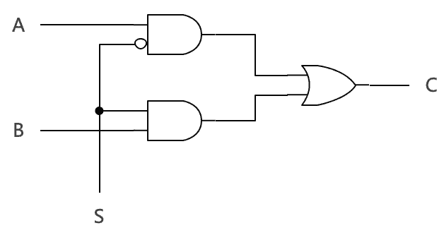；**记为**：

- **八输入的信号选择器**：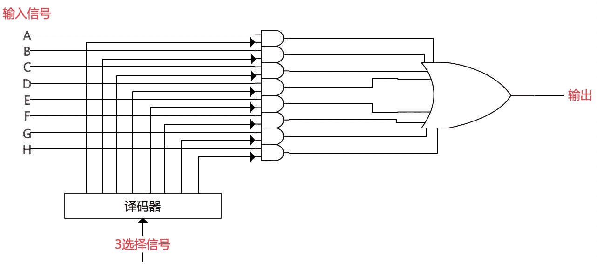

### PLA

> **programmable logic array**，**可编程逻辑阵列**
>
> - 是一种结构化逻辑单元。由一组输入信号及反向信号和一个两级逻辑构成。
> - 第一级逻辑用来生成输入信号和反向信号的**乘积项**。**也叫最小项**。
> - 第二级逻辑用来生成这些乘积项的和。

- **两级逻辑**
  - **乘积和**：一种逻辑表达形式，对所有乘积【与操作】进行逻辑求和【或操作】。

  - **和积项**：一种逻辑表达形式，对所有求和【或操作】进行逻辑乘积【与操作】。


#### 真值表与其对应的实现

- **真值表**

  |      | 输入 |      |      | 输出 |      |
  | ---- | ---- | ---- | ---- | ---- | ---- |
  | A    | B    | C    | D    | E    | F    |
  | 0    | 0    | 0    | 0    | 0    | 0    |
  | 0    | 0    | 1    | 1    | 0    | 0    |
  | 0    | 1    | 0    | 1    | 0    | 0    |
  | 0    | 1    | 1    | 1    | 1    | 0    |
  | 1    | 0    | 0    | 1    | 0    | 0    |
  | 1    | 0    | 1    | 1    | 1    | 0    |
  | 1    | 1    | 0    | 1    | 1    | 0    |
  | 1    | 1    | 1    | 1    | 0    | 1    |

- **实现**：

### ROM

> ROM是是完全译码，PLA是部分译码。

- **只读存储器**【ROM】：一类存储器，数据在制造时就固定下来，之后其数据只能被读。ROM作为逻辑化结构，可以将逻辑函数组中的项作为输入地址，将输出作为存储器中的一个字，以此来实现逻辑函数组。
- **可编程POM**【PROM】：一类只读存储器，但是当设计者知道其中的数据时，可以对其进行编程。

### 无关项

> 在真值表中记为X，**可以简化逻辑函数的实现**。
>
> - **无关项的输入**：对一些输入组合产生的输出不太关心。
> - **无关项的输出**：当输出只取决于一部分输入时。

#### 简化后的真值表

> 1. 不管B的值为多少，只要A或C为真，则输出D为真。
> 2. 不管C的值为多少，只要A或B为真，则输出E为真。
> 3. 虽然D和E都为真时，我们不关心F的值，但是如果三个输入中一个为真，则输出F为真。

- **原真值表**

  |      | 输入 |      |      | 输出 |      |
  | ---- | ---- | ---- | ---- | ---- | ---- |
  | A    | B    | C    | D    | E    | F    |
  | 0    | 0    | 0    | 0    | 0    | 0    |
  | 0    | 0    | 1    | 1    | 0    | 1    |
  | 0    | 1    | 0    | 0    | 1    | 1    |
  | 0    | 1    | 1    | 1    | 1    | 0    |
  | 1    | 0    | 0    | 1    | 1    | 1    |
  | 1    | 0    | 1    | 1    | 1    | 0    |
  | 1    | 1    | 0    | 1    | 1    | 0    |
  | 1    | 1    | 1    | 1    | 1    | 0    |

- **加上无关项**

  |      | 输入 |      |      | 输出 |      |
  | ---- | ---- | ---- | ---- | ---- | ---- |
  | A    | B    | C    | D    | E    | F    |
  | 0    | 0    | 0    | 0    | 0    | 0    |
  | 0    | 0    | 1    | 1    | 0    | 1    |
  | 0    | 1    | 0    | 0    | 1    | 1    |
  | x    | 1    | 1    | 1    | 1    | x    |
  | 1    | x    | x    | 1    | 1    | x    |

- **最终逻辑实现**

  > 只需要4个最小项。

### 逻辑单元阵列【总线】

> 很多操作需要一次处理整个字，所以我们会构建一个逻辑单元的阵列，通过将一个操作作用在整个输入的集合中来实现。
>
> 一般由一个选择信号串联整个阵列。

- **实现**：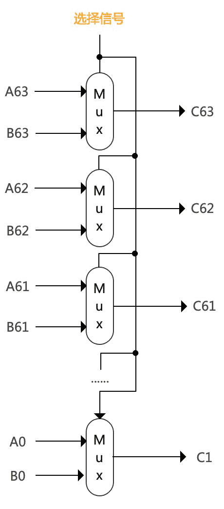;**记为**：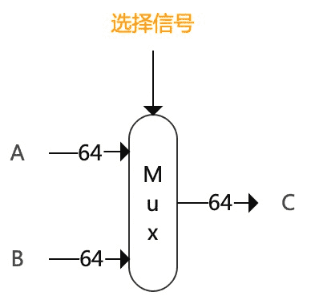
  - **总线**：在逻辑设计中，由多个数据线构成的一条逻辑线，这些数据线被同时执行；被多个源使用的一组信号线也可以称为总线。


### ALU

> arithmetic logic unit，算术逻辑单元。

#### 一位ALU

- **真值表**

  |      | 输出 |          | 输出     |      |
  | ---- | ---- | -------- | -------- | ---- |
  | a    | b    | 进位输入 | 进位输出 | 和   |
  | 0    | 0    | 0        | 0        | 0    |
  | 0    | 0    | 1        | 0        | 1    |
  | 0    | 1    | 0        | 0        | 1    |
  | 0    | 1    | 1        | 1        | 0    |
  | 1    | 0    | 0        | 0        | 1    |
  | 1    | 0    | 1        | 1        | 0    |
  | 1    | 1    | 0        | 1        | 0    |
  | 1    | 1    | 1        | 1        | 1    |

- **加法进位器**：;**记为**：

- **与和或逻辑单元实现**：

- **ALU实现**：

  > - **与**：操作信号和A、B反转器信号为0。
  > - **或**：操作信号1，A、B反转器信号为0。
  > - **或非**：操作信号0，A、B反转器信号为1。(a + b)<sup>-</sup> = a · b<sup>-</sup>
  > - **加**：操作信号2，A、B反转器信号为0。
  > - **减**：操作信号2，A反转器信号为0，B反转器信号为1，进位为1。

#### 64位ALU

##### 波形进位

> 就是将64个alu串联起来。

- **实现**：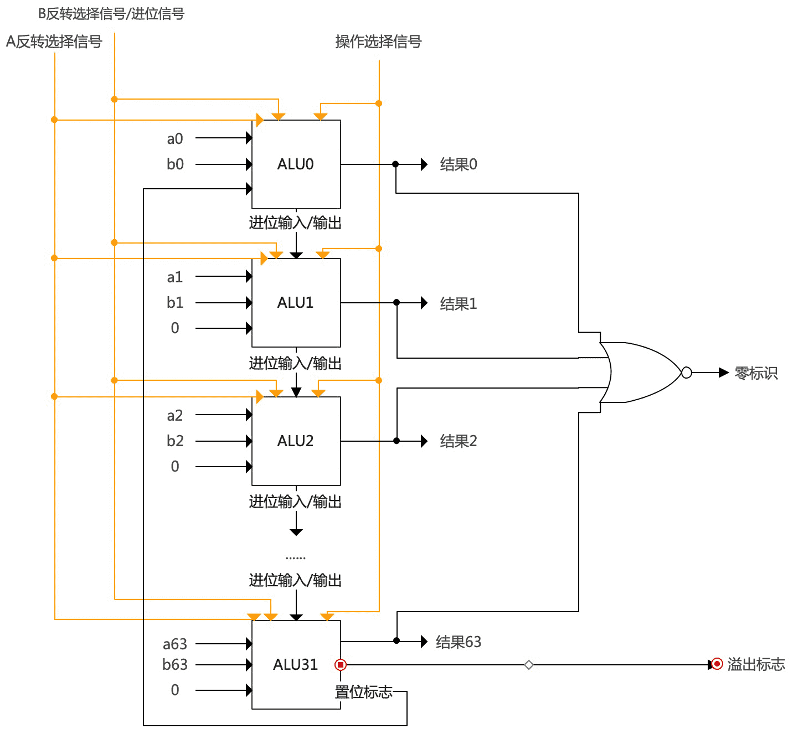；**记为**：

- **功能**

  | ALU控制线 | 功能       |
  | --------- | ---------- |
  | 0000      | 与         |
  | 0001      | 或         |
  | 0010      | 加         |
  | 0110      | 减         |
  | 0111      | 小于则置位 |
  | 1100      | 或非       |

##### 超前进位

- **理论依据**：c代表进位，a，b代表输入。
  - c<sub>i+1</sub> = (a<sub>i</sub> · b<sub>i</sub>) + (b<sub>i</sub> · c<sub>i</sub>) + (a<sub>i</sub> · c<sub>i</sub>) =  (a<sub>i</sub> · b<sub>i</sub>) +  (a<sub>i</sub> + b<sub>i</sub>) · c<sub>i</sub>
  - 设：g<sub>i</sub> = a<sub>i</sub> · b<sub>i</sub>【进位产生函数】; p<sub>i</sub> = a<sub>i</sub> + b<sub>i</sub>【进位传输函数】。
    - c<sub>1</sub> = g<sub>0</sub> + (p<sub>0</sub> · c<sub>0</sub>)
    - c<sub>2</sub> = g<sub>1</sub> + (p<sub>1</sub> · g<sub>0</sub>) +  (p<sub>1</sub> · p<sub>0</sub> · c<sub>0</sub>)
    - c<sub>3</sub> = g<sub>2</sub> + (p<sub>2</sub> · g<sub>1</sub>) +  (p<sub>2</sub> · p<sub>1</sub> · g<sub>0</sub>) +  (p<sub>2</sub> · p<sub>1</sub> · p<sub>0</sub> · c<sub>0</sub>)
    - c<sub>4</sub> = g<sub>3</sub> + (p<sub>3</sub> · g<sub>2</sub>) +  (p<sub>3</sub> · p<sub>2</sub> · g<sub>1</sub>) +  (p<sub>3</sub> · p<sub>2</sub> · p<sub>1</sub> · g<sub>0</sub>) +  (p<sub>3</sub> · p<sub>2</sub> · p<sub>1</sub> · p<sub>0</sub> · c<sub>0</sub>)

- **第一级抽象**：;**第二抽象级**：
- **水管抽象**：
  - **进位传输因子**：P<sub>0</sub> = p<sub>3</sub> · p<sub>2</sub> · p<sub>1</sub> · p<sub>0</sub>
  - **进位产生因子**：G<sub>0</sub> = g<sub>3</sub> + (p<sub>3</sub> · g<sub>2</sub>) +  (p<sub>3</sub> · p<sub>2</sub> · g<sub>1</sub>) +  (p<sub>3</sub> · p<sub>2</sub> · p<sub>1</sub> · g<sub>0</sub>)
  - C<sub>1</sub> = G<sub>0</sub> + (P<sub>0</sub> · C<sub>0</sub>)

## 时序逻辑

> 包含存储元件，输出取决于输入和当前存储元件的内容。

### 时钟

> 在时序电路中非常重要，决定了处于某一状态的存储元件合适被更新。是一个具有固定周期时间的不停运转的信号。【脉冲】

- **时钟周期**：分为高电平时钟和低电平时钟。

- **边沿触发时钟**：一种时钟机制，在这种机制下所有的状态改变都发生在时钟边沿。

  > 采用原因：易于描述，应用简单。

- **时钟同步方法**：一种根据时钟来决定数据何时有效和稳定的办法。

- **状态单元**：存储元件。

- **同步系统**：一个使用时钟的存储系统，且数据信号只有在当前时钟下是处于稳定状态才可被读取。

#### 时钟控制原理

- **时钟偏斜**：对不同的状态单元，时钟电路到达的时间有细微差别。两个状态单元看到时钟沿的绝对时间差别。

  > 时钟偏斜可能引发竞争现象，引起错误操作，例如后面的触发器的时钟有效信号到达之前，由于第一个触发器时钟信号已触发，经过组合电路后，后面的触发器的输入已经发生了变化。

- **时钟周期公式**：时钟周期 = t<sub>prop</sub> + t<sub>combinational</sub> + t<sub>setup</sub> + t<sub>skew</sub>

  > 
  >
  > -  t<sub>prop</sub>：信号通过触发器传播的时间。即触发器的输入到输出。
  > - t<sub>combinational</sub>：对于任何组合逻辑的最长延时。
  > - t<sub>setup</sub>：在上升沿到来前，触发器输入必须有效的时间。
  > - t<sub>skew</sub>：时钟偏斜时间。最好不要超过最小的触发器传播时间。

#### 电平敏感时控原理

> **双相时钟控制**：交替锁存器。

- **双相时钟周期**：
- **时钟控制**：

#### 异步输入和同步器

- **亚稳态**：如果采样时信号不满足建立时间和保持时间的要求，采样所得的数据可能是结余高电平和低电平之间的一个错误值。
- **异步输入**：在实际系统中，CPU有自己的时钟信号，I/O设备也有自己的时钟信号。

- **同步器**：

  > 将异步输入信号转化为同步信号并用于改变系统的状态量。输入为异步信号和独立的时钟信号，输出为与此输入时钟同步的信号。

  - **两个D触发器的原因**：一个触发器的输出可能会有亚稳态，亚稳态作为第二个触发器的输入，等退出亚稳态后再接收该同步器的输入信号。

- **同步失败**：触发器进入亚稳态，并且有些逻辑模块读到触发器输出为0，另外一些模块读到触发器输出为1。

### 存储元件

#### 锁存器

> 它的输出与内部存储的状态一致，并且当时钟有效时，只要输入发生变化，存储状态就会随之发生变化。

- **S-R【set-reset】锁存器**：

  - **置位信号【S】**：S为1时，Q为0。
  - **复位信号【R】**：R为1时，Q为1。
  - S和R不可同时有信号。
  - Q：存储的数据。
  - Q‘：存储数据的反向数据。
  
  该装置在无信号输入时可保证存储状态稳定。

- **D锁存器**：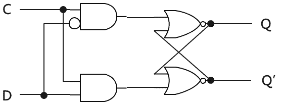；**记作**：

  - D为要存储的数据。
  - C为时钟信号
    - 当有时钟信号时，Q的存储内容和D相同。
    - 当没有时钟信号时，无论D信号为任何内容，Q的存储内容不会发生变化。

#### 触发器

> **基本构造单元**，它的输出与内部存储的状态一致，并且内部状态只在时钟的边沿发生变化。

- **D触发器**：一个包含一个输入数据的触发器，这类触发器只在时钟信号的边沿，才将输入信号存储到内部元件中。

- **上升沿触发的D触发器**：

  > - 当时钟信号有效时，主锁存器【第一个】打开，输入数据D。
  > - 当时钟信号拉低时，主锁存器关闭，D数据输出Q。

- **下降沿触发的D触发器**：

- **建立&保持时间**：

  - **建立时间**：在时钟发生跳变前，输入信号必须保持有效的最短时间。
  - **保持时间**：在时钟跳变后，输入信号需要保持的最短的有效时间。
  

#### 寄存器堆

> 包含一组可读写的寄存器，读写通过指定寄存器号进行。
>
> 一条指令通常包含两个读，一个写。

- **记号**：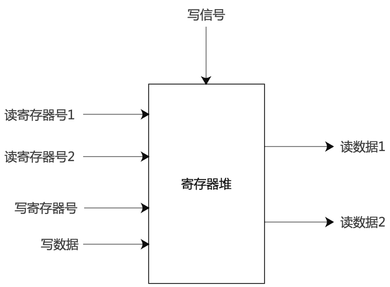

  > **读端口**：;**写端口**：

  - **写端口实现**

    > 需要三个输入：寄存器号，要写入的数据和一个控制写入的时钟。

    - 寄存器号用译码器生成一个信号和时钟信号一起组成写信号。
    - 寄存器数据直接作为触发器的数据写入。

#### 静态随机访问存储器：SRAM

- **2M * 16**：
  -  **组成**：2M个表项【21条地址线】，16位数据输出线，16位数据输入线。
  - **读操作**：片选信号【chip select】必须有效，还必须激活输出使能【Output enable】信号。
  - **写操作**：片选信号【chip select】必须有效，还必须激活写使能【Write enable】信号。
  
- **4 * 2**：

- **4M * 8**：

  > 由4k * 1024 阵列组成。

#### 动态随机访问存储器【DRAM】

> - 行地址和列地址共享地址线。
> - 行访问选通【**RAS**】和列访问选通【**CAS**】信号用于表示正在提供行地址或列地址。

- **4M *** 1：

> 2048 * 2048阵列实现。

### 有限状态机

> **用来描述时序系统**。一个包含一套输入、输出函数和下一状态函数的时序逻辑函数。
>
> - 其中下一状态函数根据当前状态和输入产生一个新的状态。
> - 输出函数根据当前状态和输入【有时不需要输入】确定输出的控制信号。

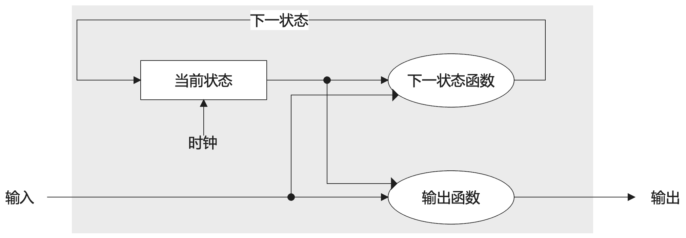

- **实现**：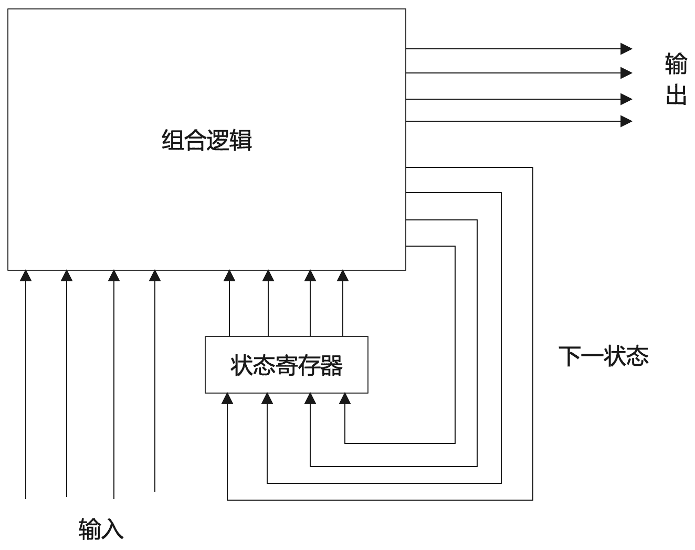
  - **下一状态函数**：是一个组合函数，根据输入和当前状态确定有限状态机的下一状态。

# 计算机概要与技术

## 程序概念

- **系统软件**：提供常用服务的软件。包括操作系统、编译程序、加载程序和汇编程序等。
- **操作系统**：用户程序和硬件之间的接口。
  - 处理输入输出。
  - 分配外存和内存。
  - 提供应用间共享的计算机资源。
- **高级程序语言**：可以由编译器转换为汇编语言。
  - 语言表达更自然。
  - 提高生产率。
  - 提高移植性。
- **编译程序【编译器】**：将高级语言翻译成汇编语言。
- **汇编程序**：将指令由助记符翻译成二进制形式。
  - *汇编语言*：用助记符形式表示的语言。
  - *机器语言*：以二进制形式表示的机器指令。

## 硬件

> - 集成电路：也叫芯片，将几十至几百万个晶体管连接起来的设备。
> - 指令集体系【体系结构】：是低层次软件和硬件之间的抽象接口，包含了指令、寄存器、存储访问、和I/O等。
>   - 应用二进制接口：用户部分指令和应用程序员调用的操作系统接口，定义了二进制层次可移植的计算机的标准。
>   - 实现：遵循体系结构抽象的硬件。

- **输入设备**：将数据写入存储器。

  > 键盘、鼠标。

- **输出设备**：从内存中读出数据。

  - *显示器*
    - **液晶显示**【LCD】：一种显示技术，**控制光的传输，非光源**。用液体聚合物薄层的带电或者不带电来传输或组织光线的传输。
    - **动态矩阵显示**：液晶显示技术，使用晶体管控制单个像素上光纤的传输。
    - **彩色动态矩阵**：每个像素有红绿蓝3类晶体管开关。
      - **位图**：图像由像素矩阵组成，可表示成二进制位的矩阵。
      - **分辨率**：矩阵的大小。如 1024 * 768。
      - **帧缓冲区**：保存位图，以刷新频率输出到显示设备。
    - **像素**：图像元素的最小单元。每个像素24位。
  - *触摸屏*：平板采取电容感应实现。

- **存储器**

  - **主存储器**：易失性存储器，仅在加电时保存数据。
    - **缓存**：处理器内使用，小而快的存储器，作为内存的缓冲。
      - **SRAM**：static random access memory，**静态随机访问存储器**，集成电路式，比
    - **内存**：程序运行时的存储空间，同时存储程序运行时所需数据。
      - **DRAM**：dynamic random access memory，**动态随机访问存储器**，集成电路式，可随机访问任何地址，时间一样。
  - **二级存储器**：非易失性存储器，在掉电时仍保持数据。
    - **磁盘**：硬盘，以旋转盘片为基础的设备。
    - **闪存**：半导体内存，比磁盘快，在个人移动设备中使用。

- **处理器**【CPU】：中央处理单元。central processor unit。从存储器中得到指令和数据。发出控制信号激活I/O设备。

  - **数据通路**：处理器中执行算数操作的部分。
  - **控制器**：指挥数据通路、存储器、输入和输出部件。

### 计算机通信

- **通信**：在计算机之间高速交换信息。
- **局域网**：在一定地理区域内使用的网络，通过交换器连接。
- **广域网**：以光纤为基础向通信公司租用，可支持万维网【World Wide Web】

## 处理器和存储器制造技术

- **晶体管**：由电信号控制的简单开关。
- **超大规模集成电路**【VLSI】：very large-scale integrated circuit，由数十万到数百万晶体管组成的电路。
- **瑕疵**：晶圆上的微小缺陷。
- **芯片**：chip，从晶圆中切割出来的单独的矩形区域。
- **成品率**：合格芯片占总芯片数的百分比。

### 公式

$$
每芯片价格 = 每晶圆价格 / (每晶圆的芯片数 * 成品率)
$$

$$
每晶圆芯片数 ≈ 晶圆面积 / 芯片面积
$$

$$
成品率 = 1 / (1 + 单位面积的瑕疵数 * 芯片面积 / 2)²
$$

## 性能

- **响应时间**：执行时间，计算机完成某任务的时间，包括硬盘访问、内存访问、I/O活动、操作系统开销和CPU执行时间。

  - CPU~~执行~~时间：执行某一任务在cpu上花费的时间。
    - 用户CPU时间：在程序本身所花费的cpu时间。
    - 系统CPU时间：在操作系统上花费的时间。

- **吞吐率**：带宽，单位时间内完成的任务数量。

- **时钟周期**：tick，通常为处理器时钟，一般为常数。处理器越好，时钟周期越短。

- **时钟频率**：时钟周期的倒数，单位时间内时钟周期的数量。

- **CPI**：每条指令的时钟周期数。

- **能耗**：一般为晶体管开关过程产生的能耗。功耗的极限限制了处理器发展，迫使进化成多核CPU。

- **并发挑战**：调度、负载均衡、通信以及同步开销。

- **MIPS**：million instructions per second，每秒百万条指令。

  

### 公式

$$
性能 = 1 / 响应时间
$$

$$
性能𝚡 / 性能𝚢 = 响应时间𝚢 / 响应时间𝚡
$$

$$
时钟频率 = 1 / 时钟周期
$$

$$
程序的CPU执行时间 = 程序的CPU时钟周期数 * 时钟周期时间
$$

$$
程序的CPU执行时间 = 程序的CPU时钟周期数 / 时钟频率
$$

$$
CPU时钟周期数 = 程序的指令数 * 每条指令的平均时钟周期数
$$

$$
CPU时间 = 指令数 * CPI * 时钟周期时间
$$

$$
CPU时间 = 指令数 * CPI / 时钟频率
$$

$$
能耗 ∝ 1/2 * 负载电容 * 电压²
$$

$$
能耗 ∝ 1/2 * 负载电容 * 电压² * 开关频率
$$

$$
改进后的执行时间 = 受改进影响的执行时间 / 改进量 + 不受改进的执行时间
$$

# 编译器

- **谬误**：更强大的指令意味着更高的性能。
- **谬误**：使用汇编语言编程来获得更高的性能。
- **谬误**：商用计算器二进制兼容的重要性意味着成功的指令集不需改变。
- **陷阱**：忘记在字节寻址机器中，连续的字地址相差不是1。**是4，字节编址**。
- **陷阱**：在自动变量的定义过程外，使用指针指向该变量。**过程栈的数据会被覆盖**。

## 名词解释

- **指令**

  - **指令集**：一个给定的计算机体系结构所包含的指令集合。
  - **指令格式**：二进制数字字段组成的指令表示形式。
  - **机器语言**：在计算机系统中用于交流的二进制表示形式。
  - **数据传输指令**：在存储器和寄存器之间移动数据的命令。

- **字**：计算机的基本访问单位，通常是32位一组。

  - **双字**：通常是64位一组。
  - **位**：bit，是信息的基本组成单位。
  - **字节**：8位为1字节。
  - **对齐限制**：字的起始位置必须是4的倍数。

- **寄存器**：reg。存放在寄存器后，才能执行算数操作。一般32个通用寄存器。

  - **通用寄存器**：可用于存储任何指令的地址或数据的寄存器。
  - **程序计数器**【PC】：包含在程序中正在被执行指令地址的寄存器。

- **地址**：用于在存储器空间中指明某特定数据元素位置的值。

  - **PC**：正在被执行指令地址的寄存器。
  - **PC相对寻址**：一种寻址方式，将pc和指令中的常数作为寻址结果，条件分支的地址就是PC相对寻址。所以16位即可。
  - **字地址**：地址指令用，跳转范围可扩大4倍。
  - **寻址模式**：根据对操作数和地址的使用不同有五种寻址模式。
    - **立即数寻址**：操作数是唯一指令自身中的常数。
    - **寄存器寻址**：操作数是寄存器。
    - **基址【偏移】寻址**：操作数在内存中，地址是指令中基址寄存器和常数的和。
    - **PC相对寻址**：地址是PC和指令中常数的和。
  - **转移地址表**：转移表，指包含不同指令序列地址的表。case / swich语句使用。

- **有符号数**

  - **最低有效位**：双字中最右边的位。
  - **最高有效位**：双字中最左边的位。
  - **二进制补码**：一个n位数与其n位相反数的无符号和为2<sup>n</sup> - 1。
  - **偏移表示法**：用00...00表示最小负数，用11...11表示最大正数。
  - **符号扩展**：取回有符号数时，会用符号位填充寄存器所有剩余位。
  - **反码**：也表示按位求反。

- **过程**：根据提供的参数执行一定任务的存储的子程序

  - **返回地址**：指向调用点的链接，是过程可以返回到合适的地址，存储在寄存器x1中。

  - **调用者**：调用一个过程并为过程提供必要参数值的程序。

  - **被调用者**：根据调用者提供的参数执行一系列存储的指令，然后将控制权返回调用者的过程。

  - **过程帧**：也称作活动记录，栈中包含过程所保存的寄存器一级局部变量的片段。

    

  - **叶过程**：不调用其他过程的过程。

  - **帧指针**：指向过程帧的第一个字，**过程中栈指针可能会变化，而帧指针不会变化**。

  - **尾递归**：可以使用尾迭代高效实现。

- **逻辑操作**

  - **与**：两个操作位都为1，结果为1。
  - **或**：两个操作位有1个为1，结果为1。
  - **非**：对操作数每位1变为0，0变为1。
  - **异或**：两个操作位值不同，结果为1。

## 相关表格

### 寄存器存储

|   名称    | 寄存器号 | 用途                   |
| :-------: | :------: | ---------------------- |
|    x0     |    0     | 常数0                  |
|  x1(ra)   |    1     | 返回赋值【链接寄存器】 |
|  x2(sp)   |    2     | 栈指针                 |
|  x3(gp)   |    3     | 全局指针               |
|  x4(tp)   |    4     | 线程指针               |
|  x5 ~ x7  |  5 ~ 7   | 临时寄存器             |
|  x8 ~ x9  |  8 ~ 9   | 保存寄存器，x8帧指针   |
| x10 ~ x17 | 10 ~ 17  | 参数 / 结果            |
| x18 ~ x27 | 18 ~ 27  | 保存寄存器             |
| x28 ~ x31 | 28 ~ 31  | 临时寄存器             |

### RISC-V操作数

|           名字           |                     示例                      | 注释                                                         |
| :----------------------: | :-------------------------------------------: | :----------------------------------------------------------- |
|        32个寄存器        |                  $x0 ~ $x31                   | 用于数据快速存取。                                           |
|      32个浮点寄存器      |                  $f₀ ~ $f₃₁                   | 成对地使用MIPS浮点寄存器来保存双精度数                       |
| 2<sup>61</sup>个存储器字 | Memory[0]、Memory[8]...Memory[2<sup>64</sup>] | 只能通过数据传输指令访问，连续的字地址差8。<br>保存数据结构、数组和溢出的寄存器。 |
|     常数或立即操作数     |                                               | 常数操作数出现频率高，从存储器中取常数比较慢。<br />增加立即数是**加速大概率事件**。 |

### RISC-V六类指令

#### 算数

|     指令 | 示例          | 含义         | 注释                       |
| -------: | :------------ | :----------- | :------------------------- |
|     加法 | add x5,x6,x7  | x5 = x6 + x7 | 三个寄存器操作数，检测溢出 |
|     减法 | sub x5,x6,x7  | x5 = x6 - x7 | 三个寄存器操作数，检测溢出 |
| 加立即数 | addi x5,x6,20 | x5 = x6 + 40 | 加常数，检测溢出           |

#### 数据传输

|             指令 | 示例           | 含义                                   | 注释                         |
| ---------------: | :------------- | :------------------------------------- | :--------------------------- |
|           取双字 | ld x5,40(x6)   | x5 = Memory[x6 + 40]                   | 从存储器取双字到寄存器       |
|           存双字 | sd x5,40(x6)   | Memory[x6 + 40] = x5                   | 从寄存器存双字到存储器       |
|             取字 | lw x5,40(x6)   | x5 = Memory[x6 + 40]                   | 从存储器取字到寄存器         |
|   取字【无符号】 | lwu x5,40(x6)  | x5 = Memory[x6 + 40]                   | 从存储器取无符号字到寄存器   |
|             存字 | sw x5,40(x6)   | Memory[x6 + 40] = x5                   | 从寄存器存字到存储器         |
|           取半字 | lh x5,40(x6)   | x5 = Memory[x6 + 40]                   | 从存储器取半字到寄存器       |
|     取无符号半字 | lhu x5,40(x6)  | x5 = Memory[x6 + 40]                   | 从存储器取半字到寄存器       |
|           存半字 | sh x5,40(x6)   | Memory[x6 + 40] = x5                   | 从寄存器存半字到存储器       |
|           取字节 | lb x5,40(x6)   | x5 = Memory[x6 + 40]                   | 从存储器取字节到寄存器       |
| 取字节【无符号】 | lbu x5,40(x6)  | x5 = Memory[x6 + 40]                   | 从存储器取无符号字节到寄存器 |
|           存字节 | sb x5,40(x6)   | Memory[x6 + 40] = x5                   | 从寄存器存字节到存储器       |
|         取保留字 | lr.d x5,40(x6) | x5 = Memory[x6 + 40]                   | 取：原子交换的前半部分       |
|         存条件字 | sc.d x5,40(x6) | x5 = Memory[x6 + 40]<br />;x5 = 0 or 1 | 存：原子交换的后半部分       |
|   取立即数的高位 | lui x5,0x12345 | x5 = 0x12345000                        | 取左移12位后的20位立即数     |

#### 逻辑

|       指令 | 示例          | 含义          | 注释                     |
| ---------: | :------------ | :------------ | :----------------------- |
|         与 | and x5,x6,x7  | x5 = x6 & x7  | 三个寄存器操作：按位与   |
|         或 | or x5,x6,x7   | x5 = x6 \| x7 | 三个寄存器操作：按位或   |
|       或非 | xor x5,x6,x7  | x5 = x6 ^ x7  | 三个寄存器操作：按位异或 |
|   与立即数 | andi x5,x6,20 | x5 = x6 & 20  | 和常数按位与             |
|   或立即数 | ori x5,x6,20  | x5 = x6 \| 20 | 和常数按位或             |
| 异或立即数 | xori x5,x6,20 | x5 = x6 ^ 20  | 和常数按位异或           |

#### 移位操作

|           指令 | 示例         | 含义          | 注释                     |
| -------------: | :----------- | :------------ | :----------------------- |
|       逻辑左移 | sll x5,x6,x7 | x5 = x6 << x7 | 按寄存器给定位数左移     |
|       逻辑右移 | srl x5,x6,x7 | x5 = x6 >> x7 | 按寄存器给定位数右移     |
|       算术右移 | sra x5,x6,x7 | x5 = x6 >> x7 | 按寄存器给定位数算数右移 |
| 逻辑左移立即数 | slli x5,x6,3 | x5 = x6 << 3  | 按立即数给定位数左移     |
| 逻辑右移立即数 | srli x5,x6,3 | x5 = x6 >> 3  | 按立即数给定位数右移     |
| 算术右移立即数 | srai x5,x6,3 | x5 = x6 >> 3  | 按立即数给定位数算数右移 |

#### 条件分支

|                     指令 | 示例           | 含义                               | 注释                                                     |
| -----------------------: | :------------- | :--------------------------------- | :------------------------------------------------------- |
|               相等即跳转 | beq x5,x6,100  | if (x5 == x6) <br />go to PC + 100 | 若寄存器数值相等则跳转到PC相对地址                       |
|               不等即跳转 | bne x5,x6,100  | if (x5 != x6) <br />go to PC + 100 | 若寄存器数值不等则跳转到PC相对地址                       |
|               小于即跳转 | blt x5,x6,100  | if (x6 < x7)<br />go to PC + 100   | 若寄存器数值比较结果小于则跳转到PC相对地址               |
|           大于等于即跳转 | bge x5,x6,100  | if (x6 >= x7)<br />go to PC + 100  | 若寄存器数值比较结果大于等于则跳转到PC相对地址           |
|     小于即跳转【无符号】 | bltu x5,x6,100 | if (x6 >= x7)<br />go to PC + 100  | 若寄存器数值比较结果小于则跳转到PC相对地址【无符号】     |
| 大于等于即跳转【无符号】 | bgeu x5,x6,100 | if (x6 >= x7)<br />go to PC + 100  | 若寄存器数值比较结果大于等于则跳转到PC相对地址【无符号】 |

#### 无条件跳转

|          指令           |     示例     |            含义             | 注释                     |
| :---------------------: | :----------: | :-------------------------: | :----------------------- |
|        跳转-链接        |   jal 2500   |   x1 = PC + 4; go to 100    | 用于过程调用             |
| 跳转-链接【寄存器地址】 | jalr 100(x5) | x1 = PC + 4; go to x5 + 100 | 用于过程返回，非直接调用 |

### <span id="指令格式">RISC-V六种指令格式</span>

#### R型：算输指令格式

|  字段  | 位数 | 比特位位置 | 注释                               |
| :----: | :--: | :--------: | :--------------------------------- |
| funct7 |  7   |   31:25    | 另外的操作码字段                   |
|  rs2   |  5   |   24:20    | 第二个源操作数寄存器               |
|  rs1   |  5   |   19:15    | 第一个源操作数寄存器               |
| funct3 |  3   |   14:12    | 另外的操作码字段                   |
|   rd   |  5   |    11:7    | 目的寄存器，用于存放操作结果       |
| opcode |  7   |    6:0     | 操作码，用于表示指令操作和指令格式 |

##### 常用

|          指令 | funct7  | rs2  | rs1  | funct3 | rd   | opcode  |
| ------------: | :------ | :--- | ---- | ------ | ---- | ------- |
|           add | 0000000 | reg  | reg  | 000    | reg  | 0110011 |
| sub[subtract] | 0100000 | reg  | reg  | 000    | reg  | 0110011 |
|           sll | 0000000 | reg  | reg  | 001    | reg  | 0110011 |
|           xor | 0000000 | reg  | reg  | 100    | reg  | 0110011 |
|           srl | 0000000 | reg  | reg  | 101    | reg  | 0110011 |
|           sra | 0000000 | reg  | reg  | 101    | reg  | 0110011 |
|            or | 0000000 | reg  | reg  | 110    | reg  | 0110011 |
|           and | 0000000 | reg  | reg  | 111    | reg  | 0110011 |
|          lr.d | 0001000 | reg  | reg  | 011    | reg  | 0110011 |
|          sc.d | 0001100 | reg  | reg  | 011    | reg  | 0110011 |

#### I型：加载&用于立即数

|      字段       | 位数 | 比特位位置 | 注释                                                         |
| :-------------: | :--: | :--------: | :----------------------------------------------------------- |
| immediate[11:0] |  12  |   31:20    | 字节偏移量或常数，可以取相对于基址rd偏移±2<sup>11</sup>个字节。 |
|       rs1       |  5   |   19:15    | 第一个源操作数寄存器                                         |
|     funct3      |  3   |   14:12    | 另外的操作码字段                                             |
|       rd        |  5   |    11:7    | 用于存放操作结果的目的寄存器                                 |
|     opcode      |  7   |    6:0     | 操作码，用于表示指令操作和指令格式                           |

##### 常用

|                指令 | immediate | rs1  | funct3 | rd   | opcode  |
| ------------------: | :-------- | :--- | ------ | ---- | ------- |
|                  lb | constant  | reg  | 000    | reg  | 0000011 |
|                  lh | constant  | reg  | 001    | reg  | 0000011 |
|                  lw | constant  | reg  | 010    | reg  | 0000011 |
|                  ld | constant  | reg  | 011    | reg  | 0000011 |
|                 lbu | constant  | reg  | 100    | reg  | 0000011 |
|                 lhu | constant  | reg  | 101    | reg  | 0000011 |
|                 lwu | constant  | reg  | 110    | reg  | 0000011 |
| addi[add immediate] | constant  | reg  | 000    | reg  | 0010011 |
|                slli | address   | reg  | 001    | reg  | 0000011 |
|                xori | -         | reg  | 100    | reg  | 0010011 |
|                srli | -         | reg  | 101    | reg  | 0010011 |
|                srai | -         | reg  | 101    | reg  | 0010011 |
|                 ori | constant  | reg  | 110    | reg  | 0010011 |
|                andi | constant  | reg  | 111    | reg  | 0010011 |
|                jalr | constant  | reg  | 000    | reg  | 1100111 |

#### S型：存储

|    字段     | 位数 | 比特位位置 | 注释                                                 |
| :---------: | :--: | :--------: | :--------------------------------------------------- |
| immed[11:5] |  7   |   31:25    | 字节偏移量，分两个位置存放，保证其他字段的位置不变化 |
|     rs2     |  5   |   24:20    | 第二个源操作数寄存器                                 |
|     rs1     |  5   |   19:15    | 第一个源操作数寄存器                                 |
|   funct3    |  3   |   14:12    | 另外的操作码字段                                     |
| immed[4:0]  |  5   |    11:7    | 字节偏移量，分两个位置存放，保证其他字段的位置不变化 |
|   opcode    |  7   |    6:0     | 操作码，用于表示指令操作和指令格式                   |

##### 常用

|                 指令 | immed[11:5] | rs2  | rs1  | funct3 | immed[4:0] | opcode  |
| -------------------: | :---------- | :--- | ---- | ------ | ---------- | ------- |
|                   sb | address     | reg  | reg  | 000    | address    | 0100011 |
|                   sh | address     | reg  | reg  | 001    | address    | 0100011 |
|                   sw | address     | reg  | reg  | 010    | address    | 0100011 |
| sd[store doubleword] | address     | reg  | reg  | 011    | address    | 0100011 |

#### U型：大立即数格式

|     字段     | 位数 | 比特位位置 | 注释                               |
| :----------: | :--: | :--------: | :--------------------------------- |
| immed[31:12] |  20  |   31:12    | 大数的高 31 ~ 12 位                |
|      rd      |  5   |    11:7    | 用于存放操作结果的目的寄存器       |
|    opcode    |  7   |    6:0     | 操作码，用于表示指令操作和指令格式 |

##### 常用

| 指令 | immed[31:12] | rd   | opcode  |
| ---: | :----------- | :--- | ------- |
|  lui | address      | reg  | 0110111 |

#### SB型：条件分支格式

> 不能编码奇数字地址

|      字段      | 位数 | 比特位位置 | 注释                                                 |
| :------------: | :--: | :--------: | :--------------------------------------------------- |
| immed[12,10:5] |  7   |   31:25    | 字节偏移量，分两个位置存放，保证其他字段的位置不变化 |
|      rs2       |  5   |   24:20    | 第二个源操作数寄存器                                 |
|      rs1       |  5   |   19:15    | 第一个源操作数寄存器                                 |
|     funct3     |  3   |   14:12    | 另外的操作码字段                                     |
| immed[4:1,11]  |  5   |    11:7    | 字节偏移量，分两个位置存放，保证其他字段的位置不变化 |
|     opcode     |  7   |    6:0     | 操作码，用于表示指令操作和指令格式                   |

##### 常用

| 指令 | immed[12,10:5] | rs2  | rs1  | funct3 | immed[4:1,11] | opcode  |
| ---: | :------------- | :--- | ---- | ------ | ------------- | ------- |
|  beq | address        | reg  | reg  | 000    | address       | 1100111 |
|  bne | address        | reg  | reg  | 001    | address       | 1100111 |
|  blt | address        | reg  | reg  | 100    | address       | 1100111 |
|  bge | address        | reg  | reg  | 101    | address       | 1100111 |
| bltu | address        | reg  | reg  | 110    | address       | 1100111 |
| bgeu | address        | reg  | reg  | 111    | address       | 1100111 |

#### UJ型：无条件跳转

|       字段        | 位数 | 比特位位置 | 注释                               |
| :---------------: | :--: | :--------: | :--------------------------------- |
| immed[20,10:1,11] |  12  |   31:20    | 地址位置，分两个位置存放           |
|   immed[19:12]    |  8   |   19:12    | 地址位置，分两个位置存放           |
|        rd         |  5   |    11:7    | 基址地址寄存器                     |
|      opcode       |  7   |    6:0     | 操作码，用于表示指令操作和指令格式 |

##### 常用

| 指令 | immed[20,10:1,11] | immed[19:12] | rd   | opcode  |
| ---: | :---------------- | :----------- | ---- | ------- |
|  jal | address           | address      | reg  | 1101111 |

## C程序

### 翻译并执行


- **编译器**：将c语言转换成机器能理解的符号形式的汇编语言。
- **汇编语言**：一种符号语言，能被翻译成二进制的机器语言。
  - **伪指令**：汇编语言指令的变种通常被看作一条汇编指令。
- **汇编器**：汇编器能够处理一些机器语言指令的变种。这些变种也称为伪指令，简化了程序转换和编程。
- **目标文件**：机器代码语言。包括机器语言指令、数据和指令正确放入内存所需要的信息。
  - *目标文件头*：描述目标文件其他部分的大小和位置。
  - *代码段*：包含机器语言代码。
  - *静态数据段*：包含在程序生命周期内分配的数据。
  - *重定位信息*：标记了一些在程序加载进内存时依赖于绝对地址的指令和数据。**比如载入、跳转等包含address的指令**。
  - *符号表*：用来匹配标记名和指令所在内存字的地址的列表。包含未定义的剩余标记，如外部引用。**变量和分支等**。
  - *调试信息*：包含一份说明目标模块如何编译的简明描述。
- **链接器**：也称链接编辑器，系统程序。把各个独立汇编的机器语言程序组合起来并且解决所有未定义的标记，最终生成可执行文件。
  - **工作内容**
    - 使用每个目标模块中的重定位信息和符号表，解析所有的未定义标签。
      - 寻找所有旧地址并用新地址替换。
    - 外部引用解析完后，决定每个模块要占用的内存位置，当模块放入内存中时，修改重定位信息中的决定引用。
  - **工作步骤**
    - 将代码和数据模块象征性的放入内存。
    - 决定数据和指令标签的地址。
    - 修补内部和外部引用。
- **可执行文件**：具有目标文件格式的功能程序，不包含未解决的引用。可以包含符号表和调试信息。
- **加载器**：把目标程序装载到内存中以准备运行的系统程序。
  - 读取可执行文件头来确定代码段和数据段的大小。
  - 为正文和数据创建一个足够大的地址空间。
  - 将可执行文件中的指令和数据复制到内存中。
  - 把主程序的参数复制到栈顶。
  - 初始化机器寄存器，将栈指针指向第一个空位置。
  - 跳转到启动例程，将参数复制到参数寄存器并调用程序的main函数。当main函数返回时，启动例程通过系统调用exit终止程序。
- **动态链接库**：**DDL**，dynamically linked library。在程序执行过程中才被链接的库例程。
  - 第一次，调用虚入口。执行间接跳转，跳转到动态链接器或加载器。加载完在该表间接跳转位置的地址。
  - 以后，调用虚入口。间接跳转到例程。
- **内存分配**：

### 边界检查

```assembly
# x20 >= x11 或者 x20 < 0，就跳到越界，可以让x11作为边界最大值
bgeu x20 x11 IndexOutOfBounds
```

### 函数

#### 运行步骤

1. 将参数放在过程可以访问的位置。
2. 将控制转交给过程。
3. 获得过程所需的存储资源。
4. 执行需要的任务。
5. 将结果的值放在调用程序可以访问的位置。
6. 将控制返回初始点，因为一个过程可能由一个程序的多个点调用。

#### 寄存器栈

- **过程调用保留**。

  | 保留                           | 不保留                       |
  | ------------------------------ | ---------------------------- |
  | 保存寄存器：x8 ~ x9, x18 ~ x27 | 临时寄存器：x5~x7, x28 ~ x31 |
  | 栈指针寄存器：x2(sp)           | 参数/结果寄存器：x10 ~ x17   |
  | 帧指针寄存器：x8(fp)           |                              |
  | 返回地址寄存器：x1(ra)         |                              |
  | 栈指针以上的栈                 | 栈指针以下的栈               |

- **参数过多**：前8个放在寄存器，其他的放在帧指针上方。

### 编译程序

#### 排序

- **c程序**

  ```c
  void sort(int v[], int n) {
      int i, j;
      for (i = 0; i < n; i++) {
          for (j = i - 1; j >= 0 && v[j] > v[j+1]; j--) {
              swap(v, j);
          }
      }
  }
  
  void swap(int v[], int k) {
      temp = v[k];
      v[k] = v[k + 1];
      v[k + 1] = temp;
  }
  ```

- **编译程序**

  ```assembly
  # v 和 n 使用参数寄存器，因为非叶程序，i 和 j 使用保存寄存器。
  # v -> x10; n -> x11; i -> x19; j -> x20;
  
  # 非叶程序，第一步：入栈，程序中用到了哪些寄存器，就要把寄存器的值入栈。
  		addi sp, sp, -40
  		sw x1, 32(sp)
  		sw x22, 24(sp)
  		sw x21, 16(sp)
  		sw x20, 8(sp)
  		sw x19, 0(sp)
  
  # sort 过程体
  # 复制参数，因为调用swap函数需要用到参数寄存器，所以要先移过来。
  		mv x21, x10
  		mv x22, x11
  
  # 外层循环
  		li x19, 0									# i = 10
  loop1:	bge x19, x22, exit1  	# i >= n
  		
  # 内层循环
  		addi x20, x19, -1 				# j = i - 1
  loop2:	blt x20, x0, exit2 		# j < 0
  		slli x5, x20, 3 					# j << 2
  		add x5, x5, x21 					# v[j]基址
  		ld x6, 8(x5) 							# v[j]
  		ld x7, 8(x5) 							# v[j+1]
  		ble x7, x6, exit2 				# v[j+1] < v[j]
  		
  # 传参和调用
  		mv x10, x21								# 参数赋值
  		mv x11, x20								# 参数赋值
  		jal x1, swap 							# 跳转swap(v[], k) 并修改x1
  		
  # 循环内部
  		addi x20, x20, -1 				# j--
  		j loop2
  
  exit2:	addi x19, x19, 1 			# i++
  		j loop1
  
  # 恢复寄存器的值
  exit1:	lw x19, 0(sp)
  		lw x20, 8(sp)
  		lw x21, 16(sp)
  		lw x22, 24(sp)
  		lw x1, 32(sp)
  		addi sp, sp, 40
  		
  # 过程返回
  		jalr x0, 0(x1)
  		
  # swap函数
  swap:	sll x5, x11, 2
  		add x5, x10, x5
  		lw x5, 0(x5)
  		lw x5, 4(x5)
  		sw x5, 0(x5)
  		sw x5, 4(x5)
  		jr x1

## JAVA程序

todo 老孙

## 并行与同步

- **数据竞争**：来自不同线程的两个访存请求访问同一个地址，连续出现，并且其中一个是写操作，存储访问形成数据竞争。
- **原子交换原语**：提供对存储单元进行原子读和原子写的能力，多处理器中实现同步需要，存储器在进行原子度或原子写操作时任何其他操作都不得插入。

- **原子操作实现**：指令对，如果保留加载指令指定的内存位置的内容在条件存储指令执行到同一位置时发生了变化，则条件指令存储失败且不会将值写入内存。
  - 保留加载：`lr.d`
  - 条件存储：`sc.d`

# 算数运算

- **谬误**：左移可以代替2的幂次方数相乘，右移也可以代替与2的幂次方数相除。**无符号整数可以，有符号整数有问题**。
- **陷阱**：浮点加法不能使用结合律。**因为浮点数精度有限，结合可能会导致精度提前忽略**。
- **谬误**：并行执行策略不但适用于整数类型数据，同样也适用于浮点数据类型。**因为浮点数不能使用结合律**。
- **谬误**：只有理论数学家才会关心浮点精度。

## 相关指令

### 算数

|                     指令 | 示例              | 含义                                   | 注释                       |
| -----------------------: | :---------------- | :------------------------------------- | :------------------------- |
|                 小于置位 | slt x5,x6,x7      | if (x6 < x7) x5 == 1<br />else x5 == 0 | 三个寄存器操作数           |
|     小于置位【无符号数】 | sltu x5,x6,x7     | if (x6 < x7) x5 == 1<br />else x5 == 0 | 三个寄存器操作数           |
|       小于置位【立即数】 | slti x5,x6,x7     | if (x6 < x7) x5 == 1<br />else x5 == 0 | 与立即数比较               |
| 小于置位【无符号立即数】 | sltiu x5,x6,x7    | if (x6 < x7) x5 == 1<br />else x5 == 0 | 与立即数比较               |
|                       乘 | mul x5,x6,x7      | x5 = x6 * x7                           | 128位乘积的低64位          |
|                   高位乘 | mulh x5,x6,x7     | x5 = (x6 * x7) >> 64                   | 128位有符号乘积的高64位    |
|       高位乘【无符号数】 | mulhu x5,x6,x7    | x5 = (x6 * x7) >> 64                   | 128位无符号乘积的高64位    |
|    高位乘【有-无符号数】 | mulhsu x5,x6,x7   | x5 = (x6 * x7) >> 64                   | 128位有-无符号乘积的高64位 |
|                       除 | div x5,x6,x7      | x5 = x6 / x7                           | 取有符号64位数字           |
|             除【无符号】 | divu x5,x6,x7     | x5 = x6 / x7                           | 取无符号64位数字           |
|                     取余 | rem x5,x6,x7      | x5 = x6 % x7                           | 对有符号64位除法取余       |
|           取余【无符号】 | remu x5,x6,x7     | x5 = x6 % x7                           | 对无符号64位除法取余       |
|         浮点加【单精度】 | fadd.s f0, f1, f2 | f0 = f1 + f2                           |                            |
|         浮点减【单精度】 | fsub.s f0,f1,f2   | f0 = f1 - f2                           |                            |
|         浮点乘【单精度】 | fmul.s f0,f1,f2   | f0 = f1 * f2                           |                            |
|         浮点除【单精度】 | fdiv.s f0,f1,f2   | f0 = f1 / f2                           |                            |
|     浮点平方根【单精度】 | fsqrt.s f0,f1     | f0 = √f1                               |                            |
|         浮点加【双精度】 | fadd.d f0,f1,f2   | f0 = f1 + f2                           |                            |
|         浮点减【双精度】 | fsub.d f0,f1,f2   | f0 = f1 - f2                           |                            |
|         浮点乘【双精度】 | fmul.d f0,f1,f2   | f0 = f1 * f2                           |                            |
|         浮点除【双精度】 | fdiv.d f0,f1,f2   | f0 = f1 / f2                           |                            |
|     浮点平方根【双精度】 | fsqrt.d f0,f1     | f0 = √f1                               |                            |

### 比较

|                     指令 | 示例           | 含义                                    | 注释             |
| -----------------------: | :------------- | :-------------------------------------- | :--------------- |
|     浮点数相等【单精度】 | feq.s x5,f0,f1 | if (f0 == f1) x5 == 1<br />else x5 == 0 | 单精度浮点数比较 |
|     浮点数小于【单精度】 | flt.s x5,f0,f1 | if (f0 < f1) x5 == 1<br />else x5 == 0  | 单精度浮点数比较 |
| 浮点数小于等于【单精度】 | fle.s x5,f0,f1 | if (f0 <= f1) x5 == 1<br />else x5 == 0 | 单精度浮点数比较 |
|     浮点数相等【双精度】 | feq.d x5,f0,f1 | if (f0 == f1) x5 == 1<br />else x5 == 0 | 双精度浮点数比较 |
|     浮点数小于【双精度】 | flt.d x5,f0,f1 | if (f0 < f1) x5 == 1<br />else x5 == 0  | 双精度浮点数比较 |
| 浮点数小于等于【双精度】 | fle.d x5,f0,f1 | if (f0 <= f1) x5 == 1<br />else x5 == 0 | 双精度浮点数比较 |

### 数据传输

|       指令 | 示例         | 含义                | 注释                             |
| ---------: | :----------- | :------------------ | :------------------------------- |
|   浮点取字 | flw f0,4(x5) | f0 = Memory[x5 + 4] | 从存储器取单精度字到浮点寄存器   |
| 浮点取双字 | fld f0,8(x5) | f0 = Memory[x5 + 8] | 从存储器取双精度字到浮点寄存器   |
|   浮点存字 | fsw f0,4(x5) | Memory[x5 + 4] = f0 | 将浮点寄存器的单精度字存到存储器 |
| 浮点取双字 | fsd f0,8(x5) | Memory[x5 + 8] = f0 | 将浮点寄存器的双精度字存到存储器 |

## 整数

### 加减法

- **加法**：从右到左逐渐位相加，进位也向左传播。

  > 因此不必额外考虑符号的问题。

- **减法**：对数取补码后，执行加法操作。

- **溢出条件**

  | 操作  | 操作数A | 操作数B | 表示结果有溢出的条件 |
  | ----- | ------- | ------- | -------------------- |
  | A + B | >=0     | >=0     | <0                   |
  | A + B | <0      | <0      | >=0                  |
  | A - B | >=0     | <0      | <0                   |
  | A - B | <0      | >=0     | >=0                  |

- **算数异常**

  - add、addi、sub 在溢出时产生异常。
  - addu、addiu、subu在溢出时不产生异常。【C语言忽略溢出，所以使用这个指令。】

- **异常**：也叫中断，一种打断正常程序执行过程的事件，用于溢出检测。

  > 1. 产生异常的指令保存到寄存器【异常程序计数器，EPC，$k₀ ~ $k₁】中。
  > 2. 跳到预先设定好的地址执行异常处理程序。

- **饱和操作**：发生溢出时，结果被设置为最大正数或最小负数。

### 乘法

> 乘数为常数时，乘法会用移位来代替。编译器将短常数的乘法替换为一系列移位和加法。

- **硬件结构**：

  > 积寄存器多一位是为了保存加法器的进位。

- **执行逻辑**

  ```mermaid
  graph TD
  A(开始) --> B[乘数 放入 积/乘数寄存器 的低64位]
  B -->C{检查 积/乘数寄存器 最低位}
  C --> |=1|D[积/乘数寄存器 高65位加上 被乘数,<br \>将结果写入 积/乘数寄存器 的高65位]
  D --> E[积/乘数寄存器 右移一位,<br \>相当于同时把 被乘数寄存器 左移和 乘数寄存器 右移]
  C --> |=0| E
  E --> F{第64次重复?}
  F --> |否| B
  F --> |是| G(结束)
  ```

  - **重复次数优化**：原来是加法器栈。并行树，log₂(64) = 6。

- **有符号乘法**

  - 将算法迭代63次，符号位不参与运算。

  - 符号位最后单独计算，符号相异时，符号位位1。


### 除法

- **硬件结构**：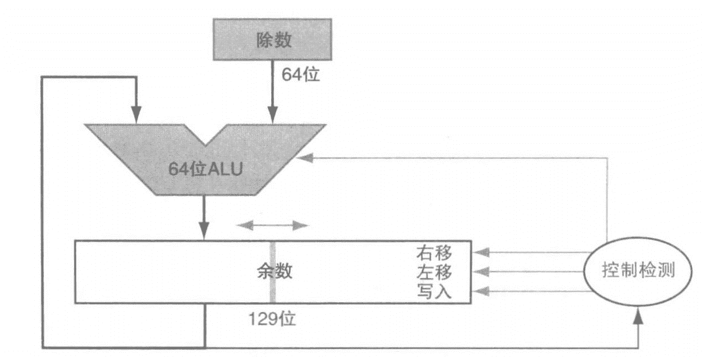

- **执行逻辑**：

  ```mermaid
  graph TD
  A(开始) --> B[将 被除数 放在 商/余数寄存器 的低65位]
  B --> C[从 商/余数寄存器 的低65位减去 除数寄存器 的值,将结果放在 商/余数寄存器 中]
  C --> D{测试余数}
  D --> |余数 >= 0|E[商/余数寄存器 左移<br \>相当于同时将 余数寄存器 左移和 除数寄存器 右移<br \>最低为设为1]
  D --> |余数 < 0| F[通过给 商/余数寄存器 加上 除数寄存器 来恢复原值,结果放在 余数寄存器.<br \>商/余数寄存器 左移0<br \>相当于同时将 余数寄存器 左移和 除数寄存器 右移<br \>最低为设为.]
  E --> G{第64次重复?}
  F --> G
  G --> |否| B
  G --> |是| H(结束)
  ```

- **有符号除法**

  - 源操作数的符号相反时商为负。

  - 使非零余数的符号和被除数相同。

## 浮点运算

|             指令 | 示例           | 含义                                          | 注释                     |
| ---------------: | :------------- | :-------------------------------------------- | :----------------------- |
|     取字【浮点】 | lw $f₁,40(x6)  | $f₁ = Memory[x6 + 40]                         | 将字从内存取到浮点寄存器 |
|     存字【浮点】 | lw $f₁,40(x6)  | Memory[x6 + 40] = $f₁                         | 将字从浮点寄存器存到内存 |
| 浮点标志真则跳转 | bclt 25        | if (cond == 1) <br />go to PC + 4 + 100       |                          |
| 浮点标志假则跳转 | bclf 25        | if (cond == 0) <br />go to PC + 4 + 100       |                          |
|   浮点单精度比较 | c.lt.s $f₂,$f₄ | if ($f₂ < $f₄) cond = 1;<br />else  cond = 0; |                          |
|   浮点双精度比较 | c.lt.d $f₂,$f₄ | if ($f₂ < $f₄) cond = 1;<br />else  cond = 0; |                          |

- **科学计数法**：十进制小数点左边只有一位整数的计数法。
- **规格化数**：没有前导0的浮点计数法。
  - 简化了浮点数的数据交换。
  - 简化了浮点算术运算。
  - 提高了一个字存储的数的精度。
- **浮点数**：二进制小数点不固定的表达数的计数法。

### 浮点表示

- **尾数**：位于浮点数的尾数字段，其值在0和1之间。

- **指数**：位于浮点数的指数字段，表示小数点的位置。

  - **指数正负**：偏阶计数法。单精度偏阶127，双精度1023。
    - 11111111：表示最大正数。
    - 00000000：表示最小负数。

- **溢出【上溢】**：正的指数太大而导致指数域放不下的情况。

- **下溢**：负的指数太大导致指数域放不下的情况。

- **双精度**：浮点数由两个32位的字表示。

  - | 符号位         | 指数 | 尾数 |
    | -------------- | ---- | ---- |
    | 1位，1代表负数 | 11位 | 52位 |

  - *表示对象*

    | 指数     | 尾数   | 表示对象  |
    | -------- | ------ | --------- |
    | 0        | 0      | 0         |
    | 0        | 非0    | ±非规格数 |
    | 1 ~ 2046 | 任何值 | ±浮点数   |
    | 2047     | 0      | ±无穷     |
    | 2047     | 非0    | NaN       |

- **单精度**：浮点数由一个32位的字表示。

  - | 符号位         | 指数 | 尾数 |
    | -------------- | ---- | ---- |
    | 1位，1代表负数 | 8位  | 23位 |

  - *表示对象*

    | 指数    | 尾数   | 表示对象    |
    | ------- | ------ | ----------- |
    | 0       | 0      | 0           |
    | 0       | 非0    | ±非规格化数 |
    | 1 ~ 254 | 任何值 | ±浮点数     |
    | 255     | 0      | ±无穷       |
    | 255     | 非0    | NaN         |

- **有效位**：有效位比尾数多了一个1，隐藏了规格化二进制数的前导位1。
- **非规格化数**：在指数为0而有效数非0时，允许一个有效数逐步变小直至0，称为**逐步下溢**。进而获得更大的精度。

#### 举例：-0.75表示

> -3 / 4 => -11/ 2² => -1.1 * 2<sup>-1</sup>
>
>  浮点数的尾数表示时去掉前导1。

- **单精度**

  | 符号位 | 指数     | 尾数                   |
  | ------ | -------- | ---------------------- |
  | 1      | 01111110 | 1000000000000000000000 |

- **双精度**

  | 符号位 | 指数        | 尾数                                              |
  | ------ | ----------- | ------------------------------------------------- |
  | 1      | 01111111110 | 1000000000000000000000000000000000000000000000000 |

### 加法

- **硬件结构**：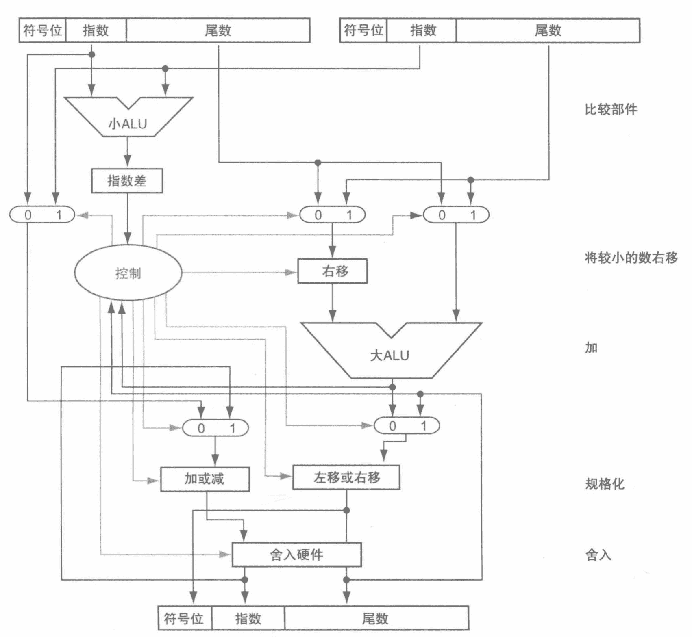

- **执行逻辑**

  ```mermaid
  graph TD
  A(开始) --> B[比较两个数的指数,将指数最小的数进行右移,直到其指数与指数较大的相匹配]
  B --> C[尾数相加]
  C --> D[结果进行规格化,右移时增大指数,左移时减小指数]
  D --> E{上溢或下溢}
  E --> |是| F(异常)
  E --> |否| G[对尾数进行舍入,保留适当的位数]
  G --> H{依然是规格化数?}
  H --> |是| I(结束)
  H --> |否| D
  ```

### 乘法

- **执行逻辑**

  ```mermaid
  graph TD
  A(开始) --> B[对两个偏阶指数相加,然后减去偏阶值,得到新的偏阶指数]
  B --> C[尾数相乘]
  C --> D[如有需要,对乘积进行规格化:乘积右移,指数增大]
  D --> E{上溢或下溢}
  E --> |是| F(异常)
  E --> |否| G[对尾数进行舍入,保留适当的位数]
  G --> H{依然是规格化数?}
  H --> |否| D
  H --> |是| I[如果操作数符号相同,设置积的符号为正,否则为负]
  I --> J(结束)
  ```

### 算数精确性

> 中间计算中右边多保留两位。0~49舍，51~99入。

- **保护位**：在浮点数中间计算中，在右边多保留的两位中的首位；用于提高舍入精度。

- **舍入位**：在浮点数中间计算中，在右边多保留的两位中的第二位；使浮点中间结果满足浮点格式，得到最接近的数。
- **尾数最低位**：在实际数和能表达的数之间的有效数最低位上的误差位数。

## 子字并行

在一个宽字内部进行的并行操作。

- 通过提供256字节的寄存器实现。
- 100多条宽字指令。

### 举例

矩阵相乘可以每4个为一组在一个宽字上运算，速度可以提升4倍。

# 处理器

- **谬误**：流水线是简单的。

  > Inter Core i7的流水线结构，仅Verlog代码就有成千上万行。

- **谬误**：对于流水线等结构设计，可以与工艺无关。

  > 晶体管数量成倍增长，处理速度远超存储，多个功能部件和动态流水线技术也越来越关键。

- **陷阱**：缺乏对指令系统设计的考虑反过来会影响流水线的实现。

## 名词解释

- **逻辑单元**
  - **组合单元**：操作单元，如与门或ALU。
  - **状态单元**：存储单元，如寄存器个存储器。至少有两个输入和一个输出。
    - **两个输入**：**要写入的数据值**、**时钟信号**。
    - **一个输出**：在前一个时钟信号写入单元的数据值。
    - **写控制信号**
      - **需要**：状态单元在每个有效的时钟边沿都进行写操作。
      - **不需要**：状态单元不是在每个有效的时钟边沿【当前基于上升沿】都进行写操作。
  
- **控制信号**：用来决定多选器选择或指示功能单元操作的信号；与数据信号相对应，数据信号包含由功能单元操作的信息。
  - **有效**：表示信号为逻辑高或真。
  - **无效**：表示信号为逻辑低或假。
  - 在硬件实现时，**数字1有时表示逻辑高，有时表示逻辑假**。
  
- **时钟方法**：用来确定数据相对于时钟何时稳定和有效的方法。
  - **边沿触发的时钟**：一种所有的状态改变发生于时钟沿的时钟机制。
  
- **数据通路部件**：一个用来操作或保存处理器中数据的单元。在MIPS实现中，数据通路部件包含**指令存储器**、**数据存储器**、**寄存器堆**、**ALU**和**加法器**。

  - **程序计数器**：PC，存放下一条将要被执行指令地址的寄存器。
  - **寄存器堆**：包含一系列寄存器的状态单元，可以通过寄存器号进行读写。
  - **符号扩展**：处理偏移地址需要，为增加数据项的长度，将原数据项的最高位复制到新数据项多出来的高位。

- **流水线技术**：在顺序指令流中开发指令间并行的技术。**提高吞吐率**。

  - **流水线冒险**：在下一时钟周期下一条指令无法执行。

    - **结构冒险**：因缺乏硬件支持而导致指令不能在预定时间周期内执行。【例如指令存储器和数据存储器是从同一存储器内取数据】。

    - **数据冒险**：因无法提供指令执行所需数据而导致指令不能在预先的时间周期内执行。**严重浪费**。

      ```assembly
      add x19, x1, x0
      sub x2, x19, x13
      ```

    - **控制冒险**：也称为分支冒险，由于取到的指令并不是所需要的，或者指令地址的流向不是流水线所预期的没导致正确的指令无法在正确的时钟周期内执行。

      - **停顿**：取出分支指令后立即停顿，等到流水线确定分支。
      - **分支预测**：一种解决分支冒险的方法。它预测分支的结果并沿预测方向执行，而不等分支结果确定后再开始执行。
      - **延迟转移**：在分支指令后放一条不受分支影响的指令。**将分支前面的指令移到分支后执行**。

  - **前递或旁路**：一种解决数据冒险的方法，提前从内部缓冲中拿到数据，而不是等到数据到达程序员可见的寄存器或存储器。**不能避免所有流水线停顿**。

  - **载入-使用型数据冒险**：一种特定形式的数据冒险，指当载入指令要取的数据还没取回时，其他指令就需要该数据的情况。

  - **流水线停顿**：也称为气泡，为了解决冒险而实施的一种阻塞。

  - **空指令**：流水线停顿的实现。一种不执行任何操作、不改变任何状态的指令。
  
- **异常**：也称为中断，指打断程序正常执行的突发事件，比如未定义指令。

- **中断**：来次处理器外部的异常。

- **指令级并行**：指令间的并行性。

  - **多发射**：一个时钟周期内可以发射多条指令的策略。
    - **静态多发射**：多发射的一种实现方式，由编译器完成发射相关判断。
      - **超长指令字**：一种类型的指令系统体系结构，支持在单条指令中使用不同的编码位来定义多个可同时被发射的独立操作。
      - **使用延迟**：为保证能够正确使用load指令的执行结果，在load指令和后序相关指令间插入的时钟周期数。
    - **动态多发射**：多发射的一种实现方式，在动态执行过程中由硬件完成发射相关判断。
      - **超标量**：一种高级流水线技术，指处理器能够在动态执行时选择指令，并在一个周期内执行一条以上的指令。
      - **动态流水线调度**：指一种为避免停顿流水线，对指令执行顺序进行重排的硬件技术。
      - **乱序执行**：流水线处理器执行过程中的一种情况，即如果当前执行的指令停顿，并不会引起后序无关指令的等待。
      - **按序提交**：流水线处理器的一种提交方式。指的是按照取指的顺序更新程序员可见的处理器状态。
  - **发射槽**：指令发射时所处的位置，可类比为起跑位置。
  - **发射指令包**：同一周期发射的指令组合，可能是由编译器静态打包，也可能是由处理器在动态执行过程中进行调度。
  - **推测**：编译器或者处理器「猜测」指令的行为，以尽早消除该指令和其他指令之间的依赖关系。
  - **循环展开**：一种针对数组访问循环体的提高程序性能的技术。将循环体展开多遍，对不同循环内的指令进行统一调度。
    - **寄存器重命名**：编译器或硬件对寄存器进行重命名，消除指令序列的反相关。
    - **反相关**：也称为**名字相关**，由于名字重复被迫导致的顺序排列，并不是指令间真实的数据相关。


## 单周期指令设计

> - 从一个时钟边沿开始执行，下一个时钟边沿完成执行。
> - 任何数据通路单元都只能使用一次，所以分开了指令存储器和数据存储器。
> - **现在不使用单周期的原因**：违反了**加速经常性事件**原则。处理器的最长路径决定了时钟周期，时钟周期过长，会导致整体性能变差。

### 实现内容

- **存储器访问指令**：`存字【lw】`、 `取字【sw】`。
- **算数逻辑指令**：`加法【add】`、`减法【sub】`、`与【and】`、`或【or】`。
- **条件分支指令**：`相等则跳转【beq】`。

### 执行过程

- `add x1, x2, x3`

  > 1. 从指令寄存器取出指令，PC自增。
  > 2. 从寄存器堆读出两个寄存器 x2 和 x3，主控制单元在此步骤计算控制信号。
  > 3. 根据部分操作码确定ALU的功能，对寄存器对读出的数据进行操作。
  > 4. 将ALU的结果写入寄存器堆的目标存储器x1。

- `ld x1, offset(x2)`

  > 1. 从指令寄存器取出指令，PC自增。
  > 2. 从寄存器堆读出寄存器 x2 的值。
  > 3. ALU将从寄存器堆中读出的值和符号扩展后的指令中12位偏移量相加。
  > 4. 将ALU的结果用作数据存储器的地址。
  > 5. 将存储器读出的数据写入寄存器堆 x1。

- `beq x1, x2, offset`

  > 1. 从指令寄存器取出指令，PC自增。
  > 2. 从寄存器堆读出两个寄存器 x1 和 x2。
  > 3. ALU将从寄存器中读出的两数相减。PC与左移一位&符号扩展后的指令中的12位相加，结果是分支目标地址。
  > 4. ALU的零输出决定将哪个加法器的结果写入PC。

### 数据通路

> 默认每个状态单元都有时钟信号。


#### 组件

- **指令存储器**：只读的，也可以认为是组合逻辑。

- **程序计数器**：每个时钟周期都会写入，不需要写信号控制。

- **加法器**

  - **程序计数器自增**：+4。

  - **PC相对寻址**

    > - 指令系统体系结构规定：计算分支目标地址的基址是分支指令所在地址。
    > - 计算分支目标地址时，将偏移量左移一位表示以半字为单位的偏移量，这样偏移量的有效范围可以扩大两倍。
    > - **因此**，需要将偏移量再左移一位，表示字节位置，然后再加上PC地址。

- **数据存储器**：有地址输入和写数据输入，以及读取结果的单个输出。读、写控制信号相互独立，但仅有一个可以在任意给定的时钟上有效。

- **符号扩展单元**：用于将地址扩展成64位数字，用于计算。

- **寄存器**

  > - 对于R型和和分支指令：第一个操作数始终在 15 ~ 19 位。也定义载入和存储指令的基址寄存器。
  > - 对于R型和和分支指令：第二个操作数始终在 20 ~ 24 位。也可以定义存储指令中的寄存器，保存了写入存储器中的操作数。
  > - 对于分支指令、载入指令和存储指令，另一个操作数可以是12位立即数。
  > - 对于R型指令和载入指令，目标寄存器始终在 7 ~ 11 位。

- **opcode控制器**

  - **opcode与信号真值表**

    | 指令 | opcode  | ALUSrc | MemtoReg | RegWrite | MemRead | MemWrite | Branch | ALUOp |
    | ---: | ------- | ------ | -------- | -------- | ------- | -------- | ------ | ----- |
    |  R型 | 0110011 | 0      | 0        | 1        | 0       | 0        | 0      | 10    |
    |   ld | 0000011 | 1      | 1        | 1        | 0       | 0        | 0      | 00    |
    |   sd | 0100011 | 1      | X        | 0        | 0       | 1        | 0      | 00    |
    |  beq | 1100011 | 0      | X        | 0        | 0       | 0        | 1      | 01    |

  - **1位信号**

    |   信号名 | 无效时的效果【置0】                                          | 有效时的效果【置1】                                          |
    | -------: | ------------------------------------------------------------ | ------------------------------------------------------------ |
    |   ALUSrc | 第二个ALU操作数来自第二个寄存器的输出<br />即读数据2信号输出 | 第二个ALU操作数是指令的低12位符号扩展                        |
    | MemtoReg | 寄存器写数据的输入值来自于AlU                                | 寄存器写数据的输入值来自于数据存储器                         |
    | RegWrite | 无                                                           | 被写的寄存器号来自于写寄存器信号的输入<br />数据来自写数据的输入 |
    |  MemRead | 无                                                           |                                                              |
    | MemWrite | 无                                                           |                                                              |
    |   Branch | PC的值由PC + 4 替代                                          | 当ALU零输出有效时，PC的值由分支目标地址替代                  |

  - **两位信号**：**ALUOp**，指明要进行的操作。

    | ALUOp | 功能               |
    | ----: | ------------------ |
    |    00 | 存取指令需要的加法 |
    |    01 | beq需要的减法      |
    |    10 | 由 funct 字段决定  |

- **ALU控制器**

  - **funct和ALUOp的真值表**

    | ALUOp | funct7字段 | funct3字段 | 操作【结果】 |
    | ----- | ---------- | ---------- | ------------ |
    | 00    | x          | x          | 0010         |
    | x1    | x          | x          | 0110         |
    | 1x    | 0000000    | 000        | 0010         |
    | 1x    | 0100000    | 000        | 0110         |
    | 1x    | 0000000    | 111        | 0000         |
    | 1x    | 0000000    | 110        | 0001         |

  - **输出：ALU控制信号**

    | ALU控制信号 | 功能 |
    | ----------: | ---- |
    |        0000 | 与   |
    |        0001 | 或   |
    |        0010 | 加   |
    |        0110 | 减   |

## 流水线指令设计

- 任何指令都要经过流水线的每一阶段。

### 五级流水线&流水线寄存器


### 多时钟周期流水线图


### 数据通路

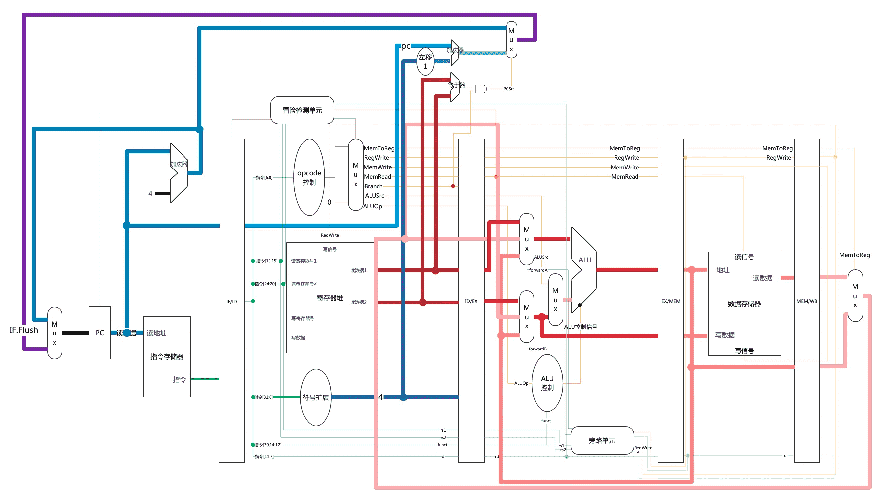

#### 流水线控制

| 流水线级别             | 寄存器 | 控制                              | 标识 | 描述                                                         |
| ---------------------- | ------ | --------------------------------- | ---- | ------------------------------------------------------------ |
| 取址                   | -      | 无特别控制                        | -    | 写PC控制信号、读存储器信号总有效                             |
| 指令译码<br />读存储器 | IF/ID  | 无特别控制                        | -    | 源寄存器总是在相同位置                                       |
| 执行/地址计算          | ID/EX  | ALUOp<br />ALUSrc                 | EX   | ALUOp：和 funct字段一起决定ALU操作。<br />ALUSrc：决定ALU的第二个输入是寄存器2还是符号扩展数。 |
| 存储器访问             | EX/MEM | Branch<br />MemRead<br />MemWrite | M    | Branch：控制PCSrc的值，决定PC的写回值。<br />MemRead：存储器读信号。<br />MemWrite：存储器写信号。 |
| 写回                   | MEM/WB | MemToReg<br />RegWrite            | WB   | MemToReg：决定将ALU结果或者存储器值写回寄存器。<br />RegWrite：写入寄存器信号。 |

#### 数据冒险

##### 旁路与前递

###### 冒险情况

> 通过寄存器号来判断。

| 冒险情况 | 条件<br />第一部分是寄存器名称，第二部分是字段名称 | 描述                                                         |
| -------- | -------------------------------------------------- | ------------------------------------------------------------ |
| 1a       | EX/MEM.RegisterRd = ID/EX.RegisterRs1              |  |
| 1b       | EX/MEM.RegisterRd = ID/EX.RegisterRs2              | 同1a                                                         |
| 2a       | MEM/WB.RegisterRd = ID/EX.RegisterRs1              | 同2b                                                         |
| 2b       | MEM/WB.RegisterRd = ID/EX.RegisterRs2              |  |

- **WB级的冒险由寄存器堆实现复杂旁路。**

###### 冒险输出信号

> 可以在ALU输入时增加两个多选控制器来决定输入的值。

| 多选器       | 多选器信号 | 源     | 解释                                                         |
| ------------ | ---------- | ------ | ------------------------------------------------------------ |
| Forward[A/B] | 00         | ID/EX  | 第【一/二】个ALU操作数来自寄存器堆                           |
| Forward[A/B] | 10         | EX/MEM | 第【一/二】个ALU操作数由上一个ALU运算结果旁路获得            |
| Forward[A/B] | 01         | MEM/WB | 第【一/二】个ALU操作数从数据存储器或者前面的ALU结果旁路中获得。 |

###### 冒险信号算法

- **EX冒险**

  ```c
  if (
      EX/MEM.RegWrite 
      and (EX/MEM.RegisterRd != 0) 
      and (EX/MEM.RegisterRd == ID/EX.RegisterRs[1|2])
  )
      Forward[A|B] = 10
  ```

- **MEM冒险**

  ```c
  if (
  	MEM/WB.RegWrite 
  	and (MEM/WB.RegisterRd != 0) 
      and (MEM/WB.RegisterRd == ID/EX.RegisterRs[1|2])
  )
  	Forward[A|B] = 01
  ```

  - **特殊情况**

    ```assembly
    add x1, x1, x2
    add x1, x1, x3
    add x1, x1, x4
    ```

    > 此时第三个add 应该用第二个add的ALU输出而不是第一个的ALU输出。

    ```c
    if (
    	MEM/WB.RegWrite 
    	and (MEM/WB.RegisterRd != 0) 
    	and not(
        	EX/MEM.RegWrite 
        	and (EX/MEM.RegisterRd != 0) 
       		and (EX/MEM.RegisterRd == ID/EX.RegisterRs[1|2])
       	)
        and (MEM/WB.RegisterRd == ID/EX.RegisterRs[1|2])
    )
    	Forward[A|B] = 01
    ```

##### 停顿

###### 冒险情况

当一条指令试图读取一个由前一条装载指令读入的寄存器无法使用旁路解决数据冒险。


###### 停顿方式

1. 加入冒险检测单元，工作在ID级运行前。检测方式详见：**冒险检测**。
2. 保持当前指令向后不再执行，方式是加入**空指令**，可以将所有控制信号都置为0【所有的寄存器和存储器都不进行写操作】。
3. 保持 PC寄存器 和 **IF/ID寄存器** 的值不变，让当前指令重新执行IF阶段。


###### 冒险检测

```c
if (
    ID/EX.MemRead 
    and (
        (ID/EX.RegisterRd == IF/ID.RegisterRs1)
    	or (ID/EX.RegisterRd == IF/ID.RegisterRs2)
    )
)
    // 停一下
```

#### 控制冒险

##### 缩短分支延迟

- 将计算从 EX级 提到 ID级。
  - 计算分支目标地址。
  - 判断分支条件。

- 只需要清除后面一条指令，加入IF.Flush控制信号，将指令字段置0。

##### 动态分支预测

>  通过 **分支预测缓存** 查找指令的地址观察上一次上一次执行该指令时分支是否发生。

- **分支预测缓存**：分支历史表，按照分支指令的低位地址定位的小容量存储器，包含一个或多个比特以表明一个分支最近是否发生了跳转。

## 指令级并行【ILP】

### 提高指令级并行度的方法

- 增加流水线级数。
- **多发射**：增加流水线内部的功能数量，一个时钟周期内可以发射多条指令。

### 静态双发射流水线

> 使用大指令合并两条指令。

- **指令**：
- **数据通路**：


### 动态流水线调度

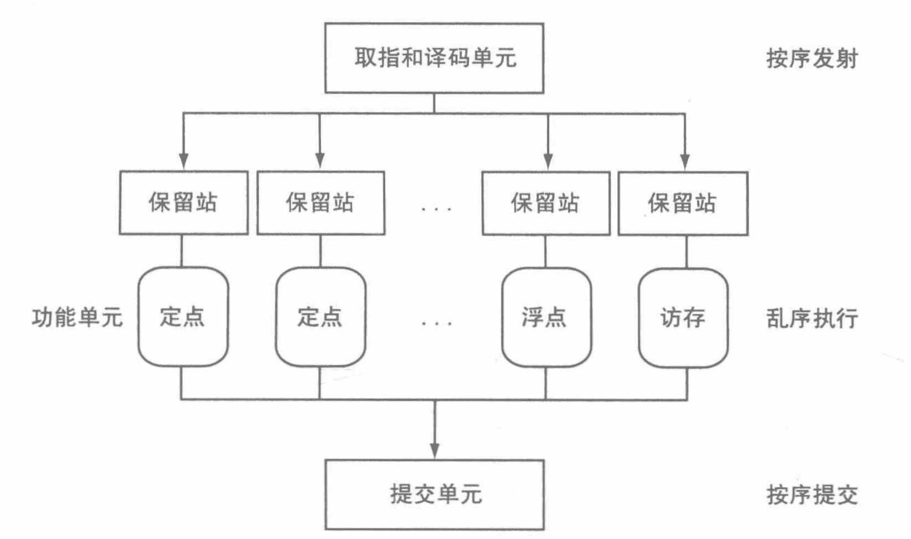

- **组成**

  - **取指和发射单元**
  - **多功能单元**
    - **保留站**：功能部件前的缓冲区，用来存放指令的操作和所需操作数。

  - **提交单元**：动态调度或乱序执行的流水线中判定指令何时提交的功能单元。指令一旦被提交，将会更新程序员可见的寄存器和存储器。
    - **重排序缓冲**：动态调度处理器用来保存指令执行结果的缓冲区。一旦指令确认将被提交，将会把缓冲区的结果写入内存或寄存器中。

- **执行步骤**

  1. 发射指令时，指令会被拷贝到相应功能单元的保留站中。

     > 同时，如果指令所需的操作数已准备好，也会从寄存器堆或者重排序缓冲中拷贝到保留站中。
     >
     > 指令会一直保存在保留站中，直到所需的操作数全部准备好，并且相应功能部件可用。
     >
     > 对于处在发射阶段的指令，由于可用操作数已被拷贝至保留站中，他们在寄存器中的副本就无需保存了，如果出现相应寄存器的写操作，那么该寄存器中的数值将被更新。

  2. 如果操作数不在寄存器堆或者重排序缓冲中，那它一定在等待某个功能单元的计算结果。

     > 该功能单元的名字将被记录。
     >
     > 当最终结果计算完毕，将会直接从功能单元拷贝到等到该结果的保留站中，旁路了寄存器堆。

# 存储器

- **陷阱**：在写程序或编译器生成代码时忽略存储系统的行为。

- **陷阱**：在模拟cache的时候，忘记说明字节编址或cache块大小。

- **陷阱**：对于共享cache，组相联度少于核的数量或者共享该核cache的线程数。

- **陷阱**：用存储器平均访问时间来评估乱序存储器的存储器层次结构。【需要模拟乱序处理器】

- **陷阱**：通过在未分段地址空间的顶部增加段来扩展地址空间。

- **谬误**：实际的磁盘故障率和规格书中声明的一致。

  > 实际大约是规格书上的6倍之多。

- **谬误**：操作系统是调度磁盘访问的最好地方。

  > 由于磁盘知道逻辑地址被映射到扇区、磁道上以及磁面上的实际物理地址，通过调度可以减少旋转以及寻道的时间。

- **陷阱**：在不为虚拟化设计的指令系统体系结构上实现虚拟机监视器。

  > 虚拟化产生问题的18条指令。
  >
  > | 问题种类                                                  | x86问题指令                                                  |
  > | --------------------------------------------------------- | ------------------------------------------------------------ |
  > | 当运行在用户模式时，<br />访问敏感寄存器无内陷中断        | 存储全局描述符表寄存器【SGDT】<br />存储局部描述符表寄存器【SLDT】<br />存储中断描述符表寄存器【SIDT】<br />存储机器状态字【SMSW】<br />标志入栈【PUSHF、PUSHFD】<br />标志出栈【POPF、POPFD】 |
  > | 在用户模式下访问虚拟存储机制时，<br />x86保护检查指令失效 | 从段描述符获取访问权限【LAR】<br />从段描述符获取段的边界【LSL】<br />如果段描述符可读，进行读校验【VERR】<br />如果段描述符可写，进行写校验【VERW】<br />段寄存器出栈【POP CS，POP SS，...】<br />段寄存器入栈【PUSH CS，PUSH SS，...】<br />远调用不同的特权级【CALL】<br />远返回至不同的特权级【RET】<br />远跳转至不同的特权级【JMP】<br />软中断【INT】<br />存储段选择寄存器【STR】<br />移入/移出段寄存器【MOVE】 |

## 名词解释

- **局部性原理**：principle of locality。
  - **时间局部性**：如果某个数据项被访问，那么在不久的将来它可能再次被访问。
  - **空间局部性**：如果某个数据项被访问，与它地址相邻的数据项可能很快也被访问。
- **存储器层次结构**：多级存储采用的结构，与处理器的距离越远，存储的容量越大，访问速度越慢。
  - **块或行**：在缓存中存储信息的最小单位。
  - **命中【hit】**：处理器所需的数据在本层的存储中找到。
  - **失效【miss】**：处理器所需的数据不在本层的存储中，将访问下一级存储。
  - **命中率**：在访问某个存储器层次时命中的次数占总访问次数的比例。
  - **失效率**：在访问某个存储器层次时失效的次数占总访问次数的比例。
  - **命中时间**：访问某个存储器层次所需要的时间，包括判断命中或失效的时间。
  - **失效损伤**：将数据块从下层存储复制到某层所需的时间，包括数据块的访问时间、传输时间、写入目标层的时间和将数据块返回给请求的时间。
- **cache**：一个隐藏或存储信息的安全场所。
  - **分离的cache**：某一级存储由两个独立的 cache 组成，一个处理指令访存，一个处理数据访存，两个可以同时被使用。
  - **失效率**：分为指令失效率、数据失效率和综合失效率。
  - **全局失效率**：对于多级cache，在全部cache层次上失效的访问数目所占比例。
  - **局部失效率**：对于多级cache，在某一cache层次上失效的访问数目所占比例。
  - **块**：cache中，每块缓存的大小。

- **服务可靠性**
  - **服务完成**：交付的服务与需求相符。
  - **服务中断**：交付的服务与需求不符。
  - **可靠性**：系统能够持续提供用户需求的服务的度量。
  - **可用性**：指系统正常工作时间在连续两次服务中断间隔时间中所占的百分比。 = MTTF / (MTTF + MTTR)
  - **平均无故障时间**：MTTF
  - **年度失效率**：AFR，指给定 MTTF 一年内预期的器件失效百分比。
  - **平均修复时间**：MTTR，衡量服务中断。
  - **平均失效间隔时间**：MTBF = MTTF + MTTR

- **虚拟化**
  - **虚拟存储**：一种将主存看做辅助存储的『cache』技术。主存也可以为通常由磁盘实现的辅助存储充当『cache』。
  - **物理地址**：主存的地址。
  - **保护**：一种保护机制，确保共享处理器、内存、I/O设备的多个进程之间没有故意地、无意地读写其他进程，这些保护机制可以讲操作系统和用户的进程隔离开来。
  - **虚拟地址**：虚拟空间的地址，当访问内存时需要通过地址映射转换为物理地址。
  - **地址转换**：也称为地址映射。访问内存时将虚拟地址映射为物理地址的过程。
  - **段式存储**：一种可变长度的地址映射策略，其中每个地址由两部分组成：映射到物理地址的段号和段内偏移。
  - **页表**：在虚拟存储系统中，保存着虚拟地址和物理地址之间转换关系的表。页表保存在内存中，通常使用虚拟页号来索引，如果这个页在内存中，页表中的对应项包含该页对应的物理页号。
  - **页表寄存器**：硬件包含一个指向页表首地址的寄存器。
  - **交换区**：为进程的全部虚拟空间所预留的磁盘空间。
  - **引用位**：也称为使用位。每当访问一个页面时，该位被置位，通常用来实现LRU或其他替换策略。

- **快表【TLb】**：**地址转换cache**，用于记录最近使用地址的映射信息的cache，从而可以避免每次都要访问页表。
  - **虚拟地址cache**：一种使用虚拟地址而不是物理地址访问的cache。
  - **别名**：两个地址访问同一个目标的情况，一般发生在虚拟地址中两个虚拟地址对应同一个物理页中。
  - **物理寻址cache**：使用物理地址寻址的cache。

- **保护**
  - **管理模式**：也称为内核模式，是一种运行操作系统进程的模式。
  - **系统调用**：将控制权从用户模式转换到管理模式的特殊指令，触发进程中的一个异常例程。
  - **上下文切换**：将允许另一个不同的进程使用处理器，改变处理器内部的状态，并保存当前进程返回时需要的状态。
  - **可重启指令**：一种在异常被处理之后能从异常中恢复而不会影响指令的执行结果的指令。
  - **使能例外**：也称为中断使能，用于控制处理器是否响应异常的信号或动作；在处理器安全地保存重启所需信息之前，必须组织例外的发生。

- **3C模型**：将所有的cache失效都归为三种类型的cache模型，三类分别为**强制失效**、**容量失效**和**冲突失效**。因其三类名称的英文单词首字母均为C而得名。
  - **强制失效**：也称为冷启动生效。对没有在cache中出现过的块进行第一次访问时产生的失效。
  - **容量失效**：由于cache在全相联时都不可能容纳所有请求的块而导致的失效。
  - **冲突失效**：也称为**碰撞失效**。在组相联或者直接映射cache中，很多块为了竞争同一个组导致的失效，这种失效在使用相同大小的全相联cache中不存在。

- **错误共享**：当两个不相关的共享变量位于同一个缓存块中时，即使处理器正在访问不同的变量，也会在处理器之间交换完整的块。
- **非阻塞cache**：允许处理器在处理前面的cache缺失时仍可以访问cache。
- **预取**：使用特殊指令将未来可能用到的指定地址cache块提前搬到cache中的一种技术。

## 存储器技术

| 存储器技术           | 典型访问时间【ns】 | 2012年每GiB的价格【美元】 |
| -------------------- | ------------------ | ------------------------- |
| SRAM【静态随机存取】 | 0.5 ~ 2.5          | 500 ~ 1000                |
| DRAM【动态随机存取】 | 50 ~ 70            | 10 ~ 20                   |
| Flash                | 5000 ~ 50000       | 0.75 ~ 1.00               |
| 磁盘                 | 5000000 ~ 20000000 | 0.05 ~ 0.10               |

- **SRAM**：是一种组织成存储阵列结构的简单集成电路，一个存储单元通常由 6 ~ 8 个晶体管组成，但当今处理器芯片集成了多层次cache，因此 SRAM 芯片几乎消失了。

- **DRAM**：使用电容保存电荷的方式来存储数据。

  > - 由于电容会漏电，因此必须周期性刷新，所以是动态存储。
  > - 译码器使用行列地址。如果用单译码器，选通线很多。工程难度大。
  > - **刷新**
  >   - 频率：2ms。
  >   - 每次刷新：以行为单位，每次刷新一行。
  >   - 刷新方式：读出一行再重新写入。
  >   - **刷新方式**
  >     - **分散刷新**：对每行的刷新分散到各个工作周期中，每个工作周期前半部分用于正常读写，后半部分用于刷新一行。
  >     - **集中刷新**：利用一段固定时间，依次对存储器的所有行进行逐一再生，存储周期不变，在刷新时间内停止对存储器的访问，称为死时间。
  >     - **异步刷新**：避免cpu连续等待过长时间，每隔一段周期刷新一行。

- **闪存**：电可擦除的可编程只读存储器。

  > 写操作会使存储位损耗，由控制器将写入很多次的块写入次数较少的块，称为损耗均衡。

- **磁盘**

  - **磁道**：位于磁盘表面的数万个同心圆环中的任意一个圆环称为一个磁道。
  - **扇区**：构成磁盘上磁道的基本单位，是磁盘上数据读写的最小单位。
  - **寻道**：把读写磁头移动到磁盘上适当的磁道上面的过程。
  - **旋转延时**：在磁头定位后，指定扇区通过读写头的所需时间。通常是磁盘转动一周时间的一半。

## 集成虚拟存储、TLB和内存

- **失效情况**

  | TLB  | 页表 | cache | 发生情况                                                     |
  | ---- | ---- | ----- | ------------------------------------------------------------ |
  | 命中 | 命中 | 失效  | 可能，TLB命中不会检查页表                                    |
  | 失效 | 命中 | 命中  | TLB失效，但是在页表中找到了这一项，重试后在cache中找到了数据 |
  | 失效 | 命中 | 失效  | TLB失效，但是在页表中找到了这一项，重试后在cache中没有找到数据 |
  | 失效 | 失效 | 失效  | TLB失效，接着发生缺页失效，重试后，在cache中没有找到数据     |
  | 命中 | 失效 | 失效  | 不可能，如果页没有在内存中，TLB中没有此转换                  |
  | 命中 | 失效 | 命中  | 不可能，如果页没有在内存中，TLB中没有此转换                  |
  | 失效 | 失效 | 命中  | 不可能，如果页没有在内存中，数据不允许在cache中存在          |

- **设计参数**

  |                 特征                  | 一级cache的典型值 | 二级cache的典型值 |   页式存储的典型值   | TLB的典型值 |
  | :-----------------------------------: | :---------------: | :---------------: | :------------------: | :---------: |
  |              块的总大小               |    250 ~ 2000     |   2500 ~ 25000    |    16000 ~ 250000    |  40 ~ 1-24  |
  |           以KiB计量的总容量           |      16 ~ 64      |    125 ~ 2000     | 1000000 ~ 1000000000 |  0.25 ~ 16  |
  |              块的字节数               |      16 ~ 64      |     64 ~ 128      |     4000 ~ 64000     |   4 ~ 32    |
  |           失效代价的周期数            |      10 ~ 25      |    100 ~ 1000     | 10000000 ~ 100000000 |  10 ~ 1000  |
  | 失效率【二级cache失效】<br />全局失效 |      2% ~ 5%      |     0.1% ~ 2%     |  0.00001% ~ 0.0001%  | 0.01% ~ 2%  |

- **设计变化**

  | 设计变化      | 对失效率的影响                                               | 可能对性能产生的负面影响                     |
  | ------------- | ------------------------------------------------------------ | -------------------------------------------- |
  | 增加cache容量 | 降低失效率                                                   | 可能延长访问时间                             |
  | 增加相联度    | 由于减少了冲突失效，降低了失效率                             | 可能延长访问时间                             |
  | 增加块容量    | 由于空间局部性，对很宽范围内变化的块大小，<br />降低了失效率 | 增加失效损失，<br />块太大还是会增大失效率。 |

### cache

#### 公式


$$
CPU时间 = (CPU执行的时钟周期数 + 等待存储访问的时钟周期数) * 时钟周期
$$

$$
等待存储访问的时钟周期数 = 读操作带来的停顿周期数 + 写操作带来的停顿周期数
$$

$$
读操作带来的停顿周期数 = (读操作数目 / 程序) * 读失效率 * 读失效代价
$$

$$
写操作带来的停顿周期数 = (写操作数目 / 程序) * 写失效率 * 写失效代价 + 写缓冲满时的停顿周期
$$

$$
【写穿透（读写代价相同）】：等待存储访问的时钟周期数 = (访存操作数目 / 程序) * 写失效率 * 写失效代价
$$

#### 访问方式

##### 直接映射

> 一种cache结构，其中每个存储地址都映射到cache中确定位置。

$$
cache地址 = (块地址) mod (cache 中的数据块数量)
$$

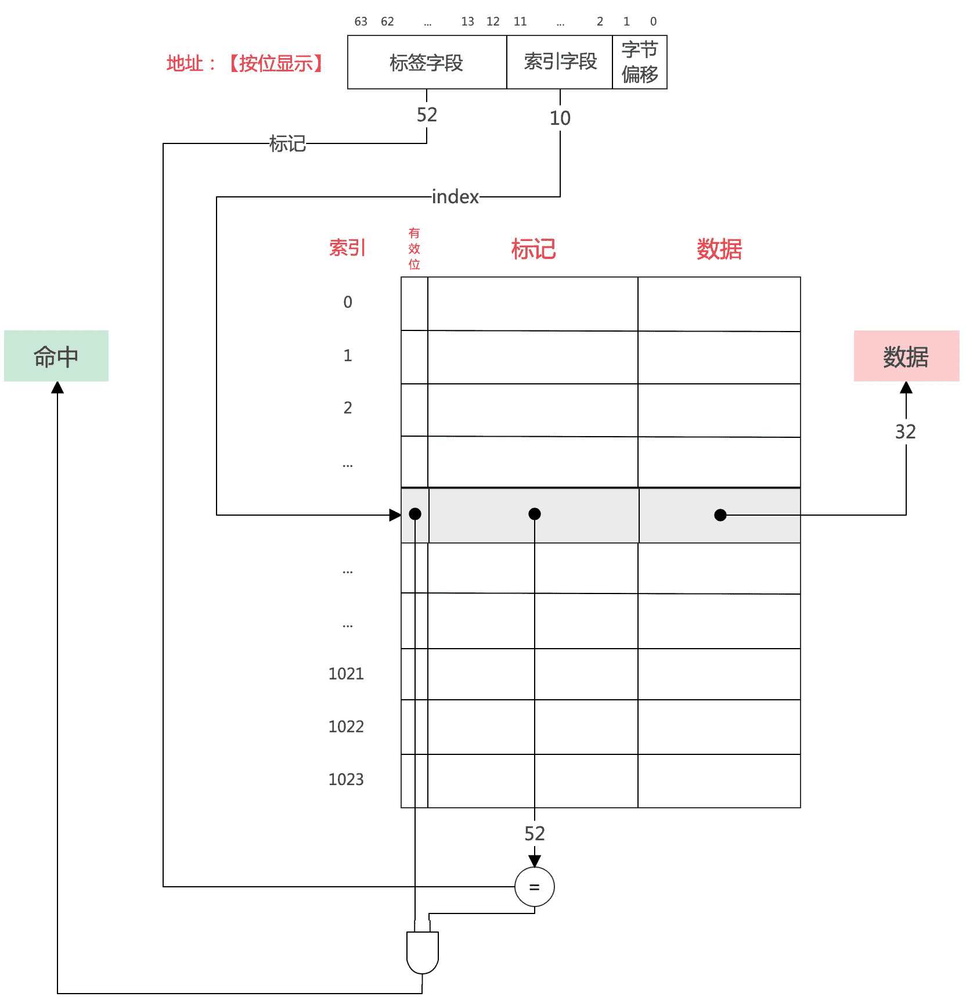

- **标签**：存储层次中的表项位，用来记录对应请求字的地址信息，这些信息用来确定所需数据块是否在该存储层次中。
- **有效位**：存储层次中的表项位，用来表示该层次的对应数据块中是否保存了有效数据。
- **真实总容量**：2<sup>n【10】</sup> * (单个数据块容量【32】+ 标签字段大小【52】+ 有效位大小【1】)。
- **命名**：一般只考虑数据的大小，不考虑标签和有效位大小，所以叫 `4KiB cache`。

###### 处理失效

1. 将PC的原始值【当前PC - 4】发送到内存。
2. 对主存进行读取操作，等待主存完成本次访问。
3. 写cache表项，将从内存中获得的数据写入该表项的数据部分，将地址的高位写入标签字段，并将有效位置为有效。
4. 重启指令执行。这将会重新取址，本次取址将在指令cache中命中。

##### 全相联

> cache 的一种组织结构，数据块可以存储在cache的任意位置。虚拟存储系统使用全相联。

- **缺点**：不能直接寻址，需要挨个查找。
- **优点**
  - 全相联有优越性，因为失效代价非常高。
  - 全相联允许软件使用复杂的替换策略以降低失效率。
  - 全相联很容易索引，不需要额外的硬件，也不需要进行查找。

##### 组相联：介于直接映射和全相联

> cache 的一种组织结构，每个数据块在 cache 中存放的位置数量具有固定值【至少为2】。

$$
数据组号 = (块地址) mod (cache 中的组数)
$$


> 四路组

###### 处理失效【淘汰方式】

- 在**cache**中，替换用硬件实现，所以用随机替换策略。

  > 通过跟踪某个数据块相对于组内其他数据块的使用时间来实现。

- **LRU**：**最近最少使用**，**Least Recently Used**。最长时间未被使用的数据块将被替换。方案实现复杂，在虚拟存储中用。

#### 写操作

> 有三种策略

##### 写穿透或写直达

> 一种写策略。写操作总是同时更新cache和下一级存储，保证两者之间的数据一致。

- **缺点**：性能不佳。每次写操作需要100个处理器时钟周期。

##### 写缓冲

> 一个保存等待写入主存的数据的队列。数据写入cache的同时也写入写缓冲中。当写入主存的操作完成后，写缓冲中的表项将被释放。如果写缓冲满了，处理器必须停顿流水线，直到写缓冲中出现空闲表项。

- **缺点**：还是会产生停顿。主存写速度小于处理器产生写操作的速度时，缓冲无济于事。
- **优点**
  - 失效比较简单，代价也比较小，因为不需要将块写回存储层次结构中的较低层。
  - 比写返回容易实现，尽管也需要缓冲区。

##### 写返回

>  处理写操作时，只更新cache中对应数据块的数值。当该数据块被替换时，再将更新后的数据块写入下一级存储。

- **优势**
  - 处理器可以按cache而不是按内存能接收的速率写单个的字。
  - 块内的多次写操作只需对存储层次结构中的较低层进行一次写操作。
  - 当写回块时，由于写一整个块，系统可以有效的利用高带宽传输。

#### 性能优化

##### 多级cache

> 一种有多级cache的存储结构，区别于只有一个cache和主存的结构。

受限的芯片面积和更高的时钟频率设计目标阻碍了一级cache的容量扩大，可以在二级cache上做文章。

通常二级cache的容量比一级大10倍。访问时钟周期通常小于10。

##### 软件优化

> 通过指令重排序，让内存能够按块儿访问，避免重复的载入内存和淘汰内存。


#### 可靠性

##### 提高MTTF的办法

1. **故障避免技术**：通过合理构建系统来避免故障的出现。
2. **故障容忍技术**：使用冗余技术，即使出现故障，仍然可以按照需求服务。
3. **故障预测技术**：预测故障的出现和构建，从而允许在器件故障前进行替换。

##### 汉明编码

> 纠正一位错、检测两位错。

- **汉明不等式**：2<sup>r</sup> > k + r + 1。 k是数据位数，r是校验位数。

- **纠正一位错**

  1. 从左到右由1开始依次编号。

  2. 将编号为2的整数幂的位标记为奇偶校验位【1、2、4、8...】。

  3. 剩余其他位用于数据位【3、5、6、7、9、10、11、12、13、14、15...】。

  4. 奇偶校验位的位置决定了其对应的数据位。

     1. 校验位1【0001】检查 1【0001】、3【0011】、5【0101】、7【0111】等位，这些位的最右一位编号为1。
     2. 校验位2【0010】检查 2【0010】、3【0011】、6【0110】、7【0111】等位，这些位的最右二位编号为1。
     3. 以此类推。。。

  5. 设置奇偶校验位，个数为奇数校验位置1，否则置0。

     > 举例：**原数据**【10011010】
     >
     > - 汉明不等式得校验位为4。
     > - _ _ 1 _ 0 0 1 _ 1 0 1 0。
     > - 填补校验位：<u>0</u> <u>1</u> 1 <u>1</u> 0 0 1 <u>0</u> 1 0 1 0。

  6. 将校验位和其校验的数据位全部异或，得到的值比为0，因为有偶数个1。

     > 如果有一位错误，则异或值为1。而且错误的数据位的位置和校验位有关。

  7. 将所有的异或值从右向左排好，得到的数即为错误的位。直接取反改正即可。

- **检测两位错**：再添加一位奇偶校验位【P用于计算整个字的奇偶】。再计算全组的奇偶校验位的奇偶性【H】。

  1. H为偶且P为偶，表示没有错。
  2. H为奇且P为奇，发生了一位可纠正错误。
  3. H为偶且P为奇，表示仅P位出错了。
  4. H为奇且P为偶，表示发生了两位错。

#### cache一致性：并行

##### 带来一致性问题：迁移&复制

- **迁移**：数据项可以移动到本地cache并以透明的方式使用。迁移减少了访问远程的共享数据项的延迟，也减少了共享存储器的带宽需求。
- **复制**：当同时读取共享数据时，cache会在本地cache中创建数据项的副本。复制减少了读取共享数据项的访问延迟和争用。

##### 基于监听的cache一致性

*写失效*：处理器在写入一个数据项时，使其他cache中的副本失效。强制实现了写操作串行化。

#### 简单的cache控制


- **空闲**：等待处理器发出有效读或写信号，之后有限状态自动机跳转到标签比较状态。
- **标签比较**：检测读或写请求是命中还是失效。
- **写返回**：由标签和cache索引组成的地址将块写回存储器。等写操作完成后，自动跳转到分配状态。
- **分配**：从存储器中取出一个新块。等操作完成后，自动跳转到标签比较状态。

### 虚拟机

支持虚拟机的软件被称为 *虚拟机监视器【VMM】* 和 *管理程序*。*VMM* 是虚拟机技术的核心。

#### 必须要做的事情

- 客户端软件应该像本地硬件一样在虚拟机上运行。
- 客户端软件不能直接改变实际系统资源的分配。
- 至少有两种处理器模式：系统模式和用户模式。
- 特权指令集合只能在系统模式下使用，如果在用户模式下执行将会陷入内陷；所有系统资源只能通过这些指令控制。

#### 优点

1. **隔离和安全**。
2. **管理软件**：提供一个可以运行整个软件堆的抽象。
3. **管理硬件**：使分离的软件堆独立运行，但共享硬件。

### 虚拟存储

#### 设计决策

- 页应该足够大以分摊长访问时间。
- 能降低缺页失效率的组织结构很有吸引力。
- 缺页失效可以由软件处理，因为与磁盘访问时间相比，这样开销会很小。软件可以用巧妙的算法来选择如何放置页面，只要失效率减少很小一部分就足以弥补算法的开销。
- 写穿透策略对于虚拟存储不合适，因为写入时间过长。

#### 页表

- **页查找**：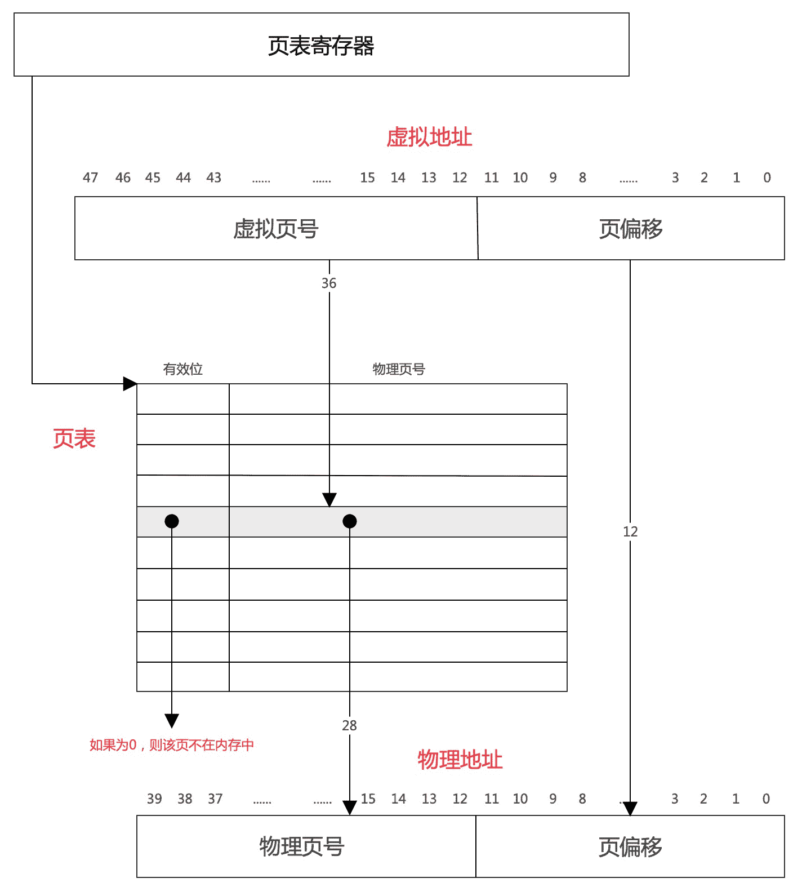

- **缺页失效**：

  1. 操作系统在创建进程时为所有页面在闪存或磁盘上创建空间。这个空间称为交换区。

  2. 创建一个数据结构记录每个虚拟页在磁盘上的存储位置。【**可以是页表的一部分，也可以是具有与页表相同索引方式的辅助数据结构**】。

  3. 创建一个数据结构用于跟踪每个物理地址的是哪些进程和哪些虚拟地址。

  4. 发生缺页失效时，如果内存中所有页都正在使用，操作系统通过 **LRU** 算法替换。

##### 页表地址空间

> 对于 4KiB 大小的页，如果虚拟地址是 48 位，并采用单级页表，则页表有 640亿【2<sup>36</sup>】个表项，RISV-C 每个页表项中为8个字节，因此页表就需要 0.5TiB 的存储空间，如果每个进程都有页表，内存无法承受。

有五种技术从两个角度解决问题：1. 减少存储页表所需的最大存储空间；2. 减少用于存放页表的存储空间。

1. 保留界限寄存器，限制给定进程的页表大小。如果虚拟页号大于界限寄存器的值，那么表项才被添加到页表。

   > 页表随进程消耗空间的增多而增长。

2. 允许地址空间只朝一个方向增长并不够，因为堆栈。要使用两个单独的页表和界限寄存器。段的大小以页为单位增长。

3. 对虚拟地址应用哈希函数，使页表容量等于主存中物理页的数量。【**反向页表**】。查找过程比较复杂。

4. 为减少页表占用的实际主存，大多数现代系统允许页表再分页。

5. 多级页表也可以减少页表存储的总量，这是 RISC-V 采用的方案，采用树型查找。以稀疏的方式访问地址空间，不必分配整个页表。

   > 

   - **缺点**：地址转换复杂。

##### 页写入

使用写回策略：向页表中添加一个脏位，当一页中任何字被写入时，脏位被置位。如果操作系统要替换某一页，脏页指示在该页所占内存让给另一页之前，是否需要将该页写回磁盘。

- **优点**
  - 写穿透会阻塞CPU，时钟周期较长【磁盘可能需要数百万个时钟周期】，不可行。
  - 将页复制回磁盘的效率高于单个字写回。

##### 缺页失效

- **处理过程**
  - 使用虚拟地址找到对应的页表表项，并在辅助存储中找到引用页的位置。
  - 选择要替换的物理页；如果所选页是脏的，则必须先将其写入辅助内存，才能将新的虚拟页写到此物理页中。
  - 启动读操作，将被访问的页从磁盘上取回到所选择的物理页的位置上。【花费数百万个时钟周期】
- **很难处理**
  - 发生在指令的中间，和指令缺页失效不同。
  - 在异常处理结束之前无法完成指令。
  - 异常处理结束后，指令必须重新启动，就像什么都没发生过一样。

#### TLB

> 是一个硬件，作为页表的cache，存放映射到物理页的项，包含页表中的虚拟页。

- **架构图**：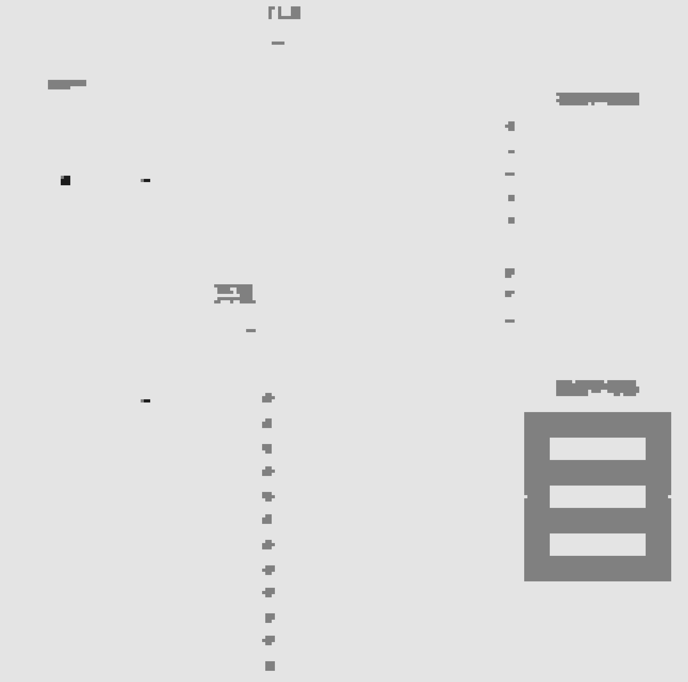

  > 标签字段用于匹配进程ID，页表在进程中，因此不需要标签字段。

- **作用**

  - 因为页表存储在内存中，因此每个访存请求需要两次访存，用来追踪最近使用过的地址转换。

- **转换过程**

  1. 每次引用时，在TLB中查找虚拟页号。

  2. 如果命中，则使用物理页号来形成地址，相应的引用位被置位。

  3. 如果处理器执行写操作，那么脏位也会被置位。

  4. 如果TLB失效，需要确定是缺页失效还是TLB失效。

     - **TLB失效**：将最后一级页表中的地址转换加载到TLB中。

     - **缺页失效**：处理器调用操作系统的异常处理。

- **典型值**

  - **TLB大小**：16 ~ 512个表项。
  - **块大小**：1 ~ 2 个页表项【通常 4 ~ 8 个字节】
  - **命中时间**：0.5 ~ 1个时钟周期。
  - **失效代价**：10 ~ 100 个时钟周期。
  - **失效率**：0.01% ~ 1%。

##### Intrinsity FastMath TLB

- **架构图**：
- **流程图**


##### TLB失效

- **失效场景**
  - 页在内存中，只需创造较少的TLB表项。
  - 页不在内存中，需要将控制转移给操作系统来处理缺页失效。
- **处理**
  - 必须在访存发生的同一个时钟周期的末尾被判定，这样下一个时钟周期将开始执行异常处理而不是正常执行指令。
  - 如果未识别出缺页失效，load指令可能会改写寄存器，可能是灾难性的错误。

#### 保护

> 硬件要提供三个基本能力。

1. **至少支持两种模式**：指示正在运行的进程是用户进程还是操作系统进程，操作系统进程也可称为管理态进程、内核进程或主管进程。

2. **提供用户进程可读但不能写的一部分处理器状态**。包括用户/管理程序模式位、页表指针和TLB。为了写这些结构，操作系统仅在管理态下可用的特殊指令进行操作。

3. **提供能让处理器在用户态和管理态之间相互转换的机制**

   > - **用户->管理**：由特殊指令【**ecall**】将控制转移到管理态的代码空间的指定位置。系统调用处的程序计数器中的值被保存在管理态异常程序计数器【**SPEC**】中，并且处理器被置于管理态。
   > - **管理->用户**：使用管理态异常返回【**sret**，supervisor exception return】指令，将重置为用户模式，并跳转到【**SPEC**】中的地址。

##### 上下文切换

将进程P1切换到P2时，必须保证P2不能访问P1的页表，有两种方式。

- 清除属于P1的TLB表项，并迫使TLB载入P2的表项。

- 添加进程标识符或任务标识符【ASID，8位】来扩展虚拟地址空间，进程标识符和TLB的标签部分连接，减少TLB刷新。

# 并行处理器

- **谬误**：Amdahl定律不适用于并行计算机。
- **谬误**：峰值性能可代表实际性能。
- **陷阱**：在利用和优化多处理器体系结构时不开发软件。
- **谬误**：可以在不提升存储器带宽的前提下得到好的向量计算性能。

## 名词解释

- **多处理器**：至少含有两个处理器的计算机系统。与之对应的概念是单处理器。
  - **集群**：通过局域网连接的一组计算机，起作用等同于一个大型的多处理器。
  - **多核微处理器**：在单一集成电路上包含多个处理器【核】的微处理器。基本上目前所有的台式机和服务器都是多核微处理器。
  - **共享内存处理器**：共享一个物理地址空间的并行处理器。
- **并行**
  - **任务级并行【进程级并行】**：通过同时运行独立程序的方法来利用多处理器。
  - **并行处理程序【并行软件】**：同时运行在多个处理器上的单一程序。
  - **比例缩放**
    - **强比例缩放**：在多处理器上不需增加问题规模即可获得的加速比。
    - **弱比例缩放**：在多处理器上增加处理器数量的同时按比例增加问题规模所能获得的加速比。
- **并行硬件**
  - **SISD**：单指令流单数据流的单处理器。
  - **MIMD**：多指令流多数据流的多处理器。
    - **SPMD**：单程序多数据流。传统的**MIMD**编程模型，其中一个程序运行在所有处理器之上。
  - **SIMD**：单指令多数据流。同样的指令在多个数据流上操作，入子字并行。
    - **数据级并行**：对不同数据执行相同操作所获得的并行。
- **向量通道**：一个或多个向量功能单元和一部分向量寄存器堆。受高速公路上的多车道提高交通速度的启发，利用多个通道同时执行向量操作。
- **硬件多线程**：通过在一个线程停顿时切换到另一个线程来提高处理器的利用率。
  - **线程**：包括程序计数器、寄存器状态和栈。线程是一个轻量级的进程，线程通常共享一个地址空间，而进程不共享。
  - **进程**：包括一个或多个线程、完整的地址空间和操作系统状态。因此，进程的切换通常需要调用操作系统，而线程切换则不用。
- **同步**：协调两个或多个进程行为的过程，这些进程可能在不同的处理器上运行。
- **锁**：一种同步机制，同一时刻仅允许一个处理器访问数据。
- **归约**：一种处理器结构并返回单个值的函数。
- **OpenMP**：一套支持共享内存多处理器的API，支持多平台多语言。
- **集群**：通过标准网络交换机上的 I/O 进行连接的计算机集合，以构成消息传递多处理器。
  - **消息传递**：通过显示发送和接收消息在多个处理器之间进行通信。
  - **发送消息例程**：在具有私有存储器的计算机处理器中使用的例程，用于将消息传递给另一个处理器。
  - **接收消息例程**：在具有私有存储器的计算机处理器中使用的例程，用于接收来自另一个处理器的消息。

## 公式

$$
改进后的执行时间 = 受影响的执行时间【并发时间】 / 改进量【核数】 + 未受影响的改进时间
$$

$$
加速比 = 1 / (1 - 受影响的执行时间比例) + 受影响的执行时间比例【并发比例】 / 改进量【核数】
$$

## SIMD：向量体系结构

### 向量属性

> 与标量【传统指令系统体系结构】相比。

1. 单个向量指令指定了大量工作——相当于执行了完整的循环。正因为这样，指令取指和译码带宽大大减少。
2. 通过使用向量指令，编译器或程序员确认了向量中的每个结果都是独立的，因此硬件无需再检查向量指令中的数据冒险。
3. 当程序存在数据级并行时，相比使用**MIMD**多处理器，使用向量体系结构和编译器的组合更容易写出高效的应用程序。
4. 硬件只需要在两条向量指令之间检查向量操作数之间的数据冒险，而无需检查向量中的每个数据元。减少检查的次数可以节省能耗和时间。
5. 访问存储器的向量指令具有确定的访问模式。如果向量中的数据元位置都是连续的，则可以从一组存储器中交叉访问数据块，从而快速获取向量。因此，对整个向量而言，主存储器的延迟开销看上去只有一次，而不是对向量中每个字都产生一次。
6. 因为整个循环被具有已知行为的向量指令所取代，所以通常由循环引发的控制冒险不再存在。
7. 与标量体系结构相比，节省的指令带宽和冒险检查以及对存储器带宽的有效利用，使得向量体系结构在功耗和能耗方面更具优势。

### 向量多通道

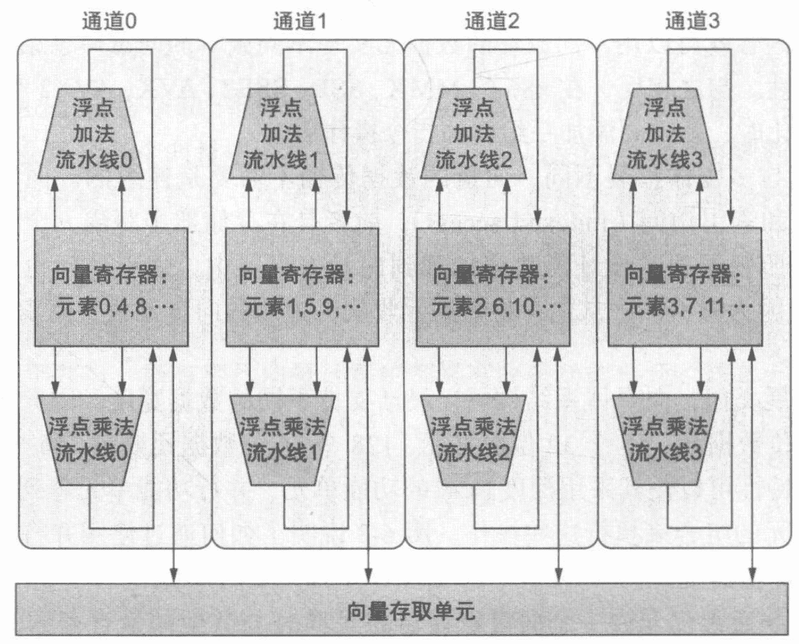

## 硬件多线程


> 三种标量的处理器执行情况。SMT 看起来有较高性能。

- **细粒度多线程**：硬件多线程的一种版本，在每条指令之后切换线程。
- **粗粒度多线程**：硬件多线程的一种版本，仅在重大事件之后才切换线程。
- **同时多线程【SMT】**：多线程的一个版本，通过利用多发射、动态调度的微体系结构的资源来降低多线程的成本。

## 共享内存处理器


- **两种处理器类型**
  - **统一内存访问**：一种单地址空间多处理器，无论哪个处理器访问存储器，存储器的访问延迟都大致相同。
  - **非统一内存访问**：一种单地址空间多处理器，存储器的访问延迟各不相同，具体取决于哪个处理器访问哪个存储。

## 图形处理单元：GPU

> 具有数百个并行浮点单元，一般和CPU比较。

- **特性**
  - GPU是作为CPU的补充器，因此不需要能够执行CPU上的所有任务。【可能在执行一些任务上性能很差，而且所有的资源都用于图形。】
  - GPU的问题规模通常为几百MB到GB，而不是几百GB到TB。
- **差异**
  - GPU不依赖多级cache消除内存长延时，CPU需要。
  - GPU的存储器面向带宽而不是延迟。
  - 每个GPU处理器都比传统CPU拥有更多线程，并且拥有更多的处理器。

## 集群、仓储级计算机和其他消息传递多处理器

- **集群**

  

- **仓储级计算机**：**W3C**
  - 大量、简单的并行性。
  - 计算运营成本。
  - 规模及与规模相关的机会和问题。

# 优化举例：矩阵乘法

## 普通编译

- **c程序**

  ```c
  // 前提，矩阵都是32 * 32
  void mm(double c[][], double a[][], double b[][]) {
      int i, j, k;
      for(i = 0; i < 32; i++) {
          for (j = 0; j < 32; j++) {
              for(k = 0; k < 32; k++) {
                  c[i][j] += a[i][k] * b[k][j];
              }
          }
      }
  }
  ```

- **编译程序**

  ```assembly
  # 寄存器入栈
  mm:		addi sp, sp, -32
  		sw x1, 24(sp)
  		sw x7, 16(sp)
  		sw x6, 8(sp)
  		sw x5, 0(sp)
  
  		li x28, 32				# 将32给到临时变量
  		li x5, 0				# i = 0
  		
  loop1:	li x6, 0				# j = 0
  
  loop2:	li x7, 0				# k = 0
  		sll x30, x5, 5			# 得到[i][0]字偏移量
  		add x30, x30, x6		# 得到[i][j]字偏移量
  		sll x30, x30, 3			# 得到字节偏移量，又因为每个元素占2字节，所以 * 4 * 2
  		add x30, x10, x30		# 得到c[i][j]基址
  		fld f0, 0(x30)			# 从基址处获取8个字节，存在f0中
  		
  loop3:	sll x29, x7, 5			# 得到[k][0]字偏移量
  		add x29, x29, x6		# 得到[k][j]字偏移量
  		sll x29, x29, 3			# 得到字节偏移量，又因为每个元素占2字节，所以 * 4 * 2
  		add x29, x12, x29		# 得到b[k][j]基址
  		fld f1, 0(x29)		
  		
  		sll x29, x5, 5			# 得到[i][0]字偏移量
  		add x29, x29, x7		# 得到[i][k]字偏移量
  		sll x29, x29, 3			# 得到字节偏移量，又因为每个元素占2字节，所以 * 4 * 2
  		addu x29, x11, x29		# 得到a[i][k]基址
  		fld f2, 0(x29)		
  		
  # 乘法
  		fmul.d f1, f2, f1
  		fadd.d f0, f0, f1
  		
  		addi x7, x7 1 			# k = k + 1
  		bltu x7, x28, loop3
  		fsd f0, 0(x30)
  		
  		addi x6, x6, 1			# j = j + 1
  		bltu x6, x28, loop2
  		
  		addi x5, x5, 1			# j = j + 1
  		bne x5, x28, loop1
  		
  # 恢复寄存器
  		lw x5, 0(sp)
  		lw x6, 8(sp)
  		lw x7, 16(sp)
  		lw x1, 24(sp)
  		addi sp, sp, 32
  		jr x1
  ```

## 子字并行

- **c程序**

  ```assembly
  #include <x86intrin.h>
  #define UNROLL (4)
  
  void dgemm(int n, double *A, double *B, double *C) {
      for(int i = 0; i < n; i+= UNROLL * 4) {
          for(int j = 0; j < n; j++) {
              __m256d c[4];
              for(int x = 0; x < UNROLL; x++) {
                  c[x] = _mm256_load_pd[C+i+x*4+j*n] 				// c[x] = C[i][j]
              }
              for(int k = 0; k < n; k++) {
                  __m256d b = _mm256_boardcast_sd(B + k + j*n); 	// b = B[k][j]
                  for(int x = 0; x < UNROLL; x++) {
                      c[x] = _mm256_add_pd(c[x] /* c[x] += A[i][k] * b */, _mm256_mul_pd(_mm256_load_pd(A + n*k + x*4 + i), b));
                  }
              }
              for(int x = 0; x < UNROLL; x++) {
                  _mm256_store_pd(C + i + x*4 + j*n, c[x]);		// C[i][j] = c[k]
              }
          }
      }
  }
  ```

- **编译程序**：循环部分。

  

## 指令级并行【循环展开】

- **c程序**：不变。

- **编译程序**

  

## cache分块

> cache分化通过调整代码实现。降低cache失效率。

- **c程序**

  ```c++
  #define BLOCKSIZE 32
  
  void do_blok(int n, int si, int sj, int sk, double *A, double *B, double *C) {
      for(int i = si; i < si + BLOCKSIZE; i++) {
          for(int j = sj; j < sj + BLOCKSIZE; j++) {
              double cij = C[i + j * n];
              for(int k = sk; k < sk + BLOCKSIZE; k++) {
                  cij += A[i + k*n] + B[k + j*n];
              }
              c[i + j*n] = cij;
          }
      }
  }
  
  void dgemm(int n, double *A, double *B, double *C) {
      for(sj = 0; sj < n; sj += BLOCKSIZE) {
          for(si = 0; si < n; si += BLOCKSIZE) {
              for(sk = 0; sk < n; sk += BLOCKSIZE) {
                  do_block(n, si, sj, sk, A, B, C);
              }
          }
      }
  }
  ```

## cache分块 + 并行

- **c程序**

  ```c++
  #include <x86intrin.h>
  #define UNROLL (4)
  #define BLOCKSIZE 32
  
  void do_blok(int n, int si, int sj, int sk, double *A, double *B, double *C) {
      for(int i = si; i < si + BLOCKSIZE; i+= UNROLL * 4) {
          for(int j = sj; j < sj + BLOCKSIZE; j++) {
              __m256d c[4];
              for(int x = 0; x < UNROLL; x++) {
                  c[x] = _mm256_load_pd[C+i+x*4+j*n] 				// c[x] = C[i][j]
              }
              for(int k = sk; k < sk + BLOCKSIZE; k++) {
                  __m256d b = _mm256_boardcast_sd(B + k + j*n); 	// b = B[k][j]
                  for(int x = 0; x < UNROLL; x++) {
                      c[x] = _mm256_add_pd(c[x] /* c[x] += A[i][k] * b */, _mm256_mul_pd(_mm256_load_pd(A + n*k + x*4 + i), b));
                  }
              }
              for(int x = 0; x < UNROLL; x++) {
                  _mm256_store_pd(C + i + x*4 + j*n, c[x]);		// C[i][j] = c[k]
              }
          }
      }
  }
  
  void dgemm(int n, double *A, double *B, double *C) {
      for(sj = 0; sj < n; sj += BLOCKSIZE) {
          for(si = 0; si < n; si += BLOCKSIZE) {
          	for(sk = 0; sk < n; sk += BLOCKSIZE) {
                  do_block(n, si, sj, sk, A, B, C);
              }
      	}
      }
  }
  ```

## 多处理器

- **c程序**

  ```c
  #include <x86intrin.h>
  #define UNROLL (4)
  #define BLOCKSIZE 32
  
  void do_blok(int n, int si, int sj, int sk, double *A, double *B, double *C) {
      for(int i = si; i < si + BLOCKSIZE; i+= UNROLL * 4) {
          for(int j = sj; j < sj + BLOCKSIZE; j++) {
              __m256d c[4];
              for(int x = 0; x < UNROLL; x++) {
                  c[x] = _mm256_load_pd[C+i+x*4+j*n] 				// c[x] = C[i][j]
              }
              for(int k = sk; k < sk + BLOCKSIZE; k++) {
                  __m256d b = _mm256_boardcast_sd(B + k + j*n); 	// b = B[k][j]
                  for(int x = 0; x < UNROLL; x++) {
                      c[x] = _mm256_add_pd(c[x] /* c[x] += A[i][k] * b */, _mm256_mul_pd(_mm256_load_pd(A + n*k + x*4 + i), b));
                  }
              }
              for(int x = 0; x < UNROLL; x++) {
                  _mm256_store_pd(C + i + x*4 + j*n, c[x]);		// C[i][j] = c[k]
              }
          }
      }
  }
  
  void dgemm(int n, double *A, double *B, double *C) {
  # pragma omp parallel for // OpenMP语句，使最外层的for循环并行执行    
      for(sj = 0; sj < n; sj += BLOCKSIZE) {
          for(si = 0; si < n; si += BLOCKSIZE) {
          	for(sk = 0; sk < n; sk += BLOCKSIZE) {
                  do_block(n, si, sj, sk, A, B, C);
              }
      	}
      }
  }
  ```

  
