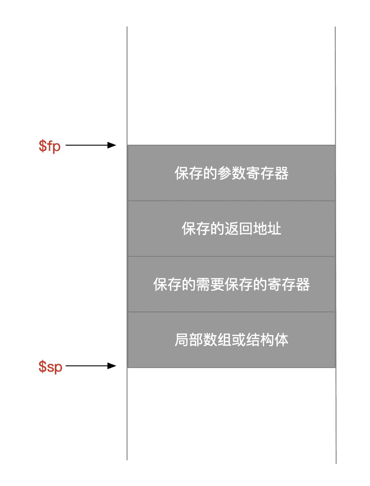

[答案](https://wenku.baidu.com/view/c8644769757f5acfa1c7aa00b52acfc789eb9fcb.html)

₀      ₁          ₂     ₃       ₄    ₅     ₆      ₇      ₈        ₉

# 逻辑设计

## 信号

- **有效信号**：信号为逻辑1或真。
- **无效信号**：信号为逻辑0或假。

## 时钟

> 在时序电路中非常重要，决定了处于某一状态的存储元件合适被更新。是一个具有固定周期时间的不停运转的信号。

- **时钟周期**：分为高电平时钟和低电平时钟。
- **边沿触发时钟**：一种时钟机制，在这种机制下所有的状态改变都发生在时钟边沿。
- **时钟同步方法**：一种根据时钟来决定数据何时有效和稳定的办法。
- **状态单元**：存储元件。
- **同步系统**：一个使用时钟的存储系统，且数据信号只有在当前时钟下是处于稳定状态才可被读取。

## 组合逻辑

> 不包含存储元件，因此当输入相同的数据时，将得到相同的输出。

### 描述方式

#### 真值表

> 描述组合逻辑，每一项都指定了特定输入对应的所有输入的数值。

|      | 输入 |      |      | 输出 |      |
| ---- | ---- | ---- | ---- | ---- | ---- |
| A    | B    | C    | D    | E    | F    |
| 0    | 0    | 0    | 0    | 0    | 0    |
| 0    | 0    | 1    | 1    | 0    | 0    |
| 0    | 1    | 0    | 1    | 0    | 0    |
| 0    | 1    | 1    | 1    | 1    | 0    |
| 1    | 0    | 0    | 1    | 0    | 0    |
| 1    | 0    | 1    | 1    | 1    | 0    |
| 1    | 1    | 0    | 1    | 1    | 0    |
| 1    | 1    | 1    | 1    | 0    | 1    |

#### 布尔代数

- **表示方式**

  | 操作 | 标记          |
  | ---- | ------------- |
  | 或   | +             |
  | 与   | ·             |
  | 非   | A<sup>-</sup> |

- **定律**

  | 定律        | 解释                                                         |
  | ----------- | ------------------------------------------------------------ |
  | 同一定律    | A + 0 = A; A · 1 = A                                         |
  | 0 和 1 定律 | A + 1 = 1; A · 0 = 0                                         |
  | 互补定律    | A + A<sup>-</sup> = 1; A · A<sup>-</sup> = 0                 |
  | 交换律      | A + B = B + A; A · B = B · A                                 |
  | 结合律      | A + B + C = A + (B + C); A · B · C = A · (B · C)             |
  | 分配律      | A · (B + C) = (A · B) + (A · C); A + (B · C) = (A + B) · (A + C) |

#### 硬件描述语言

> 一种描述硬件的编程语言，硬件描述语言用来模拟硬件设计，同时也作为综合工具的输入来生成具体的硬件。

- **两种描述语言**：Verilog、VHDl。

- **两种描述方式**
  - **行为级描述**：描述一个数字系统在功能方面是怎么工作的。
  - **结构级描述**：描述一个数字系统是如何通过基本元件的层次化连接进行组织的。
- **硬件综合工具**：一种计算机辅助设计软件，该软件可以通过数字系统的行为级描述来生成门级的设计结果。

### 门

> 实现基本逻辑功能的硬件设备，比如与门、或门、非门。

| 门     | 标记                                                         |
| ------ | ------------------------------------------------------------ |
| 与门   |  |
| 或门   |  |
| 非门   |  |
| 或非门 |  |

### 多路选择器


- **选择信号**：也称为控制信号，用来选择某一个输入信号，来作为多路选择器的输出信号。

#### 译码器


> 拥有n位输入和2<sup>n</sup>个输出的逻辑块。对每一个输入组合，只有一个输出信号为真。

#### 实现

- **两信号选择器**：

  > 信号0选 A；信号1选B。

- **八输入的信号选择器**：

### PLA

> **programmable logic array**，**可编程逻辑阵列**
>
> - 是一种结构化逻辑单元。由一组输入信号及反向信号和一个两级逻辑构成。
> - 第一级逻辑用来生成输入信号和反向信号的**乘积项**。**也叫最小项**。
> - 第二级逻辑用来生成这些乘积项的和。

- **两级逻辑**
- **乘积和**：一种逻辑表达形式，对所有乘积【与操作】进行逻辑求和【或操作】。
  
- **和积项**：一种逻辑表达形式，对所有求和【或操作】进行逻辑乘积【与操作】。

#### 真值表与其对应的实现

- **真值表**

  |      | 输入 |      |      | 输出 |      |
  | ---- | ---- | ---- | ---- | ---- | ---- |
  | A    | B    | C    | D    | E    | F    |
  | 0    | 0    | 0    | 0    | 0    | 0    |
  | 0    | 0    | 1    | 1    | 0    | 0    |
  | 0    | 1    | 0    | 1    | 0    | 0    |
  | 0    | 1    | 1    | 1    | 1    | 0    |
  | 1    | 0    | 0    | 1    | 0    | 0    |
  | 1    | 0    | 1    | 1    | 1    | 0    |
  | 1    | 1    | 0    | 1    | 1    | 0    |
  | 1    | 1    | 1    | 1    | 0    | 1    |

- **pla实现**

  

### ROM

> ROM是是完全译码，PLA是部分译码。

- **只读存储器**【ROM】：一类存储器，数据在制造时就固定下来，之后其数据只能被读。ROM作为逻辑化结构，可以将逻辑函数组中的项作为输入地址，将输出作为存储器中的一个字，以此来实现逻辑函数组。
- **可编程POM**【PROM】：一类只读存储器，但是当设计者知道其中的数据时，可以对其进行编程。

### 无关项

> 在真值表中记为X，**可以简化逻辑函数的实现**。
>
> - **无关项的输入**：对一些输入组合产生的输出不太关心。
> - **无关项的输出**：当输出只取决于一部分输入时。

#### 简化后的真值表

> 1. 不管B的值为多少，只要A或C为真，则输出D为真。
> 2. 不管C的值为多少，只要A或B为真，则输出E为真。
> 3. 虽然D和E都为真时，我们不关心F的值，但是如果三个输入中一个为真，则输出F为真。

- **原真值表**

  |      | 输入 |      |      | 输出 |      |
  | ---- | ---- | ---- | ---- | ---- | ---- |
  | A    | B    | C    | D    | E    | F    |
  | 0    | 0    | 0    | 0    | 0    | 0    |
  | 0    | 0    | 1    | 1    | 0    | 1    |
  | 0    | 1    | 0    | 0    | 1    | 1    |
  | 0    | 1    | 1    | 1    | 1    | 0    |
  | 1    | 0    | 0    | 1    | 1    | 1    |
  | 1    | 0    | 1    | 1    | 1    | 0    |
  | 1    | 1    | 0    | 1    | 1    | 0    |
  | 1    | 1    | 1    | 1    | 1    | 0    |

- **加上无关项**

  |      | 输入 |      |      | 输出 |      |
  | ---- | ---- | ---- | ---- | ---- | ---- |
  | A    | B    | C    | D    | E    | F    |
  | 0    | 0    | 0    | 0    | 0    | 0    |
  | 0    | 0    | 1    | 1    | 0    | 1    |
  | 0    | 1    | 0    | 0    | 1    | 1    |
  | x    | 1    | 1    | 1    | 1    | x    |
  | 1    | x    | x    | 1    | 1    | x    |

- **最终逻辑实现**

  > 只需要4个最小项。

### 逻辑单元阵列

> 很多操作需要一次处理整个字，所以我们会构建一个逻辑单元的阵列，通过将一个操作作用在整个输入的集合中来实现。
>
> 一般由一个选择信号串联整个阵列。

- **总线**：在逻辑设计中，由多个数据线构成的一条逻辑线，这些数据线被同时执行；被多个源使用的一组信号线也可以称为总线。

### ALU

> arithmetic logic unit，算术逻辑单元。

- **与和或逻辑单元实现**：

#### 一位ALU

- **真值表**

  |      | 输出 |          | 输出     |      |
  | ---- | ---- | -------- | -------- | ---- |
  | a    | b    | 进位输入 | 进位输出 | 和   |
  | 0    | 0    | 0        | 0        | 0    |
  | 0    | 0    | 1        | 0        | 1    |
  | 0    | 1    | 0        | 0        | 1    |
  | 0    | 1    | 1        | 1        | 0    |
  | 1    | 0    | 0        | 0        | 1    |
  | 1    | 0    | 1        | 1        | 0    |
  | 1    | 1    | 0        | 1        | 0    |
  | 1    | 1    | 1        | 1        | 1    |

- **加法进位器**

- **ALU实现**

#### 32位ALU

- **波形进位**
- **超前进位**

## 时序逻辑

> 包含存储元件，输出取决于输入和当前存储元件的内容。

### 存储元件


# 计算机概要与技术

## 八个伟大思想

- **面向摩尔定律的设计**：预测项目完成时的工艺水平。
- **使用抽象简化设计**：层次间不关注细节。
- **加速大概率事件**：对大概率会发生的事件进行提速。
- **通过并行提高性能**
- **通过流水线提高性能**
- **通过预测提高性能**：通过预测的方式提前开始某些操作。
- **存储器层次**：快且昂贵的作为存储器顶层、慢且便宜的作为存储器底层。
- **通过冗余提高可靠性**：冗余部件或数据。

## 程序概念

- **系统软件**：提供常用服务的软件。包括操作系统、编译程序、加载程序和汇编程序等。
- **操作系统**：用户程序和硬件之间的接口。
  - 处理输入输出。
  - 分配外存和内存。
  - 提供应用间共享的计算机资源。
- **高级程序语言**：可以由编译器转换为汇编语言。
  - 语言表达更自然。
  - 提高生产率。
  - 提高移植性。
- **编译程序【编译器】**：将高级语言翻译成汇编语言。
- **汇编程序**：将指令由助记符翻译成二进制形式。
  - *汇编语言*：用助记符形式表示的语言。
  - *机器语言*：以二进制形式表示的机器指令。

## 硬件

> - 集成电路：也叫芯片，将几十至几百万个晶体管连接起来的设备。
> - 指令集体系【体系结构】：是低层次软件和硬件之间的抽象接口，包含了指令、寄存器、存储访问、和I/O等。
>   - 应用二进制接口：用户部分指令和应用程序员调用的操作系统接口，定义了二进制层次可移植的计算机的标准。
>   - 实现：遵循体系结构抽象的硬件。

- **输入设备**：将数据写入存储器。

  > 键盘、鼠标。

- **输出设备**：从内存中读出数据。

  - *显示器*
    - **液晶显示**【LCD】：一种显示技术，**控制光的传输，非光源**。用液体聚合物薄层的带电或者不带电来传输或组织光线的传输。
    - **动态矩阵显示**：液晶显示技术，使用晶体管控制单个像素上光纤的传输。
    - **彩色动态矩阵**：每个像素有红绿蓝3类晶体管开关。
      - **位图**：图像由像素矩阵组成，可表示成二进制位的矩阵。
      - **分辨率**：矩阵的大小。如 1024 * 768。
      - **帧缓冲区**：保存位图，以刷新频率输出到显示设备。
    - **像素**：图像元素的最小单元。每个像素24位。
  - *触摸屏*：平板采取电容感应实现。

- **存储器**

  - **主存储器**：易失性存储器，仅在加电时保存数据。
    - **缓存**：处理器内使用，小而快的存储器，作为内存的缓冲。
      - **SRAM**：static random access memory，**静态随机访问存储器**，集成电路式，比
    - **内存**：程序运行时的存储空间，同时存储程序运行时所需数据。
      - **DRAM**：dynamic random access memory，**动态随机访问存储器**，集成电路式，可随机访问任何地址，时间一样。
  - **二级存储器**：非易失性存储器，在掉电时仍保持数据。
    - **磁盘**：硬盘，以旋转盘片为基础的设备。
    - **闪存**：半导体内存，比磁盘快，在个人移动设备中使用。

- **处理器**【CPU】：中央处理单元。central processor unit。从存储器中得到指令和数据。发出控制信号激活I/O设备。

  - **数据通路**：处理器中执行算数操作的部分。
  - **控制器**：指挥数据通路、存储器、输入和输出部件。

### 计算机通信

- **通信**：在计算机之间高速交换信息。
- **局域网**：在一定地理区域内使用的网络，通过交换器连接。
- **广域网**：以光纤为基础向通信公司租用，可支持万维网【World Wide Web】

## 处理器和存储器制造技术

- **晶体管**：由电信号控制的简单开关。
- **超大规模集成电路**【VLSI】：very large-scale integrated circuit，由数十万到数百万晶体管组成的电路。
- **瑕疵**：晶圆上的微小缺陷。
- **芯片**：chip，从晶圆中切割出来的单独的矩形区域。
- **成品率**：合格芯片占总芯片数的百分比。

### 公式

$$
每芯片价格 = 每晶圆价格 / (每晶圆的芯片数 * 成品率)
$$

$$
每晶圆芯片数 ≈ 晶圆面积 / 芯片面积
$$

$$
成品率 = 1 / (1 + 单位面积的瑕疵数 * 芯片面积 / 2)²
$$

## 性能

- **响应时间**：执行时间，计算机完成某任务的时间，包括硬盘访问、内存访问、I/O活动、操作系统开销和CPU执行时间。

  - CPU~~执行~~时间：执行某一任务在cpu上花费的时间。
    - 用户CPU时间：在程序本身所花费的cpu时间。
    - 系统CPU时间：在操作系统上花费的时间。

- **吞吐率**：带宽，单位时间内完成的任务数量。

- **时钟周期**：tick，通常为处理器时钟，一般为常数。处理器越好，时钟周期越短。

- **时钟频率**：时钟周期的倒数，单位时间内时钟周期的数量。

- **CPI**：每条指令的时钟周期数。

- **能耗**：一般为晶体管开关过程产生的能耗。功耗的极限限制了处理器发展，迫使进化成多核CPU。

- **并发挑战**：调度、负载均衡、通信以及同步开销。

- **MIPS**：million instructions per second，每秒百万条指令。

  

### 公式

$$
性能 = 1 / 响应时间
$$

$$
性能𝚡 / 性能𝚢 = 响应时间𝚢 / 响应时间𝚡
$$

$$
时钟频率 = 1 / 时钟周期
$$

$$
程序的CPU执行时间 = 程序的CPU时钟周期数 * 时钟周期时间
$$

$$
程序的CPU执行时间 = 程序的CPU时钟周期数 / 时钟频率
$$

$$
CPU时钟周期数 = 程序的指令数 * 每条指令的平均时钟周期数
$$

$$
CPU时间 = 指令数 * CPI * 时钟周期时间
$$

$$
CPU时间 = 指令数 * CPI / 时钟频率
$$

$$
能耗 ∝ 1/2 * 负载电容 * 电压²
$$

$$
能耗 ∝ 1/2 * 负载电容 * 电压² * 开关频率
$$

$$
改进后的执行时间 = 受改进影响的执行时间 / 改进量 + 不受改进的执行时间
$$

## ascii码对照表

## unicode对照表

# 编译器

- **指令集**：一个给定的计算机体系结构所包含的指令集合。

## 硬件设计三条基本原则

- **简单源于规整**：例如加操作只能有3个操作数。
- **越小越快**：例如寄存器只有32个。寄存器一定比存储器快，功耗小。
- **优秀的设计需要适宜的折中方案**：指令设计的两种格式。

## MIPS 指令集

> 32位

### 操作数

|      名字      |                             示例                             |                             注释                             |
| :------------: | :----------------------------------------------------------: | :----------------------------------------------------------: |
| 32个通用寄存器 | $s₀-$s₇<br>$t₀-$t₉<br>$zero<br>$a₀-$a₃<br>$v₀-$v₁<br>$gp<br>$fp<br>$sp<br>$ra<br>$at |                      用于数据快速存取。                      |
| 32个浮点寄存器 |                          $f₀ ~ $f₃₁                          |            成对地使用MIPS浮点寄存器来保存双精度数            |
| 2³⁰个存储器字  |              Memory[0]、Memory[4]...Memory[2³²]              | 只能通过数据传输指令访问，连续的字地址差4。<br>保存数据结构、数组和溢出的寄存器。 |

- **字**：计算机的基本访问单位，通常是32位一组，和寄存器大小相同。

- **位**：bit，是信息的基本组成单位。

- **字节**：8位为1字节。

- **寄存器**：reg。存放在寄存器后，才能执行算数操作。一般32个通用寄存器。

  |   名称    | 寄存器号 | 用途                       |
  | :-------: | :------: | -------------------------- |
  |   $zero   |    0     | 常数0                      |
  | $v₀ ~ $v₁ |  2 ~ 3   | 计算结果和表达式求值       |
  | $a₀ ~ $a₃ |  4 ~ 7   | 参数                       |
  | $t₀ ~ $t₇ |  8 ~ 15  | 临时变量                   |
  | $s₀ ~ $s₇ | 16 ~ 23  | 保存的寄存器               |
  | $t₈ ~ $t₉ | 24 ~ 25  | 更多临时变量               |
  |    $gp    |    28    | 全局指针，指向静态数据区。 |
  |    $sp    |    29    | 栈指针                     |
  |    $fp    |    30    | prpcedure frame，帧指针    |
  |    $ra    |    31    | 返回地址寄存器             |

  - 1：$at，被汇编器保留。
  - 26 ~ 27：$k₀ ~ $k₁，被操作系统保留。

- **通用寄存器**：可用于存储任何指令的地址或数据的寄存器。

- **数据传输指令**：在存储器和寄存器之间移动数据的命令。

- **地址**：用于在存储器空间中指明某特定数据元素位置的值。

- **对齐限制**：字的起始位置必须是4的倍数。

#### 常数或立即操作数

> 常数操作数出现频率高，从存储器中取常数比较慢，增加立即数是**加速大概率事件**。

#### 有符号数和无符号数

- **最低有效位**：字中最右边的一位。
- **最高有效位**：字中最左边的一位。
- **二进制补码**：前导为0表示正数，前导为1表示负数。
- **符号扩展**：取回有符号数时，会用符号位填充寄存器所有剩余位。
- **反码**：也表示按位求反。
- **偏移量表示法**：浮点数的一中表示发，通过将数加一个偏移使其具有非负的表示形式。

### 汇编语言

- **指令格式**：二进制数字字段组成的指令表示形式。
- **机器语言**：在计算机系统中用于交流的二进制表示形式。

#### 指令格式

- **R型**：用于寄存器。

  | 字段  | 位数 | 注释                         |
  | :---: | :--: | :--------------------------- |
  |  op   |  6   | 操作码                       |
  |  rs   |  5   | 第一个源操作数寄存器         |
  |  rt   |  5   | 第二个源操作数寄存器         |
  |  rd   |  5   | 用于存放操作结果的目的寄存器 |
  | shamt |  5   | 偏移量                       |
  | funct |  6   | 功能码，指明变式             |

- **I型**：用于立即数。

  |        字段         | 位数 | 注释                 |
  | :-----------------: | :--: | :------------------- |
  |         op          |  6   | 操作码               |
  |         rs          |  5   | 第一个源操作数寄存器 |
  |         rt          |  5   | 第二个源操作数寄存器 |
  | constant or address |  16  | 常数或地址           |
  
  - **PC**：正在被执行指令地址的寄存器。
  - **PC相对寻址**：一种寻址方式，将pc和指令中的常数作为寻址结果，条件分支的地址就是PC相对寻址。所以16位即可。

- **J型**：用于跳转指令。

  |  字段   | 位数 | 注释     |
  | :-----: | :--: | :------- |
  |   op    |  6   | 操作码   |
  | address |  26  | 跳转地址 |

  - **地址**：字地址，跳转范围可扩大4倍。

#### 指令

- **算数**

  |           指令 | 示例              | 含义                               | 注释                                              |
  | -------------: | :---------------- | :--------------------------------- | :------------------------------------------------ |
  |           加法 | add $s₁,$s₂,$s₃   | $s₁ = $s₂ + $s₃                    | 三个寄存器操作数，检测溢出                        |
  |           减法 | sub $s₁,$s₂,$s₃   | $s₁ = $s₂ - $s₃                    | 三个寄存器操作数，检测溢出                        |
  |       加立即数 | addi $s₁,$s₂,20   | $s₁ = $s₂ + 20                     | 加常数，检测溢出                                  |
  |       无符号加 | addu $s₁,$s₂,$s₃  | $s₁ = $s₂ + $s₃                    | 三个寄存器操作数，不检测溢出                      |
  |       无符号减 | subu $s₁,$s₂,$s₃  | $s₁ = $s₂ - $s₃                    | 三个寄存器操作数，不检测溢出                      |
  | 无符号加立即数 | addiu $s₁,$s₂,20  | $s₁ = $s₂ + 20                     | 加常数，不检测溢出                                |
  |       获取异常 | mfc0 $s₁,$epc     | $s₁ = $epc                         | 复制异常PC到寄存器                                |
  |             乘 | mult $s₂,$s₃      | Hi,Lo = $s₂ * $s₃                  | 64位有符号积存放在Hi,Lo中<br />Lo中存放32位整数积 |
  |       无符号乘 | multu $s₂,$s₃     | Hi,Lo = $s₂ * $s₃                  | 64位有符号积存放在Hi,Lo中                         |
  |             除 | div $s₂,$s₃       | Lo = $s₂ / $s₃<br />Hi = $s₂ % $s₃ | Lo=商，Hi等于余数                                 |
  |       无符号除 | divu $s₂,$s₃      | Lo = $s₂ / $s₃<br />Hi = $s₂ % $s₃ | Lo=商，Hi等于余数                                 |
  |     从Hi中获取 | mfhi $s₁          | $s₁ = Hi                           | 获取Hi的副本                                      |
  |     从Lo中获取 | mflo $s₁          | $s₁ = Lo                           | 获取Lo的副本                                      |
  |   浮点单精度加 | add.s $f₂,$f₄,$f₆ | $f₂ = $f₄ + $f₆                    |                                                   |
  |   浮点单精度减 | sub.s $f₂,$f₄,$f₆ | $f₂ = $f₄ - $f₆                    |                                                   |
  |   浮点单精度乘 | mul.s $f₂,$f₄,$f₆ | $f₂ = $f₄ * $f₆                    |                                                   |
  |   浮点单精度除 | div.s $f₂,$f₄,$f₆ | $f₂ = $f₄ / $f₆                    |                                                   |
  |   浮点双精度加 | add.d $f₂,$f₄,$f₆ | $f₂ = $f₄ + $f₆                    |                                                   |
  |   浮点双精度减 | sub.d $f₂,$f₄,$f₆ | $f₂ = $f₄ - $f₆                    |                                                   |
  |   浮点双精度乘 | mul.d $f₂,$f₄,$f₆ | $f₂ = $f₄ * $f₆                    |                                                   |
  |   浮点双精度除 | div.d $f₂,$f₄,$f₆ | $f₂ = $f₄ / $f₆                    |                                                   |

  |                指令 | 格式 | op   | rs   | rt   | rd   | shamt | funct | address |
  | ------------------: | :--: | :--- | :--- | ---- | ---- | ----- | ----- | ------- |
  |                 add |  R   | 0    | reg  | reg  | reg  | 0     | 32    | -       |
  |       sub[subtract] |  R   | 0    | reg  | reg  | reg  | 0     | 34    | -       |
  | addi[add immediate] |  I   | 8    | reg  | reg  | -    | -     | -     | 常数    |

- **数据传输**

  > - 取字：lord word，20 是偏移量。$s₂属于基址寄存器。

  |           指令 | 示例            | 含义                                      | 注释                       |
  | -------------: | :-------------- | :---------------------------------------- | :------------------------- |
  |           取字 | lw $s₁,20($s₂)  | $s₁ = Memory[$s₂ + 20]                    | 将一个字从内存取到寄存器中 |
  |           存字 | sw $s₁,20($s₂)  | Memory[$s₂ + 20] = $s₁                    | 将一个字从寄存器存到内存中 |
  |         取半字 | lh $s₁,20($s₂)  | $s₁ = Memory[$s₂ + 20]                    | 将半个字从内存取到寄存器中 |
  |   取无符号半字 | lhu $s₁,20($s₂) | $s₁ = Memory[$s₂ + 20]                    | 将半个字从内存取到寄存器中 |
  |         存半字 | sh $s₁,20($s₂)  | Memory[$s₂ + 20] = $s₁                    | 将半个字从寄存器存到内存中 |
  |         取字节 | lb $s₁,20($s₂)  | $s₁ = Memory[$s₂ + 20]                    | 将一字节从内存取到寄存器中 |
  |   取无符号字节 | lbu $s₁,20($s₂) | $s₁ = Memory[$s₂ + 20]                    | 将一字节从内存取到寄存器中 |
  |         存字节 | sb $s₁,20($s₂)  | Memory[$s₂ + 20] = $s₁                    | 将一字节从寄存器存到内存中 |
  |       取链接字 | ll $s₁,20($s₂)  | $s₁ = Memory[$s₂ + 20]                    | 取字作为原子交换的前半部分 |
  |       存条件字 | sc $s₁,20($s₂)  | $s₁ = Memory[$s₂ + 20]<br />;$s₁ = 0 or 1 | 取字作为原子交换的后半部分 |
  | 取立即数的高位 | lui $s₁,20      | $s₁ = 20 * 2¹⁶                            | 取立即数并放到高16位       |
  |   取字【浮点】 | lw $f₁,20($s₂)  | $f₁ = Memory[$s₂ + 20]                    | 将字从内存取到浮点寄存器   |
  |   存字【浮点】 | lw $f₁,20($s₂)  | Memory[$s₂ + 20] = $f₁                    | 将字从浮点寄存器存到内存   |

  |           指令 | 格式 | op   | rs   | rt   | rd   | shamt | funct | address |
  | -------------: | :--: | :--- | :--- | ---- | ---- | ----- | ----- | ------- |
  |  lw[lord word] |  I   | 35   | reg  | reg  | -    | -     | -     | address |
  | sw[store word] |  I   | 43   | reg  | reg  | -    | -     | -     | address |

  - **加载32位立即数**

    ```assembly
    # 将立即数存放在寄存器的高16位，低16位补0
    lui $s₀,高16位
    # 插入低16位
    ori $s₀,$s₀,第16位
    ```

- **逻辑**

  |   指令   |      示例       |         含义         |          注释          |
  | :------: | :-------------: | :------------------: | :--------------------: |
  |    与    | and $s₁,$s₂,$s₃ |   $s₁ = $s₂ & $s₃    |  三个寄存器操作按位与  |
  |    或    | or $s₁,$s₂,$s₃  |   $s₁ = $s₂ \| $s₃   |  三个寄存器操作按位或  |
  |   或非   | nor $s₁,$s₂,$s₃ | $s₁ = ~ ($s₂ \| $s₃) | 三个寄存器操作按位或非 |
  | 立即数与 | andi $s₁,$s₂,20 |    $s₁ = $s₂ & 20    |      和常数按位与      |
  | 立即数或 | ori $s₁,$s₂,20  |    $s₁ = $s₂ \|20    |      和常数按位或      |
  | 逻辑左移 | sll $s₁,$s₂,10  |   $s₁ = $s₂ << 20    |   根据常数左移相应位   |
  | 逻辑右移 | srl $s₁,$s₂,10  |   $s₁ = $s₂ >> 20    |   根据常数右移相应位   |

  | 指令 | 格式 | op   | rs   | rt   | rd   | shamt | funct | address |
  | ---: | :--: | :--- | :--- | ---- | ---- | ----- | ----- | ------- |
  | 位移 |  R   | 0    | -    | reg  | reg  | 常数  | -     | -       |

- **条件分支**

  |                                           指令 | 示例             | 含义                                          | 注释                 |
  | ---------------------------------------------: | :--------------- | :-------------------------------------------- | :------------------- |
  |                                     相等时跳转 | beq $s₁,$s₂,25   | if ($s₁ == $s₂) <br />go to PC + 4 + 100      | 相等检测；PC相关。   |
  |                                   不相等时跳转 | bne $s₁,$s₂,25   | if ($s₁ != $s₂) <br />go to PC + 4 + 100      | 不相等检测；PC相关。 |
  |                                     小于时置位 | slt $s₁,$s₂,$s₃  | if ($s₂ < $s₃) $s₁ = 1;<br />else  $s₁ = 0;   | 比较是否小于         |
  |     无符号数<br />小于<br />无符号数<br />置位 | sltu $s₁,$s₂,$s₃ | if ($s₂ < $s₃) $s₁ = 1;<br />else  $s₁ = 0;   |                      |
  |       无符号数<br />小于<br />立即数<br />置位 | slti $s₁,$s₂,20  | if ($s₂ < 20) $s₁ = 1;<br />else  $s₁ = 0;    |                      |
  | 无符号数<br />小于<br />无符号立即数<br />置位 | sltiu $s₁,$s₂,20 | if ($s₂ < 20) $s₁ = 1;<br />else  $s₁ = 0;    |                      |
  |                               浮点标志真则跳转 | bclt 25          | if (cond == 1) <br />go to PC + 4 + 100       |                      |
  |                               浮点标志假则跳转 | bclf 25          | if (cond == 0) <br />go to PC + 4 + 100       |                      |
  |                                 浮点单精度比较 | c.lt.s $f₂,$f₄   | if ($f₂ < $f₄) cond = 1;<br />else  cond = 0; |                      |
  |                                 浮点双精度比较 | c.lt.d $f₂,$f₄   | if ($f₂ < $f₄) cond = 1;<br />else  cond = 0; |                      |

  - **不提供小于则分支**：过于复杂，会延长时钟周期时间。
  - 将有符号数作为无符号数来处理，常用语检查数组下标是否越界。

- **无条件跳转**

  |         指令         |   示例   |           含义            |              注释              |
  | :------------------: | :------: | :-----------------------: | :----------------------------: |
  |         跳转         |  j 2500  |        go to 10000        |         跳转到目标地址         |
  | 跳转至寄存器所指位置 |  jr $ra  |         go to $ra         | 用于 switch 语句，以及过程调用 |
  |      跳转并链接      | jal 2500 | $ra = PC + 4; go to 10000 |          用于过程调用          |

#### 寻址模式总结

> 根据对操作数和地址的使用不同加以区分的多种寻址方式中的一种。

- **立即数寻址**：操作数是唯一指令自身中的常数。
- **寄存器寻址**：操作数是寄存器。
- **基址【偏移】寻址**：操作数在内存中，地址是指令中基址寄存器和常数的和。
- **PC相对寻址**：地址是PC和指令中常数的和。
- **伪直接寻址**：地址由指令中26位字段和PC高位相连而成。

## C程序

### 逻辑操作

- **位移**：可解决乘法运算。
- **按位与**：两个操作位都为1，结果为1。
- **按位或**：两个操作位有1个为1，结果为1。
- **按位取反**：对操作数每位1变为0，0变为1。
- **或非**：两个操作位均为0，结果为1。
- **异或**：两个操作位值不同，结果为1。

### 决策指令

#### 循环

> 一般使用指令 `j`

- **基本块**：没有分支，并且没有分支目标/分支标签的指令序列。

#### case / switch 语句

> 一般使用指令  `jr`

- **转移地址表**：转移表，指包含不同指令序列地址的表。

### 过程【函数】

- **过程**：根据提供的参数执行一定任务的存储的子程序。

- **跳转和链接指令**：跳转到某个地址的同时将下一条指令的地址保存到寄存器$ra中的指令。

- **返回地址**：指向调用点的链接，是过程可以返回到合适的地址，存储在寄存器$ra中。

- **调用者**：调用一个过程并为过程提供必要参数值的程序。

- **被调用者**：根据调用者提供的参数执行一系列存储的指令，然后将控制权返回调用者的过程。

- **程序计数器**【PC】：包含在程序中正在被执行指令地址的寄存器。

- **过程帧**：也称作活动记录，栈中包含过程所保存的寄存器一级局部变量的片段。

- **叶过程**：不调用其他过程的过程。

  > 

- **帧指针**：指向给定过程中保存的寄存器和局部变量的值。指向过程帧的第一个字，**过程中栈指针可能会变化，而帧指针不会变化**。

- **尾递归**：可以使用尾迭代高效实现。

#### 过程运行步骤

1. 将参数放在过程可以访问的位置。
2. 将控制转交给过程。
3. 获得过程所需的存储资源。
4. 执行需要的任务。
5. 将结果的值放在调用程序可以访问的位置。
6. 将控制返回初始点，因为一个过程可能由一个程序的多个点调用。

#### 寄存器栈

- **过程调用保留**。

  | 保留                | 不保留                |
  | ------------------- | --------------------- |
  | 保存寄存器：$s₀-$s₇ | 临时寄存器：$t₀-$t₉   |
  | 栈指针寄存器：$sp   | 参数寄存器：$a₀-a₃    |
  | 返回地址寄存器：$ra | 返回值寄存器：$v₀-$v₁ |
  | 栈指针以上的栈      | 栈指针以下的栈        |

- **参数过多**：前4个放在放在 $a₀ ~ $a₃，其他的放在帧指针上方。

### 内存分配


### 翻译并执行


- **编译器**：将c语言转换成机器能理解的符号形式的汇编语言。
- **汇编语言**：一种符号语言，能被翻译成二进制的机器语言。
  - **伪指令**：汇编语言指令的变种通常被看作一条汇编指令。
- **汇编器**：汇编器能够处理一些机器语言指令的变种。这些变种也称为伪指令，简化了程序转换和编程。
- **目标文件**：机器代码语言。包括机器语言指令、数据和指令正确放入内存所需要的信息。
  - *目标文件头*：描述目标文件其他部分的大小和位置。
  - *代码段*：包含机器语言代码。
  - *静态数据段*：包含在程序生命周期内分配的数据。
  - *重定位信息*：标记了一些在程序加载进内存时依赖于绝对地址的指令和数据。**比如载入、跳转等包含address的指令**。
  - *符号表*：用来匹配标记名和指令所在内存字的地址的列表。包含未定义的剩余标记，如外部引用。**变量和分支等**。
  - *调试信息*：包含一份说明目标模块如何编译的简明描述。
- **链接器**：也称链接编辑器，系统程序。把各个独立汇编的机器语言程序组合起来并且解决所有未定义的标记，最终生成可执行文件。
  - **工作内容**
    - 使用每个目标模块中的重定位信息和符号表，解析所有的未定义标签。
      - 寻找所有旧地址并用新地址替换。
    - 外部引用解析完后，决定每个模块要占用的内存位置，当模块放入内存中时，修改重定位信息中的决定引用。
  - **工作步骤**
    - 将代码和数据模块象征性的放入内存。
    - 决定数据和指令标签的地址。
    - 修补内部和外部引用。
- **可执行文件**：具有目标文件格式的功能程序，不包含未解决的引用。可以包含符号表和调试信息。
- **加载器**：把目标程序装载到内存中以准备运行的系统程序。
  - 读取可执行文件头来确定代码段和数据段的大小。
  - 为正文和数据创建一个足够大的地址空间。
  - 将可执行文件中的指令和数据复制到内存中。
  - 把主程序的参数复制到栈顶。
  - 初始化机器寄存器，将栈指针指向第一个空位置。
  - 跳转到启动例程，将参数复制到参数寄存器并调用程序的main函数。当main函数返回时，启动例程通过系统调用exit终止程序。
- **动态链接库**：**DDL**，dynamically linked library。在程序执行过程中才被链接的库例程。
  - 第一次，调用虚入口。执行间接跳转，跳转到动态链接器或加载器。加载完在该表间接跳转位置的地址。
  - 以后，调用虚入口。间接跳转到例程。

### 举例：排序程序

- **c程序**

  ```c
  void sort(int v[], int n) {
      int i, j;
      for (i = 0; i < n; i++) {
          for (j = i - 1; j >= 0 && v[j] > v[j+1]; j--) {
              swap(v, j);
          }
      }
  }
  
  void swap(int v[], int k) {
      temp = v[k];
      v[k] = v[k + 1];
      v[k + 1] = temp;
  }
  ```

- **编译程序**

  ```assembly
  # v 和 n 使用参数寄存器，因为非叶程序，i 和 j 使用保存寄存器。
  # v -> $a₀; n -> $a₁; i -> $s₀; n -> $s₁;
  
  # 非叶程序，第一步：入栈，程序中用到了哪些寄存器，就要把寄存器的值入栈。
  		addi $sp, $sp, -20
  		sw $ra, 16($sp)
  		sw $s₃, 12($sp)
  		sw $s₂, 8($sp)
  		sw $s₁, 4($sp)
  		sw $s₀, 0($sp)
  
  # sort 过程体
  # 复制参数，因为调用swap函数需要用到参数寄存器，所以要先移过来。
  		add $s₂, $a₀, $zero
  		add $s₃, $a₁, $zero
  
  # 外层循环
  		addi $s₀, $zero, $zero
  loop1:	slt $t₀, $s₀, $s₀
  		beq $t₀, $zero, exit1
  		
  # 内层循环
  		addi $s₁, $s₀, -1 		# j = i - 1
  loop2:	slti $t₀, $s₁, 0 		# j < 0
  		bne $t₀, $zero, exit2
  		sll $t₁, $s₁, 2 		# j << 2
  		add $t₂, $t₁, $s₂ 		#v[j]基址
  		lw $t₃, 0($t₂) 			# v[j]
  		lw $t₄, 4($t₂) 			# v[j+1]
  		slt $t₀, $t₄, $t₃ 		# v[j+1] < v[j]
  		beq $t₀, $zero, exit2
  		
  # 传参和调用
  		add $a₀, $s₂, $zero # 参数赋值
  		add $a₁, $s₁, $zero # 参数赋值
  		jal swap # 跳转swap(v[], k) 并修改$ra
  		
  # 循环内部
  		addi $s₁, $s₁, -1 # j--
  		j loop2
  
  exit2:	addi $s₀, $s₀, 1 # i++
  		j loop1
  
  # 恢复寄存器的值
  exit1:	lw $s₀, 0($sp)
  		lw $s₁, 4($sp)
  		lw $s₂, 8($sp)
  		lw $s₃, 12($sp)
  		lw $ra, 16($sp)
  		addi $sp, $sp, 20
  		
  # 过程返回
  		jr $ra
  		
  # swap函数
  swap:	sll $t₀, $a₁, 2
  		add $t₀, $a₀, $t₀
  		lw $t₁, 0($t₀)
  		lw $t₂, 4($t₀)
  		sw $t₂, 0($t₀)
  		sw $t₁, 4($t₀)
  		jr $ra

### 举例：矩阵乘法程序

- **c程序**

  ```c
  // 前提，矩阵都是32 * 32
  void mm(double c[][], double a[][], double b[][]) {
      int i, j, k;
      for(i = 0; i < 32; i++) {
          for (j = 0; j < 32; j++) {
              for(k = 0; k < 32; k++) {
                  c[i][j] += a[i][k] * b[k][j];
              }
          }
      }
  }
  ```

- **编译程序**

  ```assembly
  # 寄存器入栈
  mm:		addi $sp, $sp, -16
  		sw $ra, 12($sp)
  		sw $s₂, 8($sp)
  		sw $s₁, 4($sp)
  		sw $s₀, 0($sp)
  
  		addi $t₁, $zero, 32		# 将32给到临时变量
  		add $s₀, $zero, $zero	# i = 0
  		
  loop1:	add $s₁, $zero, $zero	# j = 0
  
  loop2:	add $s₂, $zero, $zero	# k = 0
  		sll $t₂, $s₀, 5			# 得到[i][0]字偏移量
  		addu $t₂, $t₂, $s₁		# 得到[i][j]字偏移量
  		sll $t₂, $t₂, 3			# 得到字节偏移量，又因为每个元素占2字节，所以 * 4 * 2
  		addu $t₂, $a₀, $t₂		# 得到c[i][j]基址
  		l.d $f₄, 0($t₂)			# 从基址处获取8个字节，存在$f₃ ~ $f₄中
  		
  loop3:	sll $t₀, $s₂, 5			# 得到[k][0]字偏移量
  		addu $t₀, $t₀, $s₁		# 得到[k][j]字偏移量
  		sll $t₀, $t₀, 3			# 得到字节偏移量，又因为每个元素占2字节，所以 * 4 * 2
  		addu $t₀, $a₂, $t₀		# 得到b[k][j]基址
  		l.d $f₁₆, 0($t₀)		
  		
  		sll $t₀, $s₀, 5			# 得到[i][0]字偏移量
  		addu $t₀, $t₀, $s₂		# 得到[i][k]字偏移量
  		sll $t₀, $t₀, 3			# 得到字节偏移量，又因为每个元素占2字节，所以 * 4 * 2
  		addu $t₀, $a₁, $t₀		# 得到a[i][k]基址
  		l.d $f₁₈, 0($t₀)		
  		
  # 乘法
  		mul.d $f₁₆, $f₁₈, $f₁₆
  		add.d $f₄, $f₄, $f₁₆
  		
  		addiu $s₂, $s₂ 1 		# k = k + 1
  		bne $s₂, $t₁, loop3
  		s.d $f₄, 0($t₂)
  		
  		addiu $s₁, $s₁, 1		# j = j + 1
  		bne $s₁, $t₁, loop2
  		
  		addiu $s₀, $s₀, 1		# j = j + 1
  		bne $s₀, $t₁, loop1
  		
  # 恢复寄存器
  		lw $s₀, 0($sp)
  		lw $s₁, 4($sp)
  		lw $s₂, 8($sp)
  		lw $ra, 12($sp)
  		addi $sp, $sp, 16
  		jr $ra
  ```

## JAVA程序

todo 老孙

## 并行与同步

- **数据竞争**：来自不同线程的两个访存请求访问同一个地址，连续出现，并且其中一个是写操作，存储访问形成数据竞争。

- **硬件原语**：提供对存储单元进行原子读和原子写的能力，多处理器中实现同步需要，存储器在进行原子度或原子写操作时任何其他操作都不得插入。

- **原子操作实现**：指令对，其他处理器不能改变两个指令执行之间的数据值。

  > 两条指令之间的任何时候有处理器插入，并且修改了该单元的值，指令sc都会将$t₀置为0，引起指令序列重新执行。

  - 取连接数：`ll`，laod linked。
  - 条件存数：`sc`，store conditional。

# 数据通路

- **谬误**：左移可以代替2的幂次方数相乘，右移也可以代替与2的幂次方数相除。

  > 无符号整数可以，有符号整数有问题。

- **陷阱**：浮点加法不能使用结合律。

  > 因为浮点数精度有限，结合可能会导致精度提前忽略。

- **谬误**：并行执行策略不但适用于整数类型数据，同样也适用于浮点数据类型。

  > 因为浮点数不能使用结合律。

- **谬误**：只有理论数学家才会关心浮点精度。

## 整数

### 加法和减法

- **加法**：从右到左逐渐位相加，进位也向左传播。

  > 因此不必额外考虑符号的问题。

- **减法**：对数取补码后，执行加法操作。

- **溢出条件**

  | 操作  | 操作数A | 操作数B | 表示结果有溢出的条件 |
  | ----- | ------- | ------- | -------------------- |
  | A + B | >=0     | >=0     | <0                   |
  | A + B | <0      | <0      | >=0                  |
  | A - B | >=0     | <0      | <0                   |
  | A - B | <0      | >=0     | >=0                  |

- **算数异常**

  - add、addi、sub 在溢出时产生异常。
  - addu、addiu、subu在溢出时不产生异常。【C语言忽略溢出，所以使用这个指令。】

- **逻辑算数单元【ALU】**：用于执行加法、减法，通常也包括逻辑操作。

- **异常**：也叫中断，一种打断正常程序执行过程的事件，用于溢出检测。

  > 1. 产生异常的指令保存到寄存器【异常程序计数器，EPC，$k₀ ~ $k₁】中。
  > 2. 跳到预先设定好的地址执行异常处理程序。

- **饱和操作**：发生溢出时，结果被设置为最大正数或最小负数。

### 乘法

- **基本原则**：和十进制类似。

  - 乘数为1时，将被乘数【1*被乘数】移动到合适的位置。
  - 乘数为0时，将0【0*被乘数】移到合适的位置。

- **优化**

  - **硬件优化**

    - *原来*

      > 1. 被乘数64位寄存器，每计算一次左移1位。
      > 2. 64位的ALU。
      > 3. 乘积64位寄存器，每次在乘数的最低位为1时，和被乘数寄存器相加。
      > 4. 乘数寄存器32位，每次右移一位。

      ```mermaid
      graph TD
      A(开始) -->B{测试乘数最低位}
      B --> |=1| C[给乘积加上被乘数,将结果写入乘积寄存器]
      C --> D[被乘数寄存器左移一位]
      B --> |=0| D
      D --> E[乘积寄存器右移一位]
      E --> F{第33次重复?}
      F --> |否| B
      F --> |是| G(结束)
      ```

      

    - *优化后*

      > 1. 被乘数32位寄存器，始终不变。
      >
      > 2. 32位的ALU。
      >
      > 3. 乘积64位寄存器。低32位初始放置乘数，每次右移一位。
      >
      >    > 原因是积每多一位，乘数的最后一位就可以丢弃，积和乘数的位数之和永远保持在64。基于此实现优化。

    - *更快速的方式*

      > 1. 加法器栈 n-1。
      > 2. 并行树，log₂(n)。

  - **移位**：乘数为常数时，乘法会用移位来代替。编译器将短常数的乘法替换为一系列移位和加法。

- **有符号乘法**

  - 将算法迭代31次，符号位不参与运算。

  - 符号位最后单独计算，符号相异时，符号位位1。


### 除法

- **基本原则**：和十进制类似。

- **硬件优化**

  - *原来*

    > 余数64位寄存器，初始放置被除数。
    >
    > 除数64位寄存器，高32位放置除数。每次右移一位。
    >
    > 64位的ALU。
    >
    > 商寄存器32位，因为计算32次即可。每次左移，说明商的结果是由高位到低位依次算出。
    >
    > 余数比除数小的话，商左移一位，末尾补0。
    >
    > 余数比除数大的话，商左移一位，末尾补1。

    ```mermaid
    graph TD
    A(开始) --> B[从余数寄存器中减去除数寄存器的内容,将结果放在余数寄存器中]
    B --> C{测试余数}
    C --> |余数 >= 0| D[商寄存器左移,最低为设为1]
    C --> |余数 < 0| E[通过给余数寄存器加上除数寄存器内容来恢复原值,结果放在余数寄存器.<br \>商同样左移,最低位设为0]
    D --> F[除数寄存器右移一位]
    E --> F
    F --> G{第33次重复?}
    G --> |否| B
    G --> |是| H(结束)

  - *优化后*

    > 1. 除数32位寄存器，始终不变。
    > 2. 32位的ALU。
    > 3. 余数64位寄存器。每次右移一位。空出来的每位放商的计算结果。

- **有符号除法**

  - 源操作数的符号相反时商为负。

  - 使非零余数的符号和被除数相同。


## 浮点运算

- **科学计数法**：十进制小数点左边只有一位整数的计数法。
- **规格化数**：没有前导0的浮点计数法。
  - 简化了浮点数的数据交换。
  - 简化了浮点算术运算。
  - 提高了一个字存储的数的精度。
- **浮点数**：二进制小数点不固定的表达数的计数法。

### 浮点表示

- **尾数**：位于浮点数的尾数字段，其值在0和1之间。

- **指数**：位于浮点数的指数字段，表示小数点的位置。

  - **指数正负**：偏阶计数法。单精度偏阶127，双精度1023。
    - 11111111：表示最大正数。
    - 00000000：表示最小负数。

- **溢出【上溢】**：正的指数太大而导致指数域放不下的情况。

- **下溢**：负的指数太大导致指数域放不下的情况。

- **双精度**：浮点数由两个32位的字表示。

  - | 符号位         | 指数 | 尾数 |
    | -------------- | ---- | ---- |
    | 1位，1代表负数 | 11位 | 52位 |

  - *表示对象*

    | 指数     | 尾数   | 表示对象  |
    | -------- | ------ | --------- |
    | 0        | 0      | 0         |
    | 0        | 非0    | ±非规格数 |
    | 1 ~ 2046 | 任何值 | ±浮点数   |
    | 2047     | 0      | ±无穷     |
    | 2047     | 非0    | NaN       |

- **单精度**：浮点数由一个32位的字表示。

  - | 符号位         | 指数 | 尾数 |
    | -------------- | ---- | ---- |
    | 1位，1代表负数 | 8位  | 23位 |

  - *表示对象*

    | 指数    | 尾数   | 表示对象    |
    | ------- | ------ | ----------- |
    | 0       | 0      | 0           |
    | 0       | 非0    | ±非规格化数 |
    | 1 ~ 254 | 任何值 | ±浮点数     |
    | 255     | 0      | ±无穷       |
    | 255     | 非0    | NaN         |

- **有效位**：有效位比尾数多了一个1，隐藏了规格化二进制数的前导位1。
- **非规格化数**：在指数为0而有效数非0时，允许一个有效数逐步变小直至0，称为**逐步下溢**。进而获得更大的精度。

#### 举例：-0.75表示

> -3 / 4 => -11/ 2² => -1.1 * 2<sup>-1</sup>
>
>  浮点数的尾数表示时去掉前导1。

- **单精度**

  | 符号位 | 指数     | 尾数                   |
  | ------ | -------- | ---------------------- |
  | 1      | 01111110 | 1000000000000000000000 |

- **双精度**

  | 符号位 | 指数        | 尾数                                              |
  | ------ | ----------- | ------------------------------------------------- |
  | 1      | 01111111110 | 1000000000000000000000000000000000000000000000000 |

### 加法


- 舍入：有舍入硬件来进行四舍五入。

### 乘法


### 算数精确性

> 中间计算中右边多保留两位。0~49舍，51~99入。

- **保护位**：在浮点数中间计算中，在右边多保留的两位中的首位；用于提高舍入精度。

- **舍入位**：在浮点数中间计算中，在右边多保留的两位中的第二位；使浮点中间结果满足浮点格式，得到最接近的数。
- **尾数最低位**：在实际数和能表达的数之间的有效数最低位上的误差位数。

## 子字并行

在一个宽字内部进行的并行操作。

- 通过提供256字节的寄存器实现。
- 100多条宽字指令。

### 举例

矩阵相乘可以每4个为一组在一个宽字上运算，速度可以提升4倍。

# 处理器
