# 计算机网络和因特网

[配套练习网站](http://gaia.cs.umass.edu/kurose_ross/interactive/)

## 因特网具体构成

 

## 网络边缘

- **因特网服务提供商【ISP，Internet service Provider】 **：端系统通过 ISP 接入因特网。

### 端系统【主机】

- 端系统是因为位于因特网的边缘
- 主机是因为容纳了运行程序。

### 接入网

#### 家庭接入

##### 数字用户线【DSL】

> **Digital Subscriber Line**。

 

- **因特网服务提供商【ISP】**：住户通常从提供本地电话接入的**本地电话公司**处获得 DSL 因特网接入。本地电话公司即是它的 ISP。

- **DSL调制解调器**：得到**数字数据**后将其**转换**为**高频音**，通过电话线传输给**本地中心局【CO】**。

- **本地中心局【CO】**：位于电话公司，用户的**DSL调制解调器**使用现有电话线【**双绞铜线**】与**CO**的**数字用户线接入复用器【DSLAM】**交换数据。

- **数字用户线接入复用器【DSLAM】**：

  > 1. 高频音模拟信号在DSLAM处被转换为数字。
  > 2. 把数据和电信号分隔开，将数据送往因特网。
  > 3. **数百上千家庭**和同一个DSLAM相连。

- **电话线信号**

  - *高速下行信道*：位于 50kHz ~ 1MHz 频段。
  - *中速上行信道*：位于 4kHz ~ 50kHz 频段。
  - *普通的双向电话信道*：位于 0 ~ 4kHz 频段。

##### 电缆【cable】

> 利用有线电视公司现有的有线电视基础设施。

 

- **混合光纤同轴【HFC】系统**：*Hybrid Fiber Coax*。因为应用了**光纤**和**同轴电缆**。

  > **光缆**将**电缆头端**链接到**地区枢纽**。从这里使用**同轴电缆**到达各家各户和公寓。每个枢纽通常支持**500~5000个家庭**。

- **电缆调制解调器【cable modem】**：如**DSL调制解调器**，通过一个以太网端口连接到家庭PC。

- **电缆调制解调器端接系统【CMTS】**：*Cable Modem Termination System*。与**DSLAM**具有类似功能，将来自家庭中的模拟信号转换为数字形式，将HFC网络划分为上行和下行两个信道。

  > DOCSIS 2.0标准定义了高达42.8Mbps的下行速率和高达30.7Mbps的上行速率，下行信道分配的传输速率通常比上行信道的高。

- **共享广播媒体**：因为光纤同轴，所以每个用户的实际速率**大大低于**电缆的总计速率。

  > **上行信道共享**：需要一个**分布式多路访问协议**来协调传输和避免碰撞。

##### 光纤到户【FTTH】

> **FIber To The Home**。有潜力提供每秒千兆比特范围的因特网接入速率。

- **直接光纤**：从本地中心局到每户设置一根光纤。

- **主动光纤网络【AON】**：*Active Optical Network*。本质上是交换因特网。

- **被动光纤网络【PON】**：*Passive Optical Network*。

   

  - **光纤网络端接器【ONT】**：*Optical Network Terminatior*。由专门的光纤连接到最近的**分配器【splitter】**。

    > 在家庭中，用户将一台**无线路由器**与ONT相连，经过这台路由器接入因特网。

  - **分配器**：把一些家庭【通常少于100个】集结到一根共享的光纤，该光纤连接到本地电话和公司的中心局中的**光纤线路端接器【OLT】**

  - **光纤线路端接器【OLT】**：*Optical Line Terminatior*。提供了光信号和电信号之间的转换，经过本地电话公司路由器与因特网相连。

    > 所有从**OLT**发送到分配器的分组在**分配器【类似一个电缆头端】**处复制。

##### 卫星链路

**乡村环境中**，将住宅以超过1Mbps的速率与因特网相连。StarBand和HughesNet是两家卫星接入提供商。

##### 电话线拨号

与**DSL**基于相同的模式：家庭的调制调解器经过电话线连接到**ISP**的调制调解器，速率极慢【56kbps】。

#### 企业|家庭接入

##### 以太网

使用局域网【LAN】将端系统连接到边缘路由器。

 

- **以太网交换机**：用户使用双绞铜线与一台以太网交换机相连。

##### wifi

 

#### 广域无线接入

##### 3G

无线设备通过蜂窝网提供商运营的基站来发送和接收分组，一个用户仅需要在位于基站的数万米范围内，非几十米。

##### 长期演进【LTE】

> **Long-Term Evolution**。

### 物理媒体

#### 导引型媒体【guided media】

> 电波沿着**固体媒介**前行，如**光缆**、**双绞铜线**和**同轴电缆**。

##### 双绞电缆

由两根绝缘的铜线组成，没根大约 1mm 粗。

- 以规则的螺旋状排列：减少临近类似的双绞线的电气干扰。
- 通常许多双绞线捆扎在一起形成一根电缆，并在这些双绞线外面覆盖上保护性防护层。
- **无屏蔽双绞线【UTP】**：*Unshielded Twisted Pair*，由四对不同颜色的传输线互相缠绕所组成，每对相同颜色的线传递著来回两方向的[电脉冲](https://baike.baidu.com/item/电脉冲)，这样的设计是利用了[电磁感应](https://baike.baidu.com/item/电磁感应)相互抵销的原理来屏蔽电磁干扰。UTP广泛用于[以太网](https://baike.baidu.com/item/以太网)（[局域网](https://baike.baidu.com/item/局域网)）和[电话线](https://baike.baidu.com/item/电话线)中。

##### 同轴电缆

由两个铜导体组成，这两个导体是同心的而不是并行的。

- 在电缆电视系统中相当普遍。
- 同轴电缆能被用做导引型**共享媒体**：发送设备将数字信号调制到某个特定的频段，产生的模拟信号从发送设备传送到一个或多个接收方。

##### 光纤

> 光纤是光导[纤维](https://baike.baidu.com/item/纤维)的简写，是一种由[玻璃](https://baike.baidu.com/item/玻璃/287)或[塑料](https://baike.baidu.com/item/塑料/573005)制成的[纤维](https://baike.baidu.com/item/纤维/3242959)，可作为光传导工具。传输原理是「光的[全反射](https://baike.baidu.com/item/全反射/827430)」。
>
> 是一种细而柔软、能够引导光脉冲的媒体，每个脉冲表示一个比特。

- 不受电磁干扰，长达100km的光缆信号衰弱极低，并且很难窃听。
- 光纤成为长途引导型传输媒体，特别是跨海链路。
- 广泛用于因特网的主干。
- 高成本的光设备【发射器、接收器和交换器】阻碍光纤在短途传输中的应用。

#### 非导引型媒体【unguided media】

> 电波在**空气或外层空间中**传播，如**无线局域网**和**数字卫星频道**中。

##### 陆地无限电信道

不需要安装物理线路，并具有穿透墙壁、提供与移动用户的连接以及长距离承载信号的能力。无线电信号的特性极大地依赖于传播环境和信号传输的距离。

- 一类运行在短距离【1~2M】。
- 一类运行在局域网【数十~几百米】。
- 一类运行在广域【数万米】。

##### 卫星无限电信道

- **同步卫星**：永久停留在地球上方【36000km】的相同点上。由于距离远，信号传播时延有 280ms。
- **近地轨道卫星**：靠地球非常近，并且围绕地球旋转。

## 网络核心

通过网络链路和交换机移动数据有两种基本方法：**电路交换**和**分组交换**。

### 分组交换

> 交换机主要有两类：**路由器**和**链路交换机**。

- **分组**：为了从源端系统向目的端系统发送一个报文，源将长报文划分为较小的数据块。
- **分组交换机**：每个分组都通过通信链路和**分组交换机**通信。

#### 存储转发传输

 

- **机制**：交换机能够开始向输出链路传输该分组的第一个比特之前，必须接收到整个分组。

- **从源开始发送分组到目的地收到整个分组所经过的时间**

  > 忽略传播时延。传播路径的**速率为R**、有**N台路由器**。**分组比特大小为L**。
  > $$
  > d(端到端) = (N + 1) * L / R
  > $$

#### 排队时延和分组丢失

 

分组交换机具有一个**输出缓存**，也称为**输出队列**。

- **排队时延**：如果到达的分组需要传输到某条链路，但发现该链路正忙于传输其他分组，该到达分组必须在输出缓存中等待。

- **流量强度**：`La/R`，到达速率 / 传播速率，流量强度不能大于1。

  > L是分组字节数，a是每秒到达分组数，R是传播速率。

- **分组丢失【丢包】**：缓存的空间大小是有限的，到达的分组发现缓存已经被其他等待传输的分组占满了，这时将出现丢包，**到达的分组或排队的分组之一会丢失**。

#### 转发表和路由选择协议

- **转发表**：每台路由器具有一个**转发表**，用于将**目的地址【或目的地址的一部分】**映射成为输出链路。
- **路由选择协议**：可以决定从每台路由器到每个目的地的最短路径。

### 电路交换

 

#### 电路交换网络中的复用

链路中的电路是通过**频分复用【FDM】**或**时分复用【TDM】**来实现的。

- **频分复用【FDM】**：*Frequency-Division Multiplexing*，链路的频谱由跨越链路创建的所有连接共享。在连接期间为每条连接专用一个频段。

   

  - **电话网络**：频段的宽度通常为**4kHz【每秒4000周期】**，该频段的宽度称为带宽。

- **时分复用【TDM】**：*Time-Division Multiplexing*，时间被划分为固定期间的帧，每个帧又被划分为固定数量的时隙，当网络跨越一条链路创建一条连接时，网络在每个帧中为该连接指定一个时隙，这些时隙专门由该连接单独使用，一个时隙可用于传输该连接的数据。

   

#### 分组交换和电路交换的对比

### 网络的网络

#### 网络结构1

单一的**全球传输ISP**互联所有**接入ISP**。

- **全球传输ISP**：至少有一个由路由器靠近数十万接入ISP的每一个。属于**提供商**。**第一层ISP**。
- **接入ISP**：接入ISP项全球传输ISP付费，属于**客户**。

#### 网络结构2

多个**全球传输ISP**进行竞争，有数十万个**接入ISP**和多个**全球传输ISP**组成，**全球传输ISP**需要互联。

#### 网络结构3

引入**区域ISP**，以中国为例，每个城市有接入ISP，它们与省级ISP相连，省级ISP又与国家级ISP相连，国家级最终与第一级ISP相连。

#### 网络结构4

由**接入ISP**、**区域ISP**、**第一层ISP**、**POP**、**多宿**、**对等**和**IXP**组成。

- **存在点【POP】**：*Point of Presence*，存在于等级结构的**所有层次**，但底层ISP除外，只是**提供商**网络中一台或多台**路由器【在相同位置】群组**，其中客户ISP能够与提供商ISP连接，对于要与提供商POP连接的**客户网络**，它能从第三方电信提供商**租用高速链路**将它的**路由器之一**直接**连接到**位于该**POP的一台路由器**。
- **多宿**：*multi-home*，任何ISP可以与两个或更多**提供商ISP**连接。可以与区域ISP多宿，也可以与第一层ISP多宿，当一个ISP多宿时，即是它的提供商之一出现故障，它仍然能够继续发送和接收分组。
- **对等**：当两个ISP【**位于相同等级结构层次**】对等时，通常不进行结算，即任一个ISP不向其对等付费。
- **因特网交换点【IXP】**：*Internet Exchange Point*，**汇合点**，多个ISP能够在这里一起对等。通常位于一个有自己的交换机的独立建筑物中。

#### 网络结构5

 

**内容提供商网络**：在网络结构顶部，可以接入每一层，绕过最高层，减少了向顶层ISP支付的费用。

## 分组交换网中的时延、丢包和吞吐量

### 节点【主机或路由器】时延

$$
节点总时延 = 处理时延 + 排队时延 + 传输时延 + 传播时延
$$


 

- **处理时延**：*微秒或更低量级*。
  - 检查分组首部和决定将该分组导向何处所需要的时间。
  - 检查比特级别的差错。
- **排队时延**：分组在链路上等待传输时，经受排队时延。*毫秒到微秒量级*。
- **传输时延**：将所有分组的比特**推向链路**【**传输|发射**】所需要的时间。*毫秒到微秒量级*。
- **传播时延**：从该链路的起点到另一个路由器所需要的时间。*毫秒量级*。

### 端到端时延

$$
端到端时延 = N(处理时延 + (L/R) + 传播时延)
$$

### 端系统、应用程序和其他时延

共享媒体端系统、媒体分组化延时。

### 吞吐量

取决于数据流过的链路的传输速率。近似为沿着源和目的地之间路径的最小传输速率。

## 协议层次

> 1. 某层提供的服务易于改变。
> 2. 对于大而复杂且需要不断更新的系统，改变服务的实现而不影响该系统其他组件。

### 因特网协议栈【5层】

 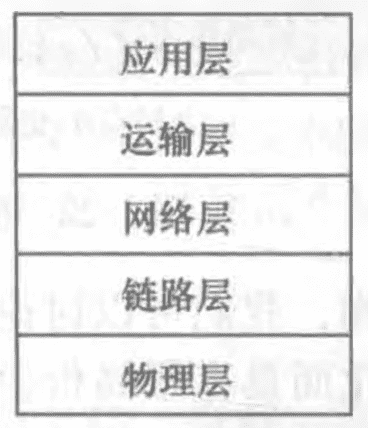

- **应用层**：网络应用程序及它们的应用层协议存留的地方。分布在多个端系统上，一个端系统中的应用程序使用协议与另一个端系统中的应用程序交换信息分组。这种位于应用层的信息分组称为**报文**。

  > **HTTP**、**SMTP**【电子邮件】、**FTP**【文件传送】、**DNS**【域名系统】。

- **运输层**：在应用程序端点之间传输应用层报文。我们把运输层的分组称为**报文段**。

  > - **TCP**：提供了面向连接的服务，包括了应用层报文向目的地的**确保传递**和**流量控制**。将长报文划分为短报文，并提供**拥塞控制机制**。
  >   - **拥塞控制机制**：当此网络拥塞时，源抑制其传输速率。
  >   - **流量控制**：发送发/接收方速率匹配。
  >
  > - **UDP**：提供无连接服务，不提供不必要的服务，没有可靠性、没有流量控制、也没有拥塞控制。

- **网络层**：负责将称为**数据报**的网络层分组从一台主机移动到另一台主机。

  > - **IP**：定义了在数据报中的各个字段以及端系统和路由器如何作用于这些字段。也包括路由选择协议。

- **链路层**：提供的服务取决于应用与该链路的特定链路层协议。我们把链路层分组称为**帧**。负责将整个帧从一个网格元素移动到临近的网格元素。

  > **以太网**、**WIFI**、和**电缆接入网的DOCSIS协议**。

- **物理层**：将帧中的一个个比特从一个节点移动到另一个节点。

  > **双绞铜线**、**同轴电缆**、**单模光纤**。

### 开放系统互联【OSI】模型

 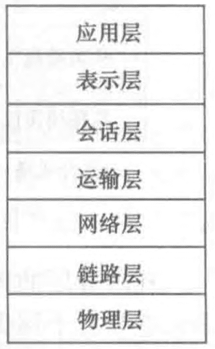

- **表示层**：使通信的应用程序能够解释交换数据的含义。包括**数据压缩**、**数据加密**以及**数据描述【数据格式】**。
- **会话层**：提供了数据交换的定界和同步功能，包括了建立检查点和恢复方案的方法。

### 封装

 

- **数据传输**

  > *在每一层，一个分组具有两种类型的字段：**首部字段**和**有效载荷字段【来自上一层分组】***

  - 在发送主机端，一个应用层**报文**被传输给**运输层**。

  - **运输层**收取到报文并附上**运输层首部信息**，首部信息被接收端的运输层使用。**应用层报文**和**运输层首部信息**一道构成**运输层报文段**，传递给**网络层**，首部信息包括以下内容：

    > 1. 允许接收端运输层向上向适当的应用程序交付报文的信息。【**端口**】
    > 2. **差错检测位信息**，让接收方能够判断报文中的比特是否在途中已被改变。

  - **网络层**增加了如**源和目的端系统地址**等**网络层首部信息**，生成了**网络层数据报**。传递给**链路层**。

  - **链路层**增加他自己的**链路层首部信息**并生成**链路层帧**。

- **实现层次**

  - **路由器**：实现了1~3层。
  - **链路层交换机**：实现了1、2层。

## 网络攻击

### 恶意软件

- **僵尸网络**：数以千计的受害设备网络。
- **自我复制**：大多数恶意软件是**自我复制**的。感染一台后，以当前主机寻找其他主机。

- **扩散方式**
  - **病毒**：需要某种形式的用户交互来感染用户设备。【可执行代码的邮件】
  - **蠕虫**：无需用户交互。用户运行了个**被攻击的脆弱应用程序**，这个应用程序从因特网接收恶意软件并执行。

### 拒绝服务攻击【Dos】

> *Denial-Of-Service attack*。可以用**僵尸网络**发起攻击。

 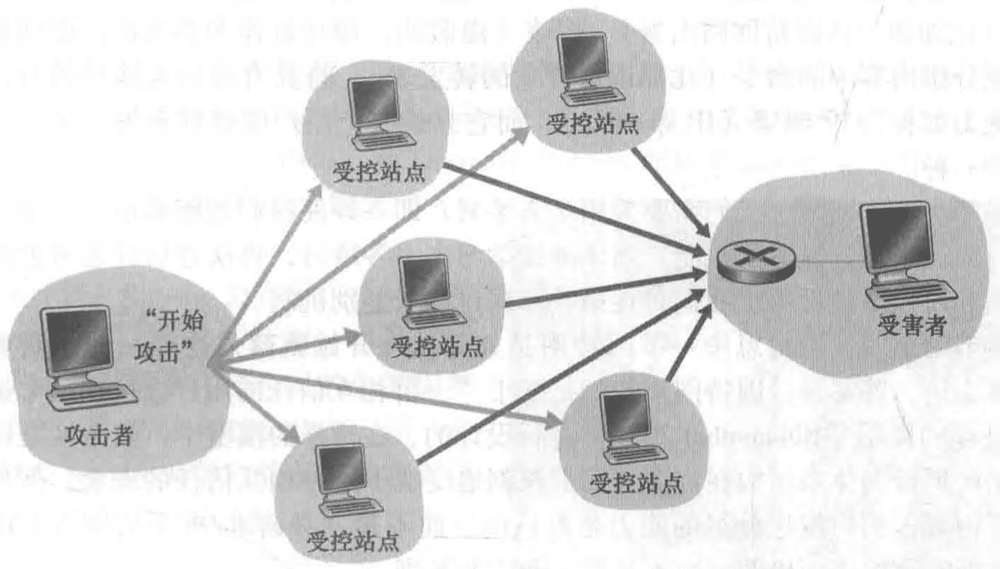

- **弱点攻击**：向应用程序发送制作精细的报文，可导致**服务器停止运行**、或**主机崩溃**。
- **带宽洪泛**：攻击者向目标主机发送大量的分组，使目标的接入链路变得拥塞，使得合法的分组无法达到服务器。
- **连接洪泛**：在目标主机中创建大量的半开获全开的TCP连接。主机因为伪造连接而陷入困境，并停止接收合法的连接。

### 分组嗅探器

被动的，不向信道注入分组，所以很难检测。

### IP哄骗

攻击者生成具有任意源地址、分组内容和目的地址的分组，传输到因特网中。我们需要使用**端点鉴别**处理。

# 应用层

## 协议原理

定义了运行在不同端系统上的应用程序如何相互传递报文。**应用层协议只是网络应用的一部分**。

- **交换的报文类型**：例如请求报文和响应报文。
- **各种报文类型的语法**：如报文中的各个字段及其描述。
- **字段的语义**：字段中信息的含义。
- 何时及如何发送报文，对报文进行响应的规则。

### 网络应用程序体系结构

#### 客户-服务器体系结构

 

- 客户之间不直接通信。
- 服务器具有固定的、周知的地址，称为IP地址，并且总是打开的。
- 需要**数据中心**来创建强大的虚拟服务器。

#### P2P体系结构

 

应用程序在间断连接的**主机对**之间使用直接通信，这些主机称为**对等方**。这些对等方并不为服务提供商所有，相反却为用户控制的桌面机和膝上机所有，大多数对等方驻留在家庭、大学和办公室。

> **文件共享**、**协助下载器【迅雷】**、**因特网电话**和**视频会议**。

### 进程通信

#### 客户与服务器进程

在一对进程之间的通信会话场景中，发起通信的进程被标识为**客户**，在会话开始时等待联系的进程是**服务器**。

#### 套接字：进程与计算机网络之间的接口

 

- 进程通过一个称为**套接字【socket】**的软件接口**向网络发送报文**和**从网络接收报文**。
- **套接字**：是同一台主机内应用层和运输层之间的接口，由于该套接字是建立网络应用程序的可编程接口，因此套接字也称为**应用程序和网络**之间的**应用程序编程接口【API，Application Programming Interface】**。

#### 进程寻址

在一台主机上运行的进程为了向在另一台主机上运行的进程发送分组，接收进程需要一个**地址**，为了标识该接受进程，需要定义两种信息。

- **IP**：主机的地址。
- **端口号**：在目的主机中指定接收进程的标识符。

### 运输层的服务

#### 通用运输服务

> 每种运输模式可以为调用它的应用程序提供不同的服务，服务可以分为**四类**。

- **可靠数据传输**：确保由应用程序的一端发送的数据正确、完全地交付给该应用程序的另一端。
  - **容忍丢失的应用**：交谈式**音频/视频**。
- **吞吐量**：运输层协议能够以**某种特定的速率提供确保的可用**吞吐量。具有吞吐量要求的应用程序被称为**带宽敏感的应用**。
- **定时**：可以以多种形式实现。比如到达时间不低于100ms，在**游戏和虚拟环境**中需要。
- **安全性**：除了机密性外，还提供数据完整性和端点鉴别的安全行服务。
  - **机密性**：能够加密由发送进程传输的所有数据，在接收主机，运输层协议能够在将数据交付给接收进程之前解密这些数据。

#### 运输服务协议

##### TCP服务

- **提供的服务**

  - **面向连接的服务**
    - **握手**：提醒客户和服务器为大量分组的带来做准备。
    - **TCP连接**：握手阶段后，连接在两个套接字之间建立了。
    - **拆除连接**：应用程序结束报文发送后。

  - **可靠的数据传送服务**：无差错、按适当顺序交付所有发送的数据。没有字节的丢失和冗余。

- **其他功能**

  - **拥塞控制机制**：能够为因特网带来整体好处，不一定能为通信进程带来直接好处。

  - **安全套接字层【SSL】**：*Secure Sockets Layer*，是TCP的加强，在应用层实现的，**不是和TCP和UDP同一层次**的第三种运输服务。

    > 当一个应用使用SSL时：
    >
    > 1. 发送进程向**SSL套接字**传递明文数据。
    > 2. 发送主机中的SSL则加密该数据并向加密的数据传递给**TCP套接字**。
    > 3. 加密的数据经因特网传送到接收进程中的**TCP套接字**。
    > 4. 接收套接字将加密数据传递给SSL，由其进行**解密**。
    > 5. 最后，SSL通过它的**SSL套接字**将明文数据传递给**接收进程**。

##### UDP服务

仅提供最小服务，不提供不必要服务的轻量级运输协议。无连接、不保证报文到达、不保证顺序、没有拥塞控制。

#### 运输协议不提供的服务

当前协议没有提供吞吐量和定时服务。

## 应用：WEB和HTTP

### HTTP：超文本传输协议

> HyperText Transfer Protocol。

- **web页面**：由对象组成，一个对象只是一个文件，可以通过一个url地址寻址。

  > 多数web页面含有一个**HTML基本文件**以及几个引用对象【通过**url地址**引用】。

- **url地址**：存放对象的服务器主机名、对象的路径名。

- **web浏览器**：IE、GOOGle，实现了HTTP的客户端。

- **web服务器**：实现了HTTP的服务器端。

- **无状态协议**：不存储任何关于该客户的状态信息。

#### 非持续连接和持续连接

- **非持续连接**

  > - 必须为每一个请求的对象建立和维护一个全新的连接。对于每个连接，在客户端和服务器中都要分配TCP的缓冲区和保持TCP变量，给web服务器带来严重负担。
  > - 每一个对象经受两倍 **RTT** 的交付时延，即一个 **RTT** 用于创建 **TCP**，另一个 **RTT** 用于请求和接收一个对象。

- **持续链接**：在相同的客户端和服务器之间，后续的请求和响应报文都能通过相同的连接进行传送。连接超过一定时间未被使用，才关闭连接。

### HTTP报文格式

#### 请求报文

  

- **请求行【request line】**
  - *方法字段*：GET、POST、HEAD、PUT和DELETE。
  - *URL字段*：带有请求字段的标识。
  - *HTTP版本*。
- **首部行【header line】**
  - *Host*：指明对象所在的主机。
  - *Connection*：指明是否使用长连接。close 要求服务器在发送完被请求的对象后就关闭连接。
  - *User-Agent*：用来指明用户代理，即向服务器发送请求的浏览器类型。
  - *Accept-language*：想得到的对象的语言版本。
- **实体【entity body】**

#### 响应报文

 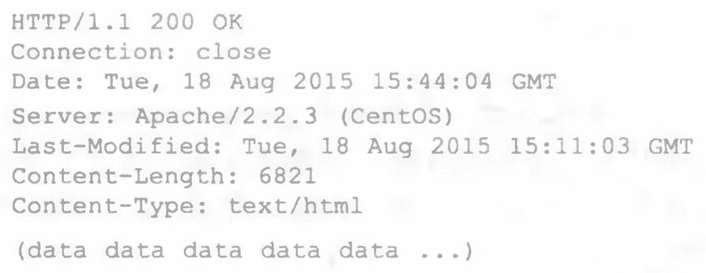 

- **状态行【status line】**
  - *200 OK*：请求成功，信息在请求报文中。
  - *301 Moved Permanently*：请求对象被永久转移了，新的URL定义在响应报文的 *Location*，客户软件会自动获取新的 URL。
  - *400 Bad Request*：一个通用差错代码，只是该请求不能被服务器理解。
  - *404 Not Fount*：被请求的文档不在服务器上。
  - *505 HTTP Version Not Supported*：服务器不支持请求报文使用的 HTTP 协议版本。
- **首部行**
  - *Date*：服务器产生并发送该报文的日期和时间。
  - *Server*：指示报文产生的服务器名称。
  - *Last-Modified*：对象创建和最后修改的日期和时间。
  - *Content-Length*：被发送对象中的字节数。
  - Content-Type：对象的类型。
- **实体**

### cookie：用户与服务器的交互

 

- **组件**
  - 在 HTTP 响应报文中的一个 cookie 首部行。
  - 在 HTTP 请求报文中的一个 cookie 首部行。
  - 在用户端系统中保留有一个 cookie 文件，并由**用户的浏览器**进行管理。
  - 位于 Web 站点的一个后端数据库。
- **请求首部行**：`cookie`。
- **响应首部行**：`Set-cookie`。

### Web缓存【代理服务】

 

#### 缓存器请求过程

1. 浏览器创建到**Web缓存器**的**TCP连接**，并向缓存器发送一个HTTP请求。
2. Web缓存器**检查本地是否存储**对象副本。如果有，用HTTP响应报文返回缓存对象。
3. 如果没有，**Web缓存器**打开一个与**对象初始服务器**的**TCP连接**。发送一个HTTP请求。**初始服务器向Web缓存器**发送具有该对象的HTTP响应。
4. Web缓存器接收到该对象，在**本地存储一份副本**，并向**客户的浏览器**用HTTP响应报文**发送副本**。

#### 缓存器的优势

1. 可以大大减少对客户请求的响应时间。
2. 能够大大减少一个机构的接入链路到因特网的通信量。节省带宽，降低费用。
3. 能从整体上大大减低因特网上的Web流量。

#### 内容分发网络【CDN】

*Content Distribution Network*。CDN公司在因特网上安装了许多地理上分散的缓存器，因而使大量流量实现了本地化。

#### 条件 GET

解决存放在缓存器中的对象可能陈旧的问题。

- **缓存服务器的请求报文**
  - *方法*：GET。
  - *首部行【If-Modified-Since】*：缓存文件上一次响应报文的 *Last-Modified*。
- **Web服务器**
  - 没有修改：返回 *304 Not Modified*。
  - 修改：返回修改后的文件。

## 应用：电子邮件和SMTP

 

- **用户代理**：允许用户**阅读**、**回复**、**转发**、**保存**和**撰写**报文。例如 *Outlook* 和 *Apple Mail*。
  - *发送*：邮件代理向邮件服务器发送邮件，邮件放在邮件服务器的外出**报文队列**中。
  - *阅读*：用户代理在其邮件服务器的**邮箱**中获取报文。
- **邮件服务器**
  - *邮箱*：每个接收方都有一个邮箱。
  - *报文队列*：保持报文并进行重试，通常每30分钟重试一次，如果几天后仍不能成功，就删除报文并通知发送方。
- **简单邮件传输协议【SMTP】**：*Simple Mail Transfer Protocol*，电子邮件中的协议。从发送方的邮件服务器发送报文到发送方的邮件服务器。
- **邮件访问协议**：用户代理服务获取邮件服务器邮件时使用的协议。

### SMTP

> 一般不使用**中间邮件服务器**发送邮件，即使这两个服务器位于地球两端。

1. **客户SMTP** 在25号端口建立一个到**服务器 SMTP** 的TCP连接。

2. 服务器和客户执行某些**应用层的握手**。然后**发送报文**，依赖 TCP 提供的可靠数据传输无差错地将邮件投递到接收服务器。

    

   >  客户发送 5 条命令:**HELO【HELLO】**、**MAIL FROM**、**RCPT TO**、**DATA** 以及 **QUIT**。

3. 如果没有其他报文，客户端指示 **TCP 关闭**连接。

#### 与HTTP的对比

|                           HTTP                           |                       SMTP                        |
| :------------------------------------------------------: | :-----------------------------------------------: |
|    **拉协议**， TCP连接是由**想接收文件**的机器发起的    | **推协议**，TCP连接是由**要发送文件**的机器发起的 |
| SMTP要求每个报文【包括它们的体】采用**7比特ASCII码**格式 |                     不受限制                      |
|          SMTP把所有报文对象放在**一个报文**之中          |  把**每个**对象封装到它自己的HTTP**响应报文**中   |

#### 报文格式

- **首部**：由 **RFC 5322** 定义。

   

  **From**、**To**、**Subject**以及其他可选的首部行。

- **报文体**：报文首部之后，紧接着一个空白行，然后是以ACSII格式表示的报文体。

### 邮件访问协议

#### 第三版邮局协议【POP3】

> **Post Office Protocol - Version 3**。

当**用户代理【客户】**打开了一个到**邮件服务器【服务器】端口110**上的**TCP连接**后，POP3就开始工作了。工作有三个阶段。

##### 代理【客户】

- **特许**

   

  - `user < user name >`
  - `pass < password > `

- **事务处理**

  - **下载并删除**：存在问题，邮件接收方Bob可能是移动的。

     

    - `list`：请求邮件服务器列出所有存储的报文的长度。
    - `retr`：取回邮件。
    - `dele`：删除邮件。
    - `quit`：结束会话。

  - **下载并保留**：不执行 `dele`。

- **更新**：`quit`后，邮件服务器删除标记为删除的邮件。

##### 服务器

用户代理发出命令，服务器对每个命令做出回答。

- **+OK**：服务器用来指示前面的命令是正常的。
- **-ERR**：服务器用来指示前面的命令出现了某些差错。

#### 因特网邮件访问协议【IMAP】

> **Internet Mail Access Protocol**，解决POP3协议没有给用户提供任何创建远程文件夹并为报文指派文件夹的方法。

- **把每个报文与一个文件夹联系起来**：当报文第一次到达服务器时，它与收件人的INBOX文件夹相关联。收件人则能够把邮件移到一个新的、用户创建的文件夹中，阅读邮件，删除邮件等。
  - **IMAP协议** 为**用户**提供了**创建文件夹**以及将**移动文件**的命令。
  - **IMAP协议** 为**用户**提供了**在远程文件夹中查询邮件**的命令，按**指定条件去查询匹配**的邮件。
  - 维护了 **IMAP会话** 的**用户状态信息**：文件夹的名字以及哪些报文与哪些文件夹相关联。
- 具有允许用户代理**获取报文某些部分**的命令：可以只读取报文首部，或者不取回音频或视频片断的大邮件。

#### 基于 Web 的电子邮件【HTTP】

> 使用 Web 浏览器收发邮件。

- **用户代理**就是普通的**浏览器**。
- **通信**通过 **HTTP** 进行。
- **邮件服务器之间**仍然是 **SMTP**。

## 应用：DNS

> **Domain Name System**。

- 一个由分层的 **DNS服务器** 实现的分布式数据库：运行在**BIND软件**的**UNIX机器**。
- 一个使得主机能够查询分布式数据库的 **应用层协议**：**DNS协议**运行在**UDP**上，使用53号端口。

### 提供的服务

- **主机名到IP地址的转换**
  - 同一用户主机上运行着 **DNS 客户端**。
  - **浏览器**从URL中抽取**主机名**传给 **DNS 客户端**。
  - **DNS 客户端** 向 **DNS服务器** 发送一个包含主机名的**请求**。
  - **DNS 客户端** 收到**回答报文**，含有对应的 **IP地址**。
  - 浏览器接收到**来自 DNS** 的 **IP 地址**，向**该IP地址80端口**的 **HTTP服务器进程**发起一个**TCP连接**。
- **主机别名**：复杂主机名的主机能够拥有一个或多个别名，应用程序可以调用DNS来获得主机别名对应的**规范主机名**和**主机的IP地址**。
- **邮件服务器别名**：电子邮件应用程序可以调用DNS，对提供的主机名别名进行解析，以获得该主机的规范主机名及其IP地址。
- **负载分配**
  - 一个**IP地址集合**与**同一个规范主机名**相联系。DNS数据库中存储着这些IP地址集合。
  - 服务器用IP地址的**整个集合**进行**响应**，但在每个回答中**循环这些地址次序**。

### 工作机制

#### 分布式、层次数据库

##### 层次结构

 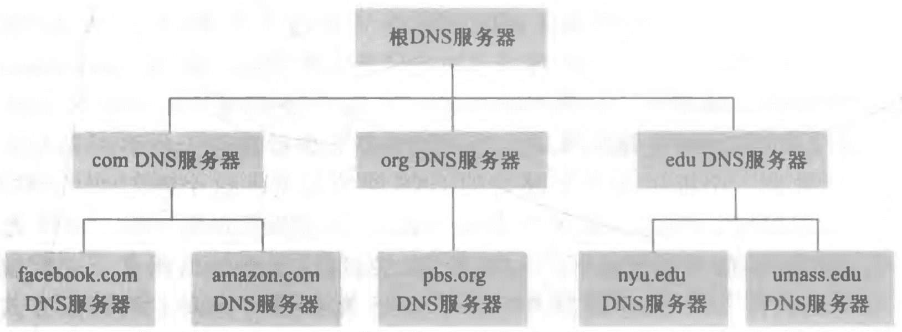

- **根DNS服务器**
  - **400多个**根名字服务器**遍及全世界**。由**13个组织**管理。
  - 根名字服务器**提供 TLD服务器** 的 **IP 地址**。
- **顶级域【TLD】服务器**：*Top-Level Domain*。
  - 对于每个**顶级域【如com、org、net、edu和gov】**和所有**国家的顶级域【如uk、fr、ca和jp】**，都有TLD服务器【服务器集群】。
  - TLD服务器**提供**了**权威 DNS 服务器**的 **IP 地址**。
- **权威 DNS 服务器**
  - 在因特网上具有**公共可访问主机**【如Web服务器和邮件服务器】的每个组织机构**必须提供公共可访问的DNS记录**，这些记录将这些主机的名字映射为IP地址。
  - 一个组织机构的权威DNS服务器**收藏**了这些**DNS记录**。
    - 组织机构实现它自己的权威DNS服务器保存这些记录。
    - 组织机构支付费用，让这些记录存储在某个服务提供商的一个权威DNS服务器中。
- **本地DNS服务器**：**并不属于服务器的层次结构**，但至关重要。
  - 每个 ISP 都有一台本地**DNS服务器【默认名字服务器】**。当主机与某个 ISP 连接时，该 ISP 提供一台主机的 IP 地址，该主机具有一台或多台其**本地 DNS 服务器**的 **IP 地址**。
  - 当主机**发岀 DNS 请求**时，请求被发往**本地 DNS 服务器**，它起着**代理**的作用，将请求**转发**到 **DNS 服务器层次结构**中。

##### 查询

 

> 主机 `cse.nyu.edu` 想知道主机 `gaia.cs.umass.edu` 的IP地址。

1. **主机** `cse.nyu.edu` **向它的本地 DNS 服务器** `dns.nyu.edu` **发送**一个 **DNS 查询报文**。报文中包含主机名 `gaia.cs.umass.edu`。
2. **本地 DNS 服务器**将报文**转发**到**根 DNS 服务器**，**根 DNS 服务器**返回**负责 `edu` 的 TLD** 的 **IP 地址列表**。
3. **本地 DNS 服务器**将报文**发送**到 **TLD 服务器之一**，**TLD 服务器**返回**权威 DNS 服务器**的 **IP 地址**。
4. **本地 DNS 服务器**将报文**发送**到 **权威 DNS 服务器**，拿到 `gaia.cs.umass.edu` 的 **IP 地址**。
5. **本地 DNS 服务器**返回给**主机**`gaia.cs.umass.edu`的 **IP 地址**。

#### DNS缓存

在一个请求链中，当某DNS服务器接收一个DNS回答时，将映射缓存在本地的存储器中，映射通常在两天后丢弃缓存消息。

本地DNS服务器也能够缓存TLD服务器的IP地址，因而允许本地DNS绕过查询链中的根DNS服务器。

### 资源记录【RR】

> **Resource Record**。提供了主机名到 IP 地址的映射。***四元组 (Name, Value, Type, TTL)***。

**TTL** 是该记录的生存时间，先忽略。**Name** 和 **Value** 的值取决于 **Type**：

- 如果 **Type = A**，则 **Name** 是主机名。**Value** 是该主机名对应的 IP 地址。如 `(relay1.bar.foo.com, 145.37.93.126, A)`。
- 如果 **Type = NS**，则 **Name** 是个域。**Value** 是权威 DNS 服务器的主机名。如 `(foo.com, dns.foo.com, NS)`。
- 如果 **Type = CNAME**，则 **Name** 是主机别名。**Value** 是规范主机名。如 `(foo.com, relay1.bar.foo.com, CNAME)`。
- 如果 **Type = MX**，则 **Name** 是主机别名。**Value** 是邮件服务器的规范主机名。如 `(foo.com, mail.bar. foo.com, MX)`。

#### 插入记录

1. 在**注册登记机构【registrar】**注册域名：是一个商业实体，验证该域名的唯一性，将该域名输入DNS数据库。并收取少量费用。

2. 向该机构提供你的**基本**和**辅助权威DNS服务器**的名字和IP地址。

3. 必须确保用于 Web 服务器 www.networkutopia.com的类型A资源记录和用于邮件服务器 mail.networkutopia.com 的类型MX资源记录被输入你的权威DNS服务器中。

   > 每台DNS服务器中的内容都是静态配置的，是个配置文件。

### 报文格式

 

>  **DNS只有查询报文和回答报文**，并且两种报文有相同的格式。

- **首部区域**：12字节。

  - **标识符**：16比特，标识查询，复制到回答报文中，用于匹配查询和回答。
  - **标志**：有若干标志。
    - **报文类型**：区分查询报文【0】和回答报文【1】。
    - **权威标志位**：返回权威服务器时，该标志位置为1。
    - **递归标志位**：客户希望在没有某记录时执行递归查询。
  - **4个数量字段**：指出在首部后的4类**数据区域**出现的数量。

- **问题区域**：包含查询信息。

  - **名字字段**：包含要查询的主机名字。
  - **类型字段**：指出有关该名字的正被询问的问题类型。如【A、MX】。

- **回答区域**：包含多条 RR。

- **权威区域**：包含其他权威服务器的记录。

- **附加信息**：包含了其他有帮助的信息。

  > 一个 MX 请求的回答报文的回答区域包含了一条资源记录，该记录提供了邮件服务器的规范主机名。附加区域包含一个类型A记录。

## 应用：P2P文件分发

## 应用：视频流

### 视频

- 视频是一系列的图像，通常以一种恒定的速率【如每秒24或30张图像】来展现。
- **图像**：一幅未压缩、数字编码的图像由像素阵列组成，其中每个像素是由一些比特编码来表示亮度和颜色。
- **压缩**：视频的一个重要特征是压缩，可用比特率来权衡视频质量。
  - 低质量：100kbps
  - 流式高分辨率：3Mbps
  - 4K流式：10Mbps

### HTTP流和DASH

- **http流**：视频是一个存储在HTTP服务器中的普通文件，每个文件有一个特定的URL。
  - 客户与服务器创建一个TCP连接并发送对该url的HTTP GET请求。
  - 服务器以底层网络协议和流量条件允许的尽可能快的速率，在一个HTTP响应报文中发送该视频文件。
  - 客户端，字节被收集在客户应用缓存中。缓存中字节数量超过预先设定的门槛就开始播放，流式视频应用程序周期性地从客户应用程序缓存中抓取帧，对这些帧解压缩并且在用户屏幕上展现。
  - **问题**：所有客户接收到相同编码的视频，但不同的客户或相同客户不同时间，客户可用的带宽不同。
- **经HTTP的动态适应性流【DASH】**：*Dynamic Adaptive Streaming over HTTP*。
  - **视频编码**：有几个不同的版本，每个版本有不同的比特率，对应于不同的质量水平。每个视频版本存储在HTTP服务器中，每个版本都有一个不同的 URL。
  - **视频段**：客户动态地请求来自不同版本且长度为几秒的视频段数据块。
  - **告示文件**：为每个版本提供了一个URL及其比特率。客户首先请求该告示文件并且得知各种各样的版本。
  - **速率决定算法**：在下载块的同时，客户也测量接收带宽并运行一个*速率决定算法*来选择下次请求的块。

## 应用：内容分发网【CDN】

> **Content Distribution Network**。

### CDN类型

- **专用CDN**：由内容提供商自己拥有，如Google。
- **第三方CDN**：代表多个内容提供商分发内容。

### 服务器安置原则

- **深入**：通过在遍及全球的接入ISP中部署服务器集群来深入到ISP的接入网中。目标是靠近端用户。
- **邀请做客**：在少量【如10】关键位置建造大集群来邀请到ISP做客。不放在**接入ISP**中，通常放置在**因特网交换点【IXP】**。

### CDN操作

 

1. 用户访问位于 **NetCinema** 的 Web 网页。

2. 当用户点击链接 http://video.netcinema.com/6Y7B23V 时，该用户主机发送了一个对于 `video.netcinema.com` 的 DNS 请求。

3. 用户的**本地DNS【LDNS】**将请求中继到一台用于 NetCinema 的权威 DNS 服务器，该服务器识别到 `video`，NetCinema 权威 DNS 服务器并不返回一个IP地址，而是向 LDNS返回一个KingCDN域的主机名。

4. 用户的LDNS则发送二个请求，进入了 KingCDN 专用 DNS 基础设施。KingCDN 返回 KingCDN 内容服务器的 IP 地址。

5. LDNS向用户主机转发内容服务CDN节点的IP地址。

6. 创建 TCP 连接，并且发出对该视频的 HTTP GET 请求。

   > **对于DASH**，服务器先向客户告示文件，每个URL对应视频的每个版本，客户端动态地选择来自不同版本的块。

### 集群选择策略

动态地将客户定向到CDN中的某个服务器集群或数据中心的机制。

- **地理上最为邻近**：使用商用地理位置数据库，每个 LDNS IP地址都映射到一个地理位置。但地理最临近的集群可能不是最近的集群。
- **基于当前流量条件**：对其集群和客户之间的时延和丢包性能执行周期性的实时测量。

## 套接字编程

- TCP只需要经过套接字将数据丢进TCP连接。
- TCP服务器握手的套接字和连接时的套接字不同，*欢迎套接字*和*连接套接字*。
- 而**UDP服务器**在将分组丢进套接字之前必须为其**附上一个目的地**地址。

# 运输层

 

- **逻辑通信**：运输层协议为运行在**不同主机上的应用进程之间**提供了**逻辑通信**，通过逻辑通信，运行不同进程的主机好像直接相连一样。

  > **网络层逻辑通信**：运输层协议在**不同主机之间**提供了**逻辑通信**。

- **端系统实现**：运输层协议是在端系统中而不是在路由器中实现的。

- **报文段**：将从发送应用程序进程接收到的报文转换成运输层分组，称为报文段。

  > 将应用报文划分为较小的块，并为每块**加上一个运输层首部**以生成运输层报文段。

- **TCP**：**传输控制协议**，为调用它的应用程序提供了一种可靠的、面向连接的服务。

- **UDP**：**用户数据报协议**，为调用它的应用程序提供了一种不可靠、无连接的服务。

## 运输层服务

1. **受限**：运输协议能够提供的服务**受制于底层网络层协议**的服务模型。如果网络层协议无法为主机之间发送的运输层报文段**提供时延或带宽保证**的话，运输层协议也无法为进程之间发送的应用程序报文提供时延或带宽保证。
2. **超越**：即使底层网络协议不能在网络层提供相应的服务，运输层协议也能提供某些服务。**即使底层网络协议是不可靠的，运输协议也能为应用程序提供可靠的数据传输服务**。

### 多路复用与多路分解

 

- **多路分解**：将运输层报文段中的数据交付到正确的套接字。
- **多路复用**：源主机从不同套接字中收集数据块，为每个数据块封装上首部信息生成报文段，然后将报文段传递到网络层。
  - *套接字有唯一标识符*：**源端口号字段**和**目的端口号字段**。
  - *每个报文段有特殊字段来指示该报文段所要交付到的套接字*。
- **端口号**：一个16比特的数，其大小在 *0 ~ 65535* 之间。
  - **周知端口号**：*0 ~ 1023*，保留给 HTTP ~ FTP 之类的周知应用层协议来用。

#### 无连接的多路复用和多路分解

> - **UDP套接字**：由一个二元组全面标识【目的IP、目的端口】，**如果两个UDP报文段源 IP /端口不同，但目的IP端口相同**，那么这两个报文段将通过相同的目的套接字被定向到相同的目的进程。

 

1. 主机A中的运输层创建一个运输层报文段【包括应用程序数据、源端口号、目的端口号、长度、校验和】。
2. 运输层将得到的报文段传递到网络层。网络层将该报文段封装到一个 IP 数据报中，并尽力而为地将报文段交付给接收主机。
3. 主机B运行多个进程，每个进程都具有自己的**UDP套接字**和**相联系的端口号**。
4. 当 UDP 报文段从网络到达时，主机B检查报文段的目的端口号，将每个报文段定向【分解】到相应的套接字。

#### 面向连接的多路复用和多路分解

> - **TCP套接字**：由一个四元组【源 IP 地址，源端口号，目的IP地址，目的端口号】标识的。当一个TCP报文段从网络到达一台主机时，该主机使用全部四个值来讲报文段定向到相应的套接字。**与UDP不同的是**，**如果两个TCP报文段源 IP /端口不同，但目的IP端口相同**，将被定向到两个不同的套接字，**除非**TCP报文段携带了初始创建连接的请求。

 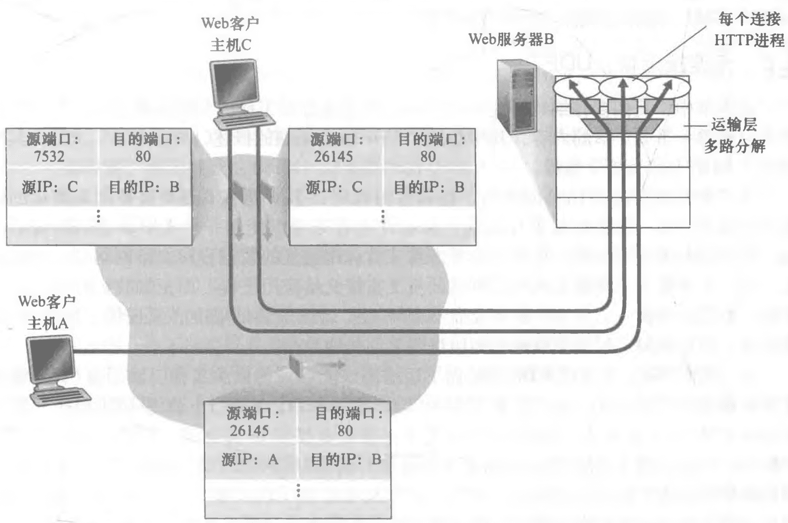

1. TCP服务器应用程序有一个「欢迎套接字」。在一个端口上等待来自TCP客户的连接建立请求。
2. TCP客户创建一个套接字并发送一个连接建立请求报文段。
3. 当服务器主机的操作系统接收到具有目的端口的**入连接请求报文段**后，定位到服务器进程，服务器进程创建一个新的套接字。
4. 新创 建的连接套接字通过四元组来标识。所有后续到达的报文段，如果它们的四元组一直，则被分解到同个套接字。

#### Web服务器与TCP

- 连接套接字与进程之间并非总是有着一一对应的关系。事实上，当今的高性能Web服务器通常只使用一个进程，但是为每个新的客户连接创建一个具有新连接套接字的新线程。
- 如果客户与服务器使用持续HTTP，则在整条连接持续期间，客户与服务器之间经由**同一个服务器套接字**交换HTTP报文。

### 可靠传输服务原理

**要点：检验和、序号、定时器、肯定和否定确认分组。**

 

- *rdt*：可靠数据传输协议。
- *udt*：不可靠数据传输协议。

#### 自动重传请求协议【ARQ】

> **Automatic Repeat reQuest**，基于重传机制的可靠数据传输协议。有三种功能处理比特差错。

- **差错检测**：要求有额外的比特从发送方发送到接收方。
- **接收方反馈**：让接收方提供明确的反馈信息给发送方。
- **重传**：接收方收到有差错的分组时，发送方将重传该分组文。

#### 停等可靠数据传输协议

- **停等协议**：当发送方处于等待响应的状态时，不能从上层获得更多的数据。

- **有限状态机【FSM】**：*Finite-State Machine*。
  - **横线上方**：引起变迁的事件。
  - **横线下方**：事件发生时采取的动作。
  - **符号⋀**：表示缺少动作或事件。
  - **虚线**：FSM 的初试状态。

##### rdt1.0：经完全可靠信道的可靠数据传输

> 假定底层信道是完全可靠的。

 

- **发送端**
  - `rdt_send(data)` 事件：接受来自较高层的数据，
  - `make_pkt(data)` 动作：产生一个包含该数据的分组。
  - `udt_send(packet)` 动作：将分组发送到信道中。
- **接收端**
  - `rdt_rcv(packet)` 事件：从底层信道接收一个分组。
  - `extract(packet, data)` 动作：从分组中取出数据。
  - `deliver_data(data)` 动作：将数据上传给较高层。

##### rdt2.0：经具有比特差错信道的可靠数据传输

> 假定所有发送的分组将按顺序被接收，但网络的物理部件可能造成比特受损。
>
> - **致命缺陷**：考虑 ACK 和 NCK 分组有可能受损。

 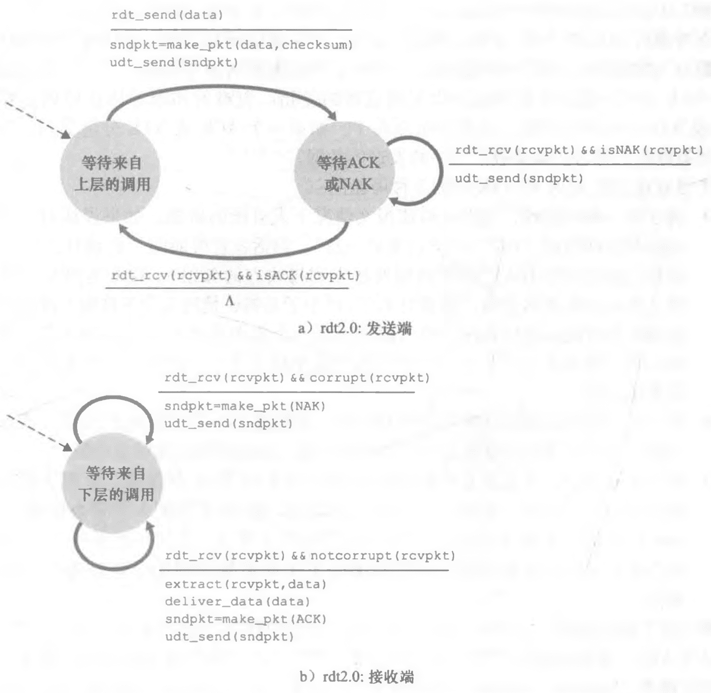

- **发送端**：有两个状态。
  - **等待上层调用**
    - `rdt_send(data)` 事件：接受来自较高层的数据。
    - `make_pkt(data, checksum)` 动作：产生一个包含该数据的分组，包含校验和。
    - `udt_send(sndpkt)` 动作：将分组发送到信道中。
  - **等待 ACK 或 NAK 分组**
    - `rdt_rcv(rcvpkt) && isACK(rcvpkt)`：等待来自接收方的 ACK 或 NAK 分组。如果收到一个 ACK 分组，则发送方知道最近发送的分组已被正确接收。协议返回到等待来自上层的数据的状态。
    - `rdt_rcv(rcvpkt) && isNAK(rcvpkt)`：等待来自接收方的 ACK 或 NAK 分组。如果收到一个 NAK 分组，则重传上一个分组并等待接收方响应。
- **接收端**
  - `rdt_rcv(rcvpkt) && corrupt(rcvpkt)`：收到一个分组并发现有错。
    - `make_pkt(NAK)`：产生一个包含该否定确认的分组。
    - `udt_send(sndpkt)` 动作：将肯定确认的分组发送到信道中。
  - `rdt_rcv(rcvpkt) && notcorrupt(rcvpkt)`：收到一个分组并且无错。
    - `extract(rcvpkg, data)` 动作：从分组中取出数据。
    - `deliver_data(data)` 动作：将数据上传给较高层。
    - `make_pkt(ACK)`：产生一个包含该肯定确认的分组。
    - `udt_send(sndpkt)` 动作：将肯定确认的分组发送到信道中。

##### rdt2.1：经具有比特差错信道的冗余【重试】分组机制的可靠数据传输

 

- **发送方**：有四个状态。

  > 在数据分组中添加一个字段，让发送方对其数据编号【即将发送数据分组的序号】。只需要1比特就够了，用来区分是重传的还是下一个。
  >
  > 当 ACK 或 NAK 出错时，重传当前分组。

- **接收方**：有两个状态。

##### rdt2.2：经具有比特差错信道的无NAK的可靠数据传输协议

 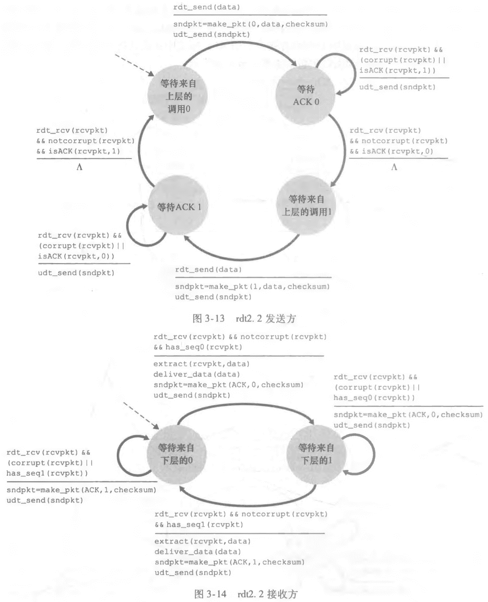

ack分组复用分组编号，如果是 NAK 的话就返回相反的编号。

##### rdt3.0：经具有比特差错的丢包信道的可靠数据传输

> 假定除了比特受损后，底层信道还会丢包。
>
> - **比特交替协议**：因为分组序号在 0 和 1 之间交替。

 

- **倒计数定时器**：`start_timer`、`stop_timer`。

  - 每次发送一个分组【包括第一次分组和重传分组】时，便启动一个定时器。
  - 响应定时器中断【采取适当的动作】。
  - 终止定时器。

- **交互情况**

  - **无丢包操作**

    ```mermaid
    sequenceDiagram
    	participant A as 发送方
    	participant B as 接收方
    	Note over A: 发送分组0
        A->>B: pkt0
        Note over B: 接收分组0<br />发送ACK0
        B->>A: ACK0
        Note over A: 接收ACK0<br />发送分组1
        A->>B: pkt1
        Note over B: 接收分组1<br />发送ACK1
        B->>A: ACK1
        Note over A: 接收ACK1<br />发送分组0
        A->>B: pkt0
        Note over B: ...
    ```

  - **分组丢失**

    ```mermaid
    sequenceDiagram
    	participant A as 发送方
    	participant B as 接收方
    	Note over A: 发送分组0
        A->>B: pkt0
        Note over B: 接收分组0<br />发送ACK0
        B->>A: ACK0
        Note over A: 接收ACK0<br />发送分组1
        A->>B: pkt1【丢失】
        Note over A: 超时<br />重发分组1
        A->>B: pkt1
        Note over B: 接收分组1<br />发送ACK1
        B->>A: ACK1
        Note over A: 接收ACK1<br />发送分组0
        A->>B: pkt0
        Note over B: ...
    ```

  - **丢失ACK**

    ```mermaid
    sequenceDiagram
    	participant A as 发送方
    	participant B as 接收方
    	Note over A: 发送分组0
        A->>B: pkt0
        Note over B: 接收分组0<br />发送ACK0
        B->>A: ACK0
        Note over A: 接收ACK0<br />发送分组1
        A->>B: pkt1
        Note over B: 接收分组1<br />发送ACK1
        B->>A: ACK1【丢失】
        Note over A: 超时<br />重发分组1
        A->>B: pkt1
        Note over B: 接收分组1【检测冗余】<br />发送ACK1
        B->>A: ACK1
        Note over A: 接收ACK1<br />发送分组0
        A->>B: pkt0
        Note over B: ...
    ```

  - **过早超时**

    ```mermaid
    sequenceDiagram
    	participant A as 发送方
    	participant B as 接收方
    	Note over A: 发送分组0
        A->>B: pkt0
        Note over B: 接收分组0<br />发送ACK0
        B->>A: ACK0
        Note over A: 接收ACK0<br />发送分组1
        A->>B: pkt1
        Note over B: 接收分组1<br />发送ACK1
        Note over A: 超时<br />重发分组1
        A->>B: pkt1
        Note over B: 接收分组1【冗余检测】<br />发送ACK1
        B->>A: ACK1【第一次】
        Note over A: 接收ACK1<br />发送分组0
        B->>A: ACK1【第二次】
        Note over A: 接收ACK1<br />什么也不做
        A->>B: pkt0
        Note over B: ...
    ```

#### 流水线可靠数据传输协议

 

- **增加序号范围**：因为每个输送中的分组必须有一个唯一的序号，而且也有许多个在输送中的未确认报文。
- **两端缓存多个分组**：发送方最低限度应当能缓冲那些**已发送但没有确认**的分组。接收方或许也需要缓存那些**已正确接收**的分组。
- **处理丢失、损坏及延时**：两种基本方法。
  - **回退N步【GBN】**：*Go-Back-N*。
  - **选择重传【SR】**：*Selective Repeat*。

##### 回退N步：GBN

> **使用技术**：**使用序号**、**累积确认**、**检验和**以及**超时/重传**操作。
>
> - **缺点**：单个分组的差错就能够引起GBN**重传大量分组**，许多分组根本没有必要重传。

允许发送方发送多个分组而无需等待确认，也受限于在流水线中未确认的分组数不能超过某个最大数 N。

 

- **基序号**：最早未被确认的分组。
- **下一个序号**：最小的未使用序号【下一个待发分组的序号】。
- **N**：窗口长度，**GBN协议**也常被称为**滑动窗口协议**。

 

- **发送方**：响应三种类型事件

  - *上层的调用*：上层调用 `rdt_send()` 时，先检查滑动窗口是否已满。
    - **已满**：`refuse_data()`，将数据返回给上层，隐式指示上层窗口已满。【或者用信号量使窗口不满时在调用 `rdt_send()` 】
    - **未读**：产生一个分组并发送，并相应的更新变量。
  - *收到一个ACK*：对序号为n的分组的确认采取**累计确认**的方式。
    - **累积确认**：表明接收方已**正确接收**到序号为**n的以前且包括n在内**的所有分组。
  - *超时时间*：发送方重传所有已发送但还未被确认过的分组。发送方仅使用一个定时器。
    - 如果收到一个ACK，但仍有已发送但未被确认的分组，则定时器被重新启动。
    - 如果没有已发送但未被确认的分组，停止该定时器。

- **接收方**

  - 如果一个序号为n的分组被正确接收到，并且按序，则接收方为分组「发送一个 ACK」，并将该分组中的数据部分交付到上层。

  - *其他情况*：接收方丢弃该分组，并为最近按序接收的分组重新发送ACK。

    - **接收方丢弃所有失序分组。尽管丢弃一个正确接收但失序的分组有点浪费，但是有理由**。

      > 接收缓存简单，接收方不需要缓存任何失序分组。

  - 交付上层的按序交付的。

##### 选择重传：SR

> - 窗口长度必须小于或等于序号空间大小的一半。

 

- **发送方**
  - *从上层收到数据*
    - 当从上层接收到数据后，检查下一个可用于该分组的序号。
    - 如果序号位于发送方的窗口内，则将数据打包并发送。
    - 否则就像在GBN中一样，要么将数据缓存，要么将其返回给上层以便后续传输。
  - *超时*：**每个分组**必须拥有其自己的**逻辑定时器**，因为超时发生后只能发送一个分组。**可以使用单个硬件定时器模拟多个逻辑定时器的操作**。
  - *收到ACK*
    - 分组序号在窗口内：将被确认的分组标记为已接收。
    - *分组的序号==send_base*：窗口基序号向前移动到具有最小序号的未确认分组处。
    - 窗口移动了并且有序号落在窗口内的未发送分组，则发送这些分组。
- **接收方**
  - *序号在 `[rcv_base, rcv_base+N-1]` 内的分组被正确接收*：收到的分组落在接收方的窗口内，一个选择ACK被回送给发送方。
    - 该分组以前没收到过，则缓存该分组。
    - 分组的序号等于接收窗口的基序号【rcv_base】，该分组以及以前缓存的序号连续的分组交付给上层，窗口基序号向前移动。
  - *序号在 `[rcv_base-N, rcv_base-1]` 内的分组被正确收到*：产生一个ACK，即使该分组是接收方以前已确认过的分组。
  - *其他情况*：忽略分组。

#### 可靠数据传输机制及其用途

| 机制         | 用途和说明                                                   |
| ------------ | ------------------------------------------------------------ |
| 检验和       | 用于检测在一个传输分组中的比特错误                           |
| 定时器       | 用于超时/重传一个分组，可能因为该分组(或其AGK) 在信道中丢失了。<br />由于当一个分组延时但未丢失(过早超时)，或当一个分组已被接收方收到但从接收方到发送方的ACK丢失时，可能产生超时事件，所以接收方可能会收到一个分组的多个冗余副本 |
| 序号         | 用于为从发送方流向接收方的数据分组按顺序编号。<br />所接收分组的序号间的空隙可使接收方检测出丢失的分组。<br />具有相同序号的分组可使接收方检测岀一个分组的冗余副本 |
| 确认         | 接收方用于告诉发送方一个分组或一组分组已被正确地接收到了。<br />确认报文通常携带着被确认的分组或多个分组的序号。确认可以是逐个的或累积的，这取决于协议。 |
| 否定确认     | 接收方用于告诉发送方某个分组未被正确地接收。<br />否定确认报文通常携带着未被正确接收的分组的序号。 |
| 窗口、流水线 | 发送方也许被限制仅发送那些序号落在一个指定范围内的分组。<br />通过允许一次发送多个分组但未被确认，发送方的利用率可在停等操作模式的基础上得到增加。<br />窗口长度可根据接收方接收和缓存报文的能力、网络中的拥塞程度或两者情况来进行设置。 |

### 拥塞控制原理

> 网络拥塞时会造成路由器缓存溢出，为避免网络拥塞，需要一些机制来遏制发送方。

#### 原因

1. 连接吞吐量有限。
2. 路由器缓存有限。
3. 路由器多跳。

#### 代价

1. 分组的到达速率接近链路容量时，分组经历巨大的排队时延。
2. 发送方必须执行重传以补偿因为**缓存溢出而丢弃的分组**。
3. 发送方在遇到大时延时所进行的不必要重传会引起路由器利用其链路带宽来转发**不必要的分组副本**。
4. 当一个分组沿一条路径被丢弃时，每个上游路由器用于转发该分组到丢弃该分组而使用的传输容量最终被浪费掉了。

#### 解决方案

- **端到端拥塞控制**：网络层没有为运输层拥塞控制提供显式支持。端系统来观察网络行为。**TCP采用端到端的方法**。

- **网络辅助的拥塞控制**：路由器向发送方提供关于网络中拥塞状态的显式反馈信息。简单地用一个比特来指示链路中的拥塞情况。

   

  - 第一种：路由器直接反馈给发送方。
  - 第二种：路由器修改报文字段，由接收方向发送方通知。**至少要经过一个完整的往返时间**。

## UDP：无连接运输

### 适用场景

- *关于发送什么数据以及何时发送的**应用层控制**更为精细*。
- *无需建立连接*。
- *无连接状态*。
- *分组首部开销小*：每个TCP报文段都有20字节的首部开销，而UDP仅有8字节的开销。

### 报文段结构

 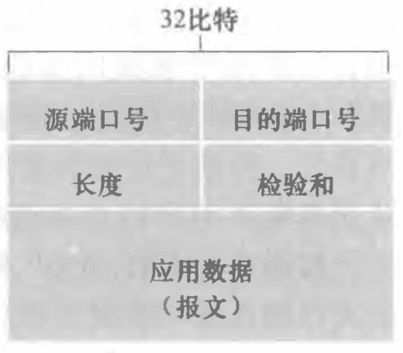

- **源端口号**：作为返回地址，服务端提取源端口号，可以回复报文。
- **目的端口号**：目的数据将应用数据交给相应进程。
- **长度**：UDP报文段中的字节数【**首部加数据**】。
- **校验和**：检查该报文段中是否出现了差错。

### UDP校验和

- **发送方**：UDP对报文段中的**所有16比特字的和**进行**反码运算**，求和时遇到的任何**溢出都被回卷**。得到的结果被放在UDP报文段中的校验和字段。

- **接收方**：全部的16比特字【包括检验和】加在一起。如果该分组中没有引入差错，则在接收方处该和将是 `11111111` 。
- **端到端原则**：与在较高级别提供这些功能的代价相比，在较低级别上设置的功能可能是冗余的或几乎没有价值的。

## TCP：面向连接的运输

### TCP连接

> 两台台主机上的缓存、变量、与进程连接的套接字。

 

1. 进程通过套接字传递数据流。数据之后由 TCP 控制。
2. TCP 将数据引导到连接的**发送缓存【发起三次握手期间设置的缓存之一】**里。
3. TCP 不时从发送缓存里取出一块数据，并将数据传递到网络层。
4. **最大报文长度【MSS】**：*Maximum Segment Size*，TCP可从缓存中取出并放入报文段中的数据数量。通常根据**最大传输单元**来设置。**典型值1460字节**。
5. **最大传输单元【MTU】**：*Maximum Transmission Unit*，本地发送主机发送的最大链路层帧长度。**典型值1500字节**。

### 报文段结构

 

- **源端口号、目的端口号**：各16比特。

- **序号和确认号**：各32比特，被TCP发送方和接收方用来实现可靠数据传输服务。

  - **序号**：建立在传送的字节流之上，而不是建立在传送的报文段的序列之上。是**该报文段首字节的字节流编号**。

  - **确认号**：主机 A填充进报文段的确认号是主机A期望从主机B收到的下一字节的序号。

    > 假设主机A收到主机B的0~535的字节，打算发一个报文给主机B，并且等待536之后的字节，就会将确认号字段填上536。

- **接收窗口字段**：16比特，用于流量控制，该字段用于指示接收方愿意接受的字节数量。

- **首部长度字段**：4比特，以32比特的字为单位的TCP首部长度。TCP首部的长度是**可变**的。【通常, 选项字段为空，所以TCP首部的典型长度是20字节】。

- **选项字段**：可选于变长，用于发送方与接收方协商**最大报文段长度【MSS】**，或在高速网络环境下用作**窗口调节因子**时使用。

- **标志字段**：6比特。

  - **ACK**：用于指示确认字段中的值是有效的，即该报文段包括一个对已被成功接收报文段的确认。
  - **RST、SYN、FIN**：用于连接建立和拆除。
    - **RST**：重置标志位，接收方端口不接受连接，向源发送一个特殊重置报文段。该TCP报文段将RST标志位置为1。
  - **CWR、ECE**：明确拥塞通告。

- **暂未使用**

  - **PSH**：指示接收方应立即将数据交给上层。
  - **URG**：指示报文段里存在着被发送端的上层实体置为「紧急」的数据。
  - **紧急数据指针字段**：16比特，指示紧急数据的最后一个字节。

### 超时/重试

#### 往返时间估计

- **样本RTT**：在某一时刻做一次 SampleRTT 测量，仅为传输一次的报文段测量 SampleRTT 。**TCP维持一个 SampleRTT 均值【EstimatedRTT】**。计算公式如下：
  $$
  EstimatedRTT = 0.875 * EstimatedRTT + 0.125 * SampleRTT
  $$

- **指数加权移动平均【EWMA】**：*Exponential Weighted Moving Average*，对最近的样本赋予的权值要大于对旧样本赋予的权值，因为越近的样本越能更好地反映网络的当前拥塞情况。

- **RTT偏差【DevRTT】**：用于估算 SampleRTT 一般会偏离 EstimatedRTT 的程度。**𝝱推荐值为0.25**。
  $$
  DevRTT = (1 - 𝝱) * DevRTT + 𝝱 * | SampleRTT - EstimatedRTT |
  $$

#### 设置和管理重传超时时间

- **初始值**：1s

- **出现超时**：**Timeoutinterval** 翻倍。**提供了一个形式受限的拥塞控制**。认为过期可能由网络拥塞引起。

- **收到报文段**
  $$
  Timeoutinterval = EstimatedRTT + 4 * DevRTT
  $$

### 可靠数据传输

> **累积确认**、**单一重传定时器**、**快速重传**、**GBN协议与SR协议的混合体**。

确保一个进程从其接收缓存中读出的数据流是**无损坏**、**无间隙**、**非冗余**和**按序**的数据流；字节流与远程发送出的字节流**完全相同**。

```python
# 假设发送方不受TCP流量和拥塞控制的限制，来自上层数据的长度小于MSS，且数据传送只在一个方向进行。
NextSeqNum = InitialSeqNumber # 下一个要发送的字节的序号
SendBase = InitialSeqNumber   # 未被确认的字节的最小序号

loop (True) {
    switch(事件) {
        case: 从应用程序接收到数据e
        	# 生成具有序号 NextSeqNum 的TCP报文段
        	if (定时器没有运行) {
                启动定时器
            }
        	向 IP 传递报文段
        	NextSeqNum = NextSeqNum + length(data)
			break
        case: 定时器超时
        	重传具有最小序号但仍未应答的报文段
        	启动定时器
        	break
        case: 收到ACK，具有ACK字段值y
        	if (y > SendBase) { # 因为累积确认
                SendBase = y
                if (当前仍无任何应答报文段) {
                    启动定时器
                }
            } else {
                    # 对已经确认的报文段的一个冗余ACK
                    对y收到的冗余ACK数加1
                	if (冗余ACK数 == 3) {
                        # 快速重传
                        重新发送具有序号 y 的报文段
                    }
            }
        	break
    }
}
```

#### 三种情况

| 情况                             | 图示                                                         | 描述                                                         |
| -------------------------------- | ------------------------------------------------------------ | ------------------------------------------------------------ |
| 由于确认丢失而重传               | 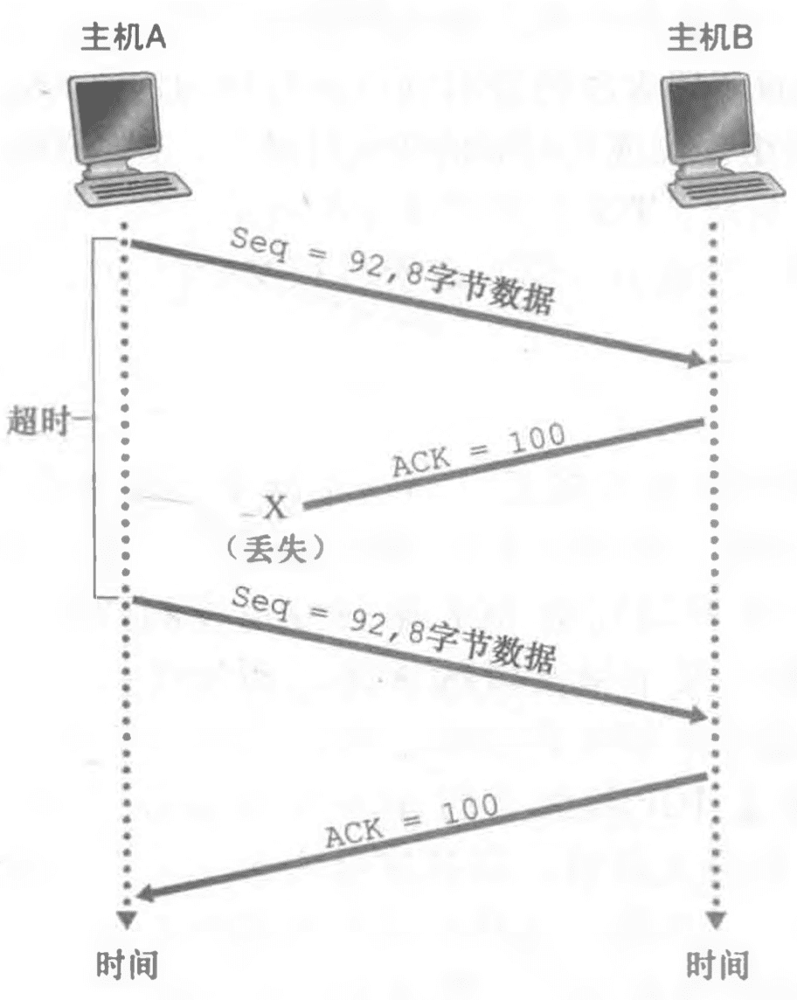 | 确认丢失时，会触发超时重传。<br />主机B发现报文段包含了之前的数据，会丢弃。<br />回复维护的最新确认数。 |
| 报文段100没有重传                |  | **每次只重传一个报文**：当超时事件发生时，主机A重传序号92的第一个报文段，并重启定时器。<br />只要第二个报文段的ACK在**新的超时发生以前到达**，则第二个报文段将不会被重传。 |
| 累积确认避免了第一个报文段的重传 |  | 第一个报文段的确认报文在网络丢失，但在超时事件发生之前主机A 收到一个确认号为120的确认报文。<br />则不会重传之前的丢失确认的报文。 |

#### 接收方 ACK 生成策略

| 事件                                                         | TCP接收方动作                                                |
| ------------------------------------------------------------ | ------------------------------------------------------------ |
| 具有所期望序号的按序报文段到达。所有在期望序号及以前的数据都已经被确认。 | 延迟的 ACK。对另一个按序报文段的到达最多等待500ms。如果下一个按序报文段在这个时间间隔内没有到达，则发送一个 ACK。 |
| 具有所期望序号的按序报文段到达。另一个按序报文段等待ACK传输。 | 立即发送单个累积 ACK，以确认两个按序报文段。                 |
| 比期望序号大的失序报文段到达。检测出间隔。                   | 立即发送冗余 ACK，指示下一个期待字节的序号【间隔的低端的序号】。 |
| 能部分或完全填充接收数据间隔的报文段到达。                   | 倘若该报文段起始于间隔的低端，则立即发送 ACK。               |

- **冗余ACK**：再次确认某个报文段的ACK，而发送方先前 已经收到对该报文段的确认。

- **快速重传**：接收到对相同数据的3个冗余ACK，就执行快速重传。**使用经验演化**。

   

### 流量控制

> 如果某应用程序读取数据时相对缓慢，而发送方发送得太多、太快，发送的数据就会使该连接的接收缓存溢出。

- **流量控制服务**：速率匹配服务，使发送方的发送速率与接收方应用程序的读取速率相匹配。通过发送方维护**接收窗口**实现。
- **和拥塞控制的区别**：都是限制发送方，但针对的是不同的原因。

#### 接收窗口

> - **RcvBuffer**：发送方维护两个变量，接收方在连接建立时分配一个接收缓存 **RcvBuffer** 。
>
> - **rwnd**：接收主机把当前的rwnd值放入它发给发送主机的报文段**接收窗口字段**中。
> - **避免阻塞**：当主机B的接收窗口为0时，主机A继续发送只有一个字节数据的报文段。这些报文段将会被接收方确认。

 

- **接收主机变量**

  - *LastByteRead*：接收主机上的应用程序从缓存中读出的数据流的最后一个字节的编号。
  - *LastByteRcvd*：从网络中到达的并且已放入接收主机接收缓存中的数据流最后一个字节的编号。

  $$
  LastByteRcvd - LastByteRead <= RcvBuffer
  $$

  $$
  rwnd = RcvBuffer - (LastByteRcvd - LastByteRead)
  $$

- **发送主机变量**

  - *LastByteSent*：最后一次发送的数据流的第一个字节编号。
  - *LastByteAcked*：最后一次被应答的数据流的最后一个字节编号

  $$
  LastByteSent - LastByteAcked <= rwnd
  $$

### 连接管理

#### 三次握手

 

1. 客户端向服务器发送一个**特殊的TCP报文段**。该报文段中不包含应用层数据。这个报文段称为 **SYN 报文段**。
   1. 报文段的**首部中的 SYN 标志位**被置为1。
   2. 随机选择一个初始序号 **client_isn**，放在报文段的序号字段中。
2. 服务器从数据报中提取出**TCP SYN报文段**。为该连接分配 **TCP 缓存和变量**，并向该客户 TCP 发送允许连接的报文段。也不包含应用层数据。这个报文段称为 **SYNACK 报文段**。
   1. **SYN 标志位**被置为1。
   2. 确认号字段被置为 **client_isn + 1**。
   3. 选择服务器自己的初始序号 **server_isn**，放到序号字段。
3. 客户端收到 **SYNACK 报文段**后，给连接分配缓存和变量。向服务器发送另外一个报文段。**可以包含应用层数据**。
   1. 确认字段设置为 **server_isn + 1**。
   2. **SYN 标志位**被置为0。因为连接已经建立了。

#### 四次断开

 

#### TCP状态序列

| 客户端                                                       | 服务端                                                       |
| ------------------------------------------------------------ | ------------------------------------------------------------ |
|  |  |

#### SYN 洪泛攻击

- **起因**：服务器为了响应一个收到的 SYN，分配并初始化连接变量和缓存【半开链接】，等待握手第三步，通常**一分多钟之后**终止该半开连接并回收资源。攻击者发送大量的 **TCP SYN 报文**。而不完成第三次握手。

- **解决方案**：**SYN cookie**。

  > - 当收到 SYN 报文段后，并不生成半开连接，而是生成一个初始 TCP 序列号。生成函数是通过**源和目的IP和端口**以及该服务器仅有的一个秘密数的一个散列函数，讲这个序列号放到 **SYNACK 分组中**。
  > - 客户端返回一个 ACK 报文段，服务端用相同的散列函数验证报文段，**结果+1**与 SYNACK 报文段的确认号比对。合法则生成一个具有套接字的全开的连接。

### 拥塞控制

> TCP所采用的方法是让每一个发送方根据**所感知到的网络拥塞程度**来**限制其能向连接发送流量的速率**。
>
> - **没有拥塞**：增加发送速率。
> - **有拥塞**：降低发送速率。

#### 拥塞变量

- **拥塞窗口【cwnd】**
  $$
  LastByteSent - LastByteAcked <= min\{cwnd, rwnd\}
  $$

- **慢启动阈值【ssthresh】**：慢启动的阈值。

#### 控制方式

1. **报文丢失**【一个超时事件或4个ACK【初试+3个冗余】事件】意味着拥塞，降低发送方速率。
2. **报文确认到达时**，可以增加发送方速率。
3. **带宽探测**，为探测拥塞开始出现的速率，TCP 发送方增加它的传输速率，从该速率后退，进而再次开始探测，看看拥塞开始速率是否发生了变化。**网络没有明确拥塞状态命令，ACK和丢包事件充当隐式信号**。

#### TCP 拥塞控制算法【AIMD】

> 也叫**加性增、乘性减**算法，**Additive-Increase, Multiplicative-Decrease**

 

- **慢启动【指数增长】**

  1. 连接开始时，`cwnd` 通常初始为一个 MSS 的较小值。

  2. 每当传输的报文段首次被确认就增加一个 MSS。**相当于翻倍**。

      

  3. 结束增长。

     - **超时丢包**，`ssthresh = cwnd / 2` ，将 cwnd 重置为 MSS，重新开始慢启动过程。
     -  **`>= ssthresh` 时**，结束慢启动，TCP**转移到拥塞避免模式**。
     - **检测到3个冗余ACK**，结束慢启动，进入**快速恢复模式**。

- **拥塞避免【线性增长】**：每到达一个新的确认，将 `cwnd` 增加 `MSS * (MSS/cwnd)` 字节。

  - **超时丢包**，`ssthresh = cwnd / 2; cwnd = MSS`。
  - **检测到3个冗余ACK**，`ssthresh = cwnd / 2; ssthresh += 3 * MSS; cwnd = cwnd / 2; ` 进入**快速恢复模式**。

- **快速恢复**：对于引起TCP进入快速恢复状态的缺失报文段，对收到的每个冗余的 ACK，cwnd的值增加一个MSS。当对丢失报文段的一个ACK到达时，TCP在降低 cwnd 后进入拥塞避免状态。

#### 公平性

1. TCP连接之间在长时间时最终能趋于动态公平，具有较小RTT的连接能够在链路空 闲时更快地抢到可用带宽。
2. UDP没有拥塞控制，所以会无限挤占TCP空间，比如**视频/音频**。
3. 不同应用间因为TCP的不同，所占用的网络带宽也会不同。

#### 明确拥塞通告【ECN】

> 网络辅助拥塞控制，*Explicit Congestion Notification*。

 

在网络层，IP数据报首部的服务类型字段中的**两个比特【四种可能】**被用于 ECN。

# 网络层

 

- **路由器**：网络层设备。

- **转发**：将分组从一个输入链路接口转移到适当的输出链路接口的路由器本地动作。发生的时间很短**【纳秒】**，通常用硬件实现。

- **路由选择**：确定分组从源到目的地所采取的端到端路径的网络范围处理过程。时间较长**【秒】**，通常用软件实现。

  | 控制平面 | 图示                                                         | 描述                                                         |
  | -------- | ------------------------------------------------------------ | ------------------------------------------------------------ |
  | 传统方法 |  | 运行在每台路由器中，并且在每台路由器中都包含转发和路由选择两种功能。**【依赖人工配置，不现实】** |
  | SDN方法  |  | 每台路由器都有一个与其他路由器的路由选择组件通信的路由选择组件。<br />路由选择设备仅执行转发，而远程控制器计算并分发转发表。<br />路由器和远程控制器通过交换包含转发表和其他路由选择信息的报文。 |

## 网络层服务

- **确保交付**：确保分组将最终到达目的地。
- **具有时延上界的确保交付**：不仅确保分组交付，而且在特定的主机到主机**时延上界内**【如100ms】交付。
- **有序分组交付**：确保分组以它们发送的顺序到达目的地。
- **确保最小带宽**：只要发送主机以低于特定比特率的速率传输比，所有分组最终会交付到目的主机。
- **安全性**：网络层能够在源加密所有数据报并在目的地解密这些分组，从而对所有运输层报文段提供机密性。

网络层提供了单一的服务，即**尽力而为服务【根本无服务】**。上面的交付全部不能保证。

## 数据平面

### 路由器

#### 组成

 

##### 输入端口

 

- **线路端接**：实现物理层功能。
- **数据链路处理**：实现链路层功能。
- **查找、转发、排队**：使用**转发表**来查找输出端口。
  - **查找**：通过转发表进行查找。
    - **转发表**：由路由选择处理器计算和更新的，从路由选择处理器经过**独立总线【虚线】**复制到线路卡，每个输入端口都有影子副本。
    - **匹配方式**：**最长前缀匹配规则**。
    - **查找表存储器**：**三态内容可寻址存储器【TCAM】**，*Tenary Content Address Memory*。
  - **排队**：如果其他端口的结构正在使用**交换结构**，则分组会在输入端口如排队。
- **其他动作**
  - 检查分组的**版本号**、**检验和**以及**寿命字段**，并且重写后两个字段。
  - 更新用于网络管理的计数器。

##### 交换结构

| 交换方式 | 图示                                                         | 描述                                                         |
| -------- | ------------------------------------------------------------ | ------------------------------------------------------------ |
| 内存     |  | 1. 交换在CPU控制下实现。<br />2. 分组到达输入端口时，通过中断方式向CPU发出信号。<br />3. 分组从输入端口复制到CPU内存。<br />4. 在转发表中找出输出端口，将分组复制到输出端口缓存。<br />5. 分组串行，因为共享系统总线一次仅能执行一个内存读/写。 |
| 总线     |  | 1. 输入端口为分组填充标签，指示本地输出端口。<br />2. 所有输出端口都收到，只有与标签匹配的端口才保存分组。<br />3. 标签在输出端口被去除。<br />4. 分组串行，因为一次只有一个分组能通过总线。 |
| 纵横式   |  | 1. 由2N条总线组成的互联网络。连接N个输入，N个输出。<br />2. 交叉点通过交换结构控制器在任何时候开启和闭合。<br />3. **非阻塞**，能够并行转发多个分组。 |

##### 输出端口

 

##### 路由选择处理器

> 执行控制平面功能。

- 负责与远程控制器通信。目的是接收由远程控制器计算的**转发表项**，并在该路由器的输入端口**安装这些表项**。
- 执行网络管理功能。

#### 分组排队

##### 输入排队

 

- **线路前部阻塞【HOL】**：*Head-Of-the-Line*，在一个输入队列中排队的分组必须等待通过交换结构发送【**即使输出端口空闲**】，因为它被位于线路前部的另一个分组所阻塞。
- 由于**HOL阻塞**，只要输出链路上的分组速率到达容量的 **58%**，输入队列长度就会无限增大，出现**丢包**。

##### 输出排队

 

- **弃尾策略**：*drop-tail*，当输出缓存不足时，丢弃到达的分组。
- **主动队列管理策略【AQM】**：*Active Queue Management*，在缓存填满之前丢弃一个分组，向发送方提供一个拥塞信号。
  - **随机早期检测【RED】**算法：*Random Early Detection*，得到**广泛研究和实现的算法**。

#### 分组调度

> 排队的分组如何**经输出链路传输**。

| 策略                | 模型                                                         | 时间轴                                                       | 描述                                                         |
| ------------------- | ------------------------------------------------------------ | ------------------------------------------------------------ | ------------------------------------------------------------ |
| 先进先出【FIFO】    |  | 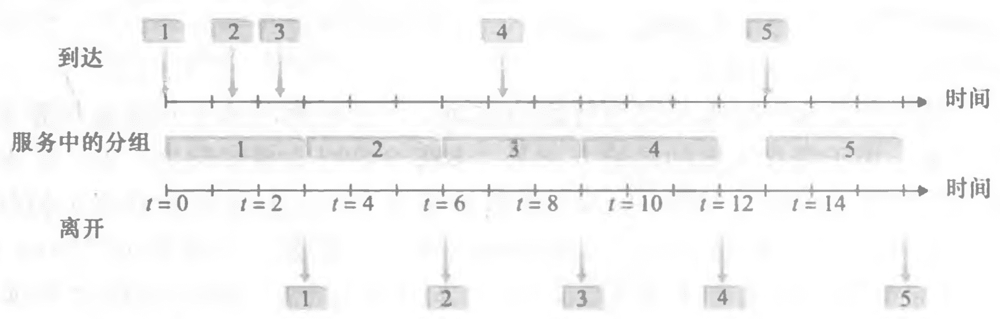 |                                                              |
| 优先权排队          |  | 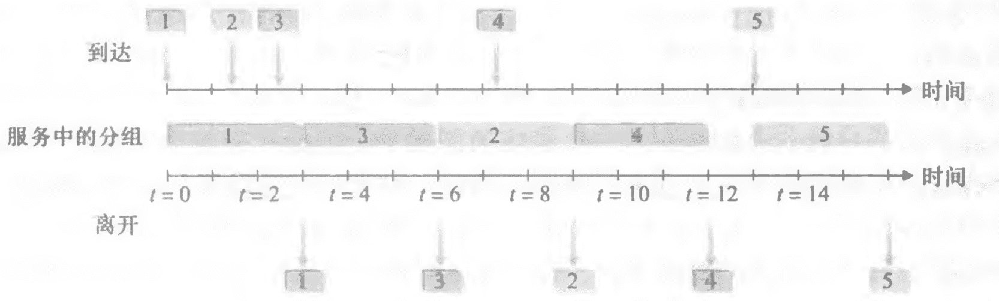 | 1. 3、4是优先分组。<br />2. 同一**优先权类**的分组使用先进先出。<br />3. **非抢占式优先权排队**：分组开始传输，就不能打断 |
| 循环                |                                                              | 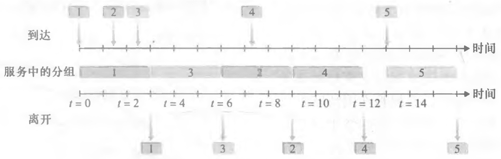 | 1. **循环排队规则**：不存在优先权，类之间轮流服务。<br />2. **保持工作排队规则**：有类分组排队等待传输时，不允许链路保持空闲。 |
| 加权公平排队【WFQ】 |  |                                                              | 1. *Weighted Fair Queuing*。<br />2. WFQ和循环排队的不同之处在于，每个类在任何时间间隔内可能受到不同数量的服务。 |

### 网际协议

#### IPv4

##### 数据报格式

 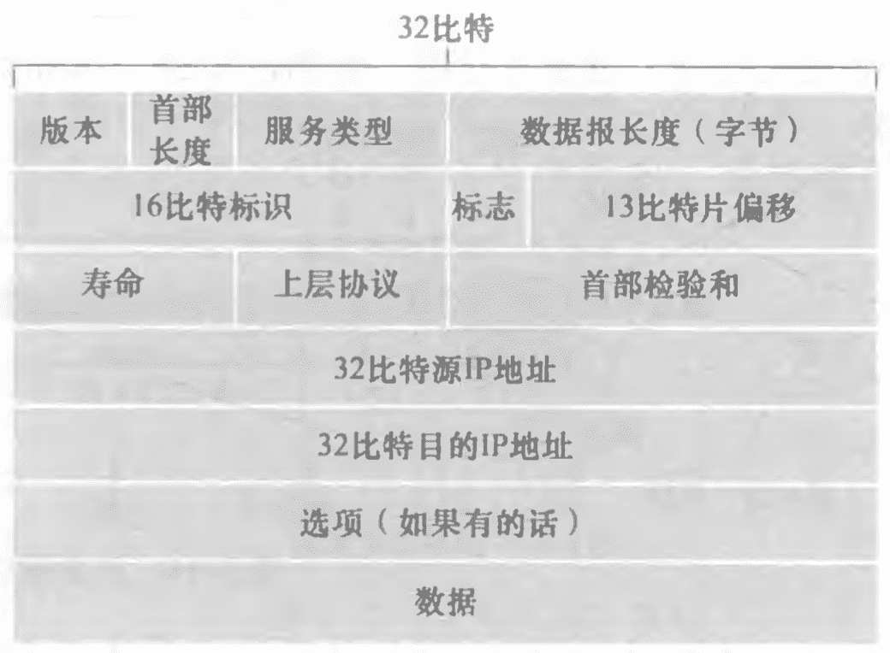

- **版本号**：**4比特**，规定了数据报的IP协议版本，确定报文解释方式。

- **首部长度**：**4比特**，运输层报文实际开始的地方。因为数据报包含可变数量的选项。

- **服务类型**：**8比特**，使不同类型的IP数据报可以区分开。

- **数据报长度**：**16比特**，这是IP数据报的总长度，首部和帧。

- **标识、标志、片偏移**：和IP分片有关。

- **寿命【TTL】**：用来确保数据报不会在网络中循环，每一台路由器处理数据报时，TTL减一，**减为0，数据报丢失**。

- **协议**：通常仅当一个IP数据报到达其最终目的地时才会有用。该字段值指示了IP数据报的数据部分应交给哪个特定的运输层协议。

  - 6：表明交给TCP。
  - 17：表明交给UDP。

- **首部校验和**：数据报首部中携带的检验和与计算得到的检验和不一致，则检测岀是个差错。路由器一般会**丢弃出错的数据报**。

  > 每台路由器上必须重新计算检验和并再次存放到原处。

- **源和目的IP地址**：源生成数据报时写入。

- **选项**：在 IPv6首部中去掉了选项，性能较差。

- **数据**：包含要交付给目的地的运输层报文段【TCP或UDP】。

##### 数据报分片

 

- **最大传送单元【MTU】**：一个链路层帧能承载的最大数据量，以太网帧能够承载不超过1500字节的数据，而某些广域网链路的帧可承载不超过576字节的数据。

- **片**：将IP数据报中的数据分片成两个或更多个较小的IP数据报，用单独的链路层帧封装这 些较小的IP数据报。较小的数据报称为片。

- **数据报组装**：重新组装工作放到端系统中，而不是放到网络路由器中。

  > - 最后一个片的标志比特被设为0，而所有其他片的标志比特被设为1。
  > - 使用偏移字段指定该片应放在初始IP数据报的哪个位置。

##### 编址

- **接口**：主机与物理链路之间的边界。
- **IP总数**：32字节，2<sup>32</sup>个，大概**40亿**。

- **点分十进制记法**：每个字节用它的十进制形式书写，各字节间以句点隔开。
- 
